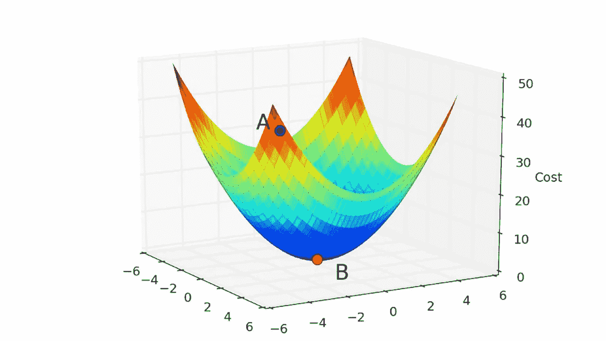
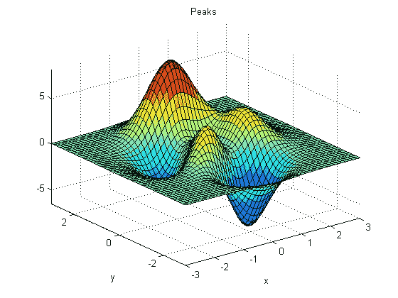
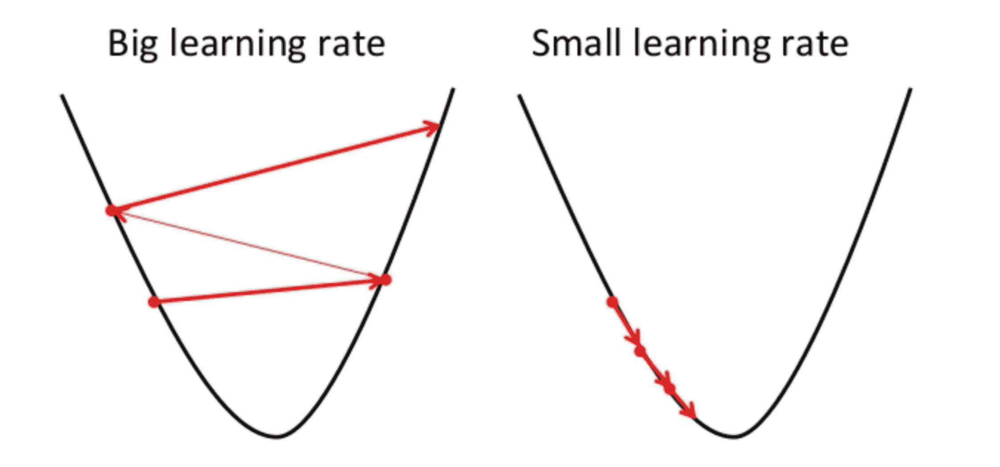
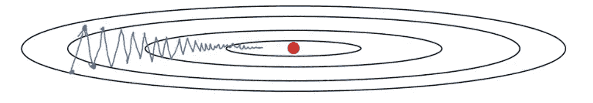
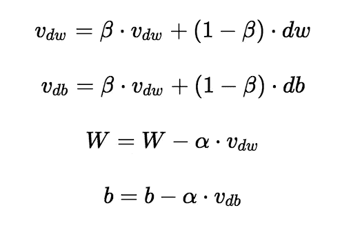
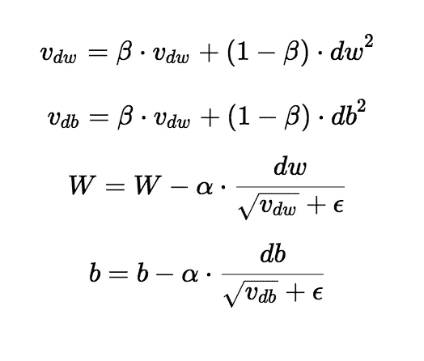

# 看看梯度下降和 RMSprop 优化器

> 原文：<https://towardsdatascience.com/a-look-at-gradient-descent-and-rmsprop-optimizers-f77d483ef08b?source=collection_archive---------2----------------------->

## 简短的解释


# 1.介绍

有无数的超参数，你可以调整，以提高你的神经网络的性能。但是，并不是所有这些都会显著影响网络的性能。您选择的优化器是决定您的算法是收敛还是爆炸的一个参数。有相当多的优化器可供选择，让我们来看看最广泛使用的两个。

# 2.梯度下降优化器

梯度下降可能是所有优化器中最流行和使用最广泛的。这是一种寻找神经网络最优值的简单而有效的方法。所有优化器的目标是达到全局最小值，其中成本函数达到最小可能值。如果你尝试在三维空间中形象化成本函数，它将类似下图。



Convex cost function

```
Stochastic Gradient Descent - AlgorithmFor each example in the data
    - find the value predicted by the neural network 
    - calculate the loss from the loss function 
    - find partial derivatives of the loss function, these partial derivatives produce gradients
    - use the gradients to update the values of weights and biases
```

每当我们找到梯度并更新权重和偏差的值时，我们就向最佳值靠近了一步。在我们开始训练我们的神经网络之前，我们的成本会很高，这由上图中的 A 点表示。通过训练神经网络的每一次迭代(寻找梯度并更新权重和偏差)，成本降低并向全局最小值移动，该最小值由上图中的点 B 表示。下面的模拟将提供一个更好的直观理解，当我们迭代训练我们的模型时，我们如何达到全局最小值。


我们的成本函数并不总是像上面图片中描绘的那样平滑。很多时候，这些成本函数是非凸的。非凸函数的问题是，你有可能陷入局部极小值，你的损失可能永远不会收敛到全局最小值。看看下面的图片。



Non-Convex cost function

从上图可以看出，图中有两个最小值，两个中只有一个是全局最小值。我们的神经网络很有可能会错过全局最小值而收敛到局部最小值。有一些方法可以限制网络收敛，例如:我们可以改变学习速率或使用动量等。

## 2.1 学习率



Different learning rate

学习率可能是梯度下降和其他优化器最重要的方面。让我用一个类比来更好地解释学习率。把成本函数想象成一个坑，你将从顶部开始，你的目标是到达坑的底部。你可以把学习率想象成你要到达坑底(全局最小值)的那一步。如果你选择一个大的值作为学习率，你将会对权重和偏差值做出剧烈的改变，也就是说，你将会经历巨大的跳跃来达到底部。还有一个巨大的概率，你会越过全局极小值(底部)，最终在坑的另一边，而不是底部。学习率大，你永远无法收敛到全局极小值，永远在全局极小值附近徘徊。如果你选择一个小的值作为学习率，你会失去超过最小值的风险，但是你的算法会有更长的时间收敛，也就是说，你采取更短的步骤，但是你必须采取更多的步骤。因此，你必须训练更长的时间。此外，如果成本函数是非凸的，您的算法可能很容易陷入局部最小值，它将无法摆脱和收敛到全局最小值。学习率没有通用的正确值。这归结于实验和直觉。

## 2.2 带动量的梯度下降

几乎总是，带动量的梯度下降比标准梯度下降算法收敛得更快。在标准的梯度下降算法中，你会在一个方向上迈出较大的步伐，而在另一个方向上迈出较小的步伐，这会降低算法的速度。在下图中，您可以看到标准梯度下降在 y 方向上的步长较大，在 x 方向上的步长较小。如果我们的算法能够减少在 y 方向上采取的步骤，并将步骤的方向集中在 x 方向上，我们的算法将收敛得更快。这就是动量所做的，它限制了一个方向的振荡，这样我们的算法可以收敛得更快。此外，由于 y 方向的步数受到限制，我们可以设置更高的学习率。



Standard gradient descent

# 3.RMSprop 优化器

RMSprop 优化器类似于带有动量的梯度下降算法。RMSprop 优化器限制垂直方向的振荡。因此，我们可以提高我们的学习率，我们的算法可以在水平方向上采取更大的步骤，收敛得更快。RMSprop 和梯度下降之间的区别在于梯度是如何计算的。以下等式显示了如何计算 RMSprop 的梯度和带动量的梯度下降。动量的值用β表示，通常设置为 0.9。如果你对优化器背后的数学不感兴趣，你可以跳过下面的等式。



Gradient descent with momenttum



RMSprop optimizer

有时 v_dw 的值可能非常接近 0。然后，我们体重的价值可能会膨胀。为了防止梯度爆炸，我们在分母中包括一个参数ε，它被设置为一个小值。

# 4.结论

优化器是神经网络的重要组成部分，了解它们的工作方式将有助于您选择哪一个用于您的应用程序。我希望这篇文章有助于做出这个决定:)