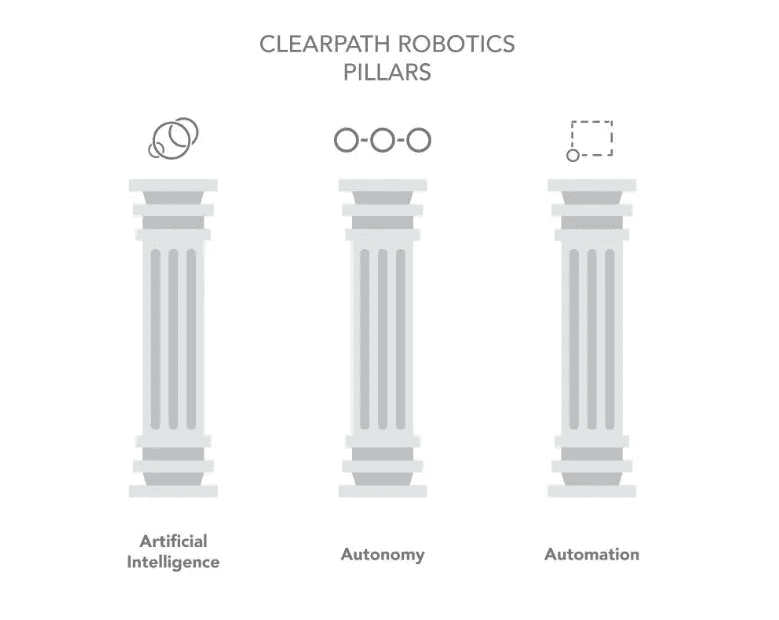
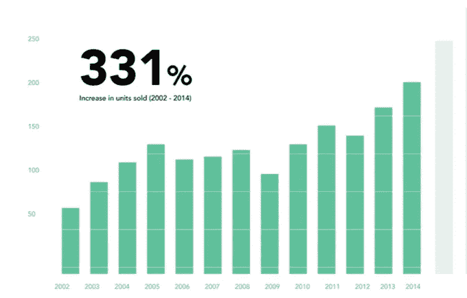
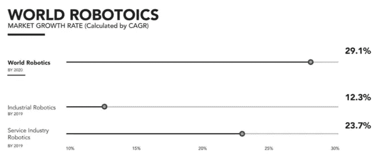

# 机器人技术一览

> 原文：<https://towardsdatascience.com/a-look-at-robotics-b58271013509?source=collection_archive---------4----------------------->

通过初创公司 Clearpath Robotics 简要介绍机器人行业及其竞争格局。

这是我对一家投资组合公司案例研究的精简版。与 Clearpath Robotics 或其团队没有任何关系。(最初发布于 2017 年 3 月 20 日)

# 关于 Clearpath:

[Clearpath Robotics](http://clearpathrobotics.com) 自其创始人——4 名雄心勃勃的滑铁卢学生——发现他们“为了更大的利益而制造机器人”的热情以来，已经走过了漫长的道路

自 2009 年以来，Clearpath Robotics 引领了一场实施智能机器人的运动，这些机器人可以执行危险的任务，以减轻人类的危险。Clearpath 的自动驾驶汽车是一项无与伦比的自动化技术，其潜力超出了农业和采矿等工业目的。目前，Clearpath 的机器人解决方案及其硬件、软件和服务已经整合到 500 多个全球品牌的日常流程中。

> “Clearpath 的最终目标是将人类从履行中心完全移除。从长远来看，我们的目标是建立一个制造或履行设施，在那里，你可以真正地关灯，因为一切都是自动化的。”
> 
> **-** [**西蒙·德雷克斯勒**](http://www.entrepreneur.com) **Clearpath 的工业系统总监**

概述 Clearpath 的 3 个不同支柱:人工智能进步，机器人自主和工业自动化，它们将在稍后进行审查。

Culminated based on my findings

# 机器人行业:

机器人领域是一个具有高增长潜力的蓬勃发展的市场。机器人是一个独立的数十亿美元的全球市场，能够转移到工业环境之外的新行业，在这些行业中，他们的现代技术仍然高度适用和有需求。

根据[当前趋势](http://www.businessinsider.com/growth-statistics-for-robots-market-2015-2)，到 2020 年，机器人的市场价值预计将达到 410 亿美元，其中 15 亿美元将用于机器人扩展到 B2C 模式。这与像 Clearpath 这样的初创公司的可能性相一致，它们只将企业作为唯一的客户群。

下面是 12 年期间(2002 年至 2014 年)数据的可视化，代表了该行业在购买数量方面的巨大增长。

Based on [source](http://www.investinontario.com/industrial-automation-and-robotics#future-of-manufacturing)

此外，机器人的未来市场将由两个主要部门驱动:工业和服务。很明显，机器人产业只会继续快速扩张，在全球范围内扩大规模。最值得注意的是，在未来几年，服务行业将有更大的市场进入机会，让公司将机器人应用于受过高等教育的角色，如客户服务。

Based on [source](http://www.prnewswire.com/news-releases/industrial-robotics-market-in-north-america-2015-2019-300097436.html) and [source](http://www.prnewswire.com/news-releases/world-robotics-market-growing-at-2911-cagr-to-2019-530365661.html)

# 全球市场:

目前，亚洲是机器人领域支出最多的地区，占全球市场总额的 65%以上。此外，据预测，到 2019 年，他们的支出将翻一番，这表明了令人难以置信的增长，但也为 Clearpath 等公司提供了巨大的市场机会，让他们在不久的将来探索扩张方案。

众所周知，中国生产了全世界几乎一半的商品。事实上，中国的进口仅占其出口的 35%[,而出口最近在 2013 年增加到 43.1%](http://www.economist.com/news/leaders/21646204-asias-dominance-manufacturing-will-endure-will- make-development-harder-others-made)。随着中国工资上涨，许多大公司选择将生产外包给菲律宾等成本更低的国家。随着中国作为制造业世界工厂的有希望的主导地位，其减少劳动力的需求，以及其强大的机器人市场机会，中国似乎是 Clearpath 的 *Otto* 等产品的下一个成功扩张地点。

从不同的角度来看，与其他大型国际机器人公司相比，Clearpath 仍然被认为是一家规模小得多的初创公司。由于他们的团队和库存更小，新的业务环境可能弊大于利，因为它将带来大量的新费用和硬件需求的突然增加，而 Clearpath 无法满足这些需求。鉴于他们目前的公司状况，他们目前留在加拿大境内可能更容易。

-

*编辑* : [**Geek+**](https://www.crunchbase.com/organization/geek#/entity) ，一家成立 1.5 年的中国北京公司，正在为仓库建造机器人(类似于亚马逊的 Kiva 机器人)，[本周在 A 轮](https://www.chinamoneynetwork.com/2017/03/20/vertex-venture-leads-14m-round-in-chinese-logistics-robot-start-up-geek)中筹集了 1400 万美元。

# Clearpath 的竞争对手:

为了分析 Clearpath 的独特地位和研究强大的市场参与者，我们必须重新审视前面提到的 3 个支柱。哪些主要竞争对手正在同一个领域进行创新，并专注于创造一系列自主、智能和高效的士兵？

值得注意的竞争对手包括[**Fetch Robotics**](http://fetchrobotics.com)**:**一家最近在硅谷成立的初创公司，旨在通过其旗舰产品 *Freight、*[**Seegrid Corp**](https://seegrid.com/)**:**一家 3D 视觉导航的创新者，希望通过自主机器人解决方案来提高生产率，并希望改造下一代视觉和自动导向车辆。

Positioning map

尽管 Clearpath 面临着挑战和不断增加的竞争对手，但这家初创公司有一个整体的价值主张，无法被其他人轻易超越。Clearpath 的基础设施不仅允许轻松的企业集成、即时实施和无缝的整体体验，而且 Clearpath 致力于卓越的客户服务，这在很大程度上帮助他们在社区中扬名立万。

# Clearpath 的未来展望:

## 检查伙伴关系

*1。地理扩张*

正如之前提出的潜在扩张战略，Clearpath 在进入全球市场时并不具备规模优势。然而，机器人行业内的一些强大的参与者有，未来的合作伙伴关系可以帮助 Clearpath 支撑这一弱点。

[**Grenzebach**](http://grenzebach.com/home/) **，**是一家德国公司，几十年来一直以家族企业的方式运营。专注于工业自动化，他们的移动设备 *Carry* 被编程为处理材料运输任务。随着品牌在欧洲和亚洲广泛使用他们的技术，Grenzebach 仍然远远没有统治北美，因为他们只进入了一个国家(美国)。Grenzebach 在德国、美国和亚洲拥有 3000 家工厂和设施，未来与 Clearpath 的合作对双方都有利。通过与 Grenzebach 合作，Clearpath 有能力轻松地扩展到我们的邻国，各州，以及亚洲市场，因为 Grenzebach 的物理设施。对于 Grenzebach 来说，Clearpath 是加拿大领先的机器人初创公司，拥有一个有前途的研究团队，他们的创新速度比典型的大公司更快。此外，在 Clearpath 的帮助下，Grenzebach 最终可以通过进入加拿大市场来覆盖北美的所有地区。

*2。产业扩张*

考察潜在合作伙伴的另一种方式是考察行业扩张机会。[根据麦肯锡&公司的预测，](https://www.entrepreneur.com/article/248013)到 2025 年，医疗保健、服务和制造等行业的先进机器人市场预计将产生高达 4.5 万亿美元的经济影响。

> “对于私人控股的 Clearpath 来说，即使是一小块蛋糕，也意味着数十亿美元。自 2010 年以来，clear path 的合作伙伴关系推动其收入同比增长了 200%。”

有鉴于此，Clearpath 可以探索与领先的医疗机构合作的选择，这些机构规模庞大，但不一定有人力或时间自己发明先进的机器人技术。医院将通过整合 Clearpath 受益，因为许多程序将变得更加高效。同样，这将是 Clearpath 的理想合作伙伴，因为他们可以将其产品扩展到医疗保健领域，收集有价值的第一手数据以进行改进，如果医疗机构是国际机构，还可能进行跨境合作。

[Unsplash/Alex Knight](https://unsplash.com/search/robotics?photo=2EJCSULRwC8)

## 检查收购

*1。大型公司收购*

2012 年，一家致力于为航运中心制造自动化机器人的机器人公司被亚马逊以 7 . 75 亿美元的巨额交易收购，该交易给了他们所有研发的独家权利。 [Kiva Systems，](https://www.amazonrobotics.com/#/)现在被称为亚马逊机器人，只在亚马逊自己的工厂内使用。

大公司刚刚开始赶上贝佐斯的步伐，因为他们最近注意到机器人和制造业之间的正相关和巨大增长。[像 IBM 和微软这样的大公司对机器人初创公司进行了无数次新投资。](http://www.geekwire.com/2016/sarcos-robotics-raises-10-5m-microsoft-caterpillar-ge-heavy-duty-ro botics-technology/)

2015 年， [GE Ventures 公开了](http://www.zdnet.com/article/self-driving-cars-for-the-factory-floor/)其作为 Clearpath Robotics 战略长期投资者的角色。

> “我们相信机器人技术将极大地改善通用电气服务的行业，”
> 
> 通用电气风险投资公司的董事总经理拉尔夫·泰勒-史密斯。

这反映了 GE 未来的发展方向。由于通用电气对自动机器人非常感兴趣，Clearpath 提供了他们希望在自己的服务中实现的创新，这使得阿格成为 Clearpath 的潜在收购者，交易类似于亚马逊的交易。

*2。扩展采集*

参照 Clearpath 目前较小的规模，他们可能更容易受到不断变化的市场的影响，对新的竞争准备不足。尤其是在文化层面和工厂程序上的差异。Clearpath 可以通过大型外国机器人公司的收购自动放弃这种担忧。此外，一个更大的公司会非常有兴趣追求 Clearpath 的独特和先进的创新，将其引入他们的外国(也许是未开发的)市场。

[**ABB 集团**](http://abb.com) **，**是一家总部位于瑞士的自动化公司，通过自动化和机器人技术解决公用事业、交通和工业领域的问题。[米语，](http://new.abb.com/products/robotics/industrial-robots/yumi)ABB 两年前创造的双臂机器人是世界上第一个鼓励人机互动的协作机器人。这不仅与 Clearpath 的目标一致，而且从向新行业和新国家扩张的角度来看，被收购将大有裨益。

# 结论:

总之，Clearpath 正在人工智能、全自动机器人和工业自动化的支柱下创造令人难以置信的发明，同时通过其现代应用来完成培养前瞻性思维、高效和安全的工作环境的使命。根据我对 Clearpath 当前竞争格局的简要分析，他们最大的优势是:提供全面的基础设施系统以及全球机器人市场需求巨大的高度先进的技术创新。Clearpath Robotics 是一家快速增长的初创公司，有可能在 Grenzebach 等合作伙伴的帮助下，或被 GE 等更大的公司收购后，扩大地理范围，进入新的行业。

随着人工智能发展研究的深入，我们继续努力复制人类智能或更高的智能，机器人行业是一个即将到来的巨人，我们必须感到兴奋，但同时保持警惕。

感谢阅读！在此之前和之后，我从未深入研究过机器人技术，我可能会再次成为一名软件狂热者。

这是我上个月的一篇文章:

 [## 关于微信的想法，以及它对北美数字应用市场的意义

### 注意:这是我的第一篇媒体文章，也是我第一篇试图分析一个应用程序和一个行业的文章

medium.com](https://medium.com/@diane.huang/thoughts-on-wechat-and-what-it-means-for-north-americas-digital-app-market-641e5063f1ac) 

*我们连线吧！:)*