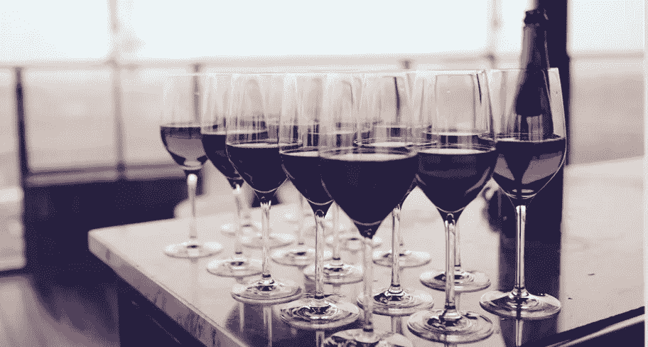
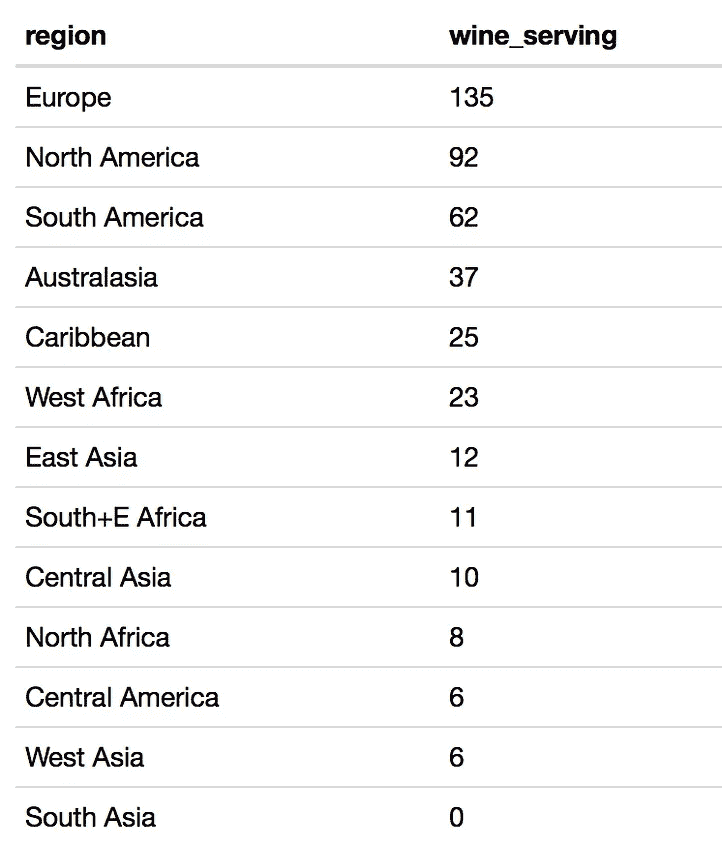
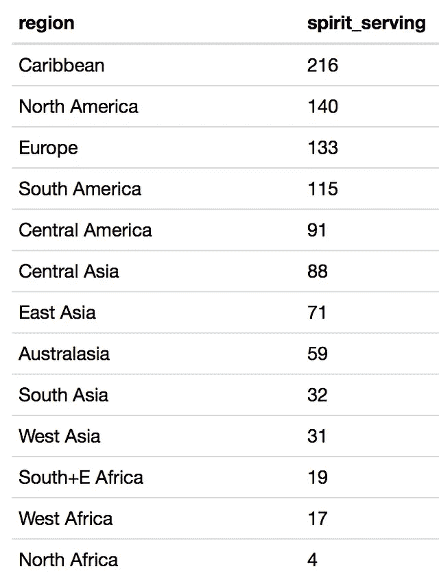
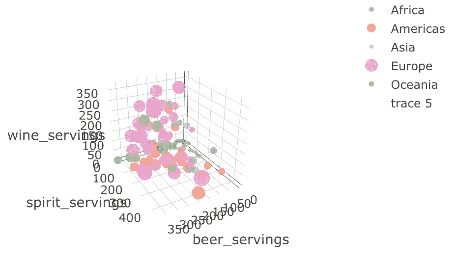
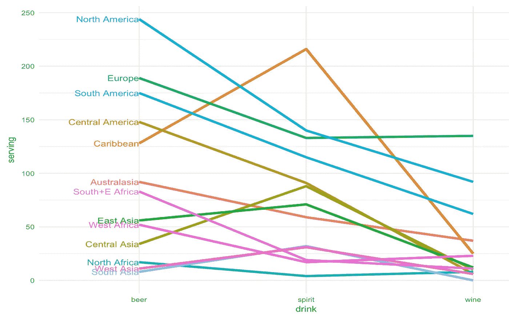
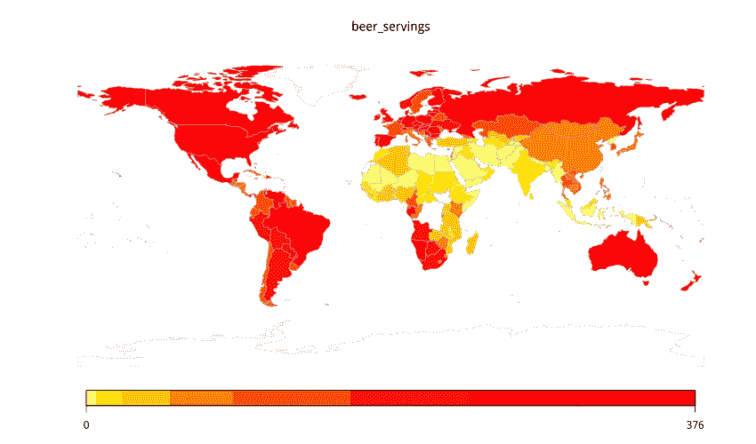

# 对酒精消费的调查

> 原文：<https://towardsdatascience.com/a-look-into-alcohol-consumption-around-the-world-87109d060271?source=collection_archive---------1----------------------->

从人们的饮酒习惯，你能说出他们来自哪里吗？

根据世界卫生组织提供的一组国家级人均酒精消费量的数据，我很想知道各个地区的酒精偏好。

幸运的是，R 库(countrycode)可以很容易地将国家名称转换成 ISO3 代码、地区和大陆。然后我们可以使用 library(rworldmap)将其可视化。

我们可以使用 plot.ly 查看国家级别的消耗量。气泡大小是指总消耗量，单位为升。

我们对地区饮料偏好进行了观察:

*   加勒比人和亚洲人倾向于消费更多的烈酒和少量的葡萄酒
*   除此之外，世界各地的啤酒消费量最高

如果在地图上画出每个国家的消费量，除了明显知道伊斯兰国家消费很少的酒以外，我们可以看到:

*   整个美洲(北部、中部和南部)都喝很多啤酒
*   欧洲人似乎对葡萄酒比对烈酒更感兴趣

这是我的# 100 days 项目的第 3 天。完整的代码可以在 github [这里](https://github.com/yanhann10/opendata_viz)找到。