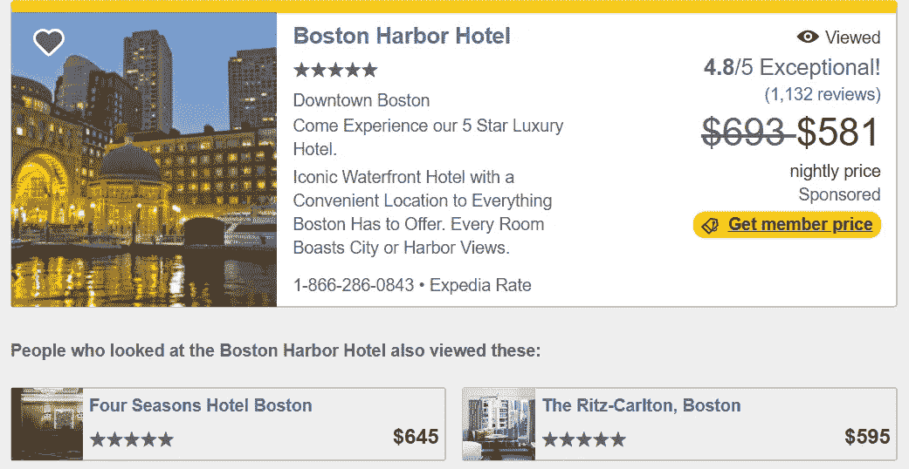
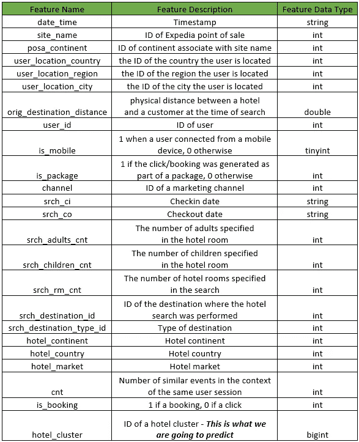
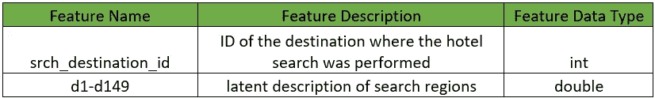
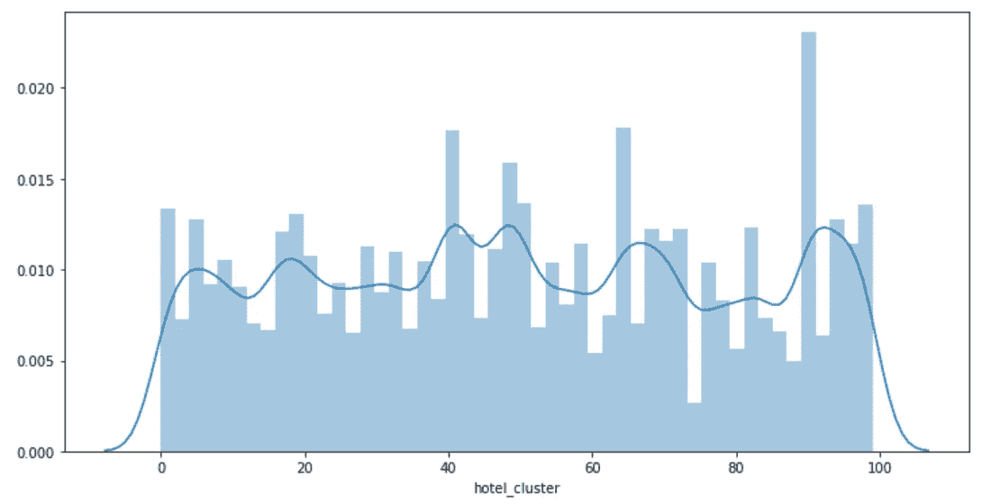
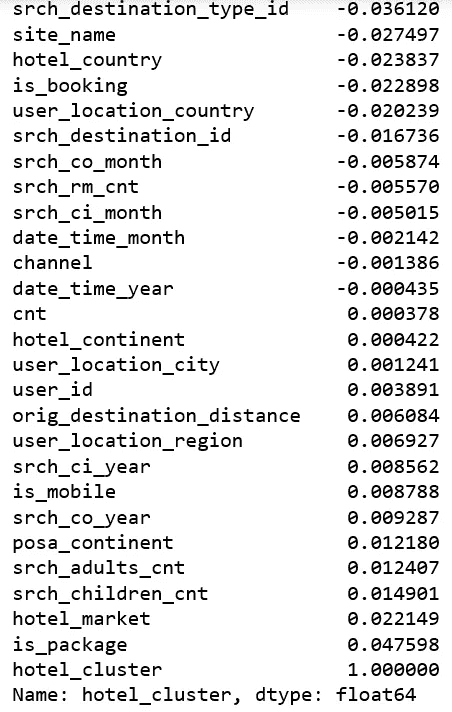
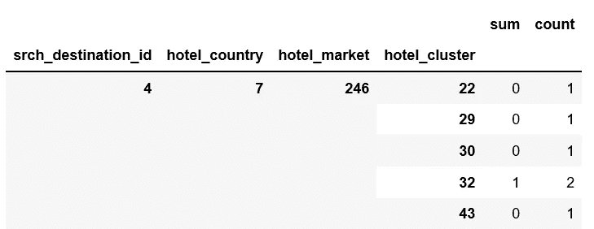
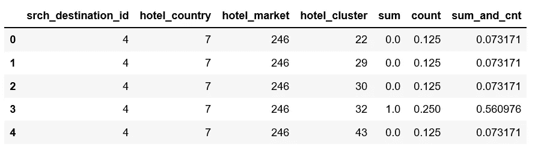
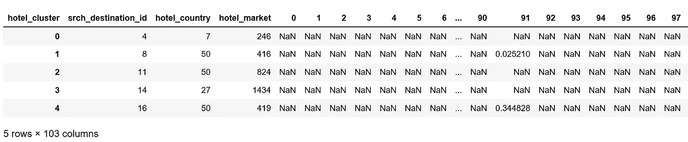

# 机器学习方法——构建酒店推荐引擎

> 原文：<https://towardsdatascience.com/a-machine-learning-approach-building-a-hotel-recommendation-engine-6812bfd53f50?source=collection_archive---------3----------------------->



source: Expedia

## 人工智能驱动的个性化，旅游推荐

所有在线旅行社都在争先恐后地满足亚马逊和网飞设定的人工智能驱动的个性化标准。此外，在线旅游世界已经成为一个竞争激烈的空间，品牌试图通过推荐、比较、匹配和分享来吸引我们的注意力(和钱包)。

在本帖中，我们的目标是为 Expedia 的用户创建最佳酒店推荐，这些用户正在搜索要预订的酒店。我们将把这个问题建模为一个多类分类问题，并使用集成方法建立 SVM 和决策树，以预测用户在给定他(或她)的搜索细节的情况下可能预订哪个“酒店群”。

# 数据

数据是匿名的，几乎所有的字段都是数字格式。数据集可以在 [Kaggle](https://www.kaggle.com/c/expedia-hotel-recommendations/data) 找到，我们将使用 train.csv 和 destinations.csv，前者捕获用户行为的日志，后者包含与用户对酒店的评论相关的信息。

下面的图 1 提供了 train.csv 的模式:



Figure 1

下面的图 2 提供了 destinations.csv 的模式:



Figure 2

```
import datetime
import pandas as pd
import numpy as np
import matplotlib.pyplot as plt
import seaborn as sns
%matplotlib inlinefrom sklearn.model_selection import cross_val_score
from sklearn.ensemble import RandomForestClassifier
from sklearn.pipeline import make_pipeline
from sklearn import preprocessing
from sklearn.preprocessing import StandardScaler
from sklearn import svm
```

为了能够在本地处理，我们随机抽取 1%的记录。之后我们还有大量的记录在 241179。

```
df = pd.read_csv('train.csv.gz', sep=',').dropna()
dest = pd.read_csv('destinations.csv.gz')
df = df.sample(frac=0.01, random_state=99)
df.shape
```

***(241179，24)***

# 电子设计自动化(Electronic Design Automation)

目标是根据用户搜索中的信息，预测用户将预订哪个酒店。总共有 100 个集群。换句话说，我们正在处理一个 100 级的分类问题。

```
plt.figure(figsize=(12, 6))
sns.distplot(df['hotel_cluster'])
```



Figure 3

数据分布在所有 100 个集群中，并且数据中存在偏斜。

# 特征工程

日期时间、入住日期和退房日期列不能直接使用，我们将从中提取年和月。首先，我们定义了几个函数来实现这一点，我们还定义了一个函数来与 destination.csv 合并。

```
from datetime import datetime
def get_year(x):
    if x is not None and type(x) is not float:
        try:
            return datetime.strptime(x, '%Y-%m-%d').year
        except ValueError:
            return datetime.strptime(x, '%Y-%m-%d %H:%M:%S').year
    else:
        return 2013
    passdef get_month(x):
    if x is not None and type(x) is not float:
        try:
            return datetime.strptime(x, '%Y-%m-%d').month
        except:
            return datetime.strptime(x, '%Y-%m-%d %H:%M:%S').month
    else:
        return 1
    pass

def left_merge_dataset(left_dframe, right_dframe, merge_column):
    return pd.merge(left_dframe, right_dframe, on=merge_column, how='left')
```

处理日期时间列:

```
df['date_time_year'] = pd.Series(df.date_time, index = df.index)
df['date_time_month'] = pd.Series(df.date_time, index = df.index)from datetime import datetime
df.date_time_year = df.date_time_year.apply(lambda x: get_year(x))
df.date_time_month = df.date_time_month.apply(lambda x: get_month(x))del df['date_time']
```

处理 srch_ci 列:

```
df['srch_ci_year'] = pd.Series(df.srch_ci, index=df.index)
df['srch_ci_month'] = pd.Series(df.srch_ci, index=df.index)# convert year & months to int
df.srch_ci_year = df.srch_ci_year.apply(lambda x: get_year(x))
df.srch_ci_month = df.srch_ci_month.apply(lambda x: get_month(x))# remove the srch_ci column
del df['srch_ci']
```

处理 srch_co 列:

```
df['srch_co_year'] = pd.Series(df.srch_co, index=df.index)
df['srch_co_month'] = pd.Series(df.srch_co, index=df.index)# convert year & months to int
df.srch_co_year = df.srch_co_year.apply(lambda x: get_year(x))
df.srch_co_month = df.srch_co_month.apply(lambda x: get_month(x))# remove the srch_co column
del df['srch_co']
```

# 初步分析

在创建新特性并删除无用的特性后，我们想知道是否有任何东西与 hotel_cluster 有很好的关联。这将告诉我们是否应该更加关注任何特定的功能。

```
df.corr()["hotel_cluster"].sort_values()
```



Figure 4

没有与 hotel_cluster 线性相关的列，这意味着对特征之间的线性关系建模的方法可能不适合该问题。

# 战略

快速谷歌搜索后，不难发现，对于搜索目的地、酒店国家、酒店市场的已知组合，肯定有助于找到酒店集群。就这么办吧。

```
pieces = [df.groupby(['srch_destination_id','hotel_country','hotel_market','hotel_cluster'])['is_booking'].agg(['sum','count'])]
agg = pd.concat(pieces).groupby(level=[0,1,2,3]).sum()
agg.dropna(inplace=True)
agg.head()
```



Figure 5

```
agg['sum_and_cnt'] = 0.85*agg['sum'] + 0.15*agg['count']
agg = agg.groupby(level=[0,1,2]).apply(lambda x: x.astype(float)/x.sum())
agg.reset_index(inplace=True)
agg.head()
```



Figure 6

```
agg_pivot = agg.pivot_table(index=['srch_destination_id','hotel_country','hotel_market'], columns='hotel_cluster', values='sum_and_cnt').reset_index()
agg_pivot.head()
```



Figure 7

与目标表和我们新创建的聚合数据透视表合并。

```
df = pd.merge(df, dest, how='left', on='srch_destination_id')
df = pd.merge(df, agg_pivot, how='left', on=['srch_destination_id','hotel_country','hotel_market'])
df.fillna(0, inplace=True)
df.shape
```

***(241179，276)***

# 实现算法

我们只对预订活动感兴趣。

```
df = df.loc[df['is_booking'] == 1]
```

获取要素和标签。

```
X = df.drop(['user_id', 'hotel_cluster', 'is_booking'], axis=1)
y = df.hotel_cluster
```

## 朴素贝叶斯

```
from sklearn.naive_bayes import GaussianNBclf = make_pipeline(preprocessing.StandardScaler(), GaussianNB(priors=None))
np.mean(cross_val_score(clf, X, y, cv=10))
```

***0.10347912437041926***

## k 近邻分类器

```
from sklearn.neighbors import KNeighborsClassifierclf = make_pipeline(preprocessing.StandardScaler(), KNeighborsClassifier(n_neighbors=5))
np.mean(cross_val_score(clf, X, y, cv=10, scoring='accuracy'))
```

**T5 0.25631461834732266**

## 随机森林分类器

我们通过[*k*-折叠交叉验证](http://scikit-learn.org/stable/modules/cross_validation.html)来报告性能测量，并且[流水线](http://scikit-learn.org/stable/modules/generated/sklearn.pipeline.make_pipeline.html)使得构建评估器更加容易。

```
clf = make_pipeline(preprocessing.StandardScaler(), RandomForestClassifier(n_estimators=273,max_depth=10,random_state=0))
np.mean(cross_val_score(clf, X, y, cv=10))
```

***0.24865023372782996***

## 多类逻辑回归

```
from sklearn.linear_model import LogisticRegressionclf = make_pipeline(preprocessing.StandardScaler(), LogisticRegression(multi_class='ovr'))
np.mean(cross_val_score(clf, X, y, cv=10))
```

***0.3045543572367767***

## SVM 分类器

SVM 非常耗时。然而，我们取得了更好的结果。

```
from sklearn import svmclf = make_pipeline(preprocessing.StandardScaler(), svm.SVC(decision_function_shape='ovo'))
np.mean(cross_val_score(clf, X, y, cv=10))
```

***0.3228727137315005***

似乎我们需要做更多的特征工程来改善结果。敬请期待进一步的改进！

源代码可以在 [Github](https://github.com/susanli2016/Machine-Learning-with-Python/blob/master/Hotel%20recommendation.ipynb) 上找到。祝你一周愉快！