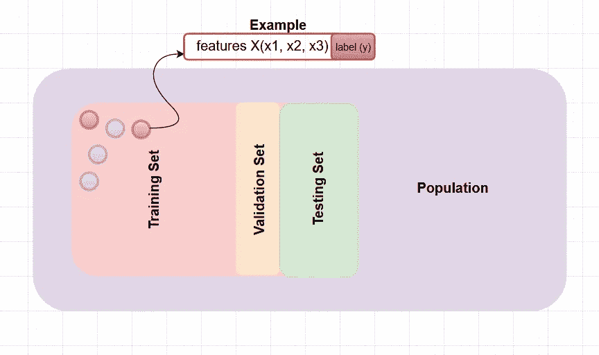
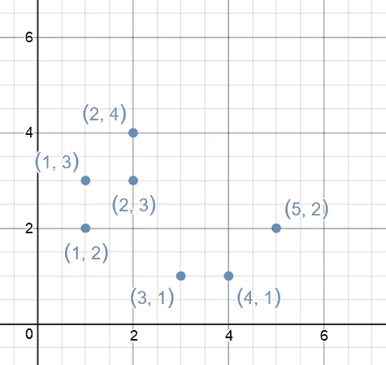
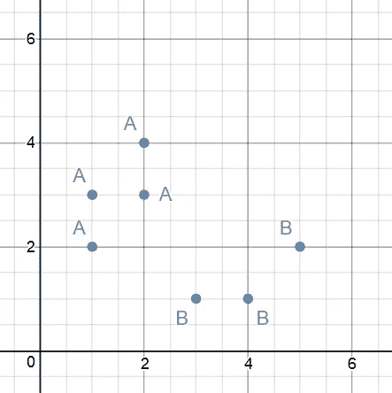
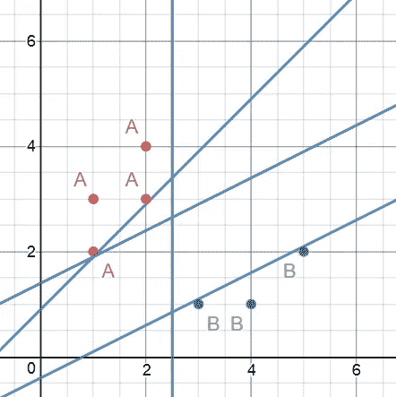
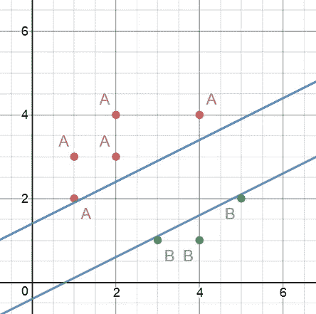
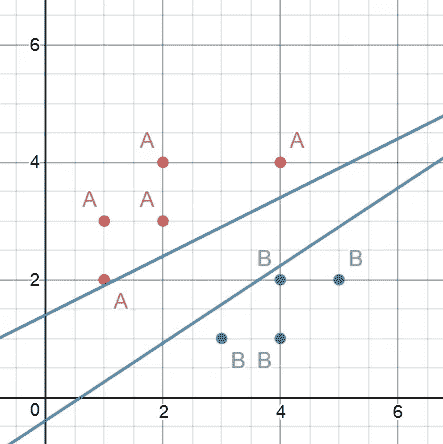
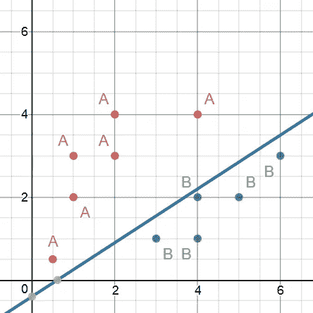
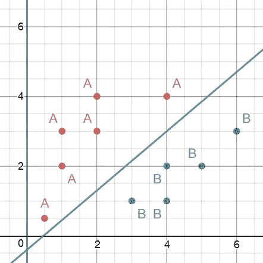
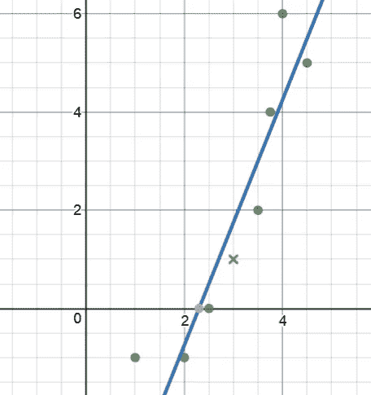
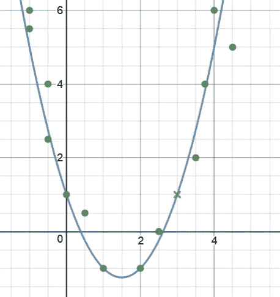

# 机器学习入门:几乎没有数学——第 1 部分

> 原文：<https://towardsdatascience.com/a-machine-learning-primer-almost-without-the-math-part-1-19ed04e352c0?source=collection_archive---------21----------------------->

机器学习课程的介绍总是以大量数学内容开始，这往往会吓倒初学者，并使他们远离它。在这里，我会试着复习机器学习的一些重要概念，除了数学，差不多。我还将尝试为每个术语附上一些简单的例子。这里涉及的大多数概念都与监督学习和预测建模有关。

这里讨论的所有解释都是实际概念的淡化版本。如果你对这些感兴趣，我强烈推荐回到数学上来获得更多的见解！

## (机器)学习

如果由 **P** 测量的计算机程序在 **T** 中的任务的性能随着经验 **E** 而提高，则称该计算机程序从关于某类任务 **T** 和性能测量 **P** 的经验 **E** 中学习。—汤姆·米切尔

## 机器学习模型

机器学习模型可以被视为机器学习系统的数学(有时是架构)表示，包括但不限于输入和输出数据的表示、学习中涉及的算法、定义学习过程的参数和模型的架构。

## 人口

与所考虑的实验相关的所有可能的例子的集合。这是机器学习模型试图预测的，目标人群的分布。

## 特征空间(输入)

特征空间是模型的输入空间，变量(除了我们想要预测的目标变量)存在于此。特征可以是数字的，也可以是分类的。例如，汽车的重量和速度是数字特征。这辆车是雪佛兰还是特斯拉是一个明确的特征。

*如果您使用颜色、速度、品牌和型号来描述一组汽车，那么这些属性的所有可能值构成了特征空间。*

## 特征向量 X

特征空间中的每个条目被称为 n 维特征向量，其中 n 是定义特定数据点的特征的数量。

*如果您要使用汽车的某些特征来定义汽车，特征列表将形成特征向量。例如:[橙色，280 英里/小时，2800 磅]是一个三维特征向量，具有 3 个特征，颜色，速度和重量。*

## 标签空间(输出)

与每个特征向量相关联的标签或目标变量的集合构成了标签空间。

*可以有各种车野马 GT，跑车，卡玛洛等。所有这些都是定义它们的功能集的标签。*

## 真实标签 y

这是与一个特定数据点相关联的实际标签。

## **示例**

一个例子是包括特征和标签的数据点。手头数据集中可用的示例可能不会完全穷尽数据分布。

Roadster[橙色，280 英里/小时，2800 磅]就是数据集中的一个例子。如果我们有一个只属于一家公司的 100 辆汽车的数据集，这并不意味着我们可以预测其他公司的汽车，因为它们可能有完全不同的数据分布。根据特斯拉汽车公司的数据，很难对福特汽车做出预测。

## 预测标签 y^

它是机器学习模型为给定特征向量预测的标签。它可能正确，也可能不正确。

*vector【橙色，280 英里/小时，2800 磅】可以预测为跑车或橙色沙滩车。*

## 训练集

用于训练机器学习模型的一组示例。

## 验证集

这是用于在训练过程中检查模型当前状态的训练集的子集(有时与训练集分开)。这并不直接有助于模型的训练。验证集可用于训练模型的参数或为模型提供评估度量。

## 测试设备

除非经过训练，否则模型无法访问的数据点集。它用于测试模型的训练状态。

Different data splits

## 分类

分类模型是将数据分类或归类为 2 个(二元分类器)或更多个(多类分类器)类的模型。

我们将尝试理解模型如何使用小数据集进行学习:

让我们绘制这个数据集，每个轴代表一个特性值:

现在我们将在这些点上标记给定的标签:

如果我们试图用直线来区分这两类，理论上可能会有无限可能的直线:

如果我们添加另一个点，可能的行数会减少:

添加更多点..

更多..

现在，如果我们从相同的数据分布中得到一个新点，我们知道根据我们的蓝线将该点分类到哪里。这条蓝线是从训练好的模型中获得的假设。

我们仍然不能确定我们的蓝线是否是原始人口分界线的实际代表。考虑下面这条线，它也将两类点分开。

如果我们得到更多的点，这条线实际上可能会改变它的位置。这就是为什么你可能总是听说，机器学习中更多的数据通常会产生更好的结果。

## 回归

简单线性回归是一种对标量标注和一个或多个解释性要素之间的关系进行建模的线性方法。通常，回归模型用于预测连续值，如温度、重量、利率等。

考虑另一个绘制在图表上的玩具数据集:

蓝线描述了分布点的大致位置。

现在，如果我们将数据分布中的更多点添加到训练集中，线条会完全改变:

我们从同一数据分布中添加的任何新点都将位于这条蓝色曲线上。给定两个特征之一的值，我们可以根据它在曲线上的位置预测另一个特征的值。前任。如果给定 x1 = 3，那么根据曲线，x2 = 1

## 培养

随着模型不断看到新的点，线的位置也在不断移动。这是学习的过程(在监督学习的情况下)。我们得到的点越多，学习过程就越好，模型的准确性就越好。

## 假设

它是我们认为尽可能接近描述数据的真实函数(或模型)的函数(或模型)。在我们的分类示例中，我们获得的蓝线是一个这样的假设，它描述了这样的数据，即该线一侧的所有点都属于相似的类。

## 假设空间

假设空间是可以用 n 个特征表示的所有可能的模型或函数的集合，不一定描述数据。必须从这个假设空间中选择目标函数。给定 2 个变量，在 2 维中可能有无限多条曲线。

## 探索的

它可以被认为是一个简单的假设空间或决策，直观地帮助我们最终选择正确的模型或函数。例如，在我们的分类示例中，我们凭直觉决定选择不同形式的直线，而不是圆或正方形，因为很明显，一条线就足以分隔这些点。这是我们的启发。我们可以选择一些圆来包含这两个类，但是这将会把测试空间限制在那些从训练数据中获得的圆上。如果我们选择了其他形状，可能需要更多的尝试才能到达最终的线条。正确选择启发式算法有助于更快地达到目标函数。

## 指标函数

目标函数是实际代表原始数据分布的函数。如果我们可以访问所有可能的数据点，我们就可以训练一个模型来学习目标函数。

## **参数**

模型参数是内部变量，其值可以从数据中确定。在训练期间，模型参数值得到更新。

## 选择机器学习模型

现在我们知道了一些相关的基本术语，让我们来看看如何选择机器学习模型:

1.  定义问题陈述。*是分类问题还是回归问题？*
2.  获取所需数据。
3.  基于初始数据分析选择一种启发式方法。
4.  根据启发和手头的任务选择机器学习模型。

既然我们已经介绍了基础知识，我们将在下一篇文章中尝试看到一个感知器模型。同样，这里涵盖的概念是淡化的版本。我将推荐吴恩达在 Coursera 上的[机器学习课程，对这些主题进行深入的数学展望。](https://www.coursera.org/learn/machine-learning)