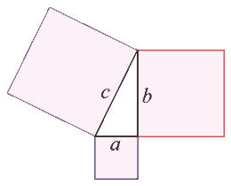
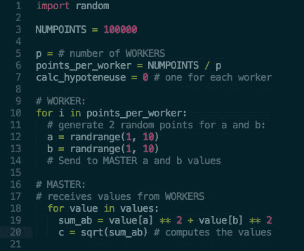
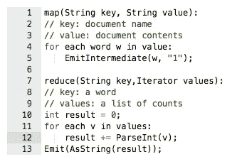
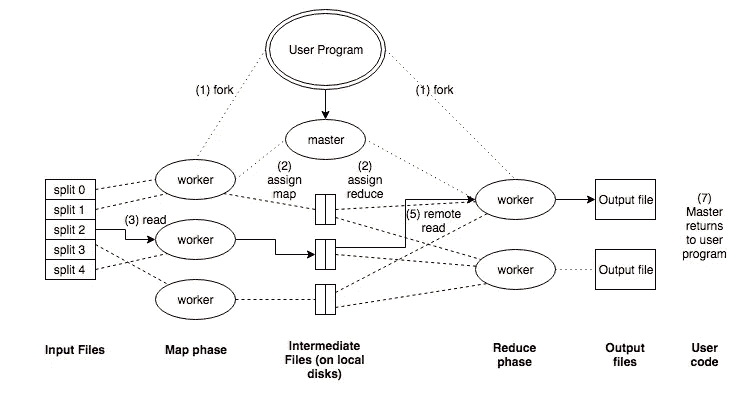

# MapReduce 概述

> 原文：<https://towardsdatascience.com/a-mapreduce-overview-6f2d64d8d0e6?source=collection_archive---------2----------------------->

> 针对高级编码人员的介绍说明，试图应对您可能也遇到过的任何劝阻。

当我第一次开始阅读 MapReduce 时，几乎每个教程都有 Java 或 C++先决条件的提示。然而，在科技界还有一种过时(而且越来越少)的思维模式，即成为程序员需要 CS 学位。我发现这是非常令人惊讶的，有多少教程有这种前兆，只是让他们通过完全可复制的进出反正。

说到**而不是**重新发明轮子，抽象就是一切。我们发现自己越少需要记住每个算法的二进制执行，我们就越接近实现它。开发的目的是让 ***进化*** ，如果我们不使用这种技术，我们还不如回到勒德派时代，在工会组织的恐龙牧场用套索套住迅猛龙，只为了赚一些诚实的郁金香球茎。

“跳进来”的想法听起来很忌讳，但不要误解。这并不是说应该忽视整体的理解。了解你的方法的功能和相关的依赖关系对于避免不可逆转的错误是至关重要的。但是要达到这个目标并不需要回到学校或者学习一门新的语言。

也就是说，我将引用[这篇](https://courses.cs.washington.edu/courses/cse490h/07wi/readings/IntroductionToParallelProgrammingAndMapReduce.pdf)文章，来自《并行编程和 MapReduce 入门》课程。现在让我们开始

# 历史

回到计算的初期，程序是串行的，即由一系列指令组成，每个指令被一个接一个地执行，就像一个人乘坐爱情船的队列。

**开发并行化**是为了提高性能和效率。它将进程原子化，并同时执行它们。这些碎片化的指令在不同的 CPU 上同时运行，要么来自一台机器，要么来自[*clouuddd*](https://d21ii91i3y6o6h.cloudfront.net/gallery_images/from_proof/3442/large/1418280711/die-cut-stickers.png)*中的*。**

除了加速这个过程，它还创造了一个解决方案，当你在本地资源上受到限制时，可以处理**大量的**数据集。然而，一个**实际的先决条件**是您拥有对所有数据的同一个存储系统的块级(物理层)访问权，即

# 集群文件系统

一个共享磁盘文件系统。最常见的 CFS 类型使用一个**存储区域网络** (SAN)来允许多台计算机在块级别获得直接的磁盘访问。这由您的数据库管理系统(DBMS)进一步提取。或者，**分布式文件系统**不这样做，而是使用网络发送数据。

操作它的系统增加了并发控制和串行化的机制，将数据结构编译成可存储的格式，用于网络传输、内存缓冲等。

此外，CFS 使用隔离，在级联故障的预防性情况下隔离集群中的单个节点(稍后将更详细地讨论)。

一旦确定了这一点，您就可以继续

# 考虑到你的计划

创建并行程序的第一步是确定一组可以并发运行的任务和/或数据分区。

有时，一个进程根本不能同时运行，就像在斐波那契函数中一样:

Fk = Fk-2 + Fk-1

这不能并行化，因为每个计算值都依赖于它前面的值。

更常见的情况是，您将处理大量一致的数据，这些数据必须进行处理，但也可以进行分区。考虑一个字符串数组:

['暴躁'，'傀儡'，'蜡笔']

可以分成大小相等的子阵列:

['暴躁'] ['傀儡'] ['蜡笔']

如果每个子阵列都没有计算依赖性，没有互通需求，并且可以遵循相同的迭代过程，那么它就是并行计算的理想候选！有一种常见的实现技术叫做****master/worker:****

***主人:***

*—初始化数组，并根据可用的**工作线程**将其拆分*

*—给每个**工人**发送他们的子阵列*

*—接收来自每个**工作者**的响应*

***工人:***

*—从**主机**接收子阵列*

*—对子阵列执行处理*

*—将结果返回给**主机***

*如果我们使用以前的子阵列，工人们将完成同样多的工作。该模型将实现*静态负载平衡*。*

***负载平衡**指的是在并行系统中的处理器之间分配任务的技术，以避免一些工作人员重复排队，而其他工作人员则处于空闲状态。为了激起一些想象，把它想象成共产主义的理想实现。*

*虽然静态平衡器允许更少的开销，但它们没有考虑当前的网络负载。*

*相反，**dynamic**balancer 在考虑网络的同时，提供了更灵活、但计算成本更高的分配。*

# *主/工人示例:*

> ****让我们以勾股定理为例来实现****

**

*这说明斜边(直角的对边)的平方等于其他两条边的平方之和，*

***a + b = c***

*虽然这本身是一个非常简单的算法，但它还可以进一步分解:*

> **a_sq = a ^ 2**
> 
> **b_sq = b^ 2**
> 
> **sum_ab =a_sq + b_sq**
> 
> **c = sqrt(sum_ab)**

*这可以用 Python 重写:*

**

*cool cool. so at this point you are probably wondering*

# *什么是 MapReduce rly*

*在查看了一些并行编程示例之后，我们可以对 MapReduce 的实际功能有更多的了解。*

*MapReduce 是从像 Lisp 这样的函数式语言的 *map* 和 *reduce* 组合子中派生出来的。*

*在 Lisp 中，*映射*以**函数**和**值序列**的形式接受输入。然后，它迭代地将该函数应用于序列中的每个值。*

*一个*归约*使用一个二元运算组合一个序列的所有元素。例如，它可以使用“+”将一个序列中的所有元素相加。*

*谷歌利用这一基础作为灵感，因此恰当的标题。与此一起使用的预期数据集非常庞大，通常需要存储在多台服务器上。因此，假定了并行化的必要性。*

> *MapReduce 为 Google 工程师提供了一个抽象概念来执行基本计算，同时隐藏并行化、负载平衡和容错的细节。*

***MAP:** 由 MapReduce 库的用户编写，接受输入对并生成一组中间键/值对。MapReduce 库将与同一个中间键 *I* 相关联的所有中间值组合在一起，并将它们传递给 Reduce 函数。*

***化简:**也由用户编写，接受中间密钥 I 和以及该密钥的一组值。它将这些值合并在一起，形成一个可能更小的值集。*

*例如，考虑对大量文档中每个单词的出现次数进行计数的问题:*

**

*map 函数发出每个单词以及相关出现次数的计数。然后 reduce 函数将特定单词发出的所有计数加在一起。*

# ***MapReduce 执行概述***

*通过将输入数据自动划分为一组 **M** 分割或*碎片*，映射调用被分布在多台机器上，这些将在多台机器上被处理。*

*Reduce 调用是通过使用用户指定的分区函数将中间密钥空间划分为 **R** 个片段来分发的。*

*下图描述了 MapReduce 操作的整个流程序列:*

**

1.  *用户程序中的 MapReduce 库首先将输入文件分成 M 段，通常为 16MB-64MB/段。然后，它在一组机器上启动程序的许多副本。*
2.  *该程序的副本之一是特殊的:主程序。其余的是由主人分配工作的工人。有 M 个映射任务和 R 个归约任务要分配。主设备挑选空闲的工人，给每个工人分配 M 或 R 任务。*
3.  *被分配了地图任务的工作者读取相应输入碎片的内容。它从输入数据中解析出键/值对，并将每一对传递给用户定义的映射函数。产生的中间 K/V 对在存储器中缓冲。*
4.  *周期性地，缓冲对被写入本地磁盘，由分区函数划分成 R 个区域。这些缓冲对在本地磁盘上的位置被传递回 master，master 负责将这些位置转发给 reduce workers。*
5.  *当 reduce worker 从 master 获得位置时，它使用远程调用从磁盘读取缓冲的数据。当 reduce worker 读取了所有中间数据后，它会按照中间键对数据进行排序，这样所有相同的事件就会被分组在一起。(**注意:如果中间数据量太大而不适合内存，则使用外部排序)***
6.  *reduce 工作器遍历排序后的中间数据，对于遇到的每个唯一的中间键，它会将该键和相应的一组中间值传递给用户的 Reduce 函数。reduce 函数的输出被附加到这个 Reduce 分区的最终输出文件中。*
7.  *当所有的 map 任务和 reduce 任务完成后，主机唤醒用户程序。此时，用户程序中的 MapReduce 调用返回到用户代码。*

***执行注意事项:***

*   *成功完成后，MapReduce 执行的输出可以在 R 输出文件中获得。*
*   *为了检测故障，主服务器会定期 pings 每个工作线程。如果在某个点之后没有工作者响应，则该工作者被标记为“失败”,并且该工作者的所有先前任务工作被重置，以变得有资格在其他工作者上重新调度。*
*   *发生故障时，会重新执行已完成的映射任务，因为它们的输出存储在故障机器的本地磁盘上，因此无法访问。完成的 reduce 任务不需要重新执行，因为它们的输出存储在全局文件系统中。*

# *MapReduce 示例*

*我将用几个程序示例来结束本文，这些程序可以很容易地表示为 MapReduce 计算，并有助于描绘 M/R worker 进程的画面:*

***Distributed Grep —** 如果匹配到一个模式，Map 函数会发出一条线。reduce 函数是一个恒等函数，它只是将提供的中间数据复制到输出中。*

***URL 访问频率统计—**map 函数处理网页请求日志，输出 **< URL，1 >** 。reduce 函数将同一 URL 的所有值加在一起，并发出一个 **< URL，total count >** 对。*

***反向网络链接图—** 映射函数为每个链接输出 **<目标、源>** 对，这些链接指向在名为“源”的页面中找到的目标 URL。reduce 函数连接与给定目标 URL 相关联的所有源 URL 的列表，并发出一对: **< target，list(source) >** 。*

***每台主机的术语向量—** 术语向量将文档中出现的最重要的单词概括为一列 **<单词、频率>** 对。map 函数为每个输入文档发出一个 **<主机名，术语向量>** 对(其中主机名是从文档的 URL 中提取的)。reduce 函数被传递给给定主机的所有每个文档的术语向量。它将这些术语向量加在一起，丢弃不常用的术语，并发出最终的 **<主机名、术语向量>** 对。*

***倒排索引—**map 函数解析每个文档，发出一个序列的 **< word，document ID >** 对。reduce 函数接受给定单词的所有对，对相应的文档 ID 进行排序，并发出一个 **<单词，列表(文档 ID >** 对。所有输出对的集合形成了一个简单的倒排索引。也很容易增加这个计算来跟踪单词*的位置*。*