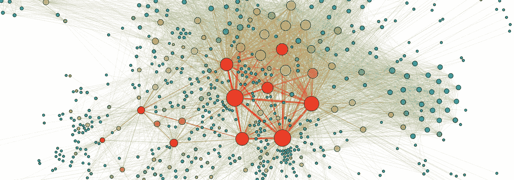
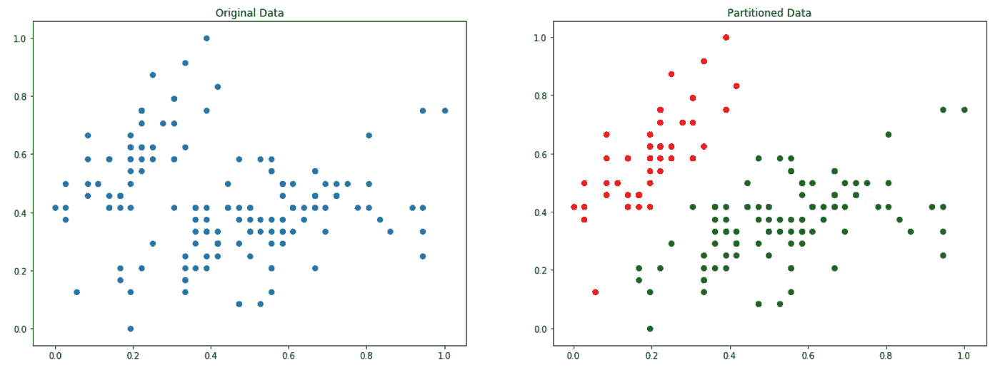
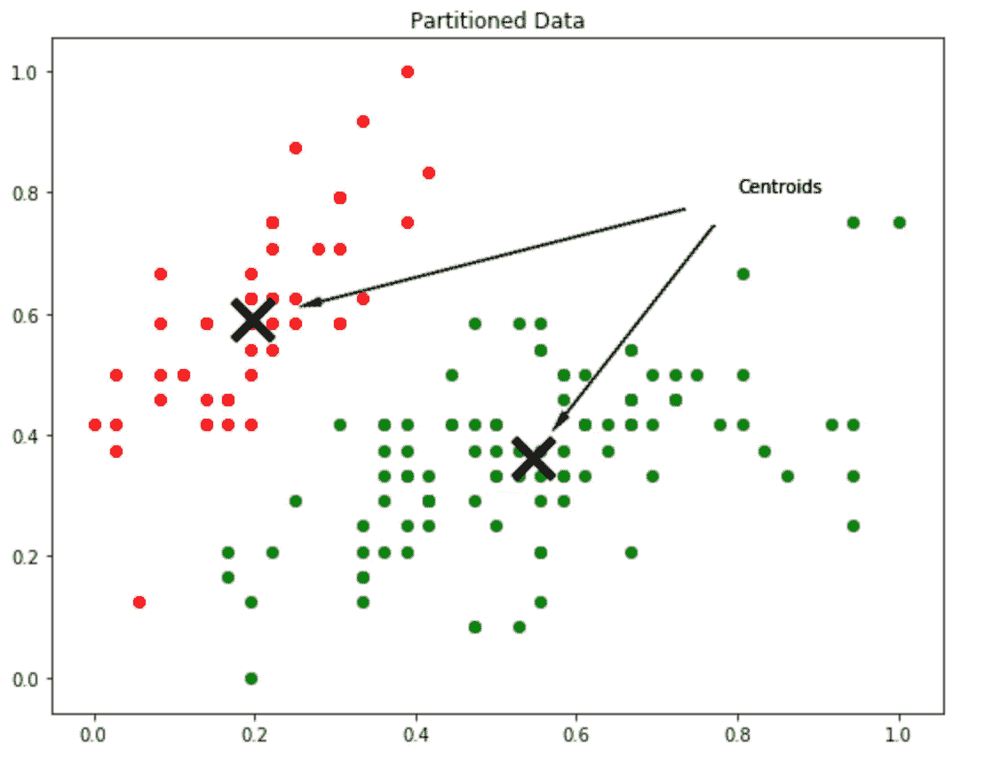
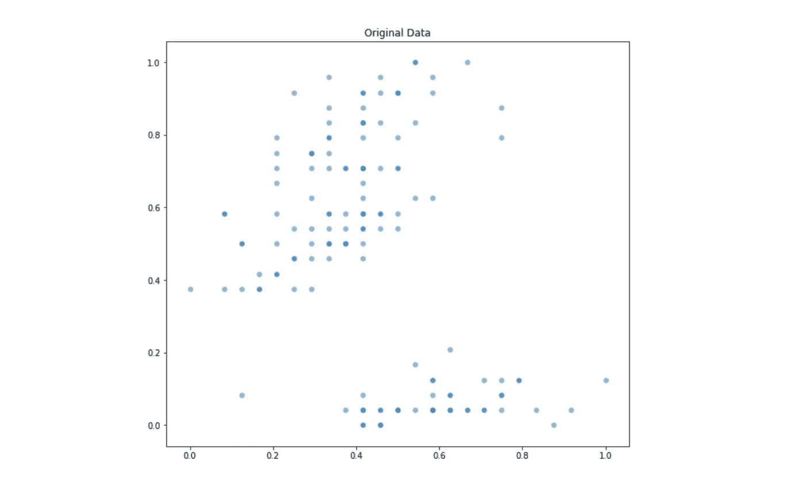
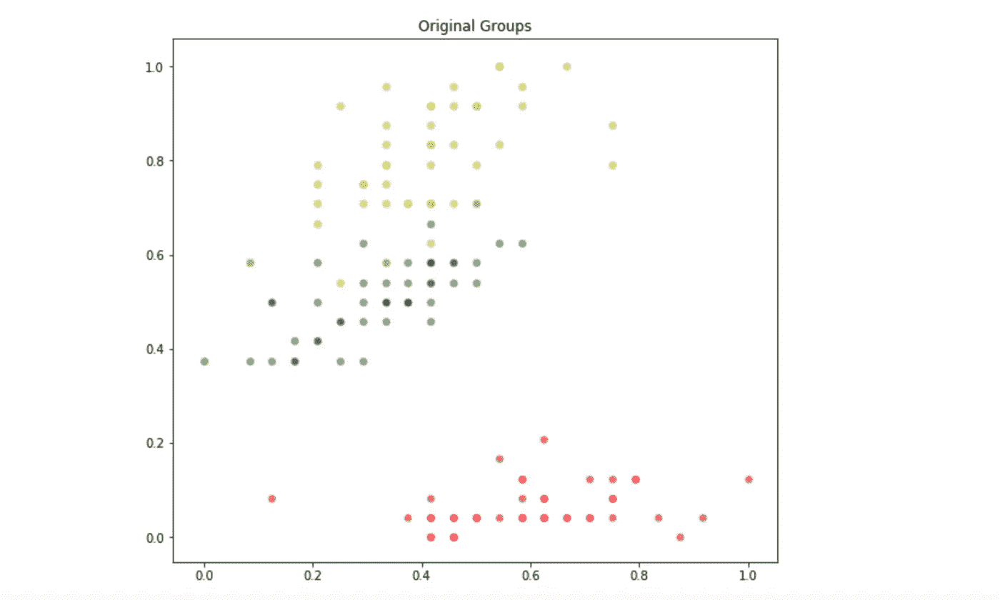
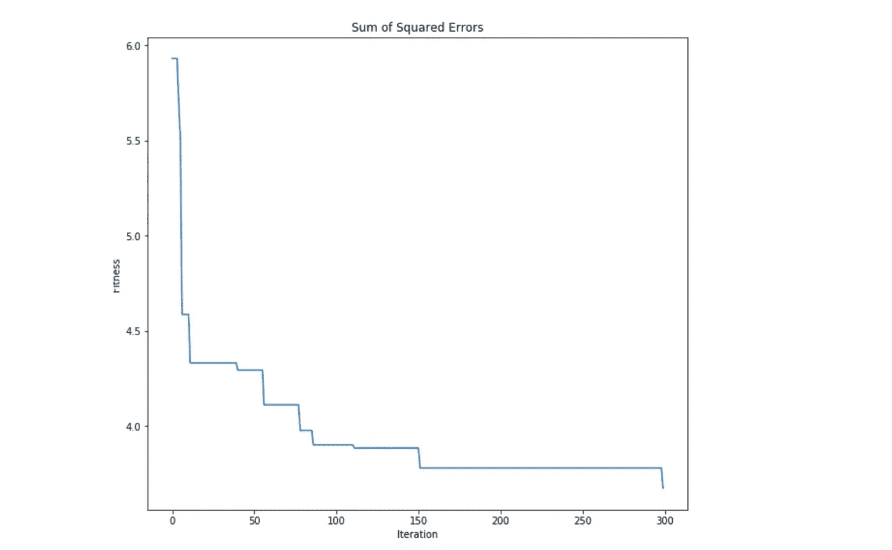

# 一种求解聚类问题的改进人工蜂群算法

> 原文：<https://towardsdatascience.com/a-modified-artificial-bee-colony-algorithm-to-solve-clustering-problems-fc0b69bd0788?source=collection_archive---------6----------------------->

## Python 中的分步实现。

Image credit: [https://www.wikipedia.org/](https://www.wikipedia.org/)

在我的[上一篇文章](https://medium.com/@pjbls/a-swarm-intelligence-approach-to-optimization-problems-using-the-artificial-bee-colony-abc-5d4c0302aaa4)中，我已经介绍了我们如何通过实现一个叫做**人工蜂群(ABC)** 的**群体智能(SI)** 算法来解决现实世界的优化问题。

现在是我们接触一些真实数据并解释如何使用 ABC 算法的 Python 实现来执行聚类任务的时候了。但在此之前，让我们更深入地了解一下**集群问题**。

# 聚类问题

聚类问题是一个非明确定义的 NP-hard 问题，其基本思想是在我们的数据中发现隐藏的模式。对于什么是**集群**并没有正式的定义，但是它与以这样一种方式对元素进行分组的想法相关联，即我们可以区分不同组中的元素。

有不同系列的算法以不同的方式定义聚类问题。在文献中经常看到的定义聚类问题的经典方法是将其简化为一个数学问题，称为寻找原始数据的 ***k 划分*** 。

寻找集合 *S* 的***k-划分*** ，被定义为寻找 *S* 的 *k* 子集，它遵循两条规则:

*   这些子集的任何不同子集的交集等于空集。
*   所有 ***k*** 子集的并集等于 *S.*

基本上，在这个划分聚类过程的最后，我们希望找到原始数据集的不同子集，这样，没有一个实例属于一个以上的组。下图说明了这一点:

On the left the original data, on the right the partitioned data with k=2.

An example of how centroids can be used to perform a data partition with k=2.

我们如何分割数据来执行上图所示的分区？嗯，聚类过程的输出是一组**质心**。质心基本上是每个组的代表实体，所以如果我们想要我们的数据的一个*，那么我们将有 ***k*** **质心。***

*质心也是由我们的数据定义的搜索空间上的点，由于每个质心定义一个组，每个数据点将被分配到离它最近的质心。*

# *修改人工蜂群进行聚类*

*好了，现在我们知道什么是聚类问题，我们如何修改原始的 ABC 算法来执行这样的任务？你猜怎么着，我们没有！是的，这就是你刚刚读到的，我们根本不需要修改我们的 ABC 实现。我们唯一要做的就是关注集群问题，并将其转化为优化任务！但是我们怎么做呢？*

*正如我们在上一篇文章中看到的，一个定义良好的优化问题需要一个**搜索空间**，一组 *d 维*输入**决策变量**和一个**目标函数。如果我们将人工蜂群中的每只蜜蜂视为聚类问题的整体解决方案，那么每只蜜蜂可以代表一组完整的候选质心！如果我们在一个 *d 维*空间上工作，并且我们想要在我们的数据集上执行一个 *k 分区*，那么每只蜜蜂将是一个*k*d 维*向量！****

*厉害！既然我们已经定义了如何表示我们的输入决策变量，我们只需要弄清楚如何定义我们的搜索空间的边界以及什么将是我们的目标函数。*

*我们的搜索空间的边界很容易，我们可以用[0，1]区间归一化我们的整个数据集，并将我们的目标函数定义为具有从 0 到 1 的边界。搞定，就这样。现在让我们进入更复杂的部分:如何定义我们的目标函数？*

*在**划分聚类方法**中，我们希望最大化两个不同组之间的距离，最小化一个组内的内部距离。文献中使用了几个目标函数，但最广为人知和使用的是***【SSE】****。**

**

*Formula for the ***Sum of Squared Errors***. Don’t be afraid, is not that scary.*

*这个公式是什么意思？嗯， ***误差平方和(SSE)*** 是一个聚类度量，背后的思想很简单。它基本上是一个数值，计算数据中每个实例到其最近质心的平方距离。我们优化任务的目标是最小化这个函数。*

*我们可以使用我们之前的目标函数框架来实现如下的 ***误差平方和*** :*

# *用真实的数据动手*

*是时候用一些真实的数据来测试我们的 ABC 聚类算法的性能了。对于这个研究案例，我们将使用众所周知的 ***虹膜数据集*** 。*

*这是一个原始的 4 维数据集，包括三种植物的特征。出于可视化的目的，我们将只使用这个数据集的两个维度。让我们检查该数据集的第二维度和第四维度之间的关系:*

*上面代码的输出如下所示:*

**

*The original data distribution.*

*由于我们将使用该数据作为基准测试，我们已经知道它的最优分割是什么，以及它由三种类型的花的原始分布给出。我们可以用下面的 **Python** 代码来可视化 ***虹膜数据集*** 的原始最优分区:*

*其中绘制了以下分布:*

**

*The original groups within our dataset*

*既然我们已经知道了这个样本数据的原始最优分区是什么，那么是时候看看我们的 ABC 算法是否能够找到这个问题的非常接近的解决方案了。我们将使用我们的 ***误差平方和*** 目标函数，并将分区数量设置为三。*

*由于初始化是随机的，很可能生成的质心的顺序与类的顺序不匹配。因此，当绘制 ABC 算法的输出时，各组的颜色可能不匹配。这并不重要，我们真正要看的是对应的分区组看起来有多好。*

*我们的 Python 代码的输出如下所示:*

**

*The partition of our dataset found by the ABC algorithm.*

*哇，太棒了！如果我们看一下原始分区和由我们的 ABC 算法生成的分区，我们可以看到它能够找到一个真正接近最优的分区。这证明了“改进的”ABC 聚类算法是多么强大。我们还可以通过查看 ABC 算法的***optimality _ tracking***属性来了解优化过程是如何进行的:*

**

*正如所料，ABC 算法在最小化 ***SSE*** 目标函数方面非常有效。我们可以看到**群体智能**拥有一些解决优化问题的强大机器，将这些算法用于解决现实世界的问题只是我们如何将这些问题转化为优化任务的问题。*

# *参考*

*   ****一种新颖的聚类方法:人工蜂群算法***——德尔维斯·卡拉博加，塞拉尔·厄兹图尔克*
*   ****一种采用协同人工蜂群算法的聚类方法*** —邹文平、、陈汉宁、*
*   ****人工蜂群算法及其在数据聚类中的应用综述*** — Ajit Kumar，Dharmender Kumar，S. K. Jarial*
*   ****一种用于聚类的两步人工蜂群算法*** — Yugal Kumar，G. Sahoo*

# *下一步是什么？*

*我们已经通过实现**人工蜂群**算法简单介绍了**群体智能**，以及如何用它来解决一些有趣的问题比如优化实函数，如何“修改”ABC 算法来解决聚类问题。*

*这些算法有大量的应用，如图像分割、人工神经网络的训练、数字图像处理和模式识别、蛋白质结构预测等等。还有一些其他强大的**群体智能(SI)** 算法，如**粒子群优化(PSO)** 和**鱼群搜索(FSS)** ，它们也是非常众所周知的技术，并有一些有趣的应用。*

*敬请期待下一章！*