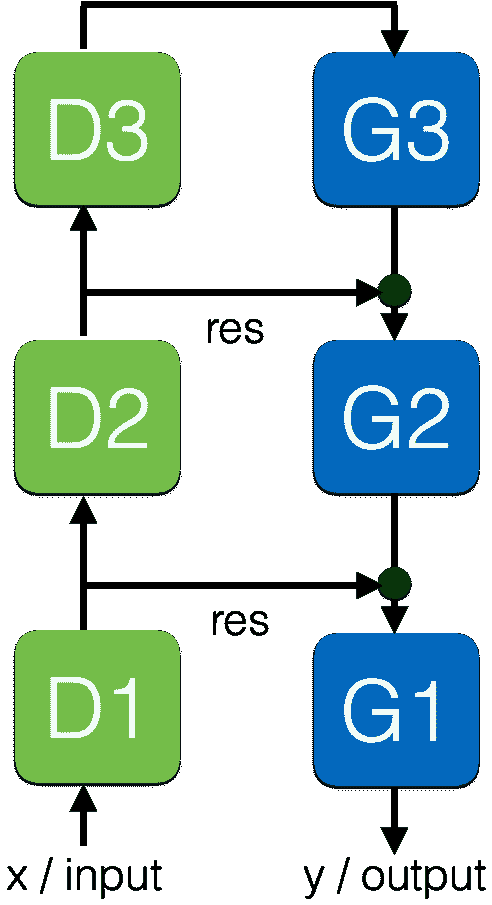
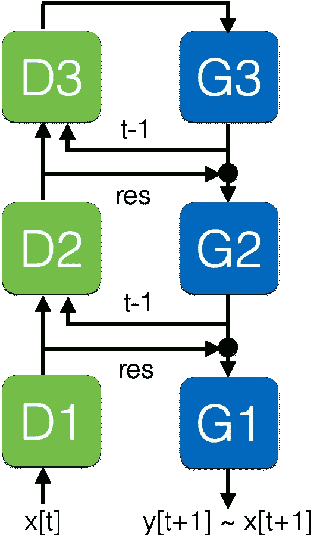
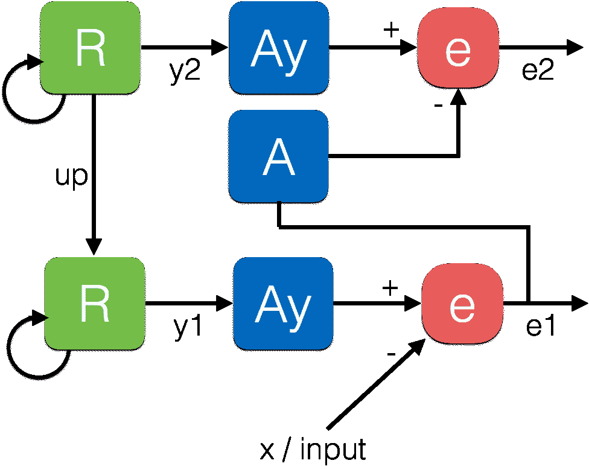
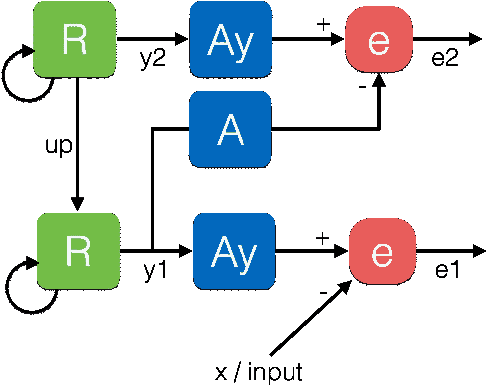
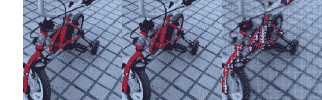

# 一种新的深度神经网络

> 原文：<https://towardsdatascience.com/a-new-kind-of-deep-neural-networks-749bcde19108?source=collection_archive---------2----------------------->

*作者阿尔弗雷多·坎齐阿尼、阿比舍克·乔拉西亚和*[尤金尼奥·库勒西略 ](https://medium.com/@culurciello)

又有**新一波深度神经网络**来了。它们是前馈模型的演变，我们之前详细分析过。

这种新型神经网络是最初的前馈模型[lenet 5](http://yann.lecun.com/exdb/publis/pdf/lecun-01a.pdf)/[Alex net](https://papers.nips.cc/paper/4824-imagenet-classification-with-deep-convolutional-neural-networks.pdf)及其衍生模型的进化，包括比[ResNet](https://arxiv.org/abs/1512.03385)/[Inception](http://arxiv.org/abs/1602.07261)更复杂的旁路方案。这些前馈神经网络也被称为*编码器、*，因为它们将图像压缩和编码成更小的表示向量。

新一波神经网络有两个重要的新特征:

*   **生成分支**:也称为*解码器*，因为它们将一个表示向量投射回输入空间
*   **重现层**:将先前时间步的表示与当前时间步的输入和表示相结合

# 太好了！但是这种增加的复杂性能为我们做什么呢？

原来传统的前馈神经网络有很多局限性:

1- **无法精确定位**:由于较高层中的下采样和空间分辨率损失，特征/对象/类别的定位受损

2- **无法对场景**进行推理:因为他们将图像压缩成一个简短的表示代码，他们丢失了关于图像如何构成以及图像或场景的部分如何在空间上排列的信息

2-具有**时间不稳定性**:由于他们是在静止图像上接受训练的，他们没有学会物体在空间中运动的平滑时空变换。它们可以识别某些图像中的物体类别，但不能识别其他图像，并且对[敌对噪声](https://arxiv.org/abs/1511.06306)和[扰动](https://arxiv.org/abs/1412.1897)非常敏感

3- **无法预测**:由于不使用时间信息，前馈神经网络仅基于当前输入在每一帧提供新的表示代码，但无法预测接下来几帧会发生什么(注意:除了[例外](https://arxiv.org/abs/1504.08023)，未在视频上训练)

为了**超越这些限制**，我们需要一种新的网络，它可以将学习到的表达投射回输入图像空间，并且可以对时间上连贯的图像序列进行训练:**我们需要对视频进行训练**。

这是这些新网络可以提供的**高级功能**列表:

*   **无监督学习**:它们可以在视频上进行预训练，以预测未来的帧或表示，从而需要少得多的标记数据(在视频上很昂贵！)来训练执行一些任务
*   **分割** : [分割图像中的不同对象](https://arxiv.org/abs/1511.00561)
*   **场景解析**:如果数据集具有逐像素对象标签，则遵循分割，用于[自动驾驶](https://codeac29.github.io/projects/linknet/index.html)和增强现实
*   **定位**:遵循分割和完美的对象边界，所有的场景解析和分割网络都可以做到这一点！
*   **时空表示**:使用视频进行训练，而不仅仅是静止图像，了解时间概念和时间关系
*   **视频预测**:一些网络被设计成[预测视频中未来帧](https://arxiv.org/abs/1605.08104)
*   **表示预测**:某网络可以[预测视频中未来帧的表示](https://arxiv.org/abs/1703.07684)
*   通过监控预测和实际未来帧或表示之间的误差信号来执行**在线学习**的能力

现在让我们检查这些新网络的细节和实现，如下所示。

# 生成梯形网络

这些模型使用编码器和解码器对来将图像分割成部分和对象。例子有: [ENet](https://arxiv.org/abs/1606.02147) ， [SegNet](https://arxiv.org/abs/1511.00561) ， [Unet](https://arxiv.org/abs/1505.04597) ， [DenseNets](https://arxiv.org/abs/1611.09326) ，[梯形网络](https://arxiv.org/abs/1507.02672)等等。

下面是一个典型的三层模型:

*D 模块*是标准的前馈层。 *G 模块*是生成模块，类似于标准前馈层，但具有去卷积和上采样功能。它们还使用类似残差的连接*“RES”*将每个编码器层的表示连接到其中一个解码器层。这迫使生成层的表示由前馈表示来调制，从而具有更强的将场景定位和解析为对象和部分的能力。*【x】*是输入图像，*【y】*是输出分割的同时步。

这些网络可以执行分割、场景解析和精确定位，但是不在时间域中操作，并且没有过去帧的记忆。

最近，每层的编码器到解码器旁路帮助这些网络实现了最先进的性能。

# 递归和生成梯形网络

最新的深度神经网络架构之一将递归添加到生成梯形网络中。这些是递归和生成式梯形网络(REGEL，我们称之为 [CortexNet](https://engineering.purdue.edu/elab/CortexNet/) 模型)，它们是迄今为止最复杂的深度神经网络模型之一，至少对于图像分析来说是如此。

这是我们目前使用的一个网络的三层模型:

*D* 和 *G* 模块实际上与上述生成梯形网络中的模块相同。这些网络增加了从每个 *G* 模块到同一层中相应的 *D* 模块的循环路径*“t-1”*。

这些网络将视频中的一系列帧作为输入 *x[t]* ，并在每个时间步预测视频中的下一帧 *y[t+1]* ，如果预测准确的话，该帧接近 *x[t+1]* 。

由于该网络可以测量预测和实际下一帧之间的误差，它知道何时能够预测输入或不能够预测输入。如果没有，它可以激活增量学习，这是前馈网络所不能做到的。因此，它能够执行固有的**在线学习**。

我们认为这是机器学习的一个非常重要的特征，是预测神经网络的特权。没有这个特征，网络就不能提供真正的预测置信度信号，也不能进行有效的增量学习。

这些网络仍在研究中。我们的建议是:保持警惕！

# 预测编码网络—第 1 部分

递归生成网络是一种可能的预测模型。或者，**预测编码**计算神经科学模型可以提供预测能力，并被安排为分层深度神经网络。

下面是一个两层模型的示例:

[Rao 和 Ballard](http://www.nature.com/neuro/journal/v2/n1/abs/nn0199_79.html) 模型和 [Friston 实现](https://www.ncbi.nlm.nih.gov/pubmed/23177956)计算*“A”*模块(类似于梯形网络上的 *D* 模块)和*R/Ay】*模块(类似于梯形网络上的 *G* 模块)之间每一层的误差*“e”*。这个误差*“e”*表示在每一层，网络预测表示的能力。错误*“e”*然后作为输入被转发到下一层。*“R”*是卷积 RNN/LST 模块，*“Ay”*类似于*“A”*模块。*【R】*和*【Ay】*也可以组合成一个单独的循环模块。在第一层 *"x"* 是输入帧。

这个模型的问题是，这个网络与标准的前馈神经网络非常不同。它不在创建较低层特征组合的较高层创建分层表示，而是这些预测网络计算先前层的*残差*的表示。

因此，它们有点让人想起残差前馈网络，但在实践中，迫使这些网络转发错误并不会导致它们在更高层学习有效的分层表示。因此，它们不能有效地执行基于上层表示的其他任务，例如分类、分割、动作识别。需要更多的实验来证明这些局限性。

这个模型已经由 Bill Lotter 和 David Cox 在 [PredNet](https://coxlab.github.io/prednet/) 中实现。类似的型号也来自[大脑公司](https://arxiv.org/abs/1607.06854)。

# 预测编码网络—第二部分

[Spratling](https://nms.kcl.ac.uk/michael.spratling/Doc/visres08.pdf) 预测编码模型将表示 *y* 投射到上层，而不是误差*“e”*，如在上面的 Friston 模型中所执行的。这使得该网络模型与分层前馈深度神经网络更兼容，并避免了上层中的学习误差时刻。

下面是一个两层模型的示例:

这个模型可以基本上重写并简化为我们上面看到的递归生成阶梯模型。这是因为*“R”*和*“Ay”*可以组合成一个单独的循环模块。

# 与生成性对抗网络的关系

生成对抗网络(GAN)是一种非常流行的模型，它能够学习从数据分布中生成样本。这里介绍的新网络模型优于 GAN，因为:

*   他们不是在一个极大极小游戏中被训练，而是直接为一个有用的任务被训练，所以鉴别器和生成器都是直接有用的
*   他们学习创建有用的输入表示，同时也能够生成新的输入
*   他们可以学习根据输入生成目标数据
*   发生器和鉴别器网络连接在一起，消除了收敛问题
*   与 GAN 提供的[难看的结果相比，该生成器提供了近乎完美的照片级真实样本(见下文)](https://channel9.msdn.com/Events/Neural-Information-Processing-Systems-Conference/Neural-Information-Processing-Systems-Conference-NIPS-2016/Generative-Adversarial-Networks)

Example of CortexNet predictive capabilities — Left: current frame, Center: next frame ground truth, Right: predicted next frame

# 其他型号的注意事项

像 CortexNet 这样的模型让人联想到[像素递归网络](https://arxiv.org/abs/1601.06759)及其各种实现( [PixelCNN](https://arxiv.org/abs/1606.05328) 、 [Pixel CNN++](https://openreview.net/pdf?id=BJrFC6ceg) 、 [WaveNet](https://deepmind.com/blog/wavenet-generative-model-raw-audio/) 、[等](http://ruotianluo.github.io/2017/01/11/pixelcnn-wavenet/))。这些模型旨在对输入数据的分布进行建模:(“我们的目标是估计自然图像上的分布，该分布可用于计算[数据]的可能性并生成新的数据。”).他们只专注于生成新的现实数据样本，但没有显示出学习现实生活任务的表示。这些模型的推理速度也非常慢。

# 结论

关于这个话题的一篇论文是[这里](https://arxiv.org/abs/1706.02735)。CortexNet 仍在研究和评估中。例如，最近的 PredNet 论文对预测编码和梯形网络进行了比较，PredNet 在某些任务上胜出。PredNet 用于执行方向不变的人脸分类，使用较高层表示。它还可以预测数据集中的转向角，但主要是使用网络第一层的简单运动滤波器。这项任务不需要对特征进行层次分解。

# 关于作者

我在硬件和软件方面都有将近 20 年的神经网络经验(一个罕见的组合)。在这里看关于我:[媒介](https://medium.com/@culurciello/)、[网页](https://e-lab.github.io/html/contact-eugenio-culurciello.html)、[学者](https://scholar.google.com/citations?user=SeGmqkIAAAAJ)、 [LinkedIn](https://www.linkedin.com/in/eugenioculurciello/) 等等…