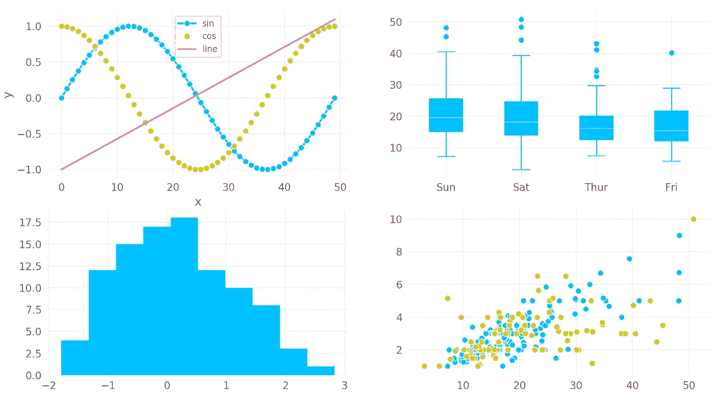
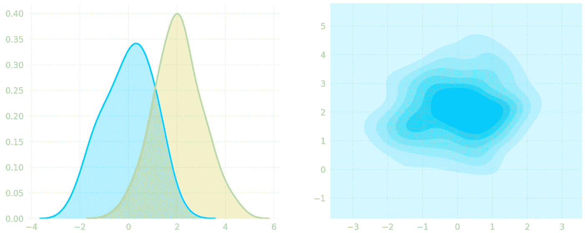
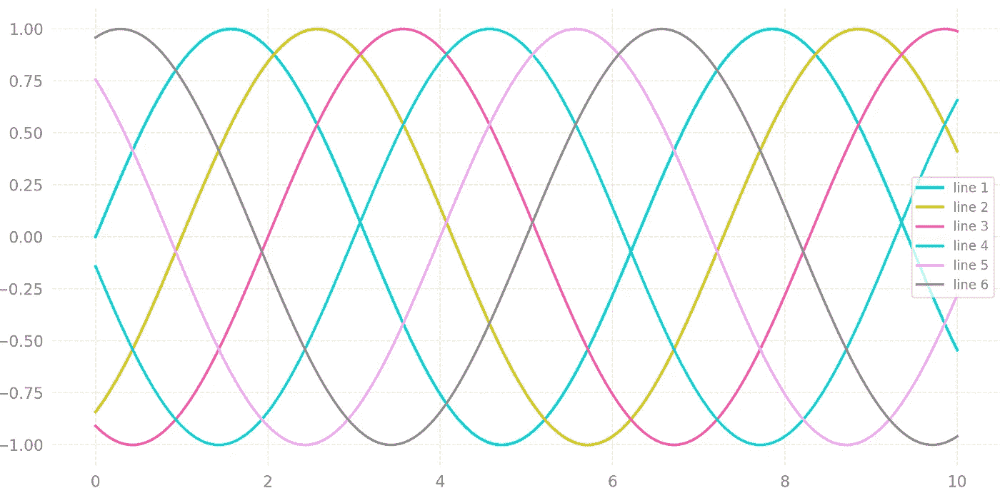
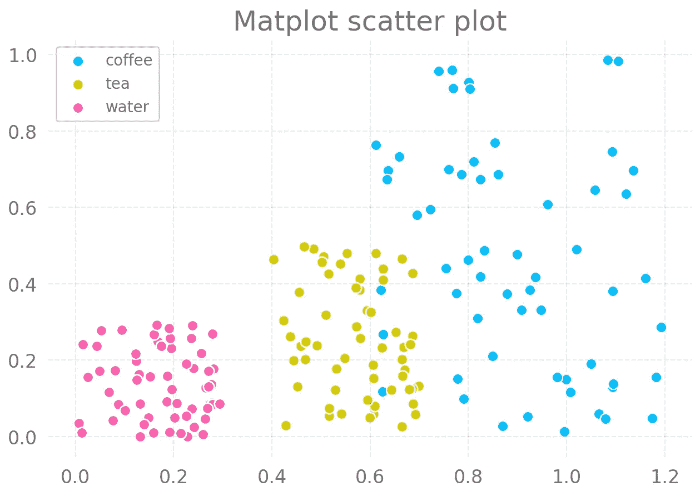
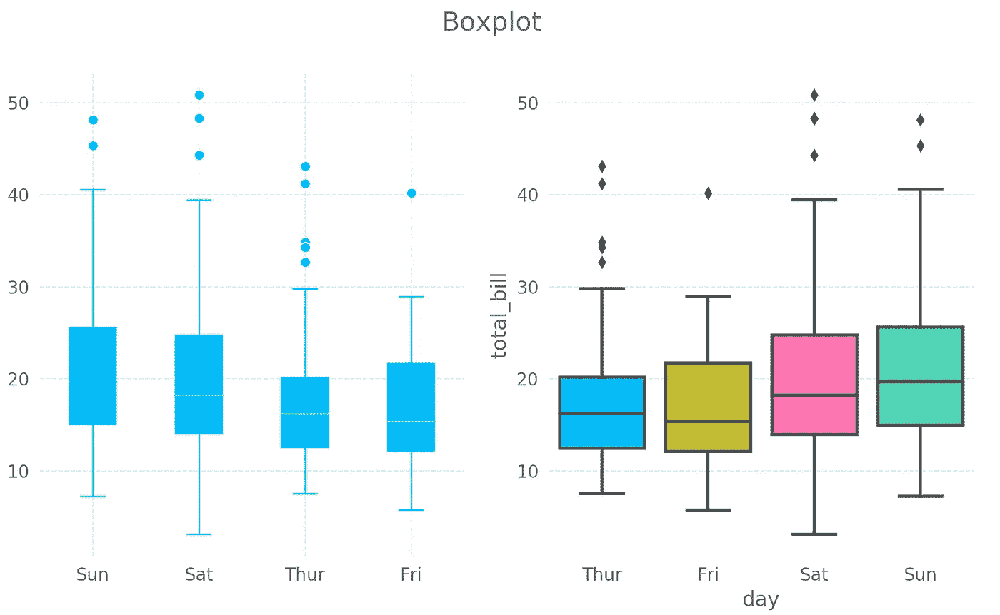
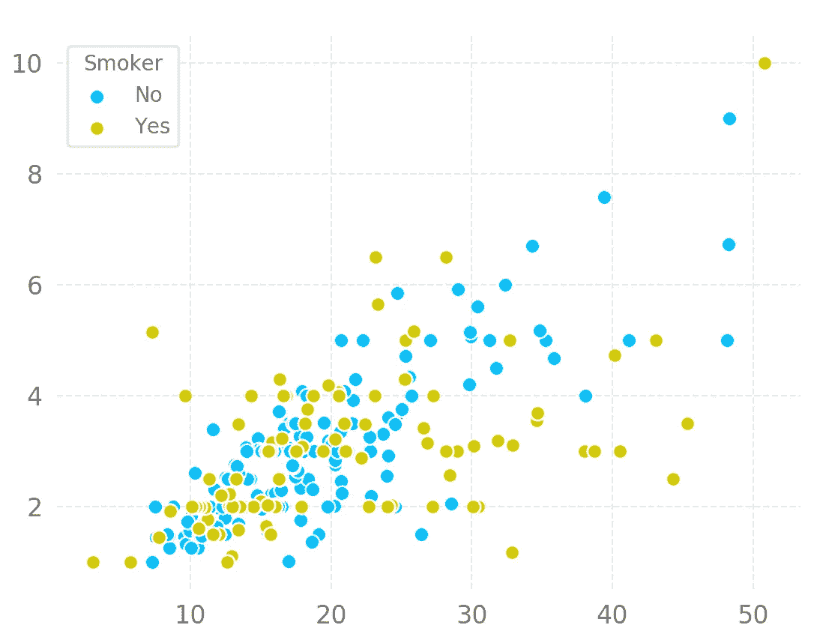
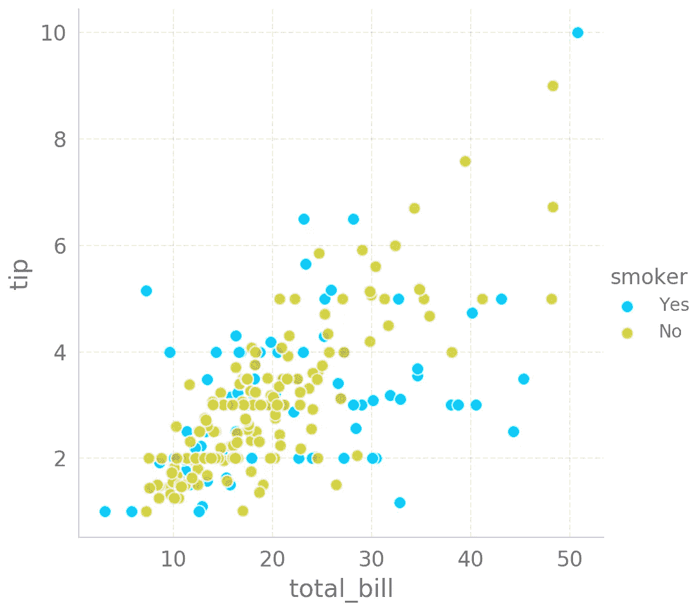

# Matplotlib 的新情节主题——牛虻

> 原文：<https://towardsdatascience.com/a-new-plot-theme-for-matplotlib-gadfly-2cffc745ff84?source=collection_archive---------6----------------------->



Sample plots from the new plotting theme inspired by the Gadfly plotting package for the Julia programming language

# 介绍

我为 [Matplotlib](https://matplotlib.org/) 制作了一个绘图主题，灵感来自于[牛虻](http://gadflyjl.org/stable/)中为 [Julia 编程语言](https://julialang.org/)使用的默认绘图主题。通常我会用 Julia 写代码，这也是我在以前的博客文章中所做的。然而，自从升级到朱莉娅 1.0 版，我已经无法导入牛虻，这意味着没有更多漂亮的牛虻情节。所以我对自己说“ *Jonny，是时候自己创造主题了*”。我做到了！

(如果您想了解如何使用该主题，请跳到最后一节)

# 更多(漂亮的)情节

## KDE 地块



Left: Two 1-dimensional kernel density estimate (KDE) plots. Right: A 2D KDE plot.

## 线形图



All the lines. Code to generate the data shamelessly stolen from *Jake VanderPlas’s article on how to create* [*Simple line plots*](https://jakevdp.github.io/PythonDataScienceHandbook/04.01-simple-line-plots.html) *in Python.*

## 散点图



Scatter plot. Code to generate the plot shamelessly stolen from [this article](https://pythonspot.com/matplotlib-scatterplot/) on how to create scatter plots in Python.

# 与 Seaborn 一起策划

当使用 Seaborn 绘图时，默认的美学会有一点改变。我还没有想出如何改变这一点，但我不会对此大惊小怪。例如，箱线图非常不同(见下文)

Code for creating the boxplots below



Left: Standard matplotlib boxplot function. Right: Boxplot using Seaborn

使用`sns.lmplot`绘图时，图例绘制在轴外，没有边框(如下)。默认情况下，它还会绘制左侧和底部的脊线。



Scatter plot made with maplotlib’s scatterplot function



Scatter plot made with seaborn’s lmplot function

# 如何获得主题

这个主题没有安装在 matplotlib 附带的主题集中。因此，如果你想使用这个主题，你有几个选择。我将在这里列出几个选项，但是你可以通过阅读 matplotlib 文档中的[使用样式表和 rcParams](https://matplotlib.org/tutorials/introductory/customizing.html) 定制 Matplotlib 来了解所有的方法。

## 选项 1

复制这篇博文末尾的 matplotlibrc 样式表内容，并将其保存在与您想要绘制的脚本相同的目录中。用`matplotlibrc`这个名字保存。那应该就行了。

## 选项 2

同样，在这篇博文的末尾复制 matplotlibrc 样式表的内容，但是这次在`mpl_configdir/stylelib`中另存为`<style-name>.mplstyle`。你可以用`matplotlib.get_configdir()`找到`mpl_configdir`在哪里。我必须创建`stylelib`目录，因为它还不在`mpl_configdir`目录中。

一旦你把文件保存在正确的目录下，你就可以用

```
import matplotlib.pyplot as plt
plt.style.use(<style-name>)
```

所以我把文件保存为`gadfly.mplstyle`，我可以用`plt.style.use('gadfly')`设置主题

# 牛虻主题 matplotlibrc 文件