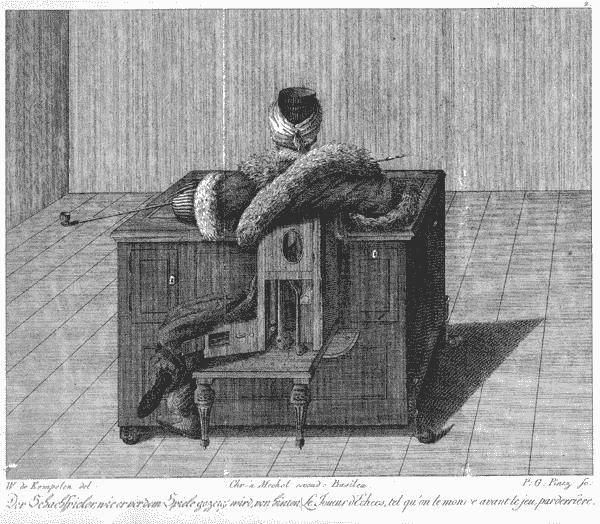

# 深度学习和新的编程范式

> 原文：<https://towardsdatascience.com/a-new-programming-paradigm-for-deep-learning-8ce53b5b6345?source=collection_archive---------8----------------------->

An engraving of the Turk from [Karl Gottlieb von Windisch](https://en.wikipedia.org/wiki/Karl_Gottlieb_von_Windisch)’s 1784 book *Inanimate Reason (*[*wiki*](https://en.wikipedia.org/wiki/The_Turk)*)*

在我之前的[帖子](https://medium.com/@mattia.cd.ferrini/on-the-importance-of-dsls-in-ml-and-ai-1dbccb3a2916)中，当讨论 DSL 在 ML 和 AI 中的重要性时，我们提到了软件 2.0 的想法，由[安德烈·卡帕西](https://medium.com/u/ac9d9a35533e?source=post_page-----8ce53b5b6345--------------------------------)提出:

> 软件 2.0 是用神经网络权重写的。没有人参与编写这段代码，因为有很多权重(典型的网络可能有几百万)，直接用权重编码有点困难(我试过)。相反，我们对期望的程序的行为指定一些约束(例如，示例的输入输出对的数据集),并使用由我们支配的计算资源在程序空间中搜索满足约束的程序。在神经网络的情况下，我们将搜索限制在程序空间的一个连续子集，在这个子集上，搜索过程可以通过反向传播和随机梯度下降*[*【19】*](https://medium.com/@karpathy/software-2-0-a64152b37c35)变得(有点令人惊讶地)高效*

**深度学习就是吃软件*[【13】](https://petewarden.com/2017/11/13/deep-learning-is-eating-software/)。在本帖中，我们将对此进行更深入的探讨。*

# *自动微分*

*什么是自动微分(AD)？网上有无数关于这个主题的资源。*

*Ryan Adams, You Should Be Using Automatic Differentiation, 2016*

*简而言之:*

1.  *向前模式计算方向导数，也称为切线。无需明确计算雅可比矩阵[【4】](https://www-sop.inria.fr/tropics/ad/whatisad.html)即可计算方向导数。换句话说，前向模式的一次扫描可以计算雅可比矩阵的一个列向量， **Jẋ** ，其中 **ẋ** 是种子的一个列向量[【7】](http://www.robots.ox.ac.uk/%7Etvg/publications/talks/autodiff.pdf)*
2.  *反向模式计算方向梯度，即反向模式的一次扫描可以计算雅可比矩阵的一个行向量， **ŷJ** ，其中 **ŷ** 是种子[【7】](http://www.robots.ox.ac.uk/%7Etvg/publications/talks/autodiff.pdf)的一个行向量*
3.  *一次向前或向后扫描的计算成本大致相当，但反向模式需要访问中间变量，需要更多内存。*
4.  *倒车模式 AD 最适合`F: R^n -> R`，前进模式 AD 最适合`G: R -> R^m`。对于使用`n > 1`和`m > 1`的其他情况，选择是很重要的。*
5.  **反向传播仅仅是自动微分的一个特殊版本* [ [2](https://idontgetoutmuch.wordpress.com/2013/10/13/backpropogation-is-just-steepest-descent-with-automatic-differentiation-2/) ]:反向传播有时也被称为反向模式自动微分。查看[ [3](http://www.cs.toronto.edu/%7Ergrosse/courses/csc321_2017/readings/L06%20Backpropagation.pdf) 了解一些历史背景。*

# *实现自动微分*

*自动微分的实现是一个有趣的软件工程课题。[【15】](http://www-sop.inria.fr/tropics/papers/TapenadeRef12.pdf)确定了实现自动微分的两种主要方法:*

1.  ***运算符重载** — *[…]可以用包含额外导数信息的新类型替换浮点变量的类型，并重载该新类型的算术运算，以便沿*传播该导数信息*
2.  ***程序转换** — *人们可以决定显式地构建一个计算导数的新源代码。这非常类似于编译器，除了它产生源代码。这种方法比操作符重载更需要开发，这也是为什么操作符重载 AD 工具出现得更早、数量更多的原因之一。*[【15】](http://www-sop.inria.fr/tropics/papers/TapenadeRef12.pdf)*

*[亲笔签名的](https://github.com/HIPS/autograd)可能是最常用的自动分化文库之一:*

 *[## 臀部/亲笔签名

### 自动签名-有效地计算 numpy 代码的衍生物。

github.com](https://github.com/HIPS/autograd)* 

*[亲笔签名](https://github.com/HIPS/autograd)是开始学习如何实现自动差异化的好地方:*

> *要计算梯度，Autograd 首先必须记录应用于输入的每个变换，因为它被转换为函数的输出。为此，自动签名包装函数(使用函数`*primitive*` *)* ，以便当它们被调用时，它们将自己添加到执行的操作列表中。Autograd 的核心有一个表，将这些包装的图元映射到它们相应的梯度函数(或者更准确地说，它们的向量雅可比乘积函数)。为了标记我们要获取梯度的变量，我们使用`Box`类包装它们。您不应该考虑 Box 类，但是您可能会在打印调试信息时注意到它。*
> 
> *在函数求值之后，Autograd 有一个图形，指定对我们想要区分的输入执行的所有操作。这是函数求值的计算图。为了计算导数，我们简单地将微分规则应用于图中的每个节点。[【亲笔签名】](https://github.com/HIPS/autograd/blob/master/docs/tutorial.md)*

*这种“装箱”是操作符重载的好味道。另一个基于 F#的选择是 DiffSharp:*

* [## DiffSharp:可微分函数编程

### DiffSharp 是一个自动微分(AD)库，由 atlm günebaydin 和 Barak 用 F#语言实现…

diffsharp.github.io](http://diffsharp.github.io/DiffSharp/) 

DiffSharp 展示了如何用合适的类型构建 AD。其他资源，对于熟悉 [Haskell 的人来说，](https://www.haskell.org/)包括[【24】](http://conal.net/blog/posts/what-is-automatic-differentiation-and-why-does-it-work)和[【25】](http://www.danielbrice.net/blog/automatic-differentiation-is-trivial-in-haskell/)。我觉得重载在函数静态类型的设置中大放异彩:

An Haskell implementation of AD [[24]](http://conal.net/blog/posts/what-is-automatic-differentiation-and-why-does-it-work)

# 未决问题:控制流、就地操作和别名

注意到自动区分适用于包含控制流(分支，循环，..).拥有控制流的可能性是具有动态计算图的深度学习框架的关键卖点(例如:PyTorch、Chainer)——这种能力也被称为“定义并运行”[【18】](https://medium.com/intuitionmachine/pytorch-dynamic-computational-graphs-and-modular-deep-learning-7e7f89f18d1):

 [## 皮托赫/皮托赫

### Python 中 pytorch - Tensors 和动态神经网络的 GPU 加速能力

github.com](https://github.com/pytorch/pytorch)  [## 链条链/链条链

### chainer——一种用于深度学习的灵活神经网络框架

github.com](https://github.com/chainer/chainer) 

然而，控制流可能导致代码只能分段可微，这是一个巨大的复杂性开销[【4】](https://www-sop.inria.fr/tropics/ad/whatisad.html)。

> 如果机器学习模型变得更像程序，那么它们将基本上不再是可微分的——当然，这些程序仍将利用连续的几何层作为子例程，这将是可微分的，但模型作为一个整体将不是可微分的。因此，在固定、硬编码的网络中使用反向传播来调整权重值，不可能是未来训练模型的选择方法——至少不可能是全部。[*【21】*](https://blog.keras.io/the-future-of-deep-learning.html)
> 
> *我们需要找出有效训练不可微系统的方法。目前的方法包括遗传算法，“进化策略”，某些强化学习方法，和 ADMM(交替方向乘数法)。自然，梯度下降不会有任何进展——梯度信息对于优化可微参数函数总是有用的。但我们的模型肯定会变得越来越雄心勃勃，而不仅仅是可微的参数函数，因此它们的自动开发(“机器学习”中的“学习”)需要的不仅仅是反向传播。[*【21】*](https://blog.keras.io/the-future-of-deep-learning.html)*

*注意:有趣的是，正如我们将看到的，处理控制流的问题与一个机会密切相关:解耦深度学习模块的想法(与端到端深度学习整体相反)。*

# *就地操作*

*就地操作是算法设计中不可避免的弊端，但也带来了额外的危险:*

> *就地操作会对自动区分造成危害，因为就地操作会使区分阶段所需的数据无效。此外，它们需要执行重要的磁带转换。*[*【16】*](https://openreview.net/pdf?id=BJJsrmfCZ)**

**[【16】](https://openreview.net/pdf?id=BJJsrmfCZ)直观地展示了 [PyTorch](http://pytorch.org/) 如何处理就地操作:失效。**

> **变量的每一个底层存储都与一个版本计数器相关联，该计数器跟踪已经对该存储应用了多少就地操作。当一个变量被保存时，我们记录当时的版本计数器。当试图使用保存的变量时，如果保存的值与当前值不匹配，就会引发错误。[*16】*](https://openreview.net/pdf?id=BJJsrmfCZ)**

# **错认假频伪信号**

**让我们看看 [PyTorch](http://pytorch.org/) 如何看待混叠:**

***x 的原地加法也导致 y 的一些元素被更新；因此，y 的计算历史也发生了变化。支持这种情况相当不容易，所以 PyTorch 拒绝了这个程序，在版本计数器中使用一个额外的字段(参见无效段)来确定数据是共享的*[【16】](https://openreview.net/pdf?id=BJJsrmfCZ)**

# **可微分规划**

**一种看待深度学习系统的方式是“可微分函数式编程”[【8】](http://www.cs.nuim.ie/%7Egunes/files/Baydin-MSR-Slides-20160201.pdf)。深度学习有一个功能解释:**

1.  **同一个神经元(如 ConvNets 和 RNNs)的权重绑定或多个应用类似于功能抽象[【8】](http://www.cs.nuim.ie/%7Egunes/files/Baydin-MSR-Slides-20160201.pdf)**
2.  **构图的结构模式类似于高阶功能(例如，地图、折叠、展开、压缩)[【8】](http://www.cs.nuim.ie/%7Egunes/files/Baydin-MSR-Slides-20160201.pdf)[【12】](http://colah.github.io/posts/2015-09-NN-Types-FP/)；**

> **探索作为深度学习网络训练的功能结构的最自然的操场将是一种可以直接在功能程序上运行反向传播的新语言。*【14】***

***更高层次抽象的好处之一是可以更容易地设计基础设施，调整模型参数和模型[【10】](https://arxiv.org/pdf/1502.03492.pdf)的超参数，利用超梯度:***

> ***超梯度的可用性允许您对基于梯度的优化进行基于梯度的优化，这意味着您可以优化学习率和动量计划、权重初始化参数或哈密顿蒙特卡罗模型中的步长和质量矩阵。[*【11】*](http://hypelib.github.io/Hype/)*；****
> 
> **获得超参数的梯度打开了一个快乐的花园。我们可以拥抱它们，并丰富地超参数化我们的模型，而不是努力从我们的模型中消除超参数。正如高维基本参数化提供了灵活的模型一样，高维超参数化提供了模型类、正则化和训练方法的灵活性。[*【10】*](https://arxiv.org/pdf/1502.03492.pdf)**

**然而，还有更深层的含义:**

> **这感觉就像一种全新的编程，一种可微分的函数式编程。一个人用这些灵活的、可学习的片段编写一个非常粗糙的函数式程序，并用大量数据定义程序的正确行为。然后应用梯度下降或其他优化算法。结果是一个程序能够做一些我们不知道如何直接创建的非凡的事情，比如生成描述图像的标题。*[*【9】*](http://colah.github.io/posts/2015-09-NN-Types-FP/)***

**我喜欢这种思路:函数式编程意味着函数的可组合性。**

> **我们今天通常发现的端到端训练的整体深度学习网络本质上非常复杂，以至于我们无法解释它的推理或行为。最近的研究表明，增量训练方法是可行的。通过用较小的单元进行训练，然后将它们组合起来执行更复杂的行为，网络已经被证明工作得很好。**【20】****

***解耦深度学习模块是一个令人兴奋的研究领域:*使用合成梯度的解耦神经接口*已经显示出，例如，非常有前景的结果[【22】](https://arxiv.org/abs/1608.05343?utm_campaign=Revue%20newsletter&utm_medium=Newsletter&utm_source=The%20Wild%20Week%20in%20AI)***

# ***我们面前的路***

***我不确定可微规划这个术语是否还会存在。与[差动*动态*编程](https://en.wikipedia.org/wiki/Differential_dynamic_programming)混淆的风险很高。***

***另一方面，这个想法很有趣。非常有意思，我很高兴看到像[tensor lang](https://github.com/tensorlang/tensorlang)[【17】](https://medium.com/@maxbendick/designing-a-differentiable-language-for-deep-learning-1812ee480ff1)这样的项目越来越受欢迎。***

***《连线》杂志认为，很快我们就不会给计算机编程了。我们会像训练狗一样训练他们。T10【23】。让我们看看会发生什么。***

# ***资源***

***[0]格里万克、安德烈亚斯和安德里亚·瓦尔特。“评估衍生物:算法微分的原理和技术”。第 105 卷。暹罗，2008 年。***

***[1]乌烈芝、卡伦、爱德华·密德斯和马克斯·韦林。"用于神经网络压缩的软加权共享."arXiv 预印本 arXiv:1702.04008 (2017)***

***[2] Dominic，Steinitz，反向传播只是自动微分的最速下降，[链接](https://idontgetoutmuch.wordpress.com/2013/10/13/backpropogation-is-just-steepest-descent-with-automatic-differentiation-2/)***

***[3]罗杰·格罗斯，《神经网络和机器学习导论讲义》，[链接](http://www.cs.toronto.edu/%7Ergrosse/courses/csc321_2017/readings/L06%20Backpropagation.pdf)***

***【4】什么是自动微分？环***

***[5]梯度和方向导数，[链接](https://math.oregonstate.edu/home/programs/undergrad/CalculusQuestStudyGuides/vcalc/grad/grad.html)***

***[6]阿列克谢·拉杜尔，《自动微分导论》，[链接](https://alexey.radul.name/ideas/2013/introduction-to-automatic-differentiation)***

***[7]哈佛·伯兰，自动微分，[链接](http://www.robots.ox.ac.uk/%7Etvg/publications/talks/autodiff.pdf)***

***[8]atlm gne Baydin，可微分编程，[链接](http://www.cs.nuim.ie/%7Egunes/files/Baydin-MSR-Slides-20160201.pdf)***

***[9] Christopher Olah，神经网络，类型和函数式编程，[链接](http://colah.github.io/posts/2015-09-NN-Types-FP/)***

***[10]马克劳林、杜格尔、戴维·杜文瑙德和瑞恩·亚当斯。"通过可逆学习的基于梯度的超参数优化."机器学习国际会议。2015.***

***[11]炒作:组合机器学习和超参数优化，[链接](http://hypelib.github.io/Hype/)***

***[12] Christopher Olah，神经网络，类型和函数式编程，[链接](http://colah.github.io/posts/2015-09-NN-Types-FP/)***

***[13]皮特·沃登，深度学习就是吃软件，[链接](https://petewarden.com/2017/11/13/deep-learning-is-eating-software/)***

***[14]大卫·达尔林普尔，可微分编程，[链接](https://www.edge.org/response-detail/26794)***

***[15] Hascoet、Laurent 和 Valérie Pascual。[“Tapenade 自动区分工具:原则、模型和规范。”美国计算机学会数学软件汇刊(TOMS) 39.3 (2013): 20](http://www-sop.inria.fr/tropics/papers/TapenadeRef12.pdf)***

***[16] Paszke，Adam，et al .[“py torch 中的自动微分”](https://openreview.net/pdf?id=BJJsrmfCZ)2017 年***

***[17] Max Bendick，为深度学习设计一种可区分的语言，[链接](https://medium.com/@maxbendick/designing-a-differentiable-language-for-deep-learning-1812ee480ff1)***

***[18] Carlos Perez，PyTorch，动态计算图和模块化深度学习，[链接](https://medium.com/intuitionmachine/pytorch-dynamic-computational-graphs-and-modular-deep-learning-7e7f89f18d1)***

***[19]安德烈·卡帕西，软件 2.0，[链接](https://medium.com/@karpathy/software-2-0-a64152b37c35)***

***[20]卡洛斯·佩雷斯，《深度教学:未来最性感的工作》，[链接](https://medium.com/intuitionmachine/why-teaching-will-be-the-sexiest-job-of-the-future-a-i-economy-b8e1c2ee413e)***

***[21]弗朗索瓦·乔莱，深度学习的未来，[链接](https://blog.keras.io/the-future-of-deep-learning.html)***

***[22] Jaderberg，Max，et al. [“使用合成梯度的去耦神经接口”](https://arxiv.org/abs/1608.05343?utm_campaign=Revue%20newsletter&utm_medium=Newsletter&utm_source=The%20Wild%20Week%20in%20AI) arXiv 预印本 arXiv:1608.05343 (2016)。***

***[23]杰森·坦兹，《代码的终结》，连线杂志，2016 年，[链接](https://www.wired.com/2016/05/the-end-of-code/)***

***[24] Conal Elliott，什么是自动微分，它为什么起作用？，[链接](http://conal.net/blog/posts/what-is-automatic-differentiation-and-why-does-it-work)***

***[25]丹尼尔·布里斯，自动微分在哈斯克尔中是微不足道的，[链接](http://www.danielbrice.net/blog/automatic-differentiation-is-trivial-in-haskell/)****