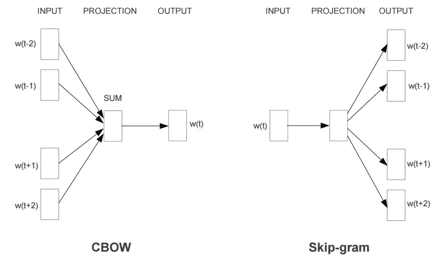
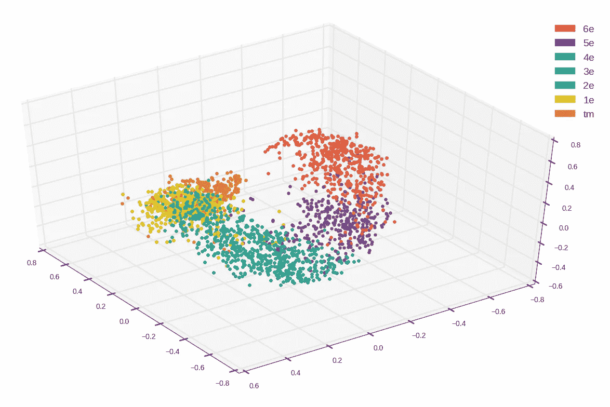
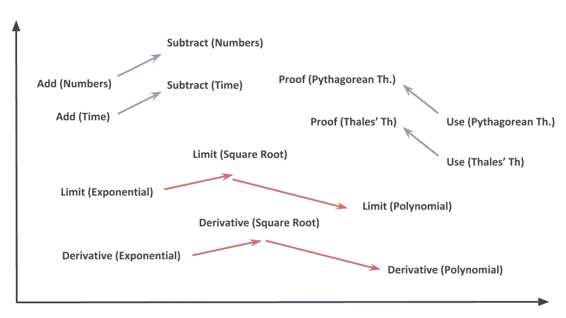

# Word2Vec 的非自然语言处理应用

> 原文：<https://towardsdatascience.com/a-non-nlp-application-of-word2vec-c637e35d3668?source=collection_archive---------1----------------------->

当使用**机器学习**解决问题时，拥有正确的**数据**至关重要。不幸的是，原始数据通常是“不干净的”和**非结构化的**。[自然语言处理](https://en.wikipedia.org/wiki/Natural_language_processing) ( **NLP** ) 从业者对这个问题很熟悉，因为他们所有的数据都是**文本的**。因为大多数机器学习算法不能接受原始的*字符串*作为输入，所以在将数据馈送给学习算法之前，使用**单词嵌入**方法来转换数据。但这并不是文本数据出现的唯一场景，它还可以在标准的非 NLP 任务中以分类特征的形式出现。事实上，我们中的许多人都在努力处理这些类型的特征，那么在这种情况下，单词嵌入有任何用处吗？

本文旨在展示我们如何能够使用 **Word2Vec** ( [2013，Mikolov et al.](https://arxiv.org/pdf/1301.3781.pdf) )，一种单词嵌入技术，将具有**大量模态**的**分类特征**转换为更小的一组更易于使用的**数字特征**。这些功能不仅更容易使用，而且成功地学习了几种模态之间的关系，类似于经典的单词嵌入对语言的影响。

# Word2Vec

> 你可以通过一个人所交往的公司来了解这个人所说的话

以上正是 Word2Vec 试图做的事情:它试图通过分析一个单词的相邻单词来确定该单词的含义(也称为**上下文**)。该算法有两种版本 **CBOW** 和 **Skip-Gram** 。给定一组句子(也称为**语料库**)，该模型循环每个句子的单词，并试图使用当前单词来预测其邻居(其上下文)，在这种情况下，该方法被称为“Skip-Gram”，或者它使用这些上下文中的每一个来预测当前单词，在这种情况下，该方法被称为“连续单词包”(CBOW)。每个上下文中的字数限制由一个名为“**窗口大小**的参数决定。

Both Word2Vec architectures. The current word is w(t) and w(t-2)..w(t+2) are context words. (Mikolov et al. 2013)

因此，如果我们选择例如 Skip-Gram 方法，Word2Vec 则包括使用**浅层神经网络**，即只有一个隐藏层的神经网络，来学习单词嵌入。网络首先随机初始化其权重，然后在训练过程中反复调整这些权重，以最小化使用单词预测其上下文时产生的错误。在一次有希望成功的训练之后，通过将网络的**权重矩阵**乘以单词的[独热向量](https://www.quora.com/What-is-one-hot-encoding-and-when-is-it-used-in-data-science)来获得每个单词的单词嵌入。

> 注意:除了允许文本数据的数字表示之外，由此产生的嵌入还学习单词之间有趣的****关系，并可用于回答如下问题:*国王对王后就像父亲对…？*****

****关于 Word2Vec 的更多细节，你可以看看这个[斯坦福讲座](https://www.youtube.com/watch?v=ERibwqs9p38)或者这个[tensor flow 的教程](https://www.tensorflow.org/tutorials/word2vec)。****

# ****应用****

****在****我们提供在线数学练习。老师给学生布置家庭作业，每次做完一个练习，一些数据就会被储存起来。然后，我们使用收集到的数据**评估学生的水平**，并给他们**量身定制的**复习练习，帮助他们进步。对于每个回答的练习，我们存储一个标识符列表，帮助我们判断:**回答的练习是什么？**，**学生是谁？，是哪一章？** …除此之外，我们还存储了一个**分数**值，该值根据学生的成绩为(0)或(1)。为了评估学生的水平，我们只需预测这个分值，并从我们的分类器中获得成功概率。********

****如你所见，我们的许多特征都是绝对的。通常，当**模态**的数量足够小时，可以简单地将具有(n)个模态的分类特征转换成(n-1)个虚拟变量，然后将其用于训练。但是当模态的数量成千上万时——就像我们的一些特征的情况一样——依赖虚拟变量变得低效和不切实际。****

****为了解决这个问题，我们的想法是使用 Word2Vec 来**将分类特征**转换成相对少量的可用的**连续特征**。为了说明这一点，让我们考虑“exercise_id”，这是一个分类特征，它告诉我们哪个练习得到了回答。为了能够使用 Word2Vec，我们必须提供一个**语料库**，一组输入算法的句子。但是原始特征——id 列表——本身并不是一个文集*:*顺序完全是随机的**并且较近的 id 不携带任何关于它们邻居的**信息**。**我们的技巧**包括把老师给的每一个作业都看作一个“句子”，一个**连贯的**练习 id 列表。因此，id 是按级别、章节自然地收集的，Word2Vec 可以直接在上面嵌入学习练习。******

****事实上，多亏了这些人造句子，我们才能够使用 Word2Vec 并获得漂亮的结果:****

********

****Exercise embedding (3 main components of PCA) colored by level. 6e, 5e, 4e, 3e, 2e, 1e and tm are the french equivalents of the 6th, 7th, 8th, 9th, 10th, 11th and 12th grades in the US.****

****正如我们所看到的，最终的嵌入有一个**结构**。事实上，3d 投影的练习云是螺旋形的，更高级别的**练习直接跟随前一级别的**练习。这意味着嵌入成功学会了**区分不同学校级别的**练习，并将相似的练习重新组合在一起。但这还不是全部，使用一种 [**非线性降维**](https://en.wikipedia.org/wiki/Nonlinear_dimensionality_reduction#Locally-linear_embedding) 技术，我们能够将整个嵌入减少到具有相同特征的单个实值变量中。换句话说，我们获得了一个**练习复杂性**特征，其对于 6 年级练习是最小的，并且**随着练习的增加而增加**，并且**变得更加复杂**，直到其对于 12 年级练习是最大的。****

****此外，嵌入还学习了练习之间的关系，就像米科洛夫学习英语单词一样:****

********

****上图显示了我们的嵌入能够学习的一些关系的例子。那么如果我们问这个问题*“一个* ***数字加法的练习*** *是为了一个* ***数字减法的练习*** *作为一个* ***时间加法的练习*** *是为了…？”*嵌入给了我们答案“*一个* ***时间减法*** ”。具体来说，这意味着如果我们采用差值嵌入[subtract(Numbers)]-嵌入[Add(Numbers)]并将其添加到要求学生添加时间值(小时、分钟……)的练习的嵌入中，那么最接近的嵌入是由减去时间值组成的练习之一。****

# ****结论****

****总之，单词嵌入技术有助于将文本数据转换成实值向量，然后可以轻松地插入到机器学习算法中。尽管这些技术主要用于自然语言处理应用，如机器翻译，我们通过给出我们在 Kwyk 使用的一个特定特征的例子，展示了这些技术在分类特征处理中的地位。但是，为了能够应用 Word2Vec 这样的技术，人们必须建立一个语料库——即一组句子，其中的标签被排列，以便隐式地创建上下文。在我们的例子中，我们使用网站上的家庭作业来创建练习的“句子”并学习练习嵌入。因此，我们能够获得新的数字特征，这些数字特征成功地学习了练习之间的关系，并且比它们所源自的一堆标签更有用。****

****Kwyk 的一名开发人员 Christophe Gabard 提出了用 Word2Vec 处理分类特征的想法，这应该归功于他。****

*****作者:*****