# 置信区间:参数和非参数重采样

> 原文：<https://towardsdatascience.com/a-note-on-parametric-and-non-parametric-bootstrap-resampling-72069b2be228?source=collection_archive---------14----------------------->

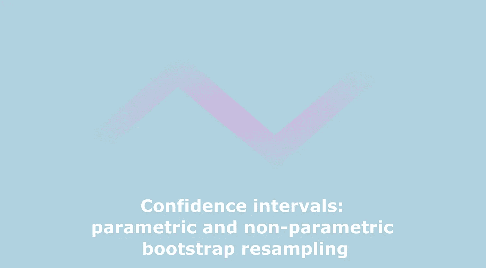

Image by Author

机器学习工程师一生中很重要的一部分时间都花在制作一个好的模型上。泪水和汗水被投入到这个艰苦的过程中。但是，一旦基于防弹理论(当然)的模型存在，一个狡猾的问题就潜伏在其中:“它能告诉我们什么？”。

# 置信区间

置信区间的概念通常用对称高斯分布来解释。然而，它们不一定是对称的，并且根据具体情况，推导起来可能非常繁琐。总的想法基于下面的公式:

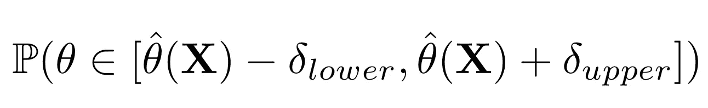

其中***【⍬】***为固定且未知的参数真值，***【⍬】****【hat】**为其“最大似然估计( *MLE)* 来自数据*(为随机变量) ***deltas*** 为置信区间的界限，其在术语中取决于与常见的误解相反，置信区间并不给出预测的置信度，而是给出参数的真实值属于由边界定义的范围的概率。类似地，它可以被解释为误差概率，即参数的真实值超出界限的概率。**

# **如果再次运行该路径，我会看到什么结果？**

**这个问题是频率主义者分析的核心。模型依赖于数据，数据越大、越清晰、越通用，就能获得更好的参数估计。在给定数据的情况下，可以使用参数的置信区间并通过提出以下问题来估计模型的良好性:“如果略有不同，参数和预测将会是什么，但仍然使用看似合理的数据来生成它们。”获取置信区间的步骤如下:**

1.  **写出一个概率模型。**
2.  **在给定数据的情况下，用最大似然估计替换任何参数。用*重采样版本*替换任何随机变量。**
3.  **使用蒙特卡罗方法来估计第 2 步中的概率。**

**步骤 2 中的*重采样版本*可以通过多种方式获得，即参数化和非参数化。**

# **非参数重采样**

**如果假设我们可能看到的所有数据都来自与手头数据相同的分布是安全的，那么，我们能做的最好的事情就是从数据集本身进行替换采样(以保持概率密度函数)。**

# **参数重采样**

**然而，在某些情况下，从数据集进行采样并不是一个很好的主意，例如当数据稀缺时。然后，我们可以直接从最佳拟合( *MLE)、*中生成新样本，并对噪声进行一些假设。**

# **把所有的放在一起**

**考虑两种情况:当数据充足时和当数据有限时。在这两种情况下，数据的基本分布都被假定为未知。**

**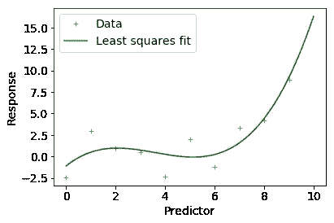****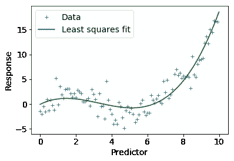

Image by Author.** 

**检查散点图(图 1)后，假设最能描述数据的模型是三次多项式。**

**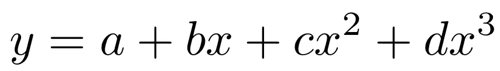**

**此外，假设数据中的噪声是具有零均值和未知标准差的高斯噪声是安全的。**

**这两个过程都遵循上一节中的步骤。对于参数重采样，样本从具有附加高斯噪声的模型中生成，该噪声具有从 *MLE* 拟合的残差中获得的方差。对于非参数重采样，样本从数据的原始分布中生成。**

**要获得响应的置信区间:首先，对于每个预测值，从所有 bootstrap 运行中对模型的预测进行排序，然后找出 *MLE* 和期望区间的界限之间的差异(在这种情况下为 95%)。上限和下限之间的差异是置信区间的上限和下限的增量。**

**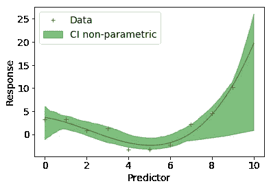****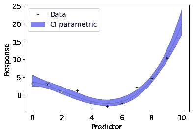

95% confidence intervals for response, non-parametric (left), parametric (Right), 10 points. Image by Author.** **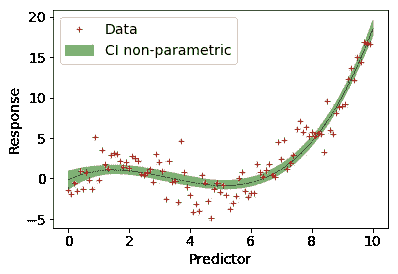****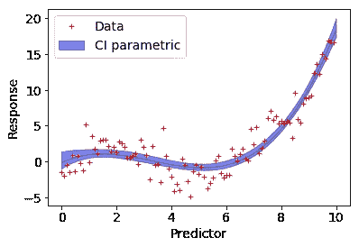

95% confidence intervals for response, non-parametric (left), parametric (Right), 100 points. Image by Author.** 

**类似于预测的置信区间，我们保存来自 bootstrap 的所有拟合模型。**

**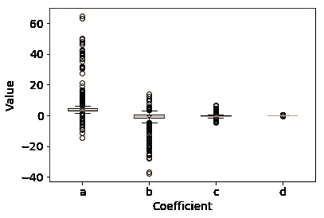****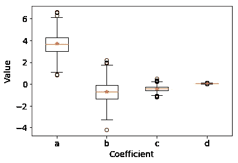

95% confidence intervals for coefficients, non-parametric (left), parametric (Right), 10 points. Image by Author.** **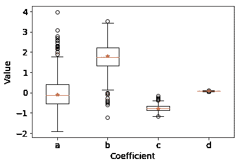****

95% confidence intervals for coefficients, non-parametric (left), parametric (Right), 100 points. Image by Author.** 

# **何时使用**

**何时需要使用参数和非参数重采样？两者都有论据支持。使用非参数重采样，我们无法生成超出经验分布的样本，而使用参数重采样，可以生成超出我们目前所见的数据。但是，如果对模型没有太大的信心，或者数据丰富，那么非参数重采样是更可取的。如果数据不足，那么从参数模型中取样可以使其平滑(从图中可以看出)。**

# **进一步阅读和链接**

**有很多方法可以获得置信区间，例如估计后验分布(贝叶斯主义)，应用中心极限定理(在正态假设下)，使用威尔克斯定理，或者如果使用高斯随机变量，使用海森的[逆作为协方差矩阵等。](https://onlinelibrary.wiley.com/doi/pdf/10.1002/9780470824566.app1)**

**我推荐阅读[这篇关于置信区间的](https://erikbern.com/2018/10/08/the-hackers-guide-to-uncertainty-estimates.html)文章，它从实践的角度给出了一个概述。另外，[这篇](https://besjournals.onlinelibrary.wiley.com/doi/full/10.1111/1365-2656.12382)论文对基于 bootstrap 的置信区间方法进行了很好的概述。**

**本文的 **jupyter 笔记本**可从[这里](https://github.com/mikhailiuk/medium/blob/master/Bootstrap-resampling.ipynb)获得。**

## **喜欢作者？保持联系！**

**我错过了什么吗？请不要犹豫，直接在 [LinkedIn](https://www.linkedin.com/in/aliakseimikhailiuk/) 或 [Twitter](https://twitter.com/mikhailiuka) 上给我留言、评论或发消息吧！**

** [## 你能做得更好吗？抽样策略，重点是吉布斯抽样，实践和代码

### 提供了通用采样策略的概述，重点是 Gibbs 采样、示例和 python 代码。

towardsdatascience.com](/can-you-do-better-sampling-strategies-with-an-emphasis-on-gibbs-sampling-practicals-and-code-c97730d54ebc)  [## 贝叶斯优化的超参数调整或者我如何用木头雕刻船

### 超参数调整通常是不可避免的。对于一个参数，网格搜索可能就足够了，但如何处理…

towardsdatascience.com](/bayesian-optimization-or-how-i-carved-boats-from-wood-examples-and-code-78b9c79b31e5)  [## 成对比较的主动采样

### 如何配对玩家，以便在尽可能少的游戏中知道排名，同时游戏体验质量…

towardsdatascience.com](/active-sampling-for-pairwise-comparisons-476c2dc18231)**