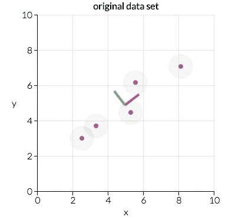
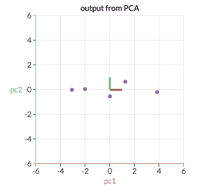
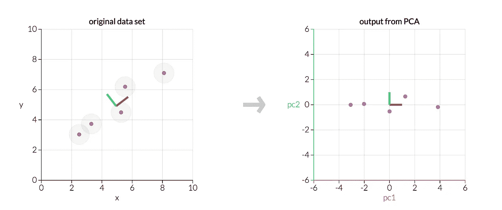
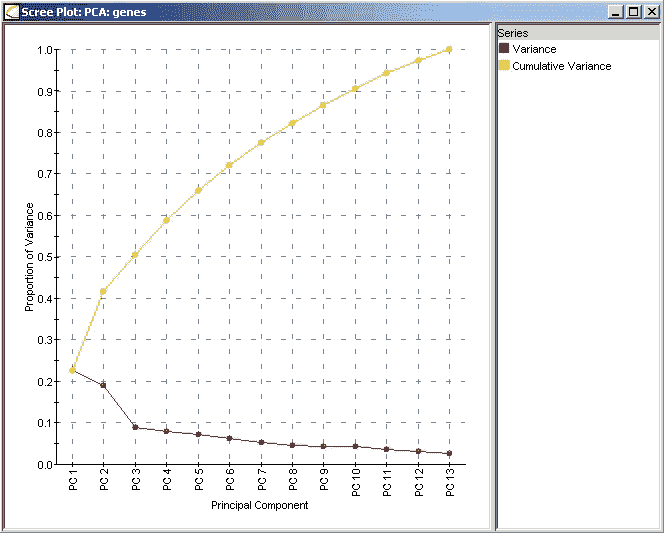

# 主成分分析的一站式商店

> 原文：<https://towardsdatascience.com/a-one-stop-shop-for-principal-component-analysis-5582fb7e0a9c?source=collection_archive---------0----------------------->

在我为研究生统计理论课程使用的[教材的开头，作者(乔治·卡塞拉和罗杰·伯杰)在序言中解释了他们为什么选择编写一本教材:](http://people.unica.it/musio/files/2008/10/Casella-Berger.pdf)

> W 当有人发现你在写教科书时，他们会问你两个问题中的一个或两个。第一个是“你为什么要写书？第二个问题是“你的书和外面的有什么不同？“第一个问题相当容易回答。你正在写一本书，因为你对现有的文本不完全满意。”

我在这里应用作者的逻辑。主成分分析(PCA)是统计学和数据科学领域中需要理解的一项重要技术……但是，当我为我的[大会](https://generalassemb.ly/)的学生们组织课程时，我发现网上的资源过于专业，没有完全满足我们的需求，并且/或者提供了相互矛盾的信息。可以肯定地说，我对现有的文本并不完全满意。

因此，我想把 PCA 的“什么”、“何时”、“如何”和“为什么”以及一些有助于进一步解释这个主题的资源链接放在一起。具体来说，我想介绍这种方法的基本原理、幕后的数学、一些最佳实践以及这种方法的潜在缺点。

虽然我想让 PCA 尽可能容易理解，但是我们将要讨论的算法是非常技术性的。熟悉以下部分或全部内容会使本文和 PCA 作为一种方法更容易理解:[矩阵运算/线性代数](https://www.youtube.com/playlist?list=PLZHQObOWTQDPD3MizzM2xVFitgF8hE_ab)(矩阵乘法、矩阵转置、矩阵求逆、矩阵分解、特征向量/特征值)和统计学/机器学习(标准化、方差、协方差、独立性、线性回归、特征选择)。我在整篇文章中嵌入了这些主题的插图的链接，但希望这些是一个提醒，而不是通读文章的必读内容。

# **什么是 PCA？**

假设你想预测美国 2017 年的国内生产总值(GDP)是多少。你有很多可用的信息:2017 年第一季度的美国 GDP，2016 年全年的美国 GDP，2015 年等等。你有任何公开的经济指标，如失业率、通货膨胀率等等。你有 2010 年的美国人口普查数据，估计每个行业中有多少美国人工作，以及在每次人口普查之间更新这些估计的[美国社区调查](https://www.census.gov/programs-surveys/acs/about.html)数据。你知道每个政党有多少名众议员和参议员。你可以收集股票价格数据，一年中发生的[首次公开募股](https://en.wikipedia.org/wiki/Initial_public_offering)的数量，以及[有多少 CEO](https://www.nytimes.com/2017/03/09/business/bloomberg-iger-business-executives-president.html?_r=0)[似乎正在准备竞选公职](http://www.latimes.com/business/technology/la-fi-tn-zuckerberg-president-20170120-story.html)。尽管有大量的变量需要考虑，但这个*只是触及了表面*。

[TL；DR](http://www.urbandictionary.com/define.php?term=tl%3Bdr)——你有*很多*变量要考虑。

如果你以前处理过很多变量，你就会知道这会带来问题。你了解每个变量之间的关系吗？您是否有太多的变量，以至于您的模型可能会过度适应您的数据，或者您可能会违反您正在使用的任何建模策略的假设？

你可能会问这样一个问题，“我如何把我收集的所有变量集中在其中的几个上？”用专业术语来说，你想要“减少你的特征空间的维数”通过减少特征空间的维度，您需要考虑的变量之间的关系更少，并且您不太可能过度拟合您的模型。(注意:这并不立即意味着过度拟合等。不再令人担忧，但我们正朝着正确的方向前进！)

不出所料， ***降维*** 特征空间的 ***维度*** 称为 ***降维*** 。”有许多方法可以实现降维，但这些技术大多属于以下两类之一:

*   特征消除
*   特征抽出

**特征消除**顾名思义:我们通过消除特征来减少特征空间。在上面的 GDP 例子中，除了我们认为最能预测美国国内生产总值的三个变量之外，我们可能会放弃所有变量，而不是考虑每一个变量。特征消除方法的优点包括简单性和维护变量的可解释性。

然而，作为一个缺点，你不能从你丢弃的变量中获得任何信息。如果我们只使用去年的国内生产总值、根据最新的美国社区调查数据，制造业就业人口的比例以及失业率来预测今年的国内生产总值，我们就错过了任何可能对我们的模型有所贡献的变量。通过消除功能，我们也完全消除了这些变量可能带来的任何好处。

**特征提取**，不过，不会碰到这个问题。假设我们有十个独立变量。在特征提取中，我们创建十个“新”独立变量，其中每个“新”独立变量是十个“旧”独立变量的组合。然而，我们以特定的方式创建这些新的自变量，并根据它们预测因变量的程度对这些新变量进行排序。

你可能会说，“降维在哪里发挥作用？”好吧，我们保留尽可能多的新的独立变量，但我们放弃了“最不重要的”因为我们根据新变量对因变量的预测程度对它们进行了排序，所以我们知道哪个变量最重要，哪个最不重要。但是——这就是问题所在——因为这些新的独立变量是旧变量的组合，所以我们仍然保留旧变量中最有价值的部分，即使我们放弃了一个或多个“新”变量！

主成分分析是一种用于*特征提取*的技术——因此它以一种特定的方式组合我们的输入变量，然后我们可以丢弃“最不重要”的变量，同时仍然保留所有变量中最有价值的部分！*作为一个额外的好处，PCA 后的每个“新”变量都是相互独立的。*这是一个好处，因为线性模型的[假设要求我们的独立变量彼此独立。如果我们决定用这些“新”变量拟合一个线性回归模型(见下面的“主成分回归”)，这个假设必然会得到满足。](http://people.duke.edu/~rnau/testing.htm)

# 什么时候应该使用 PCA？

1.  您是否希望减少变量的数量，但却无法确定可以完全不考虑的变量？
2.  你想确保你的变量是相互独立的吗？
3.  你愿意让你的自变量变得更难解释吗？

如果你对这三个问题的回答都是肯定的，那么 PCA 是一个很好的方法。如果你对问题 3 的回答是“否”,你**不应该**使用五氯苯甲醚。

# PCA 是如何工作的？

之后的部分讨论了*为什么* PCA 有效，但是在进入算法之前提供一个简短的总结可能对上下文有帮助:

*   我们要计算一个矩阵，这个矩阵总结了变量之间的关系。
*   然后我们将这个矩阵分解成两个独立的部分:方向和大小。然后，我们可以了解数据的“方向”及其“大小”(或者每个方向有多“重要”)。下面的截图，[来自 setosa.io applet](http://setosa.io/ev/principal-component-analysis/) ，显示了该数据中的两个主要方向:“红色方向”和“绿色方向”在这种情况下，“红色方向”是更重要的一个。我们稍后会讨论为什么会出现这种情况，但是考虑到这些点是如何排列的，你能看出为什么“红色方向”看起来比“绿色方向”更重要吗？(*提示:拟合该数据的最佳拟合线会是什么样子？*)

Our original data in the xy-plane. ([Source](http://setosa.io/ev/principal-component-analysis/).)

*   我们将转换我们的原始数据，以符合这些重要的方向(这是我们的原始变量的组合)。下面的截图([同样来自 setosa.io](http://setosa.io/ev/principal-component-analysis/) )是与上面相同的精确数据，但是进行了转换，使得 *x* -和*y*-轴现在是“红色方向”和“绿色方向”。这里的最佳拟合线是什么样的？

Our original data transformed by PCA. ([Source](http://setosa.io/ev/principal-component-analysis/).)

*   虽然这里的可视化示例是二维的(因此我们有两个“方向”)，但请考虑我们的数据有更多维的情况。通过识别哪些“方向”是最“重要”的，我们可以通过丢弃“最不重要”的“方向”来压缩或投影我们的数据到一个更小的空间**通过将我们的数据投影到一个更小的空间，我们减少了特征空间的维度…但是因为我们已经在这些不同的“方向”上转换了我们的数据，我们已经确保在我们的模型中保留所有原始变量！**

在这里，我通过一个算法进行主成分分析。我尽量避免太专业，但是不可能忽略这里的细节，所以我的目标是尽可能清晰地介绍事情。在下一节中，我们将更深入地了解该算法为什么会起作用。

在开始之前，您应该用 *n* 行和可能的 *p+1* 列来组织表格数据，其中一列对应于您的因变量(通常表示为 ***Y*** )和 *p* 列，其中每一列对应于一个自变量(其矩阵通常表示为 ***X*** )。

1.  如果一个 ***Y*** 变量存在，并且是你的数据的一部分，那么把你的数据分成*和 ***X*** ，如上定义——我们将主要使用 ***X*** 。(注意:如果没有 **Y** 的列，没关系——跳到下一点！)*
2.  *取独立变量矩阵 ***X*** ，对于每一列，从每一项中减去该列的平均值。(这确保了每一列的平均值为零。)*
3.  *决定是否标准化。给定 ***X*** 的列，是方差较高的特征比方差较低的特征更重要，还是特征的重要性与方差无关？(在这种情况下，重要性意味着该特征预测 ***Y*** 的好坏。)**如果特征的重要性独立于特征的方差，那么将一列中的每个观察值除以该列的标准差。**(这与步骤 2 相结合，标准化 *X* 的每一列，以确保每一列都有平均值 0 和标准偏差 1。)调用居中的(也可能是标准化的)矩阵 ***Z*** 。*
4.  *取矩阵 ***Z*** ，[转置它](https://chortle.ccsu.edu/VectorLessons/vmch13/vmch13_14.html)，将转置后的矩阵乘以 ***Z*** 。(从数学上来说，我们将把它写成***z***ᵀ***z***。)得到的矩阵就是 ***Z*** 的[协方差矩阵，最多一个常数。](http://www.itl.nist.gov/div898/handbook/pmc/section5/pmc541.htm)*
5.  *(这可能是最难的一步——请继续关注我。)计算***z***ᵀ***z***的特征向量及其对应的特征值。这在大多数计算包中都很容易做到——事实上，我们将***z***ᵀ***z***的[特征分解*z*ᵀ***z***分解为 ***PDP*** ⁻，其中 ***P*** ***D*** 对角线上的特征值会关联到 ***P*** 中对应的列——即 ***D*** 的第一个元素是λ₁，对应的特征向量是 ***P*** 的第一列。这适用于*中的所有元素以及 ***P*** 中它们对应的特征向量。我们总是能够以这种方式计算出 ***PDP*** ⁻。(额外收获:对于感兴趣的人，我们总是可以用这种方式计算 ***PDP*** ⁻，因为***z***ᵀ***z***是一个*](https://cseweb.ucsd.edu/~dasgupta/291-unsup/lec7.pdf)*[对称](https://en.wikipedia.org/wiki/Symmetric_matrix)，[半正定矩阵](https://en.wikipedia.org/wiki/Positive-definite_matrix)。)**
6.  **取特征值λ₁，λ₂，…，λ *p* ，从大到小排序。这样做，相应地对 ***P*** 中的特征向量进行排序。(例如，如果λ₂是最大特征值，则取第二列 ***P*** 放在第一列位置。)取决于计算包，这可以自动完成。把这个特征向量排序后的矩阵叫做 ***P**** 。( ***P**** 的列应该与 ***P*** 的列相同，但顺序可能不同。注意，这些特征向量是相互独立的。**
7.  **计算***Z ****=***ZP ****。这个新矩阵，**** Z ****，是 ***X*** 的中心化/标准化版本，但是现在每个观察是原始变量的组合，其中权重由特征向量确定。**另外，因为我们在 *P** 中的特征向量是彼此独立的，所以 *Z** 的每一列也是彼此独立的！****

****

**An example from [setosa.io](http://setosa.io/ev/principal-component-analysis/) where we transform five data points using PCA. The left graph is our original data ***X****; the right graph would be our transformed data* ***Z*****.***

**请注意此图中的两点:**

*   **这两个图表显示了完全相同的数据，但右边的图表反映了原始数据的转换，因此我们的轴现在是主要组成部分。**
*   **在这两幅图中，主成分相互垂直。**事实上，每一个主成分总是与每一个其他主成分******(也就是官方的数学术语，表示垂直)**。**(不信我？[尝试破解小程序](http://setosa.io/ev/principal-component-analysis/)！)******

********因为我们的主成分彼此正交，所以它们在统计上彼此线性无关…这就是为什么我们的 *Z** 列彼此线性无关！********

******8.最后，我们需要决定保留多少特性，放弃多少特性。有三种常见的方法来确定这一点，下面讨论并给出一个明确的示例:******

*   ********方法一**:我们任意选择想要保留多少维度。也许我想用二维来直观地表现事物，所以我可能只保留两个特征。这取决于用例，对于我应该选择多少特性没有硬性规定。******
*   ********方法 2** :计算每个特性的[方差比例](https://stats.stackexchange.com/questions/22569/pca-and-proportion-of-variance-explained)(下面简要说明)，选择一个阈值，并添加特性，直到达到该阈值。(例如，如果您想要解释您的模型可能解释的 80%的总可变性，则添加具有最大解释方差比例的要素，直到您的解释方差比例达到或超过 80%。)******
*   ********方法三**:这个和方法二密切相关。计算每个特征的[解释方差比例](https://stats.stackexchange.com/questions/22569/pca-and-proportion-of-variance-explained)，根据解释方差比例对特征进行排序，并绘制保留更多特征时解释方差的累积比例。(该图被称为[碎石图](http://ba-finance-2013.blogspot.com/2012/09/scree-plots-interpretation-and.html)，如下所示。)通过识别添加新特征相对于先前特征具有显著差异下降的点，并选择直到该点的特征，可以挑选包括多少特征。(我称之为“找到肘部”方法，因为查看碎石图中的“弯曲”或“肘部”可以确定所解释的方差比例中出现最大下降的位置。)******

******因为每个特征值大致就是它对应的特征向量的重要性，所以解释的方差比例就是你保留的特征的特征值之和除以所有特征的特征值之和。******

************

******Scree Plot for Genetic Data. ([Source](http://www.improvedoutcomes.com/docs/WebSiteDocs/PCA/Creating_a_Scree_Plot.htm).)******

******考虑一下这个基因数据的 scree 图。(来源:[此处](http://www.improvedoutcomes.com/docs/WebSiteDocs/PCA/Creating_a_Scree_Plot.htm)。)红线表示由每个特征解释的方差的比例，其计算方法是将该主成分的特征值除以所有特征值的总和。仅包含主成分 1 解释的方差比例为λ₁/(λ₁ + λ₂ + … + λ *p* )，约为 23%。仅包含主成分 2 解释的方差比例为λ₂/(λ₁ + λ₂ + … + λ *p* )，约为 19%。******

******同时包含主成分 1 和主成分 2 解释的方差比例为(λ₁ + λ₂)/(λ₁ + λ₂ + … + λ *p* )，约为 42%。这就是黄线出现的地方；黄线表示方差的累积比例，如果您包括到该点为止的所有主成分。例如，PC2 上方的黄点表示包含主成分 1 和 2 将解释模型中总方差的约 42%。******

******现在我们来看一些例子:******

*   ******方法 1:我们任意选择一些主要成分。假设我想在我的模型中保留五个主要组件。在上面的遗传数据案例中，这五个主成分解释了通过包括所有 13 个主成分可以解释的总可变性的大约 66%。******
*   ******方法 2:假设我想包含足够的主成分来解释全部 13 个主成分所解释的 90%的总可变性。在上面的遗传数据案例中，我将包括前 10 个主成分，并从*中去掉最后三个变量。*******
*   *******方法 3:在这里，我们要“找到肘部”在上面的碎石图中，我们看到主成分 2 和主成分 3 之间解释的可变性比例有很大下降。在这种情况下，我们可能会包括前两个特性，并放弃其余的特性。正如你所看到的，这种方法有点主观，因为“肘”没有数学上精确的定义，在这种情况下，我们将包括一个模型，它只能解释大约 42%的总可变性。*******

********(注意:一些 scree 图将在 Y 轴上具有特征向量的大小，而不是方差的比例。这导致等效的结果，但是需要用户手动计算方差的比例。* [*这里可以看到*](http://documentation.statsoft.com/STATISTICAHelp.aspx?path=Glossary/GlossaryTwo/S/ScreePlotScreeTest) *的例子。)********

******一旦我们删除了我们想要删除的转换变量，我们就完成了！那是 PCA。******

# ******但是，就像，为什么 PCA 会起作用？******

******虽然 PCA 是一种非常技术性的方法，依赖于深入的线性代数算法，但当你考虑它时，它是一种相对直观的方法。******

*   ******首先，协方差矩阵***z***ᵀ***z***是一个矩阵，包含对 ***Z*** 中的每个变量如何与 ***Z*** 中的每个其他变量相关的估计。理解一个变量如何与另一个变量相关联是非常重要的。******
*   ******第二，特征值和特征向量很重要。特征向量代表方向。想象一下在多维散点图上绘制数据。那么你可以把一个单独的特征向量想象成你的散点图中的一个特定的“方向”。特征值代表数量或重要性。更大的特征值与更重要的方向相关。******
*   ******最后，我们假设特定方向上更多的可变性与解释因变量的行为相关。大量可变性通常表示信号，而少量可变性通常表示噪声。因此，在一个特定的方向上有越多的可变性，从理论上来说，表明我们想要检测一些重要的东西。( [setosa.io PCA applet](http://setosa.io/ev/principal-component-analysis/) 是处理数据并说服自己为什么有意义的好方法。)******

******因此，PCA 是一种集合了以下内容的方法:******

1.  ******衡量每个变量如何相互关联。(协方差矩阵。)******
2.  ******我们的数据分散的方向。(特征向量。)******
3.  ******这些不同方向的相对重要性。(特征值。)******

******主成分分析结合了我们的预测，并允许我们放弃相对不重要的特征向量。******

# ******PCA 有扩展吗？******

******是的，在有限的篇幅内我无法一一讲述。我最常看到的一个是[主成分回归](https://onlinecourses.science.psu.edu/stat857/node/157)，我们将未变换的 ***Y*** 回归到我们没有丢弃的*的子集上。(这就是 ***Z**** 列独立性的来源；通过 ***Y*** 对 ***Z**** 的回归，我们知道自变量所要求的独立性必然会得到满足。然而，我们仍然需要检查我们的其他假设。)*******

******我见过的另一个常见变体是[内核 PCA](https://en.wikipedia.org/wiki/Kernel_principal_component_analysis) 。******

# ******结论******

******我希望这篇文章对你有帮助！查看下面的一些资源，以获得关于 PCA 的更深入的讨论。让我知道你的想法，尤其是如果有改进的建议。******

******我听说这篇文章的中文翻译已经在这里提供了。(谢谢， [Jakukyo 弗列尔](https://medium.com/u/c2d21d069ac?source=post_page-----5582fb7e0a9c--------------------------------)！)******

******我非常感谢我的朋友[里蒂卡·巴斯克尔](https://medium.com/@mostlyinane)、[约瑟夫·尼尔森](https://medium.com/@josephofiowa)和[科里·史密斯](https://www.linkedin.com/in/corey-smith-03203b78/)的建议和编辑。你应该看看媒体上的 Ritika 和 Joseph 他们的帖子比我的有趣多了。(科里太专注于不让自己的博士研究被抢先发表，以至于没有媒体报道。)******

******我还想给 [setosa.io 小程序](http://setosa.io/ev/principal-component-analysis/)一个**巨大的** h/t，为其直观形象的展示 PCA。******

******编辑:感谢[迈克尔·马修斯](https://www.linkedin.com/in/michael-j-matthews/)注意到上面第 7 步中*的公式中的一个错别字。他正确地指出了***z ****=***ZP ****，而不是***z***ᵀ***p ****。也感谢 [Chienlung Cheung](https://medium.com/@chienlungcheung) 注意到上面步骤 8 中的另一个错别字，并注意到我在一行中将“特征向量”和“特征值”混为一谈。*******

# ********你应该查看的资源:********

******这是我用来编译这篇 PCA 文章的资源列表，也是我通常认为有助于理解 PCA 的其他资源。如果你知道有什么资源可以加入到这个列表中，请留下你的评论，我会添加进去的。******

## ******非学术文章和资源******

*   ******[Setosa.io 的 PCA 小程序](http://setosa.io/ev/principal-component-analysis/)。(一个小程序，允许您可视化什么是主成分以及您的数据如何影响主成分。)******
*   ******[对 PCA 算法和算法本身构建模块的半学术性演练](http://www.cs.otago.ac.nz/cosc453/student_tutorials/principal_components.pdf)。******
*   ******[这个 StackExchange 问题的顶级答案，一言以蔽之，杰出。](http://stats.stackexchange.com/questions/2691/making-sense-of-principal-component-analysis-eigenvectors-eigenvalues)******
*   ******[讨论五氯苯甲醚是否有参数假设的交叉验证问答。](https://stats.stackexchange.com/questions/200410/is-principal-component-analysis-a-parametric-method)(剧透:PCA 本身是非参数方法，但使用 PCA 后的回归或假设检验可能需要参数假设。)******
*   ******如果没有[维基百科的链接](https://en.wikipedia.org/wiki/Principal_component_analysis)，资源列表就很难完整，对吗？(尽管维基百科是唾手可得的果实，但它在页面底部有一个额外链接和资源的可靠列表。)******

## ******编码资源******

*   ******[sk learn 库中 PCA 的 Python 文档](http://scikit-learn.org/stable/modules/generated/sklearn.decomposition.PCA.html)。(此链接包含例子！)******
*   ******[PCA 对 AnalyticsVidhya 的解释](https://www.analyticsvidhya.com/blog/2016/03/practical-guide-principal-component-analysis-python/)。(此链接包含 Python 和 r。)******
*   ******[用 Python 实现 PCA](http://sebastianraschka.com/Articles/2015_pca_in_3_steps.html)有几个很酷的情节。******
*   ******[R 中实现 PCA 的方法比较](http://www.sthda.com/english/wiki/principal-component-analysis-in-r-prcomp-vs-princomp-r-software-and-data-mining)。******

## ******学术教科书和文章******

*   ******[统计学习导论](http://www-bcf.usc.edu/~gareth/ISL/ISLR%20Sixth%20Printing.pdf)，第 6 版，作者:詹姆斯、威滕、哈斯蒂和蒂布希拉尼。(第 6.3、6.7 和 10.2 章详细介绍了五氯苯甲醚。这本书假设了线性回归的知识，但总的来说还是很容易理解的。)******
*   ******[宾州州立大学 STAT 505](https://onlinecourses.science.psu.edu/stat505/node/49) (应用多元统计分析)课程笔记。(我发现宾夕法尼亚州立大学的在线统计课程笔记令人难以置信，这里的 PCA 部分特别有帮助。)******
*   ******[线性代数及其应用](https://www.amazon.com/Linear-Algebra-Its-Applications-4th/dp/0321385179)，第四版，作者 David Lay。(第 7.5 章介绍了五氯苯甲醚。)******
*   ******谷歌研究院的黄邦贤·施伦斯教授的主成分分析教程。******
*   ******卡耐基梅隆大学的科斯马·沙立兹撰写的关于主成分分析的章节草稿。******
*   ******来自[的](http://appliedpredictivemodeling.com/) g 应用预测模型中关于数据预处理的一章包括对主成分分析的介绍性讨论(带视觉效果！)第 3.3 节。(h/t to [Jay Lucas](https://www.linkedin.com/in/jaylucasprofile/) 求推荐！)******
*   ******[统计学习的要素](http://statweb.stanford.edu/~tibs/ElemStatLearn/printings/ESLII_print10.pdf)，第 10 版，作者 Hastie、Tibshirani 和 Friedman。(第 3.5、14.5 和 18.6 章详细介绍了五氯苯甲醚。这本书假设了线性回归、矩阵代数和微积分的知识，比*统计学习介绍*更具技术性，但这两本书遵循相同作者的相似结构。)******

## ******次要资源******

*   ******[线性代数本质 YouTube 系列](https://www.youtube.com/playlist?list=PLZHQObOWTQDPD3MizzM2xVFitgF8hE_ab)(包括一个与 PCA 特别相关的[特征向量和特征值](https://www.youtube.com/watch?v=PFDu9oVAE-g&index=14&list=PLZHQObOWTQDPD3MizzM2xVFitgF8hE_ab&t=584s)的视频；h/t to [Tim Book](https://www.linkedin.com/in/timothykbook/) 让我意识到这个不可思议的资源。)******

******Matt Brems 是一名数据科学家，经营着数据科学咨询公司 BetaVector。他还是 [DataRobot](https://www.datarobot.com/) 数据科学产品&战略的高级经理。他解决了计算机视觉、金融、教育、消费品和政治领域的问题。他获得了[大会](https://generalassemb.ly/)颁发的 2019 年度‘杰出教师’奖。他在俄亥俄州获得了统计学硕士学位。Brems 是无国界统计组织的志愿者，目前在他们的执行委员会担任副主席。******

******你可以通过[电子邮件](mailto:matt@betavector.com)或[推特](https://twitter.com/MatthewBrems)联系他。******