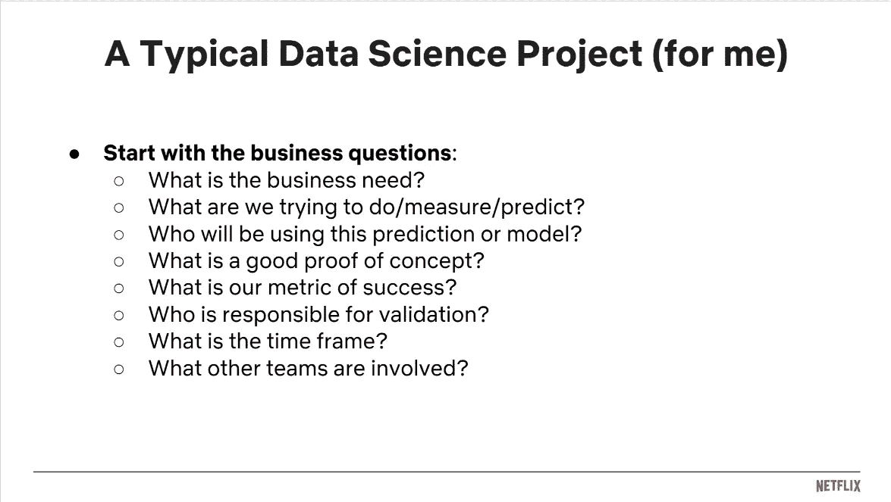
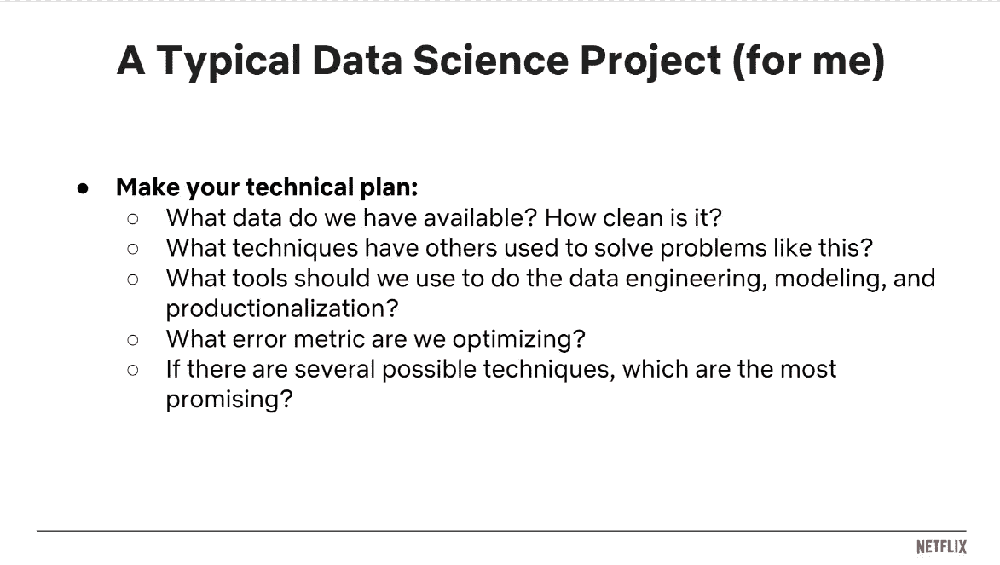
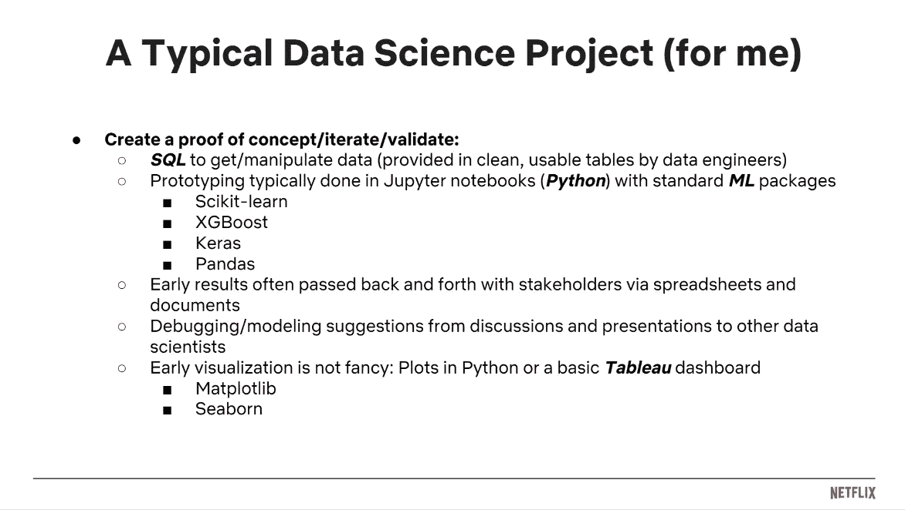

# 好奇如何成为一名数据科学家？聆听网飞数据科学家的观点

> 原文：<https://towardsdatascience.com/a-peek-into-a-netflix-data-scientists-day-66bf3dacabb9?source=collection_archive---------5----------------------->

Photo by [Franki Chamaki](https://unsplash.com/@franki?utm_source=medium&utm_medium=referral) on [Unsplash](https://unsplash.com?utm_source=medium&utm_medium=referral)

数据科学是一个如此模糊的术语。对一些人来说，这意味着数据分析；对一些人来说，它是机器学习的同义词；其他人认为它有数据工程的味道。可能的职责范围很广，不同公司甚至同一公司的团队之间存在细微的差异，这使得身份难以确定。实际上，你必须与 X 公司的数据科学家交谈，才能了解 X 公司如何看待数据科学。网飞组织的第三次 WiBD 研讨会的重点是数据科学，这是我们所有人了解网飞方面的故事的绝佳机会。感谢 [Becky](https://www.linkedin.com/in/tuckerbecky/) 领导本次研讨会，感谢网飞的 WiBD 团队使本次系列研讨会成为可能。

对于那些读过我之前关于[第一期](https://medium.com/hasbrain/a-typical-data-engineering-project-sharing-from-netflix-data-engineering-team-cc27878fce55)和[第二期](https://medium.com/hasbrain/day-in-life-of-a-data-visualization-engineer-netflix-d99150e8275c)的故事的人来说，你可能知道我写这篇文章是为了向全世界分享来自硅谷的知识和见解。信息的不对称是一个不幸的现实，阻碍了许多人对数据科学和数据工程职业的追求。越多的人着手解决这个棘手的问题，我们就能越快解决它！这促使我加入了 HasBrain，这是一家教育社会企业，致力于弥合这一信息鸿沟，并帮助所有有意愿学习的人找到一条通往数据科学和数据工程的道路。

# 数据科学项目

“A group of people brainstorming over a laptop and sheets of paper” by [Štefan Štefančík](https://unsplash.com/@cikstefan?utm_source=medium&utm_medium=referral) on [Unsplash](https://unsplash.com?utm_source=medium&utm_medium=referral)

当我在麻省理工学院上分析边缘课程时(你可以在 [edX](https://www.edx.org/course/the-analytics-edge) 上找到在线等效内容)，我一直在想真实世界的数据科学项目会有什么不同。我希望当时有人给我看 Becky 的数据科学项目 Arc。这是一个美丽的总结。

**第一步:从理解业务问题开始**

Becky 在下面的幻灯片中分享了问题清单。她就如何定义成功发出号召。当你问关于一个好的概念证明的问题时，你需要从一个简单的模型作为基准开始，并且从增量改进的角度来看你的模型的价值。否则，您将陷入不得不解释 75%的准确率是否足够好的境地。拥有物理学博士学位的贝基还提到，学者们总是要检查最后 20%以确保它是防水的；但是在这个行业中，你很少在获得大部分价值后去走最后一英里。对于正在考虑转型成为数据科学家的博士生来说，这可能是值得注意的事情。

**第二步:制定技术方案**

除了下面幻灯片中介绍的细节，Becky 还强调了沟通和站在利益相关者的角度考虑问题的重要性。机器学习误差指标可能不是你的利益相关者最关心的事情。将业务目标转化为优化问题能力至关重要。

找出别人用过的技术可以节省一次时间，因为不用重新发明轮子。现有的监督学习技术，如预测建模或分类，都有很好的记录。然而，在相对更高级和专业的机器学习领域，如 NLP 和图像分类，不断有新的论文发表，提供新的技术。因此，这些领域的数据科学家的黄金标准行为将包括及时了解最新和最好的研究论文。

**第三步:创建一个概念证明- >重复/验证，直到你成功或决定不能完成- >将结果反馈给利益相关者**

如果您对数据科学家使用的工作流和工具/库有任何疑问，Becky 对她在项目 arc 中“做项目”部分的详细描述会非常有帮助。

**第四步:生产模型**

如果你听说过某些数据科学家谈论需要学习编写生产级代码，他们可能是需要独立生产模型而不是交给机器学习工程师或软件工程师的人。

模型的生产化本质上意味着你不能停留在获取和展示模型输出上。你的输出是产品的一部分，将改变实际的用户体验。您的代码将成为更大的产品代码库的一部分。例如，如果您正在对用户是否会在未来两周内流失进行分类。标签搅动的预测类中的用户可能会看到与预测类标签不搅动的组不同的 UI。实际上，您为其他团队创建了一个 API 来调用您的模型并获得模型输出。您可能需要重构代码；只要 API 不中断，终端用户体验无缝，您就可以不断升级模型。

Becky 自学了她工作中的软件工程方面:模块化她的代码以获得可重复性并提高算法效率。有时，她可能涉及软件工程师/数据工程团队。除了工作的复杂性之外，这个决定还取决于服务级别协议。例如，如果您的 API 需要一直运行，可能需要更广泛的代码审查或软件工程团队的直接参与。

**沟通和解决问题**

在经历了数据科学课程之后，Becky 分享了更多关于有效沟通和解决问题技巧的重要性。向非技术利益相关者解释复杂的数据科学概念的能力对于让他们接受你的项目至关重要。她物理学博士的背景帮助她发展了将复杂问题分解成小块并用一个解决方案解决每个问题的能力。同样，她分解了利益相关者的高层次问题，并确定了数据科学项目可以提供价值的地方。

在获得作为数据科学家的直接工作经验之前，任何人都不容易接触到这部分工作；包括 Kaggle 项目在内的大多数实践项目都是从一个明确定义的数据科学问题开始的。Becky 提到，这些软技能来自经验，可以从建设性的反馈中学习。她还阅读创业书籍，以熟悉常见的商业概念和行话。此外，许多其他经验丰富的数据科学家建议我，如果你想进一步发展商业敏锐性，可以阅读产品管理方面的书籍和文章。

# 动手练习

与之前的研讨会类似，我们以[动手练习](https://github.com/NFLX-WIBD/WIBD-Workshops-2018/blob/master/Data%20Science/Women%20in%20Big%20Data%20-%20A%20Day%20in%20the%20Life%20of%20a%20Data%20Scientist.ipynb)结束了会议。这是一个非常初学者友好的项目，使用 [WDI 数据](https://datacatalog.worldbank.org/dataset/world-development-indicators)预测创业成本。如果你是机器学习的新手，或者刚刚完成一些关于监督学习的基础在线课程，这将是一个很好的额外练习。

回到前面的问题解决和沟通，Becky 提出了一个商业问题“在不同的国家创业有多难？”并为她的项目定义了一个目标——预测在不同国家创业的成本。如果这是一个真正的工作项目，我想她需要与她的利益相关者就创业的预测成本如何成为创业难易程度整体评估决策的一部分达成一致。

希望这个总结对你有所帮助。祝所有数据科学爱好者好运！再次感谢网飞团队的慷慨分享！[演示幻灯片](https://github.com/NFLX-WIBD/WIBD-Workshops-2018/blob/master/Data%20Science/WIBD%20-%20Data%20Science.pdf)和[视频录像](https://www.youtube.com/watch?v=ja7_kDr1MNA&feature=youtu.be)也可供感兴趣的人使用。

我们的团队已经走访了硅谷顶级科技公司的 30 多名数据科学家。我计划继续分享这些对话中的宝贵见解。同时，如果你有任何问题，请随时给我发电子邮件。敬请期待！

如果你正在考虑建立你的作品集数据项目，并希望与有相似目标的学习伙伴虚拟联系以保持动力，请点击这里查看我们的新计划:[www.boringppl.com](http://www.boringppl.com)