# 使用时尚 MNIST 的谷歌汽车视觉的性能基准

> 原文：<https://towardsdatascience.com/a-performance-benchmark-of-google-automl-vision-using-fashion-mnist-a9bf8fc1c74f?source=collection_archive---------11----------------------->


Actual footage of Google AutoML Vision at work.

[Google AutoML Vision](https://cloud.google.com/vision/automl/docs/) 是谷歌最先进的云服务，能够完全自动地从零开始构建图像识别的深度学习模型。在这篇文章中，Google AutoML Vision 用于在 [Zalando Fashion-MNIST 数据集](https://github.com/zalandoresearch/fashion-mnist)上建立图像分类模型，这是经典 MNIST 数据集的最新变体，与数字 MNIST 相比，它被认为更难学习 ML 模型。

在基准测试期间，AutoML Vision 训练模式包括“免费”(0 美元，计算时间限制为 1 小时)和“付费”(大约。480 美元，24 小时计算时间)并进行评估:

因此，free AutoML 模型在计算时间约为 100 秒的测试集上获得了 96.4%的宏 AUC 和 88.9%的准确度分数。30 分钟(提前停止)。付费 AutoML 模型在测试集上实现了 98.5%的宏观 AUC，准确率为 93.9%。

# 介绍

最近，人们对自动机器学习解决方案的兴趣越来越大。像 [H2O 无人驾驶 AI](https://www.h2o.ai/products/h2o-driverless-ai/) 或[数据机器人](https://www.datarobot.com/)这样的产品，仅举几个例子，其目标是企业客户，并继续进入专业数据科学团队和环境。对于许多用例来说，AutoML 解决方案可以显著地加快时间-2 模型周期，因此允许更快的模型迭代和部署(并且实际上开始在生产中节省/赚钱)。

自动化机器学习解决方案将在未来 3-5 年内彻底改变数据科学和 ML 领域。因此，如今许多需要相应的人工输入或专业知识的人工智能模型或应用将可能由人工智能/人工智能模型本身部分或完全自动化。很可能，这也将导致对“经典”数据科学概况的总体需求下降，而更有利于将模型投入生产的与工程和运营相关的数据科学角色。

自动机器学习快速进步的一个最近的例子是深度学习图像识别模型的开发。不久前，建立一个图像分类器是一个非常具有挑战性的任务，只有少数人能够做到。由于计算、方法和软件的进步，障碍已经大大降低，以至于你可以用 10 行 Python 代码用 Keras 建立你的第一个深度学习模型，并获得“okayish”结果。

毫无疑问，在不久的将来，仍然会有许多 ML 应用和案例不能(完全)自动化。这些情况可能会更复杂，因为基本的 ML 任务，如将分类器拟合到简单的数据集，可以并将很容易地由机器自动化。

在这一点上，第一次尝试进入机器学习自动化的方向。谷歌和其他公司正在投资汽车研究和产品开发。市场上最早的专业自动化 ML 产品之一是 Google AutoML Vision。

# 谷歌自动视觉

Google AutoML Vision(目前处于测试阶段)是 Google 的云服务，用于图像分类任务的自动化机器学习。使用 AutoML Vision，您可以在没有任何编码、神经网络或任何知识的情况下训练和评估深度学习模型。

AutoML Vision 在 Google Cloud 中运行，可以基于图形用户界面使用，也可以通过 REST、命令行或 Python 使用。AutoML Vision 实现了来自神经架构搜索(NAS)的策略，这是当前深度学习研究中备受关注的科学领域。NAS 基于另一个模型，通常是神经网络或强化学习模型，正在设计旨在解决机器学习任务的神经网络的架构的思想。NAS 研究的基石是 Zoph 等人的论文。(2017) 以及 [Pham 等人(2018)](https://arxiv.org/abs/1802.03268) 。后者也已经在 Python 包 [autokeras](https://autokeras.com/) (目前处于预发布阶段)中实现，并使神经架构搜索在具有单个 GPU 的桌面计算机上变得可行，而不是在 Zoph 等人使用的 500 个 GPU 上。

算法能够发现神经网络架构的想法似乎非常有前途，但是由于计算约束，这仍然是一种限制(我希望你不介意我将 500–1000 GPU 集群视为计算约束)。但是，神经架构搜索在上市前的产品中究竟有多好呢？

# 基准

在下面的部分中，Google AutoML vision 用于基于时尚 MNIST 数据集构建图像识别模型。

# 资料组

时尚-MNIST 数据集被认为是传统 MNIST 数据集的“替代物”，已经被欧洲在线时尚巨头 [Zalando](https://zalando.com/) 的研究部门开源(查看[时尚-MNIST GitHub repo](https://github.com/zalandoresearch/fashion-mnist) 和[Zalando research 网站](https://research.zalando.com/))。它包含 10 个不同服装类别(上衣、裤子、鞋子等)的 60，000 个训练图像和 10，000 个测试图像。).就像在 MNIST 一样，每个图像都是 28×28 的灰度图像。它与训练图像和测试图像具有相同的图像大小和结构。以下是数据集中的一些示例:

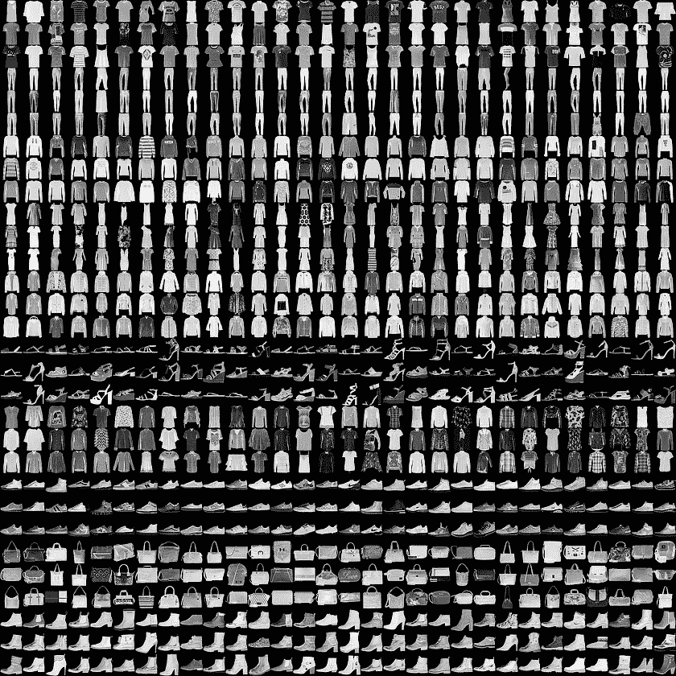

时尚 MNIST 的制作者认为，如今传统的 MNIST 数据集是一个太简单的任务，无法解决——即使简单的卷积神经网络在测试集上也能达到 99%以上的准确率，而经典的 ML 算法很容易达到 97%以上。出于这样或那样的原因，时尚 MNIST 诞生了。

Fashion-MNIST repo 包含加载数据的帮助函数以及一些用于基准测试和测试模型的脚本。此外，回购协议上的数据有一个清晰的可视化效果。克隆完成后，您可以使用一个简单的 Python 函数(查看下一节中的代码)导入时尚 MNIST 数据，并开始构建您的模型。

# 使用谷歌自动视觉

## 准备数据

AutoML 提供了两种数据摄取方式:(1)上传包含不同文件夹中的训练图像的 zip 文件，对应于各自的标签，或者(2)上传包含 Goolge 云存储(GS)文件路径、标签和可选的用于训练、验证和测试集的数据分区的 CSV 文件。我决定使用 CSV 文件，因为您可以定义数据分区(标记名为 TRAIN、VALIDATION 和 TEST ),以便保持对实验的控制。下面是需要上传到 AutoML Vision 的 CSV 文件的所需结构(没有标题！).

```
+------------+------------------------------------+---------------+
| partition  | filepath                           | label         |
+------------+------------------------------------+---------------+
| TRAIN      | gs://bucket/folder/image_0.jpg     | 0             |
| TRAIN      | gs://bucket/folder/image_1.jpg     | 2             |
| ...        | ...                                | ...           |
| VALIDATION | gs://bucket/folder/image_50001.jpg | 3             |
| VALIDATION | gs://bucket/folder/image_50002.jpg | 4             |
| ...        | ...                                | ...           |
| TEST       | gs://bucket/folder/image_60001.jpg | 7             |
| TEST       | gs://bucket/folder/image_60002.jpg | 1             |
| ...        | ...                                | ...           |
+------------+------------------------------------+---------------+
```

就像 MNIST 一样，时尚 MNIST 数据包含各个图像的像素值。为了实际上传图像文件，我开发了一个简短的 python 脚本，负责图像的创建、导出和上传到 GCP。该脚本遍历时尚 MNIST 数据集的每一行，导出图像并上传到 Google 云存储桶中。

```
import os
import gzip
import numpy as np
import pandas as pd
from google.cloud import storage
from keras.preprocessing.image import array_to_imgdef load_mnist(path, kind='train'):
    """Load MNIST data from `path`"""
    labels_path = os.path.join(path,
                               '%s-labels-idx1-ubyte.gz'
                               % kind)
    images_path = os.path.join(path,
                               '%s-images-idx3-ubyte.gz'
                               % kind)with gzip.open(labels_path, 'rb') as lbpath:
        labels = np.frombuffer(lbpath.read(), dtype=np.uint8,
                               offset=8)with gzip.open(images_path, 'rb') as imgpath:
        images = np.frombuffer(imgpath.read(), dtype=np.uint8,
                               offset=16).reshape(len(labels), 784)return images, labels# Import training data
X_train, y_train = load_mnist(path='data', kind='train')
X_test, y_test = load_mnist(path='data', kind='t10k')# Split validation data
from sklearn.model_selection import train_test_split
X_train, X_valid, y_train, y_valid = train_test_split(X_train, y_train, test_size=10000)# Dataset placeholder
files = pd.DataFrame({'part': np.concatenate([
                                   np.repeat('TRAIN', 50000),
                                   np.repeat('VALIDATION', 10000),
                                   np.repeat('TEST', 10000)
                              ]),
                      'file': np.repeat('file', 70000),
                      'label': np.repeat('label', 70000)})# Stack training and test data into single arrays
X_data = np.vstack([X_train, X_valid, X_test])
y_data = np.concatenate([y_train, y_valid, y_test])# GS path
gs_path = 'gs://secret/fashionmnist'# Storgae client
storage_client = storage.Client.from_service_account_json(json_credentials_path='secret.json')
bucket = storage_client.get_bucket('secret-bucket')# Fill matrix
for i, x in enumerate(X_data):
    # Console print
    if i % 1000 == 0:
        print('Uploading image {image}'.format(image=i))
    # Reshape and export image
    img = array_to_img(x=x.reshape(28, 28, 1))
    img.save(fp='fashionmnist' + '/' + 'image_' + str(i) + '.jpg')
    # Add info to data frame
    files.iloc[i, 1] = gs_path + '/' + 'image_' + str(i) + '.jpg'
    files.iloc[i, 2] = y_data[i]
    # Upload to GCP
    blob = bucket.blob('fashionmnist/' + 'image_' + str(i) + '.jpg')
    blob.upload_from_filename('fashionmnist/' + 'image_' + str(i) + '.jpg')
    # Delete image file
    os.remove('fashionmnist/' + 'image_' + str(i) + '.jpg')# Export CSV file
files.to_csv(path_or_buf='fashionmnist.csv', header=False, index=False)
```

函数`load_mnist`来自时尚 MNIST 知识库，将训练和测试数组导入 Python。导入训练集后，使用来自`sklean.model_selection`的`train_test_split`对 10，000 个样本进行采样和存储，作为验证数据。然后，训练、验证和测试数组被堆叠到`X_data`中，以便有一个对象进行迭代。占位符`DataFrame`被初始化以存储 AutoML Vision 所需的信息(分区、文件路径和标签)。`storage` from `google.cloud`使用一个服务帐户 json 文件连接到 GCP(当然，我不会在这里分享)。最后，主流程开始，遍历`X_data`，为每一行生成一个图像，保存到磁盘，上传到 GCP，删除不再需要的图像。最后，我将导出的 CSV 文件上传到项目的 Google 云存储桶中。

## 进入 AutoML

AutoML Vision 目前处于测试阶段，这意味着您必须在试用之前申请。由于我和我的同事目前正在为我们的一个客户探索自动机器学习在计算机视觉项目中的使用，我已经可以通过 GCP 控制台访问 AutoML Vision。

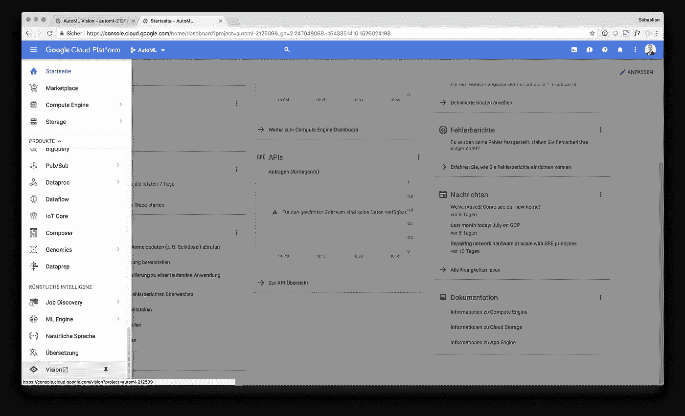

此时，开始屏幕看起来相当不起眼。你可以通过点击“开始使用 AutoML”或阅读[文档](https://cloud.google.com/vision/automl/docs/)开始，这是目前为止非常基本但信息丰富的，特别是当你不熟悉基本的机器学习概念时，如训练-测试-分割、过拟合、精确/召回等。

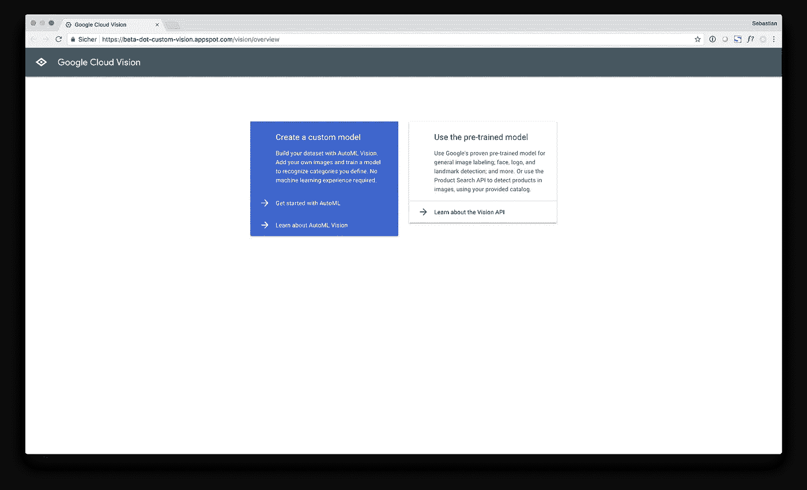

开始后，Google AutoML 会将您带到数据集对话框，这是通向最终 AutoML 模型的第一步。到目前为止，这里没有报告。稍后，您将在这里找到所有导入的数据集。

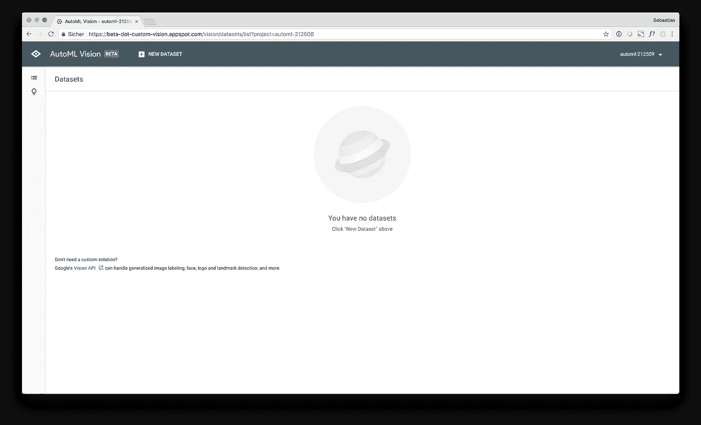

## 生成数据集

点击“+新建数据集”后，AutoML 会将您带到“创建数据集”对话框。如前所述，可以使用两种不同的方法添加新数据集，如下图所示。

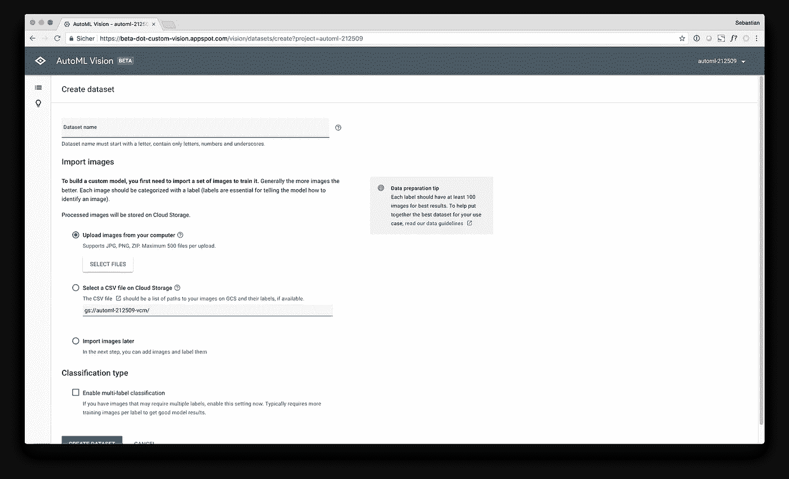

我已经从我的计算机上传了图像，以及包含 GS 文件路径、分区信息以及相应标签的 CSV 文件到 GS bucket 中。为了将数据集添加到 AutoML Vision，您必须指定包含图像 GS-filepaths 等的 CSV 文件的文件路径。

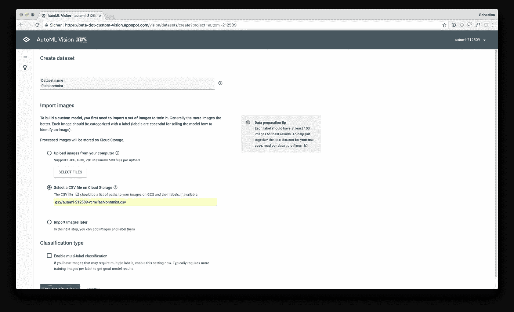

在“创建数据集”对话框中，如果每个图像有多个标签，您还可以启用多标签分类，这也是一个非常有用的功能。点击“创建数据集”后，AutoML 遍历提供的文件名，并为建模构建数据集。到底是做什么的，既不可见也没有记录。这个导入过程可能需要一段时间，所以它向你展示了时髦的“霹雳游侠”进度条。

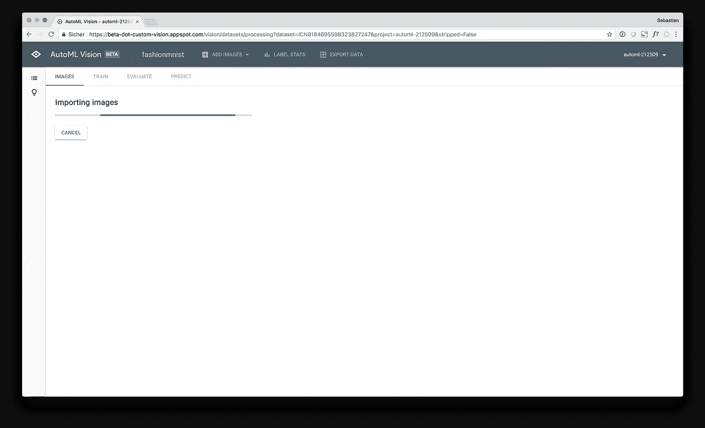

导入完成后，您将收到一封来自 GCP 的电子邮件，通知您数据集的导入已完成。我发现这很有帮助，因为你不必一直开着浏览器窗口盯着进度条。

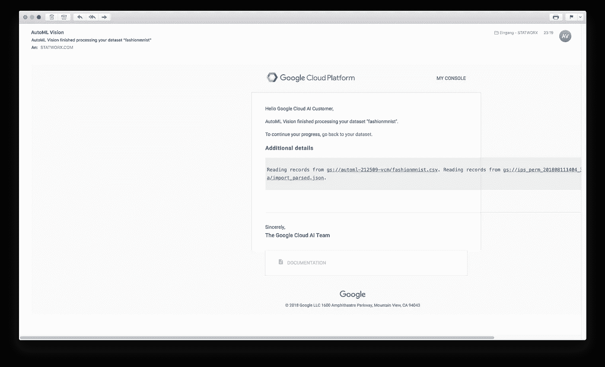

这封邮件看起来有点奇怪，但嘿，它仍然是测试版…

## 训练模型

回到 AutoML。构建数据集后，首先看到的是导入的图像。在这个例子中，图像有点像素化，因为它们的分辨率只有 28×28。您可以使用左侧的导航栏浏览不同的标签，也可以手动添加标签到目前为止尚未标记的图像。此外，如果你的图片没有附带任何标签，你可以申请[人工标签服务](https://cloud.google.com/vision/automl/docs/human-labeling)。此外，如果您需要添加类别等，您可以创建新的标签。

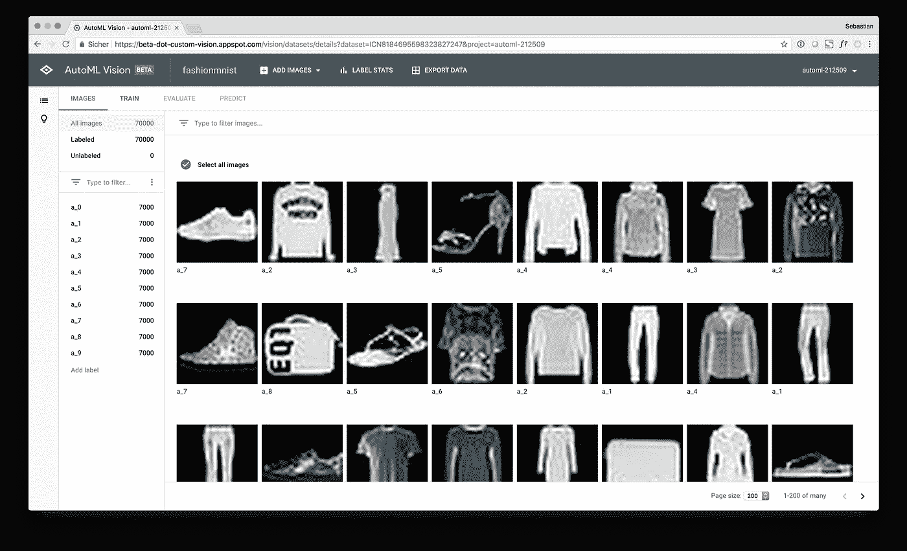

现在让我们严肃起来。进入“训练”对话框后，AutoML 会通知您标签的频率分布。它建议每个类的最小数量为$n=100$标签(我觉得这个数量很低)。此外，它似乎向您显示了整个数据集的频率(一起训练、验证和测试)。我认为，在这一点上，按数据划分的分组频率图会提供更多信息。

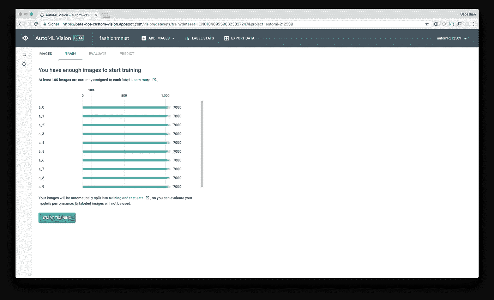

单击“开始培训”会将您带到一个弹出窗口，您可以在其中定义模型名称并分配您愿意投资的培训预算(计算时间/金钱)。您可以选择“1 计算小时”，whis 每月免费提供 10 个型号，或者“24 计算小时(更高质量)”，价格大约为。480 美元(1 小时的自动计算需要 20 美元。然而，如果架构搜索收敛于更早的点，你将只支付到目前为止所消耗的计算时间，我认为这是合理和公平的。最后，还可以选择自定义培训时间，例如 5 小时。

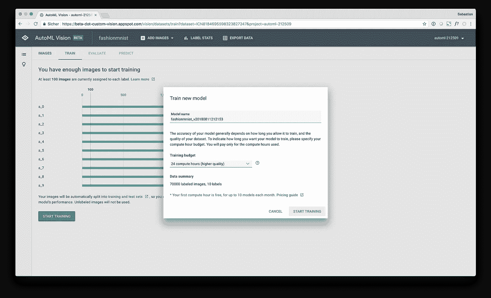

在这个实验中，我尝试了两个版本，AutoML 的“免费”版本，但我也“全押”并选择了 24 小时选项，以实现可能的最佳模式(“付费模式”)。让我们看看，您可以从 480 美元的尖端 AutoML 解决方案中获得什么。点击“开始训练”后，熟悉的骑士屏幕出现，告诉你，你可以关闭浏览器窗口，让 AutoML 做剩下的事情。奈斯。

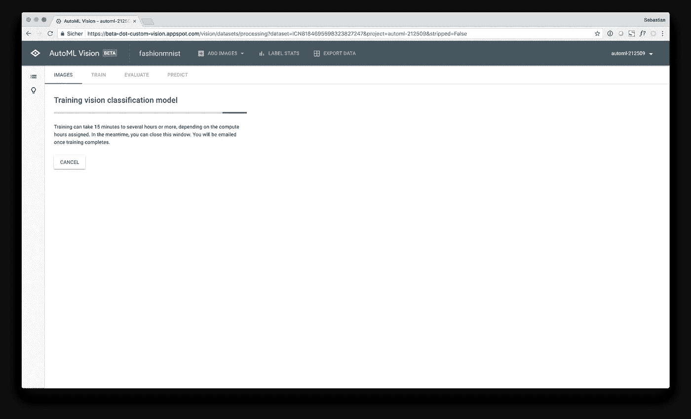

## 结果和评价

首先，我们从免费模式开始。大约花了。30 分钟的训练，似乎很快就找到了解决方案。我不确定 AutoML 在评估收敛标准时到底做了什么，但免费和付费模型之间似乎有所不同，因为免费模型已经收敛了大约 30 分钟的计算，而付费模型没有。

免费模型的整体模型指标看起来相当不错。在宏类 1 精度为 90.9%和召回率为 87.7%的测试集上，平均精度为 96.4%。时尚-MNIST 数据集上的当前精度基准为 96.7%(wrn 40–4 8.9M 参数)，其次为 96.3%(WRN-28–10+随机擦除)，而低预算模型的精度仅为 89.0%。因此，免费的 AutoML 模式与当前的时尚 MNIST 基准相去甚远。下面，你会发现免费模型的指标截图。

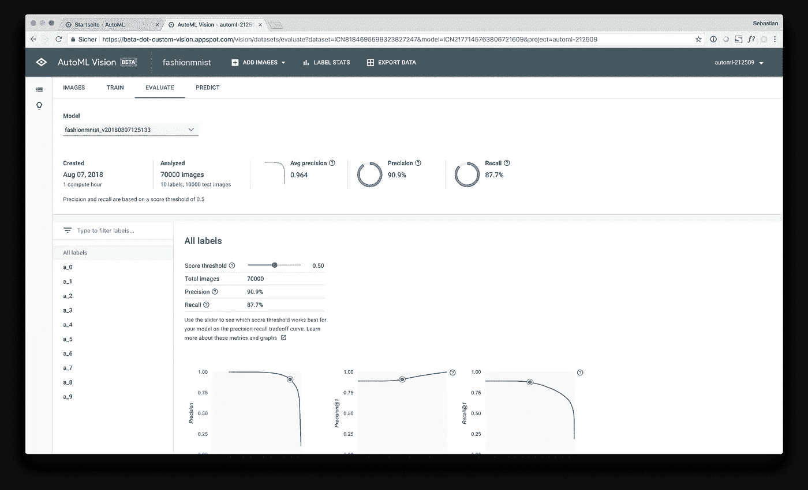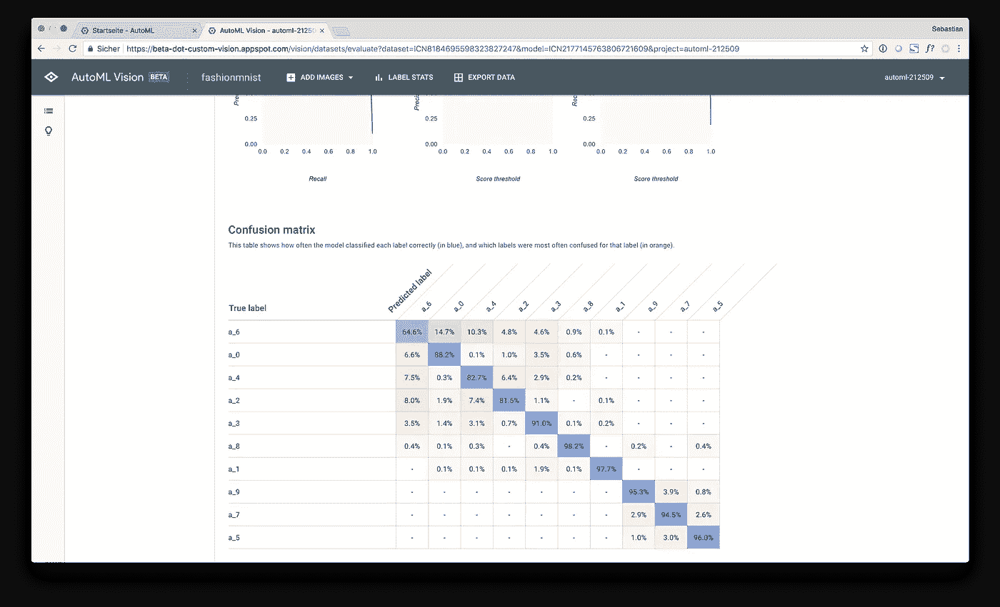

付费模型的模型度量看起来要好得多。该方法在测试集上的平均准确率为 98.5%，一级精度为 95.0%，召回率为 92.8%，准确率为 93.9%。这些结果接近当前的基准，但是，没有我希望的那么接近。下面，你会发现付费模型的指标截图。

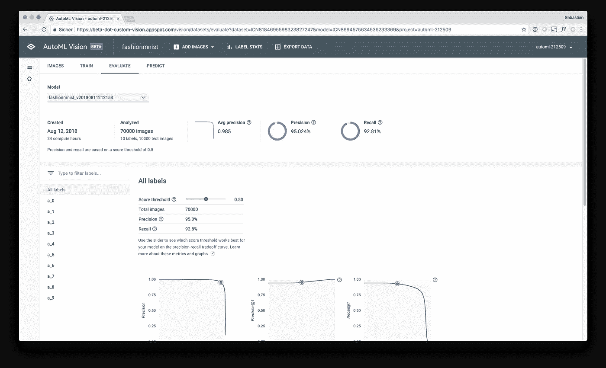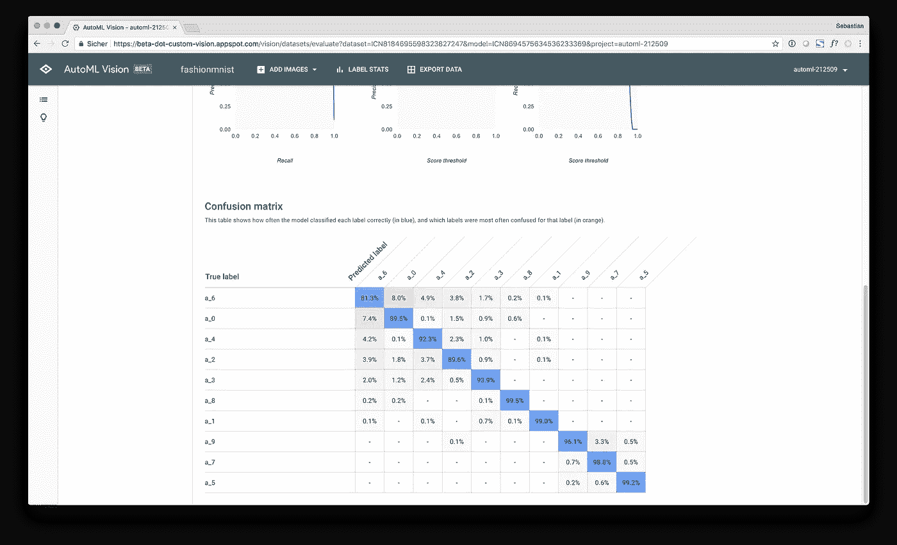

“评估”选项卡还显示了更详细的指标，如精度/召回曲线以及分别影响模型指标的分类临界值滑块。在这一页的底部，你会发现混淆矩阵，以及正确和错误分类的例子的相对频率。此外，您可以检查每个类的假阳性和假阴性的图像(如果您想了解您的模型为什么以及何时出错，这非常有帮助)。总体而言，模型评估功能有限，但用户友好。作为一个更深入的用户，当然，我希望看到更多的先进功能，但考虑到目标群体和发展状况，我认为这是相当不错的。

## 预言；预测；预告

拟合和评估模型后，您可以使用几种方法来预测新图像。首先，您可以使用 AutoML 用户界面从本地机器上传新图像。对于没有经验的用户来说，这是一个将他们的模型应用到新图像并获得预测的好方法。对于高级用户和开发人员，AutoML vision 通过 GCP 上的 API 公开模型，同时负责后台的所有技术基础设施。一个简单的 Python 脚本展示了 API 的基本用法:

```
import sys
from google.cloud import automl_v1beta1# Define client from service account json
client = automl_v1beta1.PredictionServiceClient.from_service_account_json(filename='secret.json')# Endpoint
name = 'projects/automl-XXX/locations/us-central1/models/ICNXXXXXXX'# Import a single image
with open('image_10.jpg', 'rb') as ff:
    img = ff.read()# Define payload
payload = {'image': {'image_bytes': img}}# Prediction
request = client.predict(name=name, payload=payload, params={})
print(request)# Console output
payload {
  classification {
    score: 0.9356002807617188
  }
  display_name: "a_0"
}
```

作为第三种方法，如果您想使用完整的 nerdcore，也可以将 API 放在命令行中。我认为，自动化的 API 公开是一个很好的特性，因为它让你可以将你的模型集成到各种脚本和应用程序中。此外，当您想要在生产环境中同时将模型扩展到数百或数千个 API 请求时，Google 会处理所有的细节问题。

# 结论和展望

简而言之，即使免费模型在测试集上也取得了相当好的结果，因为投入到模型中的实际时间只是手动构建模型所需时间的一小部分。付费模式取得了明显更好的结果，但是成本为 480 美元。显然，付费服务的目标是数据科学专业人士和公司。

AutoML Vision 只是来到谷歌云的一系列新 AutoML 应用的一部分([查看这些来自谷歌 Next 18](https://cloud.google.com/blog/topics/inside-google-cloud/what-week-105-announcements-google-cloud-next-18) 的公告)，进一步塑造了该平台在机器学习和人工智能方向的定位。

就我个人而言，我相信自动化机器学习解决方案将继续进入专业数据科学项目和应用。借助自动化机器学习，您可以(1)为您的定制解决方案建立基准模型，(2)更快地迭代使用案例和数据产品，以及(3)更快地到达您实际开始在生产中利用数据赚钱的时间点。

# 结束语

如果你对我的故事有任何意见或问题，欢迎在下面评论！我将尝试回答这些问题。此外，请随意使用我的代码或在您选择的社交平台上与您的同行分享这个故事。如果你想保持联系，请在 [LinkedIn](https://www.linkedin.com/in/sebastian-heinz-90885272/) 或 [Twitter](https://twitter.com/statworx) 上关注我。

请确保您也查看了棒极了的 STATWORX 博客，了解更多有趣的数据科学、ML 和 AI 内容，这些内容直接来自我们在德国法兰克福的办公室！

如果你对更多像这样的优质内容感兴趣，请加入我的邮件列表，不断为你带来新的数据科学、机器学习和人工智能阅读，并把我和我的团队发送到你的收件箱！

我希望你喜欢我的故事，我真的很喜欢写它。感谢您的宝贵时间！

*原载于 2018 年 8 月 20 日*[*www.statworx.com*](https://www.statworx.com/de/blog/a-performance-benchmark-of-google-automl-vision-using-fashion-mnist/)*。*