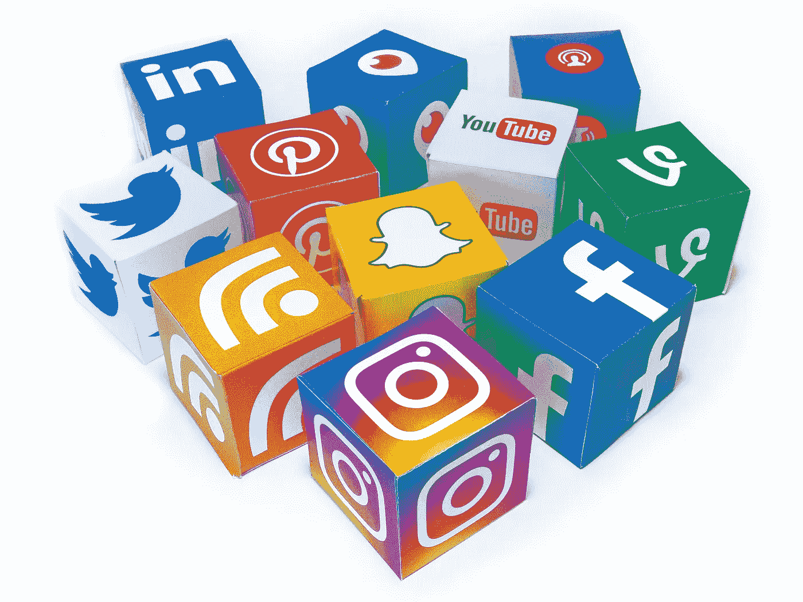

# 数据分析的哲学视角:探索对错问题

> 原文：<https://towardsdatascience.com/a-philosophical-look-at-data-analytics-exploring-questions-of-right-and-wrong-42c78d2ba3cb?source=collection_archive---------11----------------------->

> “通过收集和出售私人生活的详细记录来赚钱的企业曾被直白地描述为‘监控公司’。他们将品牌重塑为‘社交媒体’，这是自美国陆军部成为国防部以来最成功的一次欺骗。”

最近，我偶然看到了爱德华·斯诺登的上述引文，这让我不禁思考，尤其是在围绕剑桥分析——脸书争议以及如何使用个人数据的对错展开激烈辩论的背景下。作为一名从业者，我想到的问题本质上是非常现实的，它们可以归结为一件事——当涉及到个人数据的使用时，我们如何开始划清界限？有许多相互关联的方面需要结合起来看，所以让我稍微分解一下。

**(1)房间里的大肥象:数据隐私**

首先，“数据隐私”与“数据分析/使用”有很大不同。进行这种区分是至关重要的，特别是因为当前关于使用数据的许多讨论几乎总是交替使用它们。

那么区别在哪里呢？

*   数据隐私特指不同类型数据的所有权和控制权，尤其是个人的个人数据。您可以将您的数据视为您的财产。因此，您将面临数据或财产被窃取或通过其他强制手段(如监控)窃取的风险。
*   另一方面，数据分析只处理数据可用后发生的事情——谁在使用数据，他们如何使用数据，他们使用数据的目的是什么？它不关心这些数据是通过正当手段还是不正当手段获得的。

显然，假设这两者没有联系是过于简单的。但我想说的是，他们周围的不良行为是相互独立的。例如，您可以通过公平的方式(不违反数据隐私协议)获得数据，然后将它用于可疑的目的。类似地，你可以偷偷摸摸地获取数据，不理会数据隐私，但将它用于完全无害的分析。

回到最近的争论，我认为最大的错误发生在数据隐私本身。关于个人、他们的偏好和行为的敏感数据没有受到像脸书这样的人的保护，而这种脆弱性被挖掘这些数据的人所利用。这是一个非常黑白分明的犯罪，没有太多灰色，不像数据使用的许多其他方面。这里有几点需要注意:

*   仅仅因为像脸书这样的公司发布数据隐私条款，就期望数据得到保护，这是天真的。公司有责任确保有严密的控制措施，不允许未经授权访问这些数据。
*   此外，在我看来，围绕像脸书这样的平台上的数据漏洞的愤怒有点过分了。几乎每个人都知道风险，包括把数据放在那里的人，即使他们没有完全理解可能的后果。我确信剑桥分析公司的违规事件不是唯一发生过的！

有什么解决办法？像大多数其他法律问题一样，这可能需要结合更严格、更明确和更好理解的法律，以及消费者对风险的更好理解。人们会对他们放在那里的东西变得更聪明。就像即使法律禁止入室盗窃，人们仍然锁着他们的房子。

这个数据激增的世界仍然太新了。事情还在发展。控件也会。

**(2)【暗示】【影响】&【操纵】**之间界限模糊

对我来说，这是一个需要更多自省的方面，并引发了一些关于什么是可接受的，什么是不可接受的问题。数据可以用来建立许多推论。这些推论反过来可以用来确定什么是真正触动任何特定人心弦的最佳方式。

几个世纪以来，广告商一直在这样做——当然，他们是为群体而不是个人做的，但他们确实试图按下正确的按钮，让这些目标个人沿着他们自己可能选择或可能没有选择的道路前进。

> 换句话说，当一个有大众吸引力的名人代言一个可乐品牌，让我选择这个品牌而不是另一个时，我是不是被操纵了？直到现在还没有人认真提出这个问题。那么，为什么会突然出现一股利用数据分析操纵人们的需求和选择的热潮呢？

当然，如果想要的结果是通过歪曲或谎言来实现的，那就大错特错了。然而，如果数据只是用来确定哪条信息最能引起谁的共鸣，那么为什么这就应该被认为是错误的呢？

**(3)领域的问题——一些比另一些更神圣吗？**

另一件我一直难以接受的事情是剑桥分析公司的工作影响了政治结果这一事实引发的愤怒。这当然是真的，但我不明白的是，为什么它会变得如此重要。

多年来，公司一直在分析数据(包括个人数据)，并利用它做出许多商业决策，包括客户定位，但直到现在，没有人提出质疑。相反，有一场比赛，看谁做得更好，更便宜，更有效。现在，突然之间，因为客户定位是围绕政治候选人进行的，而不是品牌 A 对品牌 B，为什么同样的数据分析，使用同样的方法，变成了每个人都害怕的怪物？

你可能会说，政治选择不应该基于数据驱动的针对个人的目标，而应该仅仅基于候选人的选举平台。当然可以。但同样的推理可以扩展到任何事情——个人应该根据银行的产品和服务选择 A 银行还是 B 银行，而不是根据银行的定向广告。为什么它在政治上是错误的，而在银行、零售品牌、航空公司、保险公司和电信公司上却不是呢？

不要误解我——我并不想评论在政治中使用有针对性的数据分析是对还是错。我只是说规则至少需要有一定的一致性。

我很难在这里下结论，因为我仍在试图对这些方面做出决定，即使我继续在影响客户反应以最大化业务影响的领域工作，我从未认为这在道德上是错误的。

也许我们正处于十字路口，我们必须确定如何从这里前进。数据分析和人工智能等事物的力量毋庸置疑，但也许是时候建立一些边界和划定一些界限了——作为个人、企业、政治和监管者。

对错问题几乎总是个人理解和选择的问题。因此，我很想听听那些读到这篇文章的人，他们认为什么是可以接受的，他们认为界限应该划在哪里。

*(注意:脸书和加州的争议还有很多其他方面，比如俄罗斯的影响、对广告商的控制、假新闻等等。—但上述文章仅涉及数据隐私和目标问题)*