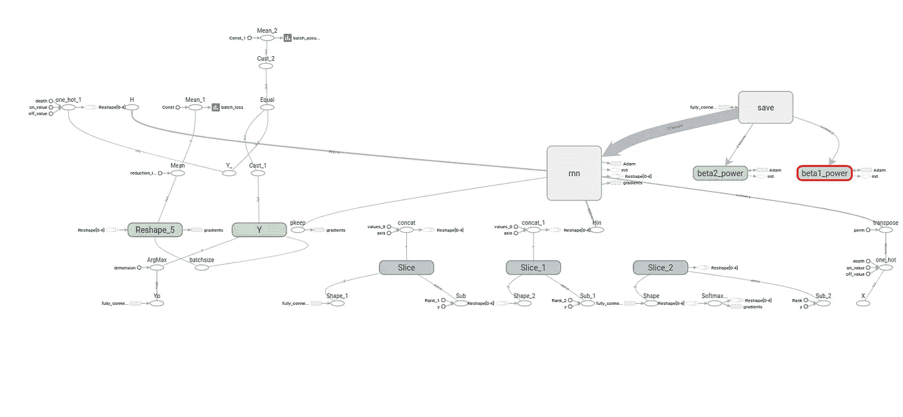
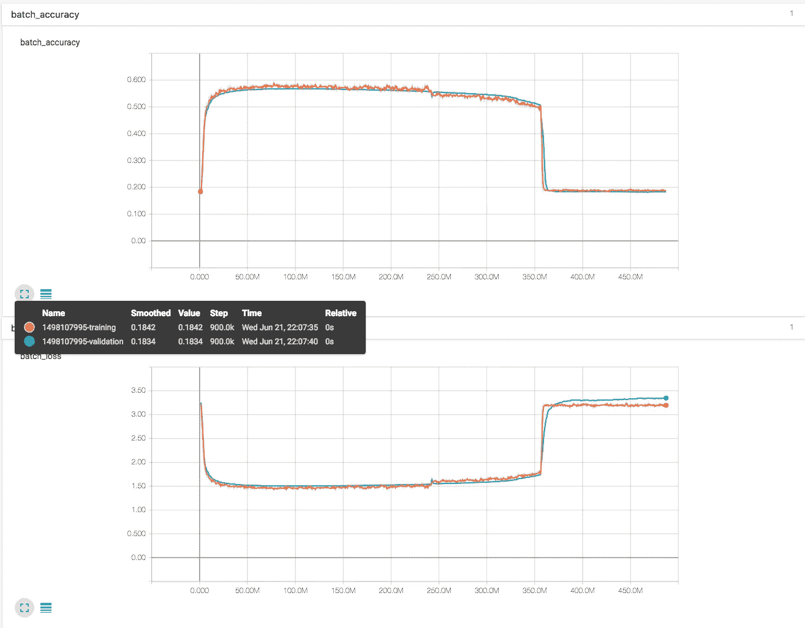
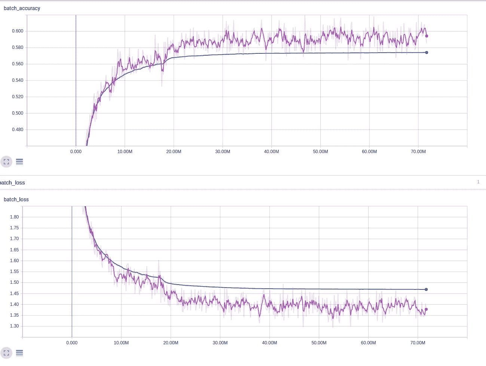

# 一种带张量流的拾波线发生器

> 原文：<https://towardsdatascience.com/a-pickup-line-generator-with-tensorflow-7e1f9eee8516?source=collection_archive---------3----------------------->

*生成、保存和部署基于 Tensorflow 的拾音线生成器。你可以在这里看到演示***和* [*这里看到代码*](https://github.com/wrannaman/tensorflow-pickup-lines) *。**

**

*A pickup line from the pickup line generator*

*几个月前我看到一篇文章，说有人创造了一个搭讪生成器。由于我刚刚开始进入深度学习的世界，我一直在考虑一些有趣的项目，这些项目至少可以在我学习的时候为我提供娱乐。一个可怕的搭讪发电机听起来像魔术。*

1.  ***数据***

*这些数据是从一些网站上手工收集的，这些网站看起来从 90 年代以来就没有更新过。我搜了大约 20 个这样的网站，你可以想象，搭讪的质量很低，而且大多数都很下流。*

*我必须清理一些奇怪的字符，重复的，并删除新的行，因为每个搭讪行的长度大约是一个四年级学生的句子。我把所有的行都放到一个文件中，瞧，训练数据！*

***4。型号***

*现在困难的部分总是以少于 100 行的完全陌生的代码结束，这些代码在被充分哄骗时会产生魔力。我发现点蜡烛和重复咒语很有帮助。*

*我找到了谷歌的马丁·戈纳的一个讲座，他在没有博士学位的情况下做了一个关于深度学习的演讲。那里有一部分他训练一个 RNN 人创作莎士比亚戏剧。这听起来像是一个把美好的东西变得粗糙的黄金机会。*

**

*Model structure*

***3。训练***

*我开始在莎士比亚数据集上训练，最初几个纪元(20-40)进行得很好，之后准确率停滞在 50%左右，输出很好，但不是很好。*

*在确保模型输出是合理的之后，我接着在我自己的数据集上进行训练。起初，我训练了 10 个时期，以了解在给定小数据集的情况下，模型会落在哪里。同样，结果是好的，但不是伟大的。作为一项实验，我训练了 200 个奇怪的纪元，直到精确度非常高，但模型开始输出它以前见过的线条。经典的过度合身。*

*我把结果给我的一个朋友看，他建议我先在一个更大的英语会话数据集上训练它，然后再在搭讪数据上重新训练顶层。他的说法是，“在学会如何搭讪之前，它必须学会如何说英语”。很自然地，我开始寻找一种方法来清理 Twitter。*

*Twitter 数据的预处理包括提取“@提及”和链接。每条推文都在文件中的一行，我把它分成几十个更小的文件，以便于检查。*

*有了大约 1 GB 的 tweets，我再次开始重新训练，结果发现迭代次数达到了 3.5 亿次。*

**

*An explosion and a lesson on learning rates.*

*究竟是什么？我向我的朋友(在这一点上，我应该承认他是卡内基梅隆大学的博士)展示了新的结果，他说我的学习速度需要在训练过程中改变。这将防止精确度突然下降，甚至可能有助于提高精确度。*

*每 10 个时期，我将学习率乘以 0.1。最初的学习率是标准的 0.001。在第 10 个时期下降到 0.0001，等等。*

*虽然这确实有所帮助，但它仍然徘徊在 60%左右，但没有大幅下降。很明显，网络可能不够大，无法获得更高的准确性，但使用 Twitter 数据上训练的模型的权重，开始对搭讪数据进行第二轮训练似乎足够合理。*

*仅仅 10 个时期后，模型的准确性突然增加到大约 70%,并且结果中拼写错误的单词少得多。拾取线的质量类似于拾取线数据的结构，但是不经常重复来自数据本身的片段。厉害！*

**

*The accuracy does not crash. Notice at ~18M steps, the slightly steeper drop in loss. That’s the learning rate decrement!*

***4。保存和部署***

*保存和部署一个用于生产的模型是这个项目的主要焦点。在 [Tensorflow Serving](https://tensorflow.github.io/serving/) 上已经做了大量的工作，但如果我能弄清楚如何将它用于这个特定的模型，我会被诅咒的。为模型提供服务要求您以特定的方式保存它，包括您将如何查询它以及它应该基于该查询输出什么。网站上有一些简单的教程，展示了如何部署 MNIST 模型，介绍了如何部署基于图像的预测器。我想很快做一个对象检测项目，所以教程会有所帮助，但对于这个模型，拾取线是通过向网络输入一个字符串并让它预测下一个字符来创建的。这可能会永远持续下去，并且必须做一些工作来创建一条单独的搭讪线。经过几个小时的挣扎，我暂时屈服了。*

*就部署 Tensorflow 模型的简单工具而言，仍有许多需要改进的地方，但 Tensorflow 团队似乎已经解决了困难的部分。*

*我决定采用简单的方法，生成数千条搭讪语句，并把它们存入数据库。这不是一个优雅的解决方案，但它确实有效，并且有 30，000 个左右使你不太可能看到同一行两次。有时候简单的方法就足够了。如果有一个简单的解决方案，只需要 1/10 的时间，就没有必要过度设计。*