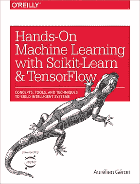
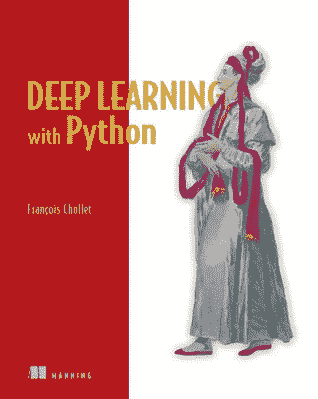

# 机器学习的实用开端

> 原文：<https://towardsdatascience.com/a-practical-start-to-machine-learning-421b0e8d5b2a?source=collection_archive---------10----------------------->

Photo by [João Silveira](https://unsplash.com/photos/DYIitvTuoD0?utm_source=unsplash&utm_medium=referral&utm_content=creditCopyText) on [Unsplash](https://unsplash.com/search/photos/ship?utm_source=unsplash&utm_medium=referral&utm_content=creditCopyText)

## [入门](https://towardsdatascience.com/tagged/getting-started)

在企业创新实验室工作教会了我很多东西，其中最值得一提的是每四个月教一次新学生应用机器学习的基础知识。最重要的是教没有机器学习(ML)经验的学生如何将这项技术应用到他们工作的各个方面。虽然我不会说我已经完善了这一技能，但我已经参加了三个学期的这个周期，我对在 1-2 周内教授学生应用机器学习的原则有了更好的理解。

有趣的是，我发现许多完成在线课程或学习神经网络数学的学生仍然会在特征工程、数据挖掘甚至加载通用数据方面苦苦挣扎。通过在我们的空间里教一些学生，我发现下面的资源是我最想推荐的，我觉得值得分享。

# 端到端的例子

虽然机器学习目前是一个热门话题，但许多开发人员不知道如何实际使用它。我发现最好通过一个简单的端到端机器学习示例，让学生对预处理、特征工程、训练和评估有基本的了解。

Painting by [Willy Stöwer](https://commons.wikimedia.org/wiki/File:St%C3%B6wer_Titanic.jpg)

我最喜欢的机器学习“Hello World”教程是[泰坦尼克号数据集](https://www.kaggle.com/c/titanic)(尽管有点病态)。从这个数据集中，你可以学习训练一个模型来预测一名乘客是否会在泰坦尼克号的事故中幸存。我用来指导学生的文件可以在这里找到。我发现最好用 Jupyter 笔记本、熊猫、Scikit-Learn 和 Numpy 进行一些练习。

我喜欢这个数据集作为介绍的原因是因为您将学习重要的 ML 基础知识，例如读取 CSV 文件，删除包含空条目和不相关列的行，将性别字段从文本转换为二进制，以及对分类字段执行一次性编码。通过一步一步地看这个例子，你可以用一个容易理解的问题来涵盖许多不同的特性工程实践。

# 看书

一旦你体验了简单的机器学习管道是什么样子，我建议你读一点书，学习一些基础知识。 [Aurélien Géron 的](https://twitter.com/aureliengeron?lang=en)书， [*用 Scikit-Learn 和 TensorFlow*](http://shop.oreilly.com/product/0636920052289.do) 动手进行机器学习，在我看来是开始了解应用机器学习的最好方式。我通常让学生阅读前几章，或者一直读到张量流部分。这本书最棒的地方在于，它附带了 Jupyter 笔记本，里面有所有的例子，所以你可以在阅读过程中调整和使用它们的代码。我还喜欢他们在第 2 章中直接切入[端到端解决方案](https://github.com/ageron/handson-ml/blob/master/02_end_to_end_machine_learning_project.ipynb)解决方案，这让工程师们可以非常轻松地快速上手。

# 摆弄一些代码

既然您已经了解了机器学习背后的一些理论，那么是时候探索不同类型的实现和用例了。然而，我们中的一些只关注阅读的人可能很难跳到代码中并用不同的数据实现解决方案。

为了找到数千个不同数据集、方法、实现和机器学习解决方案的例子，我求助于 [Kaggle](https://www.kaggle.com/) 。它拥有大量无价的知识，包括各个领域数百个高质量的数据集。可能 Kaggle 最大的部分是内核。内核是其他用户解决问题的端到端代码，包括从读取数据集和清理到功能工程、培训和优化的一切。你甚至可以派生出其他用户的内核，并在他们的云上运行，给你一个探索真正解决方案的机会。

Kaggle 很棒，因为它给了你一个脱离玩具问题和简单数据的机会。它允许您处理更具挑战性和真实性的数据集，包括图像、原始和无组织的文本以及数字要素。休息一下，探索 Kaggle(甚至可能参加一些比赛)让你有机会学习其他 Kaggler 的应用解决方案，扩展你对机器学习解决方案背后的理论和数学的理解。

# 更深入

在探索了 Kaggle 上的一些内核之后，学习一些深度学习的基础和应用是至关重要的。我之所以建议跳过 Géron 书中的张量流部分，是因为我发现 Keras 更容易快速建立神经网络。Keras 是一个高级深度学习库，它依赖于 [TensorFlow](https://www.tensorflow.org/) 或 [Theano](http://deeplearning.net/software/theano/) 作为后端来执行其计算。

幸运的是，我找到的关于学习应用深度学习的最好的书也是 Keras 的创始人，[Fran ois Chollet](https://twitter.com/fchollet)！在他令人惊叹的书中， [*用 Python 进行深度学习*](https://www.manning.com/books/deep-learning-with-python) *，*他涵盖了深度学习概念、计算机视觉、自然语言处理以及问答等领域更高级的神经网络架构等等。这本书的另一个亮点是，因为 Chollet 自己写的，所以它教授了最佳实践、内置 API 和可以在 Keras 中使用的函数。这本书包含了许多我从未在在线课程或其他书中看到过的东西，我肯定会认为它是我查找 Keras 实现技巧的最佳资源之一。

# 包装东西

采取这些步骤只是更深入理解机器学习的开始，应该会给你信心和足够的背景来开始处理不同来源的数据。通过关注不同算法、资源和库的实现，更容易兴奋和学习并想继续学习。

只关注数学的选择可能很难转化为工作环境。我学到的一些最有用的东西是 Keras、Scikit-Learn 和 Pandas 内置的微妙功能，它们让我工作得更快。我学到的一些最酷的特征工程管道是从我通过 Kaggle 涉猎的竞赛解决方案中得到启发的。

有如此多的机器学习资源，这可能是压倒性的。我希望这个列表可以作为你深入机器学习的一个很好的起点。