# 自然语言处理实践指南(第一部分)——处理和理解文本

> 原文：<https://towardsdatascience.com/a-practitioners-guide-to-natural-language-processing-part-i-processing-understanding-text-9f4abfd13e72?source=collection_archive---------0----------------------->

## 经过验证和测试的解决 NLP 任务的实践策略


# 介绍

非结构化数据，尤其是文本、图像和视频包含了丰富的信息。然而，由于处理和分析这些数据的固有复杂性，人们通常不会花费额外的时间和精力从结构化数据集冒险出来分析这些非结构化数据源，这可能是一座潜在的金矿。

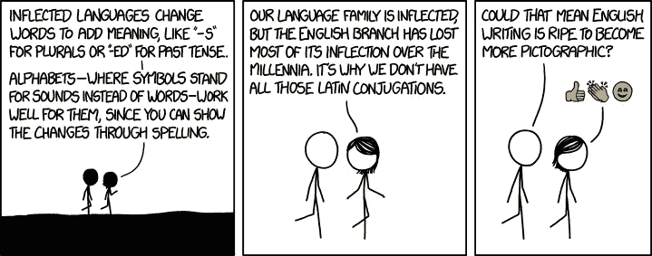

自然语言处理(NLP)就是利用工具、技术和算法来处理和理解基于自然语言的数据，这些数据通常是非结构化的，如文本、语音等。在这一系列文章中，我们将探讨实践者和数据科学家可以用来从文本数据中提取有用见解的久经考验的策略、技术和工作流。我们还将讨论 NLP 的一些有用和有趣的用例。本文将通过教程和实践例子来介绍如何处理和理解文本数据。

# 本系列的大纲

这个系列的本质将是理论概念的混合，但重点是涵盖各种 NLP 问题的实践技术和策略。我们将在这一系列文章中涉及的一些主要领域包括。

1.  **处理&理解文本**
2.  **特征工程&文本表示**
3.  **文本数据的监督学习模型**
4.  **文本数据的无监督学习模型**
5.  **高级主题**

随着本系列的进展，您可以随时提出更多的想法，我将很高兴涵盖我可能错过的一些内容。这些文章中有很多将展示在现实世界中行之有效的技巧和策略。

# 本文涵盖的内容

本文将通过实际例子详细介绍 NLP 的以下方面。

1.  **通过网络抓取进行数据检索**
2.  **文本争论和预处理**
3.  **词性标注**
4.  **浅层解析**
5.  **选区和依存解析**
6.  **命名实体识别**
7.  **情感和情绪分析**

这应该给你一个如何开始分析文本语料库中的语法和语义的好主意。

# 动机

从形式上看，NLP 是计算机科学和人工智能的一个专门领域，其根源是计算语言学。它主要关注设计和构建应用程序和系统，使机器和人类使用的自然语言之间能够进行交互。因此，它往往被视为一个利基领域的工作。而人们通常更倾向于关注机器学习或统计学习。


当我开始钻研数据科学领域时，甚至连我都被对文本数据进行分析和建模的挑战所淹没。然而，作为一名数据科学家，多年来我一直在研究 NLP 的一些挑战性问题，我注意到了一些有趣的方面，包括可以用来解决各种问题的技术、策略和工作流。我在我的书 [*【用 Python 进行文本分析】*](https://github.com/dipanjanS/text-analytics-with-python) (我正在写这个的修订版)和 [*【用 Python 进行实用的机器学习】*](https://github.com/dipanjanS/practical-machine-learning-with-python) 中涉及了几个关于 NLP 的主题。

> 然而，基于我从我所有的读者那里收到的所有优秀的反馈(是的，你们都是了不起的人！)，创作这一系列文章的主要目的和动机是与更多的人分享我的学习，这些人不能总是找到时间坐下来通读一本书，甚至可以在旅途中参考这些文章！**因此，没有必要购买这些书籍来学习 NLP。**

# 入门指南

在为本文构建内容和示例时，我在想，我是应该关注一个玩具数据集来更好地解释事情，还是应该关注数据科学数据集的主要来源之一的现有数据集。然后我想，为什么不建立一个端到端的教程，在那里我们抓取 web 来获得一些文本数据，并展示基于这些数据的示例！

我们将处理的源数据将是新闻文章，这些文章是我们从 shorts **，**中检索到的，该网站为我们提供 60 字的简短新闻文章，涉及各种各样的主题，他们甚至有一个应用程序！

 [## 体育新闻，60 个单词！

### 编辑描述

inshorts.com](https://inshorts.com/) 

在本文中，我们将使用来自科技、体育和世界新闻的文本数据。我将在下一节讲述如何从他们的网站上抓取和检索这些新闻文章的一些基础知识。

# 标准 NLP 工作流

我假设您知道 CRISP-DM 模型，这是执行任何数据科学项目的典型行业标准。通常，任何基于 NLP 的问题都可以通过一个有条理的工作流来解决，这个工作流有一系列的步骤。下图描述了主要步骤。


A high-level standard workflow for any NLP project

我们通常从文本文档的语料库开始，并遵循文本争论和预处理、解析和基本探索性数据分析的标准流程。基于最初的见解，我们通常使用相关的特征工程技术来表示文本。根据手头的问题，我们要么专注于建立预测的监督模型，要么专注于无监督模型，后者通常更专注于模式挖掘和分组。最后，我们与相关利益相关者或客户一起评估模型和整体成功标准，并部署最终模型以供将来使用。

# 抓取新闻文章进行数据检索

我们将通过利用 python 来检索新闻文章，来抓取[](https://inshorts.com/)****网站。我们将关注科技、体育和世界事务方面的文章。我们将为每个类别检索一页的文章。下图描述了一个典型的新闻类别登录页面，该页面还突出显示了每篇文章文本内容的 HTML 部分。****

****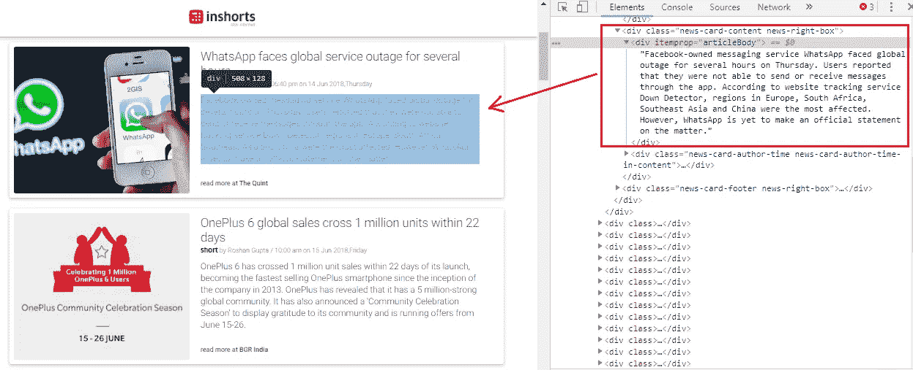****

****The landing page for technology news articles and its corresponding HTML structure****

****因此，我们可以在上面提到的登录页面中看到包含每篇新闻文章的文本内容的特定 HTML 标签。我们将利用这些信息通过利用`**BeautifulSoup**`和`**requests**`库来提取新闻文章。让我们首先加载下列依赖项。****

```
****import requests
from bs4 import BeautifulSoup
import pandas as pd
import numpy as np
import matplotlib.pyplot as plt
import seaborn as sns
import os****%matplotlib inline****
```

****我们现在将构建一个功能，该功能将利用`**requests**`从三个新闻类别的登录页面访问并获取 HTML 内容。然后，我们将使用`**BeautifulSoup**`来解析和提取每个类别中所有新闻文章的新闻标题和文章文本内容。我们通过访问特定的 HTML 标签和类来找到内容，它们就在那里(我在前面的图中描述了一个例子)。****

****很明显，我们提取新闻标题、文章文本和类别，并构建一个数据框架，其中每一行对应一篇特定的新闻文章。我们现在将调用这个函数并构建我们的数据集。****

```
****news_df = build_dataset(seed_urls)
news_df.head(10)****
```

********

****Our news dataset****

****现在，我们有了一个格式整齐的新闻文章数据集，您可以使用下面的代码快速检查新闻文章的总数。****

```
****news_df.news_category.value_counts()****Output:
-------
world         25
sports        25
technology    24
Name: news_category, dtype: int64****
```

# ****文本争论和预处理****

****清理和预处理文本数据通常涉及多个步骤。我已经在“用 Python 进行文本分析”的第三章 [***中详细介绍了文本预处理***](https://github.com/dipanjanS/text-analytics-with-python/tree/master/Chapter-3) (代码是开源的)。然而，在这一节中，我将强调一些在自然语言处理(NLP)管道中大量使用的最重要的步骤，我经常在我的 NLP 项目中使用它们。我们将利用相当多的`**nltk**`和`**spacy**`，它们都是 NLP 中最先进的库。通常一辆`pip install <library>`或者一辆`conda install <library>`就足够了。但是，如果您在加载`spacy’s`语言模型时遇到问题，请按照下面强调的步骤来解决这个问题(我在我的一个系统中遇到过这个问题)。****

```
****# OPTIONAL: ONLY USE IF SPACY FAILS TO LOAD LANGUAGE MODEL**
# Use the following command to install spaCy> pip install -U spacyOR> conda install -c conda-forge spacy# Download the following language model and store it in disk
[https://github.com/explosion/spacy-models/releases/tag/en_core_web_md-2.0.0](https://github.com/explosion/spacy-models/releases/tag/en_core_web_md-2.0.0)# Link the same to spacy 
> python -m spacy link ./spacymodels/en_core_web_md-2.0.0/en_core_web_md en_coreLinking successful
    ./spacymodels/en_core_web_md-2.0.0/en_core_web_md --> ./Anaconda3/lib/site-packages/spacy/data/en_coreYou can now load the model via spacy.load('en_core')**
```

****现在让我们加载文本预处理所需的依赖项。我们将从停用词中移除否定词，因为我们希望保留它们，因为它们可能有用，尤其是在情感分析期间**。******

> ****❗ **重要提示:**很多人给我发消息说无法加载收缩模块。它不是一个标准的 python 模块。我们利用了我的存储库[](https://github.com/dipanjanS/practical-machine-learning-with-python/tree/master/bonus%20content/nlp%20proven%20approach)**中的`[*contractions.py*](https://github.com/dipanjanS/practical-machine-learning-with-python/blob/master/bonus%20content/nlp%20proven%20approach/contractions.py)`文件中的一组标准缩写。请将它添加到运行代码的同一个目录中，否则它将不起作用。******

```
******import spacy
import pandas as pd
import numpy as np
import nltk
from nltk.tokenize.toktok import ToktokTokenizer
import re
from bs4 import BeautifulSoup
from contractions import CONTRACTION_MAP
import unicodedata****nlp = spacy.load('en_core', parse=True, tag=True, entity=True)**
#nlp_vec = spacy.load('en_vecs', parse = True, tag=True, #entity=True)
**tokenizer = ToktokTokenizer()
stopword_list = nltk.corpus.stopwords.words('english')
stopword_list.remove('no')
stopword_list.remove('not')******
```

## ******删除 HTML 标签******

******通常，非结构化的文本包含许多噪音，尤其是当您使用 web 或屏幕抓取等技术时。HTML 标签通常是对理解和分析文本没有多大价值的组件之一。******

```
******'Some important text'******
```

******从上面的输出可以明显看出，我们可以删除不必要的 HTML 标签，保留任何文档中有用的文本信息。******

## ******删除重音字符******

******通常，在任何文本语料库中，您可能会处理带重音的字符/字母，尤其是当您只想分析英语时。因此，我们需要确保这些字符被转换并标准化为 ASCII 字符。一个简单的例子——将**的**转换成**的**。******

```
****'Some Accented text'****
```

****前面的函数向我们展示了如何轻松地将重音字符转换为正常的英语字符，这有助于标准化我们语料库中的单词。****

## ****扩张收缩****

****缩写是单词或音节的缩写。在英语中，它们通常以书面或口头的形式存在。这些单词的缩短版本或缩写是通过删除特定的字母和声音来创建的。在英语缩写的情况下，它们通常是通过从单词中去掉一个元音而产生的。例如， ***不要*** 要 ***不要*** 和 ***我要*** 要 ***我要*** 。将每个缩写转换为其扩展的原始形式有助于文本标准化。****

> ****我们利用了我的库 的 [**中的**](https://github.com/dipanjanS/practical-machine-learning-with-python/tree/master/bonus%20content/nlp%20proven%20approach)**`[contractions.py](https://github.com/dipanjanS/practical-machine-learning-with-python/blob/master/bonus%20content/nlp%20proven%20approach/contractions.py)`文件中的一组标准缩写。******

```
****'You all cannot expand contractions I would think'****
```

****我们可以从前面的输出中看到我们的函数是如何帮助扩展收缩的。有更好的方法吗？肯定！如果我们有足够多的例子，我们甚至可以训练一个深度学习模型，以获得更好的性能。****

## ****删除特殊字符****

****特殊字符和符号通常是非字母数字字符，甚至偶尔是数字字符(取决于问题)，这增加了非结构化文本中的额外噪声。通常，可以使用简单的正则表达式(regexes)来删除它们。****

```
****'Well this was fun What do you think '****
```

****我一直在删除可选的数字，因为我们经常需要在预处理的文本中保留它们。****

## ****堵塞物****

****要理解词干，你需要了解词干代表什么。词干也被称为一个单词的 ***基本形式*** ，我们可以通过在词干上附加词缀来创造新单词，这一过程称为词尾变化。考虑**字*跳*。可以在上面加上词缀，组成类似 ***跳*** 、 ***跳*** 、 ***跳*** 的新词。在这种情况下，基字 ***跳*** 就是词干。******

**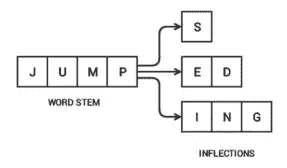**

**Word stem and its inflections (Source: Text Analytics with Python, Apress/Springer 2016)**

**该图显示了词干是如何出现在所有词形变化中的，因为词干构成了词缀构成每个词形变化的基础。从一个单词的屈折形式获得其基本形式的反向过程被称为*。词干分析帮助我们将单词标准化为词根或词根，而不管它们的词形变化，这有助于许多应用，如分类或聚类文本，甚至在信息检索中。现在让我们来看看流行的波特梗！***

```
***'My system keep crash hi crash yesterday, our crash daili'***
```

***波特词干分析器基于其发明者马丁·波特博士开发的算法。最初，据说该算法总共有五个不同的阶段来减少词干的屈折，每个阶段都有自己的一套规则。***

> ***请注意，词干通常有一套固定的规则，因此，词根可能在词典上不正确。这意味着，**词干单词可能在语义上不正确，**可能不在字典中(从前面的输出中可以明显看出)。***

## ***词汇化***

***词汇化与词干化非常相似，我们移除词缀以获得单词的基本形式。然而，这种情况下的基本形式被称为词根，而不是词干。区别在于， ***词根总是字典上正确的词*** (存在于字典中)，但是词根可能不是这样。因此，词根，也被称为 ***词条*** ，将一直存在于字典中。`**nltk**`和`**spacy**`都有优秀的旅鼠。我们将在这里使用`**spacy**`。***

```
***'My system keep crash ! his crash yesterday , ours crash daily'***
```

***你可以看到单词的语义并没有受到影响，然而我们的文本仍然是标准化的。***

> ***一定要注意，词干化过程比词干化慢得多，因为当且仅当词条存在于词典中时，词根形式或词条是通过从单词中移除词缀而形成的。***

## ***删除停用词***

***意义不大或没有意义的词，尤其是当从文本构建有意义的特征时，被称为停用词或停用词。如果你在语料库中做一个简单的术语或词频，这些通常是出现频率最高的词。通常，这些可以是冠词、连词、介词等等。停用词的一些例子是****an*******和*** 等。*****

```
****', , stopwords , computer not'****
```

****没有通用的停用词表，但是我们使用来自`**nltk**`的标准英语停用词表。您还可以根据需要添加自己的特定于领域的停用词。****

## ****将所有这些放在一起——构建一个文本规范化器****

****虽然我们肯定可以继续使用更多的技术，如纠正拼写、语法等，但现在让我们将我们所学的一切集中在一起，并将这些操作链接起来，以构建一个文本规范化器来预处理文本数据。****

****现在让我们将这个功能付诸实践吧！我们首先将新闻标题和新闻文章文本组合在一起，为每条新闻形成一个文档。然后，我们将对它们进行预处理。****

```
****{'clean_text': 'us unveils world powerful supercomputer beat china us unveil world powerful supercomputer call summit beat previous record holder china sunway taihulight peak performance trillion calculation per second twice fast sunway taihulight capable trillion calculation per second summit server reportedly take size two tennis court',** **'full_text': "US unveils world's most powerful supercomputer, beats China. The US has unveiled the world's most powerful supercomputer called 'Summit', beating the previous record-holder China's Sunway TaihuLight. With a peak performance of 200,000 trillion calculations per second, it is over twice as fast as Sunway TaihuLight, which is capable of 93,000 trillion calculations per second. Summit has 4,608 servers, which reportedly take up the size of two tennis courts."}****
```

****因此，您可以看到我们的文本预处理程序如何帮助我们预处理新闻文章！之后，如果需要，您可以将该数据集保存到磁盘，这样您就可以随时加载它以供将来分析。****

```
****news_df.to_csv('news.csv', index=False, encoding='utf-8')****
```

# ****理解语言语法和结构****

****对于任何语言来说，句法和结构通常是密切相关的，其中一套特定的规则、惯例和原则支配着单词组合成短语的方式；短语被组合成从句；从句被组合成句子。在这一部分，我们将专门讨论英语的语法和结构。在英语中，单词通常组合在一起形成其他组成单位。这些成分包括单词、短语、从句和句子。考虑到一个句子， ***“棕色的狐狸很快，他跳过了懒惰的狗”*** ，它是由一堆单词组成的，只看单词本身并不能告诉我们太多。****

****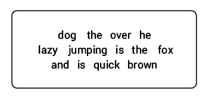****

****A bunch of unordered words don’t convey much information****

****关于语言的结构和语法的知识在许多领域都是有帮助的，例如文本处理、注释和进一步操作的解析，例如文本分类或摘要。下面提到了理解文本语法的典型解析技术。****

*   ******词性标注******
*   ******浅层解析或组块******
*   ******选区解析******
*   ******依存解析******

****我们将在随后的章节中研究所有这些技术。考虑到我们之前的例句 ***“棕色的狐狸很快，他跳过了懒惰的狗”*** ，如果我们使用基本的 POS 标签来注释它，它将看起来像下图。****

****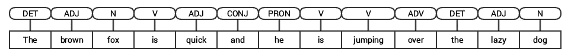****

****POS tagging for a sentence****

****因此，一个句子通常遵循由以下部分组成的层次结构，****

> ******句子→从句→短语→单词******

# ****标注词性****

****词类(POS)是特定的词汇类别，单词根据它们的句法环境和角色被分配到这些词汇类别中。通常，单词可以归入以下主要类别之一。****

*   *******N(oun):*** 通常指描绘某种物体或实体的词语，可能是有生命的，也可能是无生命的。一些例子是狐狸、狗、书等等。名词的词性标签符号是 **N** 。****
*   *******V(erb)*** :动词是用来描述某些动作、状态或事件的词语。还有各种各样的子类，如助动词、自反动词和及物动词(等等)。一些典型的动词例子有跑、跳、读和写。动词的位置标记符号是 **V** 。****
*   *******形容词*** :形容词是用来描述或修饰其他词的词，通常是名词和名词短语。短语“美丽的花”有名词“花”,它是用形容词“美丽的”( ADJ)来描述或限定的。形容词的位置标记符号是 **ADJ** 。****
*   *******Adv(erb):*** 副词通常充当其他词的修饰语，包括名词、形容词、动词或其他副词。非常美丽的花这个短语有副词(ADV)非常，它修饰形容词(ADJ)美丽，表示花美丽的程度。副词的词性标签符号是 **ADV** 。****

****除了这四大类词类之外，在英语中还有其他频繁出现的词类。这些包括代词、介词、感叹词、连词、限定词等等。此外，每个像*名词* ( **N** )这样的词性标签还可以进一步细分为像*单数名词*(**NN**)*单数专有名词*(**NNP**)*复数名词* ( **NNS** )这样的类别。****

****对词性标注进行分类和标注的过程称为*词性标注*或*词性标注*。词性标签用于注释单词和描述它们的词性，这对于执行特定的分析非常有帮助，例如缩小名词的范围并查看哪些是最突出的，词义消歧和语法分析。我们将利用`**nltk**`和`**spacy**`，它们通常使用 [***Penn Treebank 符号***](http://www.cis.uni-muenchen.de/~schmid/tools/TreeTagger/data/Penn-Treebank-Tagset.pdf) 进行词性标注。****

****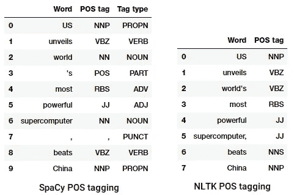****

****POS tagging a news headline****

****我们可以看到，每个库都以自己的方式对待令牌，并为它们分配特定的标签。根据我们所看到的，`**spacy**`似乎比`**nltk**`做得稍好。****

# ****浅层解析或分块****

****根据我们前面描述的层次结构，词组构成短语。有五大类短语:****

*   ****名词短语(NP): 名词充当中心词的短语。名词短语充当动词的主语或宾语。****
*   ******动词短语(VP):** 这些短语是以动词为中心词的词汇单位。通常，动词短语有两种形式。一种形式有动词成分以及其他实体，如名词、形容词或副词，作为宾语的一部分。****
*   ****形容词短语(ADJP):这些是以形容词为中心词的短语。它们的主要作用是描述或修饰句子中的名词和代词，它们可以放在名词或代词的前面或后面。****
*   ****副词短语(ADVP): 这些短语的作用像副词，因为副词在短语中充当中心词。副词短语用作名词、动词或副词本身的修饰语，提供进一步的细节来描述或限定它们。****
*   ****介词短语(PP): 这些短语通常包含一个介词作为中心词，以及其他词汇成分，如名词、代词等。这些就像形容词或副词描述其他单词或短语。****

****浅层解析，也称为轻型解析或组块，是一种流行的自然语言处理技术，它分析句子的结构，将其分解为最小的成分(即单词等标记)，并将它们组合成更高级别的短语。这包括词性标签以及句子中的短语。****

****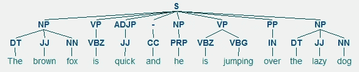****

****An example of shallow parsing depicting higher level phrase annotations****

****我们将利用`**conll2000**`语料库来训练我们的浅层解析器模型。这个语料库在`**nltk**`中提供了组块注释，我们将使用 10K 记录来训练我们的模型。一个带注释的句子示例描述如下。****

```
****10900 48
(S
  Chancellor/NNP
  (PP of/IN)
  (NP the/DT Exchequer/NNP)
  (NP Nigel/NNP Lawson/NNP)
  (NP 's/POS restated/VBN commitment/NN)
  (PP to/TO)
  (NP a/DT firm/NN monetary/JJ policy/NN)
  (VP has/VBZ helped/VBN to/TO prevent/VB)
  (NP a/DT freefall/NN)
  (PP in/IN)
  (NP sterling/NN)
  (PP over/IN)
  (NP the/DT past/JJ week/NN)
  ./.)****
```

****从前面的输出中，您可以看到我们的数据点是已经用短语和 POS 标签元数据进行了注释的句子，这将有助于训练我们的浅层解析器模型。我们将利用两个分块实用函数 tree2conlltags 来获取每个标记的单词、标记和块标记三元组，并利用 conlltags2tree 从这些标记三元组生成一个解析树。我们将使用这些函数来训练我们的解析器。下面是一个例子。****

```
****[('Chancellor', 'NNP', 'O'),
 ('of', 'IN', 'B-PP'),
 ('the', 'DT', 'B-NP'),
 ('Exchequer', 'NNP', 'I-NP'),
 ('Nigel', 'NNP', 'B-NP'),
 ('Lawson', 'NNP', 'I-NP'),
 ("'s", 'POS', 'B-NP'),
 ('restated', 'VBN', 'I-NP'),
 ('commitment', 'NN', 'I-NP'),
 ('to', 'TO', 'B-PP'),
 ('a', 'DT', 'B-NP'),
 ('firm', 'NN', 'I-NP'),
 ('monetary', 'JJ', 'I-NP'),
 ('policy', 'NN', 'I-NP'),
 ('has', 'VBZ', 'B-VP'),
 ('helped', 'VBN', 'I-VP'),
 ('to', 'TO', 'I-VP'),
 ('prevent', 'VB', 'I-VP'),
 ('a', 'DT', 'B-NP'),
 ('freefall', 'NN', 'I-NP'),
 ('in', 'IN', 'B-PP'),
 ('sterling', 'NN', 'B-NP'),
 ('over', 'IN', 'B-PP'),
 ('the', 'DT', 'B-NP'),
 ('past', 'JJ', 'I-NP'),
 ('week', 'NN', 'I-NP'),
 ('.', '.', 'O')]****
```

****块标签使用 IOB 格式。这个符号代表内部、外部和开始。标签前的 B 前缀表示它是块的开始，I 前缀表示它在块内。O 标记表示该令牌不属于任何块。如果后面有相同类型的后续标签，并且它们之间没有 O 标签，则总是使用 B 标签。****

****我们现在将定义一个函数`**conll_tag_ chunks()**`来从带有分块注释的句子中提取词性和分块标签，以及一个名为`**combined_taggers()**`的函数来训练多个带有后退标签的标签(例如，一元和二元标签)****

****我们现在将定义一个类`**NGramTagChunker**`，它将接受带标签的句子作为训练输入，获取它们的 ***(单词、词性标签、组块标签)*** **WTC 三元组**，并训练一个带有`**UnigramTagger**`的`**BigramTagger**`作为补偿标签。我们还将定义一个`**parse()**`函数来对新句子进行浅层解析****

> ****`**UnigramTagger**`、`**BigramTagger**`和`**TrigramTagger**`是继承自基类`**NGramTagger**`的类，基类本身继承自`**ContextTagger**`类，而`**ContextTagger**`类继承自`**SequentialBackoffTagger**`类。****

****我们将使用这个类在`**conll2000**`分块`**train_data**`上训练，并在`**test_data**`上评估模型性能****

```
****ChunkParse score:
    IOB Accuracy:  90.0%%
    Precision:     82.1%%
    Recall:        86.3%%
    F-Measure:     84.1%%****
```

****我们的分块模型获得了大约 90%的准确率，这是非常好的！现在让我们利用这个模型来浅层解析和分块我们之前使用的样本新闻标题， ***“美国推出世界上最强大的超级计算机，击败中国”。*******

```
****chunk_tree = ntc.parse(nltk_pos_tagged)
print(chunk_tree)****Output:
-------
(S
  (NP US/NNP)
  (VP unveils/VBZ world's/VBZ)
  (NP most/RBS powerful/JJ supercomputer,/JJ beats/NNS China/NNP))****
```

****因此，您可以看到它在新闻文章中识别了两个名词短语(NP)和一个动词短语(VP)。每个单词的词性标签也是可见的。我们也可以用如下的树形图来形象化这一点。你可能需要安装[**ghostscript**](https://www.ghostscript.com/download/gsdnld.html)**，以防`**nltk**`抛出错误。******

******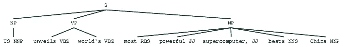******

******Shallow parsed news headline******

******在对新闻标题进行浅层解析后，前面的输出给出了很好的结构感。******

# ******选区分析******

******基于成分的语法用于分析和确定句子的成分。这些语法可以用来根据句子成分的层次有序结构来模拟或表示句子的内部结构。每个词通常都属于特定的词汇范畴，并构成不同短语的中心词。这些短语是基于称为*短语结构规则*的规则形成的。******

*********短语结构规则*** 构成了选区语法的核心，因为它们讲述了支配句子中各种成分的层次和顺序的语法和规则。这些规则主要迎合两件事。******

*   ******他们决定用什么词来构成短语或成分。******
*   ******它们决定了我们需要如何排列这些成分。******

******短语结构规则的通称是 ***S → AB*** ，描绘出结构 ***S*** 由成分*和 ***B*** 组成，排序为 ***A*** 后接 ***B*** 。虽然有几个规则(*参考第 1 章，第 19 页:使用 Python 的文本分析，如果你想更深入地研究*)，但最重要的规则描述了如何划分一个句子或从句。短语结构规则将一个句子或从句的二元划分表示为 ***S → NP VP*** 其中 ***S*** 是句子或从句，它分为主语，由名词短语( ***NP*** 表示)和谓语，由动词短语( ***VP*** 表示)。*******

******可以基于这样的语法/规则来构建选区分析器，这些语法/规则通常作为上下文无关语法(CFG)或短语结构语法来共同使用。解析器将根据这些规则处理输入的句子，并帮助构建解析树。******

******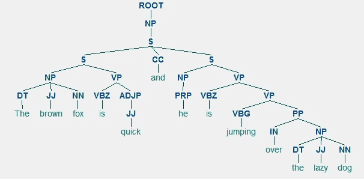******

******An example of constituency parsing showing a nested hierarchical structure******

******我们将在这里使用`**nltk**`和`**StanfordParser**`来生成解析树。******

> ********先决条件:**从 [**这里**](http://nlp.stanford.edu/software/stanford-parser-full-2015-04-20.zip) 下载斯坦福官方解析器，貌似效果还不错。你可以通过访问 [**这个网站**](http://nlp.stanford.edu/software/lex-parser.shtml#Download) 并查看**发布历史**部分来试用更高版本。下载后，将其解压缩到文件系统中的一个已知位置。一旦完成，您现在就可以使用来自`**nltk**`的解析器了，我们将很快对此进行探讨。******

******斯坦福解析器一般使用 ***PCFG(概率上下文无关语法)解析器*** 。PCFG 是一种上下文无关的语法，它将概率与其每个产生式规则相关联。从 PCFG 生成解析树的概率就是用来生成解析树的各个产品的概率的乘积。******

```
******(ROOT
  (SINV
    (S
      (NP (NNP US))
      (VP
        (VBZ unveils)
        (NP
          (NP (NN world) (POS 's))
          (ADJP (RBS most) (JJ powerful))
          (NN supercomputer))))
    (, ,)
    (VP (VBZ beats))
    (NP (NNP China))))******
```

******我们可以看到新闻标题的选区解析树。让我们把它形象化，以便更好地理解结构。******

```
******from IPython.display import display
display(result[0])******
```

******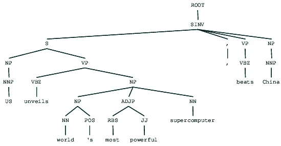******

******Constituency parsed news headline******

******与浅层解析中的平面结构相比，我们可以看到前面输出中成分的嵌套层次结构。如果你想知道 ***SINV*** 是什么意思，它代表*一个倒置的陈述句*，即主语跟随时态动词或情态动词的句子。根据需要参考 [***Penn Treebank 参考***](https://web.archive.org/web/20130517134339/http://bulba.sdsu.edu/jeanette/thesis/PennTags.html) 查找其他标签。******

# ******依存句法分析******

******在依存分析中，我们尝试使用基于依存的语法来分析和推断*结构和语义依存关系*以及句子中标记之间的关系。依存语法背后的基本原理是，在语言的任何句子中，除了一个词之外，所有的词都与句子中的其他词有某种关系或依存关系。没有依存关系的词叫做句根。在大多数情况下，动词被当作句子的词根。所有其他的单词都使用连接直接或间接地连接到词根动词，这就是依存关系。******

******考虑到我们的句子 ***“棕色的狐狸很快，他跳过了懒惰的狗”*** ，如果我们想为此绘制依存句法树，我们将有这样的结构******

******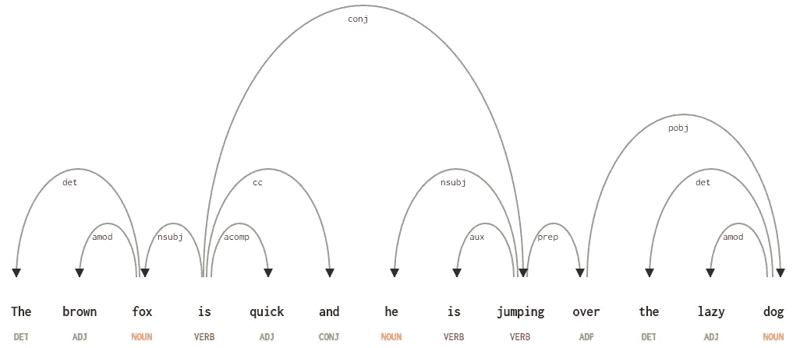******

******A dependency parse tree for a sentence******

******这些依赖关系都有自己的含义，是通用依赖类型列表的一部分。这在一篇原创论文中讨论过， [*德马尔内菲等人 2014 年*](https://nlp.stanford.edu/pubs/USD_LREC14_paper_camera_ready.pdf) 的《普遍斯坦福依赖:跨语言类型学》。你可以在这里 查看依赖类型及其含义的详尽列表 [***。***](http://universaldependencies.org/u/dep/index.html)******

******如果我们观察其中的一些依赖关系，就不难理解它们。******

*   ******依存标签***det****非常直观——它表示名词中心语和限定词之间的限定词关系。通常，带有 POS 标签 **DET** 的单词也会有 ***det*** 依存标签关系。例子有`**fox → the**` 和`**dog → the**`。*******
*   ******依存标签 ***amod*** 代表形容词修饰语，代表任何修饰名词意思的形容词。例子有`**fox → brown**`和`**dog → lazy**`。******
*   ******依存标签 ***nsubj*** 代表在从句中充当主语或施事的实体。例子包括`**is → fox**`和`**jumping → he**`。******
*   ******依存关系 ***cc*** 和 ***conj*** 更多的是与并列连词连接的词语相关的联系。例子包括`**is → and**`和`**is → jumping**`。******
*   ******依存标记 ***aux*** 表示从句中的助动词或次要动词。例子:`**jumping → is**`。******
*   ******依存标签 ***acomp*** 代表形容词补语，在句子中充当动词的补语或宾语。例子:`**is → quick**`******
*   ******依存标签 ***prep*** 表示介词修饰语，通常修饰名词、动词、形容词或介词的意思。通常，这种表示法用于带有名词或名词短语补语的介词。举例:`**jumping → over**`。******
*   ******依存标记 ***pobj*** 用来表示介词的宾语。这通常是句子中介词后面的名词短语的中心。例子:`**over → dog**`。******

*********Spacy*** 根据你使用的语言模型有两种类型的英语依存解析器，你可以在这里 找到更多细节 [***。基于语言模型，可以使用***](https://spacy.io/api/annotation#section-dependency-parsing) ***[***通用依赖方案***](http://universaldependencies.org/u/dep/index.html) 或者 [***清晰样式依赖方案***](http://www.mathcs.emory.edu/~choi/doc/cu-2012-choi.pdf) 现在 [**NLP4J**](https://emorynlp.github.io/nlp4j/components/dependency-parsing.html) 中也有了。我们现在将利用`**spacy**`并打印出新闻标题中每个标记的依赖关系。*********

```
***[]<---US[compound]--->[]
--------
['US']<---unveils[nsubj]--->['supercomputer', ',']
--------
[]<---world[poss]--->["'s"]
--------
[]<---'s[case]--->[]
--------
[]<---most[amod]--->[]
--------
[]<---powerful[compound]--->[]
--------
['world', 'most', 'powerful']<---supercomputer[appos]--->[]
--------
[]<---,[punct]--->[]
--------
['unveils']<---beats[ROOT]--->['China']
--------
[]<---China[dobj]--->[]
--------***
```

***很明显，动词 beats 是词根，因为与其他标记相比，它没有任何其他依赖性。要了解每个注释的更多信息，您可以随时参考 [***清除依赖方案***](https://emorynlp.github.io/nlp4j/components/dependency-parsing.html) 。我们也可以用更好的方式来可视化上面的依赖关系。***

******

***News Headline dependency tree from SpaCy***

***您还可以利用`**nltk**`和`**StanfordDependencyParser**`来可视化和构建依赖树。我们展示了依赖树的原始形式和注释形式，如下所示。***

```
***(beats (unveils US (supercomputer (world 's) (powerful most)))  
 China)***
```

***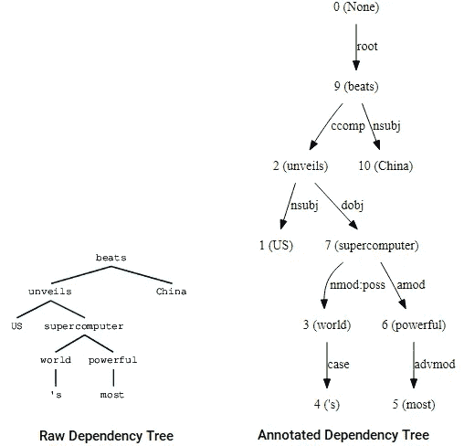***

***Dependency Tree visualizations using nltk’s Stanford dependency parser***

***您可以注意到与我们之前获得的树的相似之处。注释有助于理解不同令牌之间的依赖类型。***

# ***命名实体识别***

***在任何文本文档中，都有代表特定实体的特定术语，这些术语提供更多信息，并具有独特的上下文。这些实体被称为命名实体，更具体地说，命名实体是指表示真实世界对象的术语，如人、地点、组织等，它们通常由专有名称表示。一种简单的方法是通过查看文本文档中的名词短语来找到它们。命名实体识别(NER)，也称为实体分块/提取，是一种在信息提取中使用的流行技术，用于识别和分割命名实体，并根据各种预定义的类别对它们进行分类或归类。***

***SpaCy 拥有一些优秀的命名实体识别能力。让我们试着在我们的一篇样本新闻文章中使用它。***

```
***[(US, 'GPE'), (China, 'GPE'), (US, 'GPE'), (China, 'GPE'), 
 (Sunway, 'ORG'), (TaihuLight, 'ORG'), (200,000, 'CARDINAL'), 
 (second, 'ORDINAL'), (Sunway, 'ORG'), (TaihuLight, 'ORG'), 
 (93,000, 'CARDINAL'), (4,608, 'CARDINAL'), (two, 'CARDINAL')]***
```

******

***Visualizing named entities in a news article with spaCy***

***我们可以清楚地看到主要的命名实体已经被`**spacy**`识别。要更详细地了解每个命名实体的含义，您可以参考文档[](https://spacy.io/api/annotation#named-entities)**或查看下表。*****

*****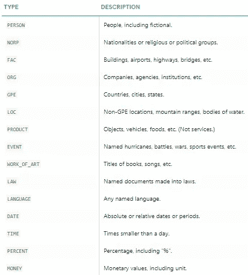*****

*****Named entity types*****

*****现在让我们找出新闻语料库中最常见的命名实体！为此，我们将使用以下代码构建一个包含所有命名实体及其类型的数据框架。*****

*****现在，我们可以转换和聚合该数据框，以找到出现次数最多的实体和类型。*****

*****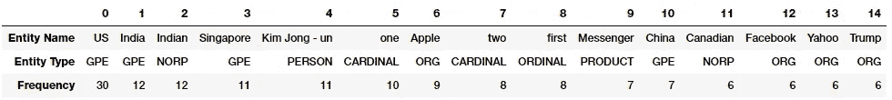*****

*****Top named entities and types in our news corpus*****

*****你注意到什么有趣的事情了吗？ *(* ***提示:*** *也许是川普和金仲翀之间所谓的峰会吧！)*。我们还看到它正确地将“Messenger”识别为一种产品(来自脸书)。*****

****我们还可以根据实体类型进行分组，以了解什么类型的实体在我们的新闻语料库中出现得最多。****

****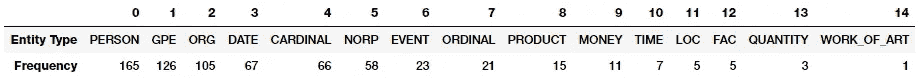****

****Top named entity types in our news corpus****

****我们可以看到，人、地点和组织是提到最多的实体，但有趣的是，我们还有许多其他实体。****

****另一个不错的 NER 标签是可从`**nltk**`界面获得的`**StanfordNERTagger**`。为此，您需要安装 Java，然后下载斯坦福 NER 资源[](http://nlp.stanford.edu/software/stanford-ner-2014-08-27.zip)*。将它们解压缩到您选择的位置(我在系统中使用了`E:/stanford`)。*****

*****[***斯坦福的命名实体识别器***](https://nlp.stanford.edu/software/CRF-NER.shtml) 基于线性链条件随机场(CRF)序列模型的一种实现。遗憾的是这个模型只在 ***人******组织*** 和 ***位置*** 类型的实例上训练。下面的代码可以作为一个标准的工作流程，帮助我们使用这个标签提取命名实体，并显示顶级命名实体及其类型(提取与`**spacy**`略有不同)。*****

****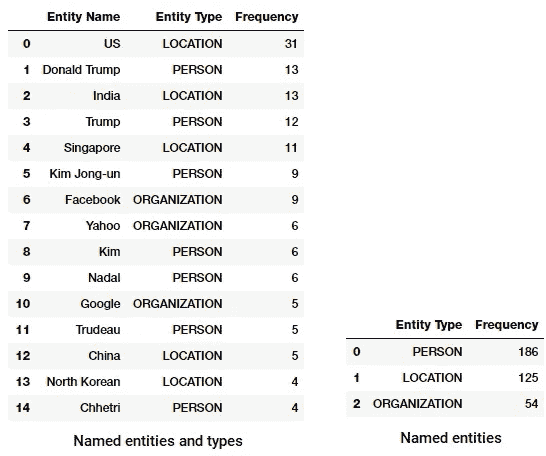****

****Top named entities and types from Stanford NER on our news corpus****

****我们注意到非常相似的结果，尽管仅限于三种类型的命名实体。有趣的是，我们在各种运动中看到许多提到的几个人。****

# ****情感和情绪分析****

****情感分析可能是 NLP 最受欢迎的应用之一，有大量的教程、课程和应用程序专注于分析从公司调查到电影评论等不同数据集的情感。情感分析的关键方面是分析一个文本体，以理解它所表达的观点。通常，我们用一个正值或负值来量化这种情绪，称为*。 ***总体情绪*** 往往从极性得分的符号推断为*正*、*中性*或*负*。*****

****通常，情感分析对有主观背景的文本比对只有客观背景的文本效果更好。客观文本通常描述一些正常的陈述或事实，而不表达任何情绪、感受或心情。主观文本包含通常由具有典型情绪、情感和感觉的人表达的文本。情绪分析被广泛使用，尤其是作为社交媒体分析的一部分，用于任何领域，无论是商业、最近的电影还是产品发布，以了解人们对它的接受程度，以及他们根据自己的意见或，你猜对了，情绪对它的看法！****

********

****通常，对文本数据的情感分析可以在几个级别上进行计算，包括在单个句子级别、段落级别或者作为整体的整个文档。通常，情感是作为一个整体在文档上计算的，或者在计算了单个句子的情感之后进行一些聚合。有两种主要的情感分析方法。****

*   ****监督机器学习或深度学习方法****
*   ****无监督的基于词典的方法****

****对于第一种方法，我们通常需要预先标记的数据。因此，我们将关注第二种方法。关于情感分析的全面覆盖，请参考 [*第七章:分析影评情感*](https://github.com/dipanjanS/practical-machine-learning-with-python/tree/master/notebooks/Ch07_Analyzing_Movie_Reviews_Sentiment) *，* [*用 Python 进行实用机器学习，Springer\Apress，2018*](https://www.springer.com/us/book/9781484232064) 。在这种情况下，我们没有标记良好的训练数据集的便利。因此，我们将需要使用无监督的技术来预测情感，通过使用知识库、本体、数据库和词典，它们具有详细的信息，专门为情感分析而策划和准备。词典是字典、词汇或一本单词书。在我们的例子中，词典是为分析情感而创建的特殊词典或词汇。这些词典中的大多数都有一个正负极性单词的列表，这些单词都有一些与之相关的分数，并且使用各种技术，如单词的位置、周围的单词、上下文、词性、短语等等，分数被分配给我们想要计算情感的文本文档。汇总这些分数后，我们得到最终的情感。****

********

****各种流行的词汇被用于情感分析，包括如下。****

*   ****[**AFINN 词典**](https://github.com/fnielsen/afinn)****
*   ****[**刘冰词库**](https://www.cs.uic.edu/~liub/FBS/sentiment-analysis.html)****
*   ****[**MPQA 主观性词汇**](http://mpqa.cs.pitt.edu/lexicons/subj_lexicon/)****
*   ****[**SentiWordNet**](http://sentiwordnet.isti.cnr.it/)****
*   ****[**VADER 词典**](https://github.com/cjhutto/vaderSentiment)****
*   ****[**文本斑点词典**](https://github.com/sloria/TextBlob/blob/eb08c120d364e908646731d60b4e4c6c1712ff63/textblob/en/en-sentiment.xml)****

****这不是可以用于情感分析的词汇的详尽列表，还有几个其他的词汇可以很容易地从互联网上获得。请随意查看这些链接并探索它们。我们将在这一部分讨论两种技术。****

## ****基于 AFINN 词典的情感分析****

****[***AFINN 词典***](https://github.com/fnielsen/afinn/blob/master/afinn/data/) 也许是最简单和最流行的词典之一，可以广泛用于情感分析。由 Finn RUP Nielsen 开发和策划，你可以在论文*“一个新的新的:评估用于微博情感分析的单词列表”，ESWC 2011 研讨会的会议录中找到关于这个词汇的更多细节。*词典的当前版本是 ***AFINN-en-165。txt* 你可以在作者的 [*官方 GitHub 知识库*](https://github.com/fnielsen/afinn/blob/master/afinn/data/) 中找到这本词典，以及它以前的版本，包括***AFINN-111***[。作者还在此基础上用 Python 创建了一个很好的包装器库，名为`**afinn**`，我们将使用它进行分析。](https://github.com/fnielsen/afinn/blob/master/afinn/data/.)******

****下面的代码计算所有新闻文章的情绪，并显示每个新闻类别的一般情绪的汇总统计。****

****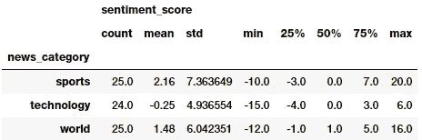****

****我们可以很好地了解不同新闻类别的总体情绪统计。貌似一般人气在 ***体育*** 很正，在 ***科技*** 相当负！现在让我们来看一些可视化。****

****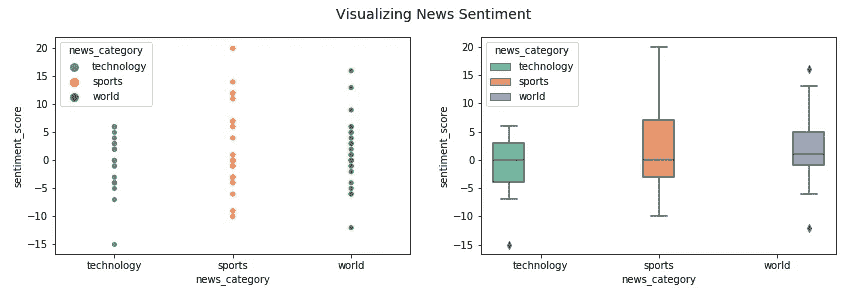****

****Visualizing news sentiment polarity****

****我们可以看到，与*相比，在 ***体育*** 和 ***世界*** 中，情绪极性的传播要高得多，在那里，许多文章似乎都具有负极性。我们也可以将情感标签的频率可视化。*****

****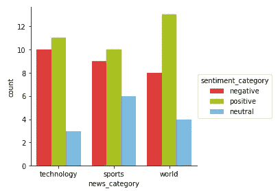****

****Visualizing sentiment categories per news category****

****毫无疑问， ***技术*** 的负面文章最多，而 ***世界*** 的正面文章最多。 ***体育*** 可能会有更多中性的文章，这是因为存在本质上更客观的文章(谈论体育赛事而不存在任何情绪或感觉)。下面就让我们深入探讨一下 ***科技*** 新闻最正反的情绪新闻文章。****

****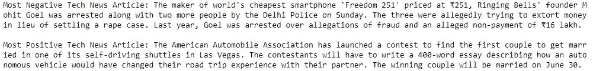****

****看起来最负面的文章是关于最近在印度的智能手机骗局，最正面的文章是关于在自动驾驶班车上结婚的比赛。有意思！让我们对 ***世界*** 新闻做一个类似的分析。****

****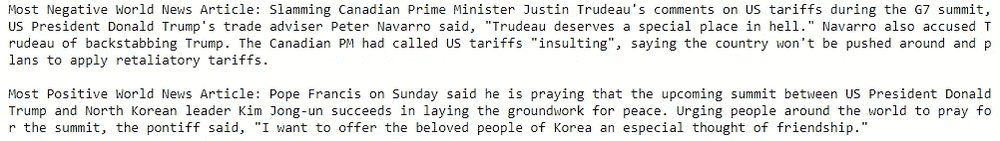****

****有趣的是，特朗普同时出现在最积极和最消极的 ***世界*** 新闻文章中。请务必阅读这些文章，从更多的角度了解为什么模型选择了其中一个作为最负面的，而另一个作为最正面的(这并不奇怪！).****

## ****使用 TextBlob 进行情感分析****

****[***text blob***](http://textblob.readthedocs.io/en/dev/)是另一个用于轻松执行 NLP 任务的优秀开源库，包括 [***情感分析***](http://textblob.readthedocs.io/en/dev/quickstart.html#sentiment-analysis) 。它也是一个 [***情感词典***](https://github.com/sloria/TextBlob/blob/dev/textblob/en/en-sentiment.xml) (以 XML 文件的形式)，它利用它来给出极性和主观性分数。通常，与 Afinn 相比，分数具有标准化的标度。 ***极性*** 分数在`**[-1.0, 1.0]**`范围内浮动。 ***主观*** 在`**[0.0, 1.0]**`范围内浮动，其中`**0.0**`非常*客观*`**1.0**`非常*主观*。现在让我们使用它来获取每篇新闻文章的情感极性和标签，并汇总每个新闻类别的汇总统计数据。****

****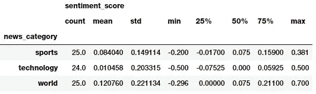****

****貌似平均人气在 ***世界*** 最正，在 ***科技*** 最不正！然而，这些指标可能表明模型预测更多的文章是正面的。我们来看每个新闻类别的情绪频率分布。****

****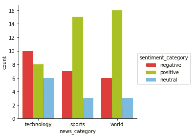****

****Visualizing sentiment categories per news category****

****与我们之前的模型相比，这里的新闻类别中肯定有更多积极的文章。然而，看起来科技仍然有最多的负面文章和世界上最多的正面文章，这与我们之前的分析相似。让我们现在做一个对比分析，看看我们是否还能在 ***世界*** 新闻的最正面和最负面类别中获得类似的文章。****

****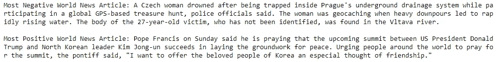****

****嗯，看来这里最负面的 ***世界*** 新闻文章比我们上次看到的还要压抑！最积极的文章仍然与我们在上一个模型中获得的相同。****

****最后，我们甚至可以在这两个模型之间评估和比较有多少预测是匹配的，有多少是不匹配的(通过利用分类中经常使用的混淆矩阵)。为此，我们利用我们漂亮的`**model_evaluation_utils**`模块。****

****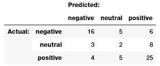****

****Comparing sentiment predictions across models****

****在上表中， ***【实际】*** 标签是来自 ***Afinn*** 情感分析器的预测，而 ***【预测】*** 标签是来自`**TextBlob**`的预测。看来我们之前的假设是正确的。`**TextBlob**`明确预测几篇*中性*和*阴性*的文章为*阳性*。总的来说，大多数情绪预测似乎是匹配的，这很好！****

# ****结论****

****这绝对是我的长篇文章之一！如果你正在读这篇文章，我真的很感谢你一直陪我读到这篇文章的结尾。这些例子应该让你很好地了解如何开始使用文本文档的语料库，以及用于文本检索、预处理、解析、理解结构、实体和情感的流行策略。在本系列的下一篇文章中，我们将通过实际例子介绍特征工程和表示技术。敬请期待！****

****本文使用的所有代码和数据集都可以从我的 [**GitHub**](https://github.com/dipanjanS/practical-machine-learning-with-python/tree/master/bonus%20content/nlp%20proven%20approach) 中访问****

****该代码也可作为 [**Jupyter 笔记本**](http://nbviewer.jupyter.org/github/dipanjanS/practical-machine-learning-with-python/blob/master/bonus%20content/nlp%20proven%20approach/NLP%20Strategy%20I%20-%20Processing%20and%20Understanding%20Text.ipynb)****

*****我经常指导和帮助* [***跳板***](https://www.springboard.com/) *的学生学习数据科学方面的基本技能。感谢* [*他们*](https://www.springboard.com/) *帮我开发这个内容。如果你对学习数据科学的职业结构化道路感兴趣，一定要去看看* [***Springboard 的 DSC 训练营***](https://www.springboard.com/workshops/data-science-career-track) *。*****

****[](https://www.springboard.com/workshops/data-science-career-track) [## 数据科学职业轨迹|跳板

### 数据科学职业跟踪是您进入数据科学职业的跳板。在线导师指导训练营，旨在获得…

www.springboard.com](https://www.springboard.com/workshops/data-science-career-track) 

这些代码中有很多来自我在写书 [***“用 Python 进行文本分析”***](https://www.springer.com/us/book/9781484223871) 期间所做的研究和工作。代码在 [**GitHub**](https://github.com/dipanjanS/text-analytics-with-python) 上开源。 *(Python 3.x 版将于今年年底推出！)*

[](https://www.springer.com/us/book/9781484223871) [## 使用 Python 进行文本分析——一种实用的现实方法，可以从以下方面获得可操作的见解…

### 使用 Python 从数据中获得有用的见解。您将学习基本和高级概念，包括文本和…

www.springer.com](https://www.springer.com/us/book/9781484223871) 

[***《用 Python 进行实用的机器学习》***](https://www.springer.com/us/book/9781484232064) ，我的另一本书也详细涉及了文本分类和情感分析。为了您的方便，代码在 [**GitHub**](https://github.com/dipanjanS/practical-machine-learning-with-python) 上开源。

[](https://www.springer.com/us/book/9781484232064) [## 使用 Python 的实用机器学习--构建真实世界的问题解决者指南…

### 掌握识别和解决复杂问题所需的基本技能与机器学习和深度学习在…

www.springer.com](https://www.springer.com/us/book/9781484232064) 

如果你对我的文章或数据科学有任何反馈、评论或有趣的见解要分享，请随时通过我的 [**LinkedIn**](https://www.linkedin.com/in/dipanzan/) 社交媒体频道联系我。

[](https://www.linkedin.com/in/dipanzan/) [## Dipanjan Sarkar -数据科学家-英特尔公司| LinkedIn

### 查看 Dipanjan Sarkar 在世界最大的职业社区 LinkedIn 上的个人资料。Dipanjan 有 6 份工作列在…

www.linkedin.com](https://www.linkedin.com/in/dipanzan/) 

感谢 [*杜巴*](https://www.linkedin.com/in/durba-dutta-bhaumik-44532ab1/) 编辑本文。****