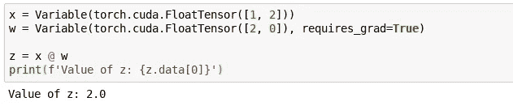
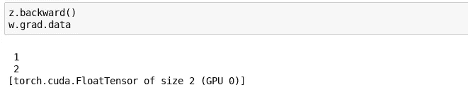
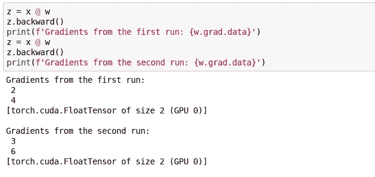
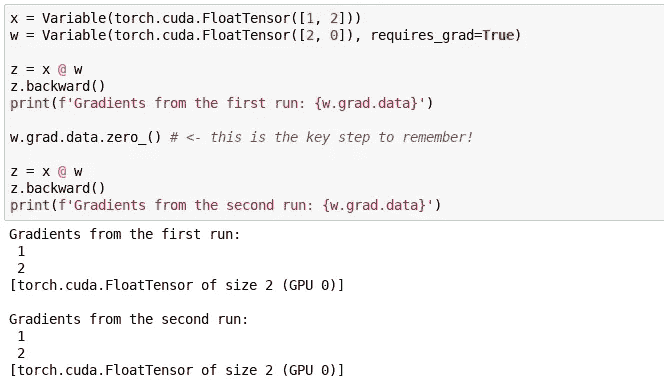

# PyTorch 实践指南

> 原文：<https://towardsdatascience.com/a-practitioners-guide-to-pytorch-1d0f6a238040?source=collection_archive---------0----------------------->

几天前我开始使用 PyTorch。下面我概述了 PyTorch 的关键概念，以及一些我在接触这个框架时发现特别有用的观察结果(如果你没有意识到它们，这可能会导致很多挫折！)

## 词汇表

**张量**——(喜欢)一个 numpy.ndarray 但是可以住在 GPU 上。

**变量**——通过将张量自身包裹起来，使其成为计算的一部分。如果创建时 requires_grad = True，将在向后阶段计算梯度。

## pytorch 如何工作

您可以通过写出它们来执行计算，就像这样:

Taking a dot product of x with w using the new Python 3.5 syntax. torch.cuda creates the tensor on the GPU.

一旦完成，您需要做的就是对结果调用#backward()。这将计算梯度，并且您将能够访问使用 requires_grad = True 创建的变量的梯度。

Accessing the gradient of w.

## 要记住的事情(否则有发疯的危险)

1.  **数据类型很重要！** 如果把一个[字节或者](http://pytorch.org/docs/master/tensors.html#)除以 50 会怎么样？如果你试图将 torch.exp(12)的结果存储在一个半张量中会怎样？实际上，这比乍看起来要简单得多，但确实需要一些思考。
2.  **如果能上溢或下溢，就会。** 数值稳定性很重要——当存储在合成张量中时，除法能产生零吗？如果你试着把它记录下来呢？
    再一次——这没什么可详细说明的，但肯定是需要注意的。如果你想更深入地了解这一点，让我向你介绍终极，同时在这一问题上非常平易近人的[来源](https://www.youtube.com/watch?v=XlYD8jn1ayE&feature=youtu.be&list=PLoWh1paHYVRfygApBdss1HCt-TFZRXs0k&t=1607)。
3.  **渐变默认累加！我把最好的留到了最后——与我们现在要看的野生动物相比，上面两只是友好的吉娃娃！
    默认情况下，渐变会累积。你运行一次计算，你逆向运行——一切都很好。但是，对于第二次运行，渐变被添加到第一次操作的渐变中！这很重要，也很容易忘记，请看看我们之前的例子:**

解决方案是在运行之间手动调零梯度。

最后但同样重要的是，我想推荐[官方教程](http://pytorch.org/tutorials/)——不管你的经验水平如何，它们都是值得一去的好地方。

我希望这能对你有所帮助，并能省去我在开始学习 PyTorch 时所经历的一些挣扎。祝我们俩好运，因为我们将继续掌握这个令人惊叹的框架！

*如果你觉得这篇文章很有趣并且想保持联系，你可以在 Twitter 上找到我* [*这里*](https://twitter.com/radekosmulski) *。*