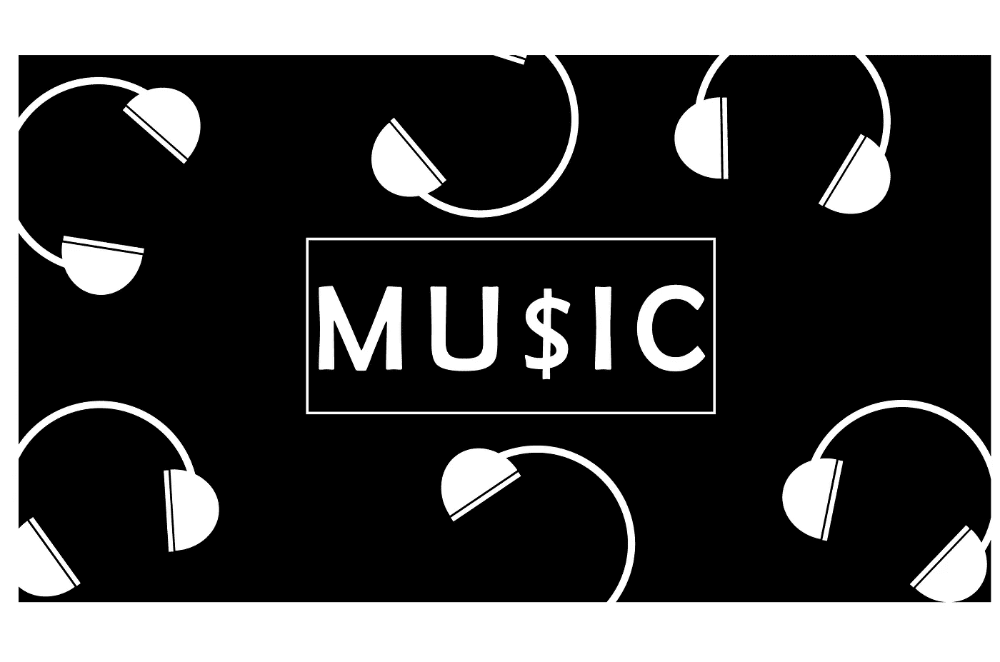
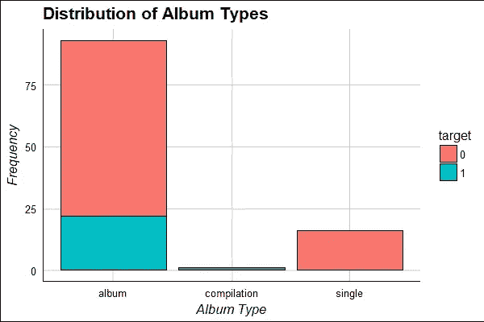
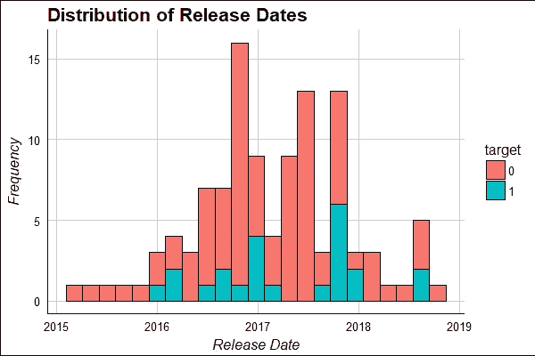
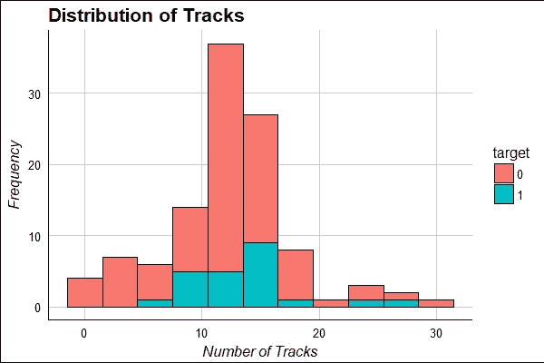

# 用音乐投资(和获利)的量化方法

> 原文：<https://towardsdatascience.com/a-quantitative-approach-to-investing-and-profiting-with-music-2537a1260c53?source=collection_archive---------13----------------------->

# ||简介||

大多数消费者和投资者都非常熟悉通过 Spotify 和 Apple Music 等服务获得的商业音乐的内容流方面，以及如何投资于它们(只需购买 *$SPOT* 或 *$AAPL* )，但制作方面呢？

我(作为一个不能连续两个小时不听好音乐的人)想结合我的一些兴趣，了解一个人如何投资音乐制作，以及在这个领域是否有一个独特的投资机会，可以快速获利？经过一番思考，我缩小了我的关注点，形成了以下研究问题:

> 是否有某些股票受到音乐输出(如歌曲、专辑等)的显著影响。)那我可以投资吗？如果是这样的话，我能预测哪些专辑/歌曲将会推动价格，从而在市场之前获得可观的回报吗？

答案是一个响亮的也许！

# ||概述||

在音乐界，有三个音乐制作的“霸主”:环球音乐集团、索尼音乐和华纳音乐集团。在这些群体中有唱片公司，它们是管理自己的艺术家和制作人的子集，负责寻找有前途的人才/为他们提供成功所需的资源(并为唱片公司/总体群体赚钱)。在这三家公司中，索尼音乐和华纳音乐集团的母公司大部分收入来自其他渠道(索尼音乐和华纳兄弟音乐占母公司收入的比例不到 3%)。环球音乐集团(UMG)是个例外——其母公司，一家名为维旺迪的意大利媒体集团，依靠 UMG 获得其总收入的 40%(另外 60%来自一家名为“Gameloft”的游戏公司和一家名为“Canal+”的体育频道)。这意味着 UMG 的任何音乐作品都会影响维旺迪股价的 40%,这足以形成一个可交易的信号。

这在我看来更有希望，进一步的研究显示 UMG 实际上拥有以下唱片公司:

> XO，Interscope 记录，Def Jam 记录，Capitol 记录，和 Republic 记录。

签约这些团体的艺术家包括*威肯、阿姆、坎耶·韦斯特、酷玩乐队、Jay-Z、蕾哈娜、李尔·韦恩、想象龙、OneRepublic 和魔力红*——我永远不会想到所有这些著名的艺术家都在为同一家公司创造收入！

然后，我的目标是弄清楚这些艺术家(以及其他许多 UMG 签名者)发行的畅销专辑是否创造了一个积极的信号，可以用来明智地交易维旺迪的股票。

# ||数据||

我需要一种方法来找到 UMG 艺术家发行的专辑之间的共同点，因为如果每张专辑都与其他专辑不同，任何价格上涨都很可能与专辑本身无关。

我决定使用专辑认证(银，金，白金等。)、首周销量、曲目数量、专辑类型(单曲、汇编等。)，以及发行日期，作为可以用来寻找相似性的潜在因素。我现在可以开始尝试将这些因素整合到一个数据集中。

**威望迪的股票价格**
我用雅虎财经为“威望迪股份有限公司”( *$VIV)提取每日收盘价。PA* ，但这并不符合我的目的，因为我想衡量一张专辑在特定时间窗口内发布的**效果**。我选择了专辑发行后的七个交易日(因为第一周的销售额是音乐行业的一个常见指标)，并计算了滚动百分比变化。

**专辑发布** 我刮了 Genius.com 的[“专辑发布时间表”](https://genius.com/Genius-january-2016-album-release-calendar-annotated)得到了最近两年(2016，2017)的专辑滴滴和各自艺人的名单。

**专辑信息**
使用 Spotify Web API，我搜索了我在上一步中找到的每张专辑，并能够获得每张专辑的更多信息，具体来说，我能够提取专辑中的曲目数量、专辑类型(单曲、汇编等)。)，以及它们的具体发布日期。

**UMG 艺术家** 我还从[维基百科的一篇文章](https://en.wikipedia.org/wiki/List_of_Universal_Music_Group_artists)中搜集了一份 UMG 艺术家的名单，并将他们与上一步的数据进行交叉引用，以获得 118 张 UMG 专辑的名单，以及他们各自的艺术家和上述因素。

我最初的计划是从美国唱片工业协会(RIAA)收集认证数据，该协会拥有每张专辑的获奖数据(如果它获奖的话)。不幸的是，我提出了太多的 HTTP 请求，并因安全原因被锁定在网站之外，所以我不得不转向。

# ||分析||

专辑认证数据的缺乏迫使我求助于二元问题，即专辑发行是否使 Vivendi 的股价上涨了 3%以上(这是一个任意选择的数字，似乎具有统计学意义)。这个支点意味着我没有因素去尝试和预测**股价变化了多少**，只有**它到底有没有变化。**

我通过一种算法计算了 118 张专辑的日期，用 1 的 **target** 值标记了对 Vivendi 有重大影响的专辑(其余的用 0)。

在这个算法的最后，我发现在过去两年的 118 张专辑中，有**张 UMG 的专辑在发行后的一周内可能使威望迪的股价上涨了至少 3%。**

Factor data for all 118 album releases by UMG artists (includes target values of “0” for no significant impact and “1” for significant impact)

为了建立 3%的 VIV 增量之间的依赖关系。PA 和这些专辑，标记为“1”的专辑之间需要有一些共性从上面的图表来看，很容易说这些有影响力的专辑彼此之间没有什么共同点(至少就我所能得到的因素而言)。然而，最后一张图表是最有趣的，因为它表明拥有 10-15 首曲目的专辑最有可能导致价格上涨。其他图表显示，专辑在接近年初或年底发行时表现最佳，“专辑”的表现比“单曲”或“合辑”好得多(但这也可能是因为 118 张专辑中的大多数是专辑)。

# ||结论||

一句话，我的小实验得出了以下结论:

> 在某张专辑发行一周后，Vivendi 的股票价格上可能有可交易信号的证据，但进一步的工作是必要的，以确定**如何**确定该信号，或者**它甚至是什么**。

也有一些潜在的变量可能扭曲了我的实验，例如 Vivendi 其他细分市场的表现(如 Gameloft 和 Canal+)。此外，我肯定有一个有限的数据集，因为 Genius.com 在 2016 年才开始他们的专辑发布日历。

118 张专辑中的 25 张可能就足以暗示出$VIV。帕和 UMG 的专辑发行，但这种相关性取决于 25 张专辑，标志着超过 3%的增长。如果这 25 张专辑有一些共同点，就有可能区分出哪种专辑会导致$VIV.PA 的飙升。

不幸的是，由于我能够提取的数据有限，我无法找出对威望迪股价产生重大影响的这些专辑之间更能说明问题的共同点。因此，尽管有轻微的证据表明这种相关性可能存在，但我不能断言这种相关性有多强。

所以，就像统计学中的大多数事情一样，

> 这个问题的真实答案唱了一首不为人知的曲子。

# ||后记||

我用 R 进行了这个实验，并使用了几个包，包括“ggplot2”(数据可视化)、“rvest”(web 抓取)和“httr”(HTTP 请求)。

我邀请你进行你自己的与这个主题相关的实验，并希望听到任何发现或进展！**如果你喜欢这篇文章，请给它一些掌声**，请**继续关注 [TDS 团队](https://medium.com/u/7e12c71dfa81?source=post_page-----2537a1260c53--------------------------------)和我( [Abhinav Raghunathan](https://medium.com/u/33c10dfa56bf?source=post_page-----2537a1260c53--------------------------------) )，了解更多数据驱动的投资理念探索！**