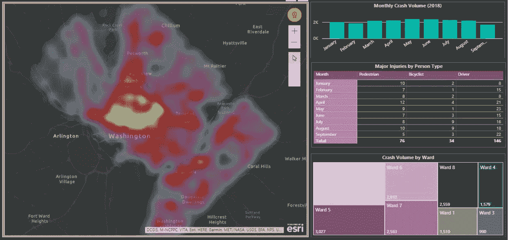
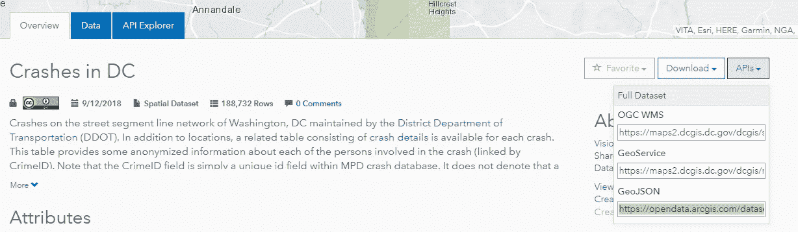
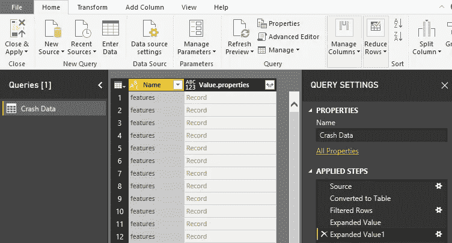
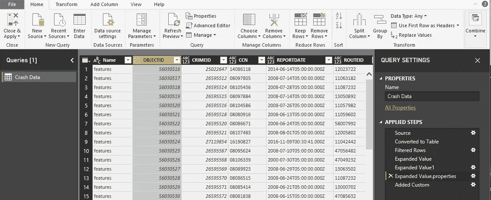

# Power BI 中的地理信息快速指南

> 原文：<https://towardsdatascience.com/a-quick-guide-to-geojsons-in-power-bi-f4736e76aa9d?source=collection_archive---------0----------------------->

## 将 GeoJSONs 转变为仪表盘



Washington, DC Crash Data Dashboard built using the Open Data DC API

任何城市都有丰富的安全数据——犯罪、交通违章、撞车等。—但是拥有数据本身并不总是等同于拥有信息。如果是的话，这个世界就不需要分析师了！

在多次收到为我们的客户执行交通安全分析的请求后，我承担了开发一个交互式工具的任务，该工具将使城市能够以一种轻松的方式探索自己的安全数据，使他们能够提取相关的安全相关信息和见解。

该工具的一个关键组成部分是能够为城市提供尽可能最新的交通事故数据，而不必在每次刷新时手动更新交通事故数据。我选择在 Power BI 中这样做，并使用 DC 的 Washington 作为该工具的原型。

首先，我需要找到我的数据。从过去的分析中，我知道 DC 的华盛顿州有一个非常令人印象深刻的开放数据设置，所以我无意中找到了那里并开始搜索。结果，他们正好有我需要的东西——[一个包含所有车祸及其位置的数据集](http://opendata.dc.gov/datasets/crashes-in-dc)，由地区交通部维护。头奖。

接下来，获取数据。开放数据 DC 网站允许您下载 CSV、KML 和 shapefiles，但这些只是某个时间点的快照。创建这个工具的目的，在某种程度上，是为了构建一个产品，以取代我每个月左右在数据发生变化时执行相同分析的需要。幸运的是，DC 开放数据有一个 API。

> 如果你像我一样不熟悉 API 的整个世界，[Petr Gaza ROV 的这篇](https://medium.freecodecamp.org/what-is-an-api-in-english-please-b880a3214a82)文章非常容易理解，信息量也很大。

访问他们的 API 很简单，但是弄清楚如何在 Power BI 中利用这些数据对我来说是一次学习经历。我花了几个小时探索他们提供的不同 API，他们返回的数据，并在网上做了一些研究。在我的搜索过程中，我找不到任何能真正带领我完成从查找数据到将其加载到 Power BI 数据模型(尤其是 GeoJSON 文件)的过程的东西，所以我想我应该写一篇快速的文章，一步一步地介绍它。



Screenshot of the “Crashes in DC” API drop down menu. You da real MVP, Open Data DC.

开放数据 DC API 下拉菜单提供了几个 URL，您可以在这些 URL 上获得完整的碰撞数据集，但我将在本文中使用的是 GeoJSON 格式。在讨论连接到 API 的细节之前，我将花一点时间来讨论 GeoJSON 文件。

## 在今天的“了解你的文件类型”节目中

JSON 文件基于 JavaScript，以文本格式存储信息，这种格式非常容易被各种类型的程序解析。GeoJSON 文件本质上是相同的东西，但是它们存储的信息对应于地理数据。由于这个特定数据集的文件相当大，让我们快速查看一下 GeoJSON 文件的一般结构，以确定一旦我们将它加载到 Power BI 中，我们将需要提取哪些元素，而不是直接打开文件本身(此代码的扩展版本可以在 GeoJSON 维基百科页面[这里](https://en.wikipedia.org/wiki/GeoJSON)找到):

```
{
  "type": "FeatureCollection",
  "features": [
    {
      "type": "Feature",
      "geometry": {
        "type": "Point",
        "coordinates": [102.0, 0.5]
      },
      **"properties": {
        "prop0": "value0"
      }**
    }
```

看起来有两个特征:“几何”和“属性”。可以肯定的是，几何图形包含用于可视化数据集的空间信息(在这种情况下是点的坐标对，但它们也可以是线或面边界)。Properties(上面代码中的粗体文本)包含每个记录的各种属性和值(在我们的例子中，这对应于每个崩溃的不同属性)。*这里值得注意的是，通过浏览网站上的碰撞数据集，我们可以看到纬度和经度的特定字段，这些字段将属于属性功能，因此我们不必从几何功能中提取它们。*

## 连接到 Power BI 中的 API

*本节要求您在计算机上安装 Power BI Desktop。* [*免费下载，随便玩玩！*](https://powerbi.microsoft.com/en-us/desktop/)

在 Power BI Desktop 中，单击顶部功能区上的“获取数据”按钮，然后从下拉菜单中选择“Web”。这将弹出一个对话框，您可以在其中粘贴来自开放数据 DC 网站的 GeoJSON 文件的 URL。


The data set looks pretty unimpressive, but has a pretty impressively complex name

导入数据集后，我们将通过单击功能区左上角“convert”选项卡下的“Into Table”按钮将其转换为表格。

回想一下我们之前对 GeoJSON 文件结构的探索，我们期望有两个特性:几何和属性，属性包含我们想要的每次崩溃的信息。为了达到这些目的，我们将执行以下步骤:

*   将“名称”列向下筛选为“功能”
*   通过单击“值”列标题右上角的两个箭头，枚举所有单独的崩溃记录，并选择“扩展到新行”
*   再次单击“值”下拉菜单，选择“属性”功能

现在，您将得到如下所示的内容:



Tabular data set from the GeoJSON data source

我们快到了。我们已经使用过几次“价值”下拉菜单，但是…


再次单击“Value”列(现在名为 Value.properties)的下拉菜单后，美妙的事情发生了——我们找到了崩溃的属性。您可以选择保留哪些列或保留所有列，但是为了您自己的健康，请取消选择“使用原始列名作为前缀”框(否则数据集中的每一列都将以“Values.properties”开头)。



This is what your data should now look like. Nailed it.

您可能需要进行一些后续的列转换(日期字段转换，可以在下面的建议部分找到，或者将数值字段转换为实际的数字而不是文本)，但是此时数据已经可以使用了！下面是我将 GeoJSON 文件中包含的一些最基本的数据放在一起的快速仪表板:


Crash dashboard (crashboard?) that is built on data pulled directly from the Open Data DC API

## 使用数据集的建议

*   我建议创建一个转换后的“报告日期”列。GeoJSON 的报告日期格式如下:“YYYY-MM-DDTHH:MM:SS.000Z”。您可以通过使用以下代码在超级查询编辑器中添加自定义列来进行转换:

```
DateTime.FromText(Text.Start( [REPORTDATE], 19))
```

*   将近 20 万起撞车事故映射为单独的点是非常没有意义的(没有双关语的意思)，因为它可能会覆盖整个地区。此外，我使用的地图可视化工具(ArcGIS Maps for Power BI)只能绘制有限数量的点。由于这个原因，我建议只过滤相关日期的视觉效果，并使用热图作为地图主题。
*   如果您想要发布包含这些数据的仪表板，不要忘记通过网关设置计划的刷新，以保持它是最新的！

就是这样！我们已经成功连接到一个 API，并将提供的 GeoJSON 文件转换为可用的 Power BI 数据集，该数据集可以定期刷新，无需在源更新时手动替换数据。