# 面向机器学习者的衍生品快速入门

> 原文：<https://towardsdatascience.com/a-quick-introduction-to-derivatives-for-machine-learning-people-3cd913c5cf33?source=collection_archive---------11----------------------->

**简介**

如果你和我一样，你可能在生活中的很大一部分时间里都在使用衍生品，并学到了一些关于它们如何运作和表现的规则，但并没有真正理解它们的来源。作为孩子，我们很早就学习了一些规则，例如幂法则，我们知道 *x* 的导数是 *2x* ，它以更一般的形式变成了 *dxᵃ/dx=axᵃ⁻* 。这在原则上是没问题的，因为所有的规则都可以很容易地记忆并在表格中查找。这样做的坏处当然是，你在使用一个你根本不理解的系统和形式主义。同样，如果你不是每天都在开发机器学习框架，这不一定是个问题，但是知道幕后发生了什么真的很好。我本人鄙视黑盒◼.为了更深入地研究这个问题，我将向你们展示它的基础。为了做到这一点，我们必须定义一个导数应该为你做什么。你知道吗？我相信你有，但万一你没有；

> *导数是对函数如何随着一个或多个变量的微小变化而变化的连续描述。*

我们将从多方面来研究这一声明。例如

*   小是什么意思？
*   改变意味着什么？
*   为什么是连续的？
*   这有什么用？

我们开始吧！

# 全微分和偏导数

这些术语通常是许多人混淆的来源，因为它们有时被视为等同物，并且在许多情况下，它们似乎彼此无法区分。然而他们不是！让我们从定义偏导数开始，然后从这里继续到全导数。为此，我将使用一个虚函数 *f(t，x，y)* ，其中我们有三个变量 *t* 、 *x* 和 *y* 。偏导数回答了**一个**变量小幅度变化(∂ *x* )时 *f* 如何变化(∂ *f* )的问题。在此设置中，所有其他变量都被假定为常量和静态变量。因此偏导数记为∂ *f* /∂ *x* 。为了展示当我们做这个操作时会发生什么，我们需要首先定义 *f* 为某物。假设它看起来像这个 *f(t，x，y)*=*txy 4*π/*3*顺便说一下，这是一个椭球体的体积。嗯，也许不是那么偶然..无论哪种方式，我都选择了不同于通常使用的参数化。在下图中，你可以从上到下从左到右分别看到一个球体、一个椭球体和一个椭球体。在我们的设置中，我们可以选择 *t=a，x=b，y=c* 作为尺寸。

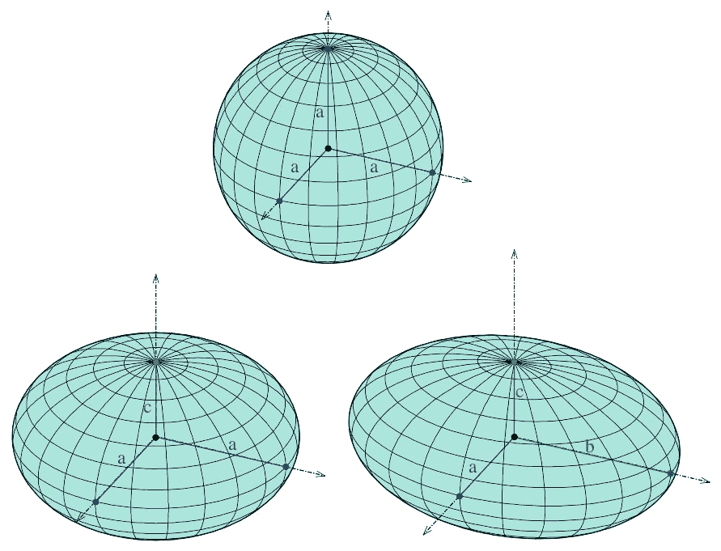

By Ag2gaeh — Own work, CC BY-SA 4.0, [https://commons.wikimedia.org/w/index.php?curid=45585493](https://commons.wikimedia.org/w/index.php?curid=45585493)

这些几何空间的体积的偏导数就变成了∂*f*/∂*x*= 4*π*3*ty*这里我们应用了幂律。如您所见，t*t*和 y*y*没有被触及，因为我们假设它们是固定的。因此，在上图中，我们模拟了当 *b* 少量延伸或缩短时，体积会发生什么。这回答了我们的问题，如果他们真的独立于 *x* 。但是如果他们不是呢？在这种情况下，我们需要 *f* 相对于 *x* 的总导数，用 *df/dx* 表示，定义如下

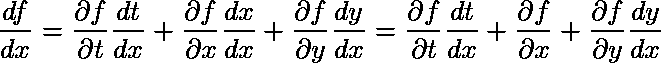

你可以看到偏导数是总导数的一部分。为了便于说明，让我们将函数限制在 *t=x* 的情况下。那么导数会发生什么呢？之前的偏导数保持不变。但是我们需要计算的另外两项。第一部分变成(∂f/∂t) (dt/dx)=4π/3 ⋅ xy ⋅ 1，而最后一部分变成

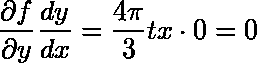

因此现在我们得到了

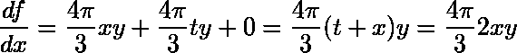

通过在最后一步中添加术语并替换 *t=x* 。现在希望很明显，∂f/∂x≠df/dx 和你需要小心，在你做导数的时候，在你的变量之间陈述独立性之前。

等等！我听到你哭了，我们能不能在计算完偏导数后直接代入？事实上，你可以，你会得到一个相差 2 倍的东西，这可能是很大的。基本上你会得到以下的疯狂

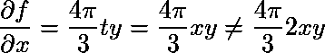

这是因为我们通常追求的是全导数，而不是偏导数。然而，你当然可以在计算偏导数之前进行代入运算。这看起来会很好

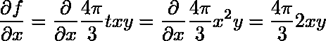

我们再次达成一致。因此，在计算完之后，你不能在偏导数**中插入依赖项！**

# 作为差异的解释

让我们暂时回到全导数的定义上来。记得它看起来像这样

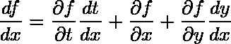

对于一个三变量函数 *f(t，x，y)* 。现在，如果我们把这个乘以 dx，我们会得到

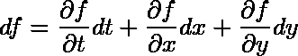

它是函数 *f* 的微分视图的表达式。它指出, *f* 中非常小的变化可以定义为变量中小变化的加权和，其中权重是函数相对于相同变量的偏导数。我们可以这样概括一个函数 *q* 和 *M* 变量

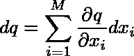

这是一种更简洁、更好的方式来看待它。快速明确地写出术语变得很乏味。另一方面，我们也得到一种简洁的方式来表示我们的全微分定义。再次坚持函数 *q* 和它的 *M* 变量。

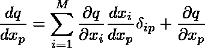

δᵢₚ在任何地方都被定义为 *1* ，除了在 *i=p* 的情况下，我们将其定义为 *0* 。我知道这不是很传统，但它是有效的，所以我将以这种方式使用 delta 函数。我这样做是因为

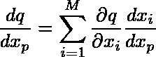

虽然是正确的，但并没有把重点放在，感兴趣的变量 xₚ的偏导数上，但这实际上是一个品味问题，对用法来说一点也不重要。

# 微积分的链式法则

在计算解析导数时，最常用的规则之一可能是链式法则。从数学上讲，它基本上表述如下

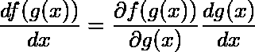

这看起来并不令人印象深刻，但不要让它的简单性欺骗了你。在梯度分析领域，它是无与伦比的主力。记住， *g(x)* 在这个设置中可以是任何东西。就此而言, *x* 也可以。因此，这条规则适用于与梯度有关的一切。

# 概率的链式法则

这里有一个关于命名的小注意事项。“链式法则”实际上也以“概率链式法则”或“一般乘积法则”的名义存在于概率中。我觉得后者更自然。无论如何，该规则规定如下

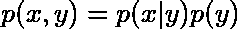

其中 *p* 是事件 *x* 和 *y* 的概率函数。这个规则可以通过迭代这个规则进一步推广到 *n 个*变量。请参见以下示例:

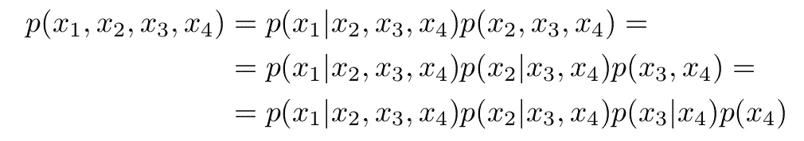

你可能会被原谅，因为你认为在应用这个规则时，变量的顺序有点重要，但当然这并不重要，因为我们所做的只是将概率空间分割成更小的独立小块。因此，在一个更紧凑的格式中，我们可以这样表达这个一般规则

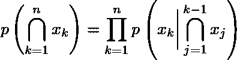

这里我们用了 n 个一般变量来表示我们的概率分布。现在谈谈我提出这个问题的原因。

> *概率的链式法则与微积分的链式法则无关。*

所以记住，如果你听到有人说出“链式法则”时，一定要想到上下文，因为没有上下文，它是很模糊的。

# 为深度神经网络构建您自己的反向传播引擎

在这一节，我将带你通过一个简单的多层感知器和反向传播算法的衍生物。有许多方法可以得出这一点，但我将从误差最小化方法开始，该方法基本上描述了神经网络 *f(* ***x*** *，****θ****)*与已知目标 *y* 的偏差的拟合。我们要解决的架构如下图所示，我们有两个隐藏层。为了简单起见，我们坚持这样做。我们也将只使用一个输出，而不是多个，但它很容易推广。

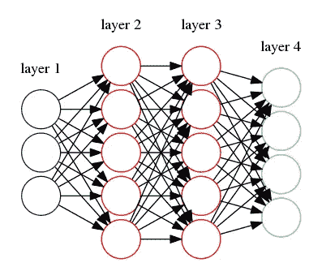

Illustration of a simple feed forward neural network with two layers.

我们不是用图形来表示我们的网络，而是用一种更正式的方式来表示，在这里，函数形式将以数学的方式来表述。基本上函数形式将是

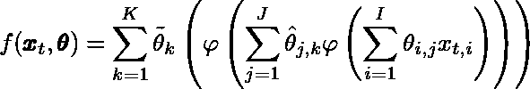

其中粗体符号表示向量。*φ(s)= 1/(1+exp(*-*a s))*函数是带有超参数 *a* 的 sigmoid 激活函数，我们在本介绍中不会对其进行调整或关心。这里有一个小注意，忽略这里的*和*参数是非常愚蠢的，因为它将从根本上改变这个网络的学习。我允许自己这么做的唯一原因是，这已经超出了本文的讨论范围。

为了训练神经网络，我们需要根据参数对我们看到的误差的影响程度来更新参数。对于数据点( **x** ₜ，yₜ).)的类似回归的问题，该误差可以这样定义

如果我们看倒数第二层，那么我们简单地根据下面的规则更新参数

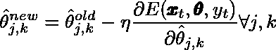

对于每个新的数据点。这叫随机梯度下降( [SGD](https://en.wikipedia.org/wiki/Stochastic_gradient_descent) )。你可以在很多地方读到这方面的很多内容，所以我在这里就不赘述了。只要说这个过程可以对每层中的每个参数重复就够了。因此，臭名昭著的[反向传播](https://en.wikipedia.org/wiki/Backpropagation)算法只是一个应用，通过误差对参数的偏导数来更新参数。现在自己做偏导数，看看你能有多容易推导出来。你可以使用的一个小技巧是认识到 *φ '(s)=φ(s)(1-φ(s))* 这里我使用了导数的素数符号。这里有一个很好的关于如何在数字上做这件事的教程。

# 带回家的信息

*   全导数和偏导数是相关的，但有时根本不同。
*   所有约束和变量替换必须在计算偏导数之前**完成。**
*   偏导数忽略了隐含的依赖性。
*   总导数考虑了所有的相关性。
*   许多神奇的配方，像反向传播算法，通常来自于非常简单的想法，自己动手做确实是有指导意义和有用的。

*最初发表于*[*doktormike . github . io*](http://doktormike.github.io/blog/A-quick-introduction-to-derivatives-for-machine-learning-people/)*。*