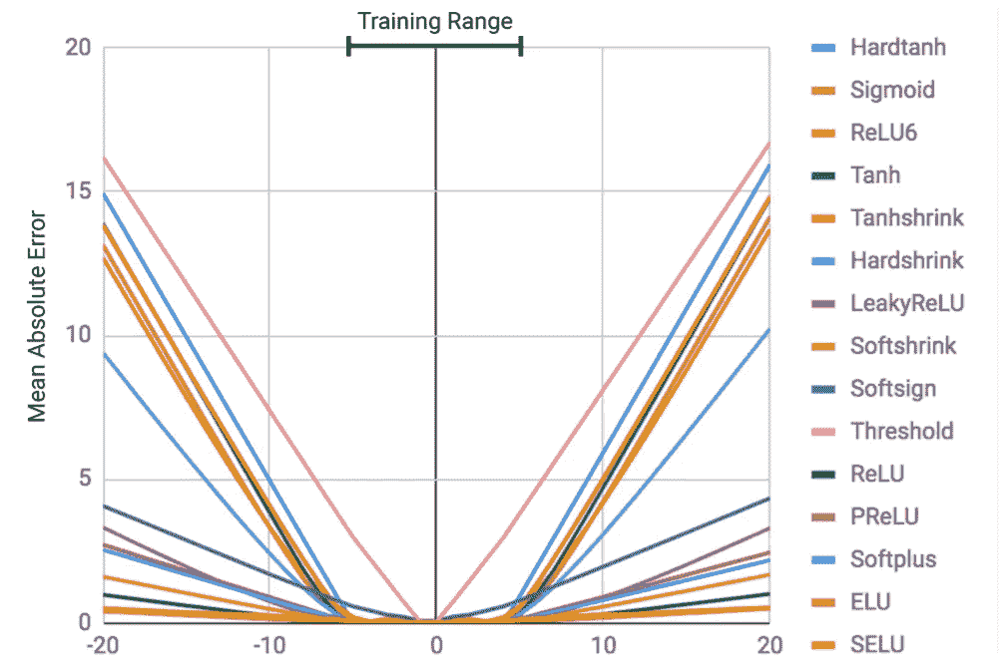
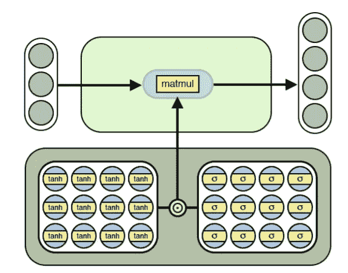
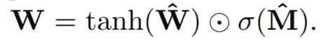
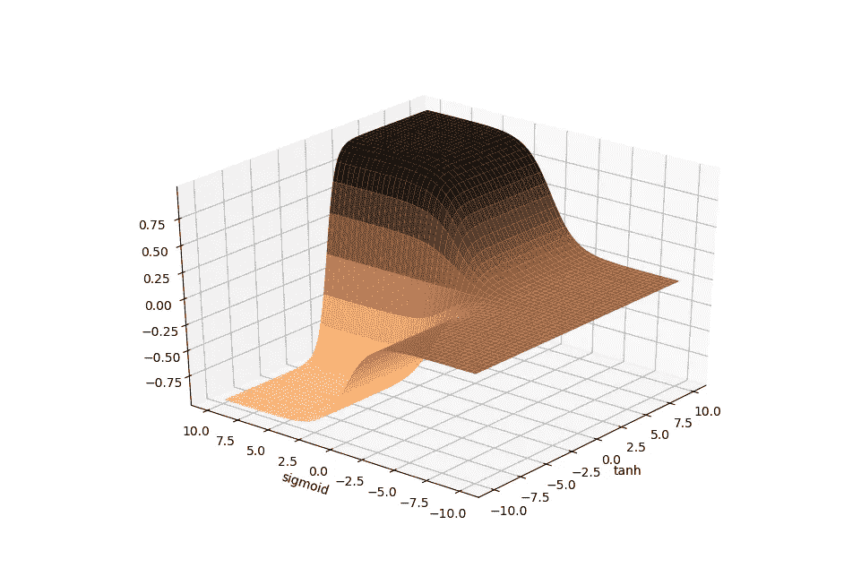
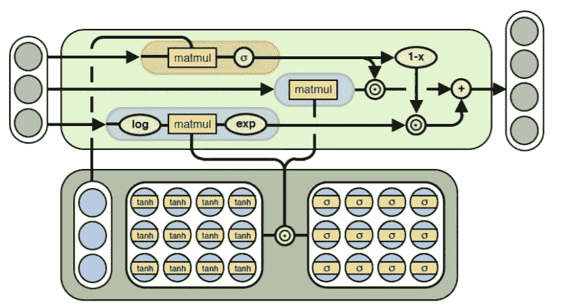
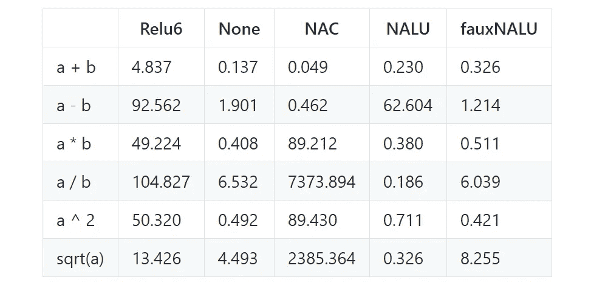

# 神经算术逻辑单元快速介绍

> 原文：<https://towardsdatascience.com/a-quick-introduction-to-neural-arithmetic-logic-units-288da7e259d7?source=collection_archive---------14----------------------->


(Credit: [aitoff](https://pixabay.com/en/users/aitoff-388338/))

经典的神经网络非常灵活，但是它们不太适合某些任务。特别是一些算术运算，对神经网络来说是个挑战。这就是为什么 Trask 等人在他们的论文[神经算术逻辑单元](https://arxiv.org/pdf/1808.00508.pdf)中介绍了两个新模块，这两个模块旨在很好地执行某些算术任务。在这篇博文中，我将描述本文旨在解决的问题，提出的解决方案，并讨论使用 PyTorch 的实现细节和结果再现。

## 所以你想学习恒等函数？

对于神经网络来说，这听起来是一个足够简单的任务，对吗？如果我们的测试集和我们的训练集在同一个范围内，那就是这样。然而，一旦我们的测试数据超出训练范围，大多数神经网络就会失败。这个失败揭示了一个令人不安的事实:理论上，多层感知器能够表示任何连续的函数，但架构、训练数据和学习时间表的选择将严重偏离 MLP 最终学习的函数。Trask 等人用下图有效地说明了这一失败:



Failure of MLPs to learn the identity function. (Credit: Trask et al)

为了克服这些限制，该论文建议使用两个新模块:神经累加器(NAC)和神经算术逻辑单元(NALU)。让我们看看它们是什么，以及它们背后的数学原理。

## 南汽和 NALU

先说 NAC:



NAC (Credit: Trask et al)

正如我们在上面看到的，NAC 类似于线性变换，但我们使用的权重矩阵是两个学习矩阵的结果，我们在将它们按元素相乘之前对其应用了`tanh`和`sigmoid`:



为什么要这么麻烦？这如何帮助我们的网络正确地学习算术函数？让我们来看看下图:



tanh(x) * sigmoid(y)

我们可以看到权重向量的值偏向 0、1 和-1。这意味着 NAC 的输出是输入向量的加法和减法，而不是缩放。这允许 NAC 无限地堆叠在一起，并且仍然保持输入表示的一致缩放。这对于学习处理加减的算术运算显然是有帮助的，但对于乘除就不行了。

这就是 NALU 的用武之地:



NALU (Credit: Trask et al)

NALU 使用 NAC 作为子单元，并增加两个额外的信息流。第一个使用 NAC 在对数空间中操作，第二个用作学习门，计算标准 NAC 和对数空间 NAC 之间的加权和。这在理论上应该允许 NALU 学习诸如乘法和除法以及加法和减法之类的功能。

## 闲聊够了，让我们看看代码！

NAC 和 NALU 的实现相当简单。你可以看看 [GitHub 回购](https://github.com/vrxacs/NALU)，但我会在这里回顾重要的部分。首先，我们将从 NAC 开始:

```
class NAC(Module):    
  def __init__(self, n_in, n_out):
    super().__init__()
    self.W_hat = Parameter(torch.Tensor(n_out, n_in))
    self.M_hat = Parameter(torch.Tensor(n_out, n_in))
    self.reset_parameters() def reset_parameters(self):
    init.kaiming_uniform_(self.W_hat)         
    init.kaiming_uniform_(self.M_hat) def forward(self, input):
    weights = torch.tanh(self.W_hat) * torch.sigmoid(self.M_hat)
    return F.linear(input, weights)
```

代码应该是不言自明的。我们首先对 PyTorch 的`Module`进行子类化。在初始化步骤中，我们将两个学习到的矩阵`W_hat`和`M_hat`定义为`Parameters`，并使用初始化对它们进行初始化。在向前的步骤中，在我们将`W_hat`和`M_hat`相乘之前，我们通过`tanh`和`sigmoid`传递它们。然后，我们获取生成的矩阵，并使用它和单元的输入执行线性变换。这就是你拥有的:一个全功能的 NAC 模块！

在我们转向 NALU 实现之前，重要的是要强调这样一个事实，即在上面的代码中只有两个学习过的矩阵。被传递到线性变换中的矩阵没有被训练，只是实际学习的矩阵`W_hat`和`M_hat`的数学运算的结果。当 NALU 的论文第一次出现时，许多 PyTorch 实现将最终重量作为参数，[这将它们的 NAC 变成简单的线性层](https://github.com/vrxacs/NALU/blob/master/fauxNAC.ipynb)。这些**我称之为 FauxNALUs** ，成为一项意外消融研究，我将在下一节讨论它们的意义。

在我们到达那里之前，我们仍然需要看一看 NALU 的实现:

```
class NALU(Module):    
  def __init__(self, n_in, n_out):
    super().__init__()        
    self.NAC = NAC(n_in, n_out)        
    self.G = Parameter(torch.Tensor(1, n_in))        
    self.eps = 1e-6        
    self.reset_parameters()          def reset_parameters(self):        
    init.kaiming_uniform_(self.G)          def forward(self, input):        
    g = torch.sigmoid(F.linear(input, self.G))        
    y1 = g * self.NAC(input)        
    y2 = (1 - g) * 
         torch.exp(self.NAC(torch.log(torch.abs(input) + self.eps)))
    return y1 + y2
```

我们首先定义 NAC 和学习门矩阵，并初始化它们。在前面的步骤中，我们首先通过对输入和门矩阵进行线性变换来计算门值`G`。然后，我们计算标准 NAC 输出和对数空间 NAC 输出，然后返回它们的加权和。值得注意的是，在计算 log-space NAC 时，我们需要向`log`函数传递一个小的 epsilon 值，以避免任何未定义的行为。

## 数学课时间到了

现在我们知道了 NALUs 背后的理论以及如何在 PyTorch 中实现它们，剩下的就是实际观察它们的运行了。我们将尝试使用基于 [kevinzakka 的代码](https://github.com/kevinzakka/NALU-pytorch)的脚本来重现论文中函数学习部分的结果，我已经修改了这些脚本，在这里加入了 FauxNALU [的代码](https://github.com/vrxacs/NALU-pytorch)。函数学习测试的想法是，我们将提供符合特定函数(加、减、除、平方根等)的随机生成的输入数据，然后测试我们的 MLP 是否能够正确地学习算术函数:



从这些结果中可以得出以下几点:

*   **NAC** 在加法和减法方面表现惊人，但在乘法、除法和幂函数方面表现糟糕。这是有意义的，因为当它必须学习其他函数时，使它强大的加法(没有输入的任意缩放)的同样的东西极大地限制了它。
*   除了减法之外，NALU 在其他方面都表现得很好。鉴于 **NAC** 和 **FauxNALU** 在减法上表现良好，这表明 log gate 和 **NAC** 在减法用例中以某种方式相互干扰。
*   FauxNALU 的结果最有趣。它的表现与 **None** MLP(仅使用线性的那种)一样好，这表明学习门本身对学习这些功能没有帮助。在学习除法和平方根方面，NALU 决定性地击败了 T21**,这表明对数空间 NAC 和标准 NAC 的结合真正发挥了作用。**

## 就这些了，伙计们！

NAC 和 NALU 当然是有趣的模块，尽管他们在我们所研究的玩具问题上表现不一。只有时间和进一步的实验才能告诉我们这些专门的模块是否会成为机器学习实践者常规工具箱的一部分。有一件事是肯定的:我们可以通过巧妙定义权重矩阵和使用门来设计具有特定偏好的模块，这一想法将继续存在，我们将看到许多其他模块利用这一点。

感谢阅读！如有任何问题或建议，欢迎留言或推文 [@AlexievValeri](https://twitter.com/AlexievValeri) 。