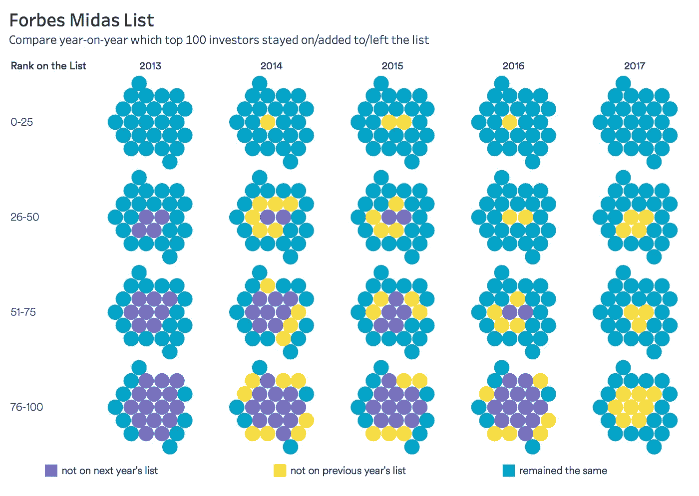
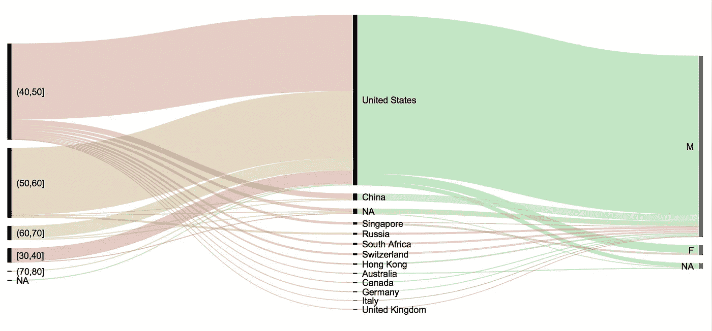
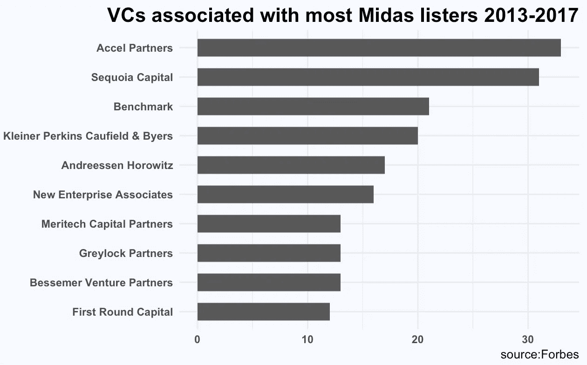
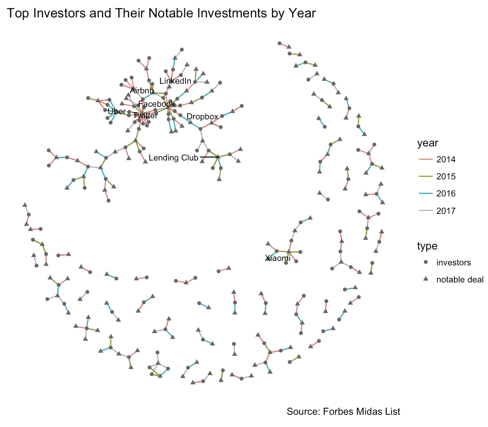
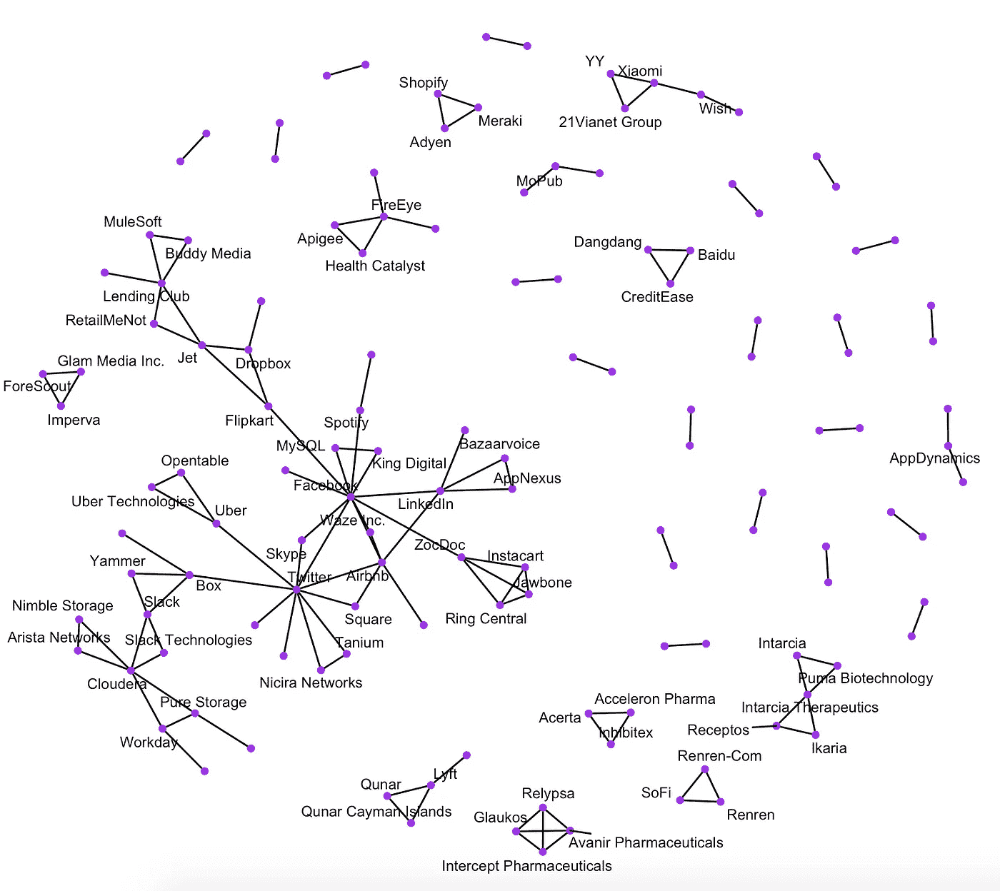

# 快速浏览 100 位顶级风险投资家的名单

> 原文：<https://towardsdatascience.com/a-quick-look-at-the-evolving-list-of-top-100-venture-capitalists-7064a8bf559a?source=collection_archive---------4----------------------->

《福布斯》每年都会发布一份 100 位风险投资家的“迈达斯排行榜”,列出全球顶尖的科技投资者。虽然对这份名单的含义有健康的批评，但任何过分美化的衡量也可能引发问题。我将只关注数据方面，而不是含义，并试图回答这些问题:

*   每年名单上的新进者和退出者是谁？
*   迈达斯·李斯特的典型特征是什么？
*   与之相关的常见风投有哪些？
*   哪些公司是由名单上的相同投资者投资的？

**进化名单**

平均每年，18%的 Midas lister 将在明年退出榜单，16%将是新进者(不在去年的榜单上)，其余的将留在排名榜上。

2013/2017 don’t have complete prior/next year data for comparison. Click for detailed names

显然，排名越靠后，列表就越有可能发生变化。

**人口统计**

基于过去 4 年的数据和相对完整的生物数据，通过按年龄、国家和性别分类，我们得到了 Midas lister 大部分是 40 岁的美国人的照片。

**与 Midas listers 相关的顶级风投和投资**

#num of times VCs are associated with Midas listers

这些是每年 Midas 排行榜上有显著交易的投资者。

**由同一个迈达斯·李斯特投资的公司**

这是我关于数据科学和视觉故事的[# 100 日项目](https://medium.com/@yanhann10)的第 68 天。我去度假了几天。完整代码在我的 [github](https://github.com/yanhann10/opendata_viz) 上。感谢阅读。欢迎新主题的建议和反馈。