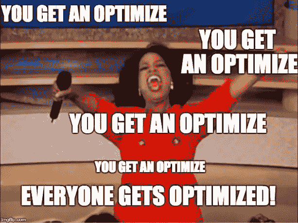
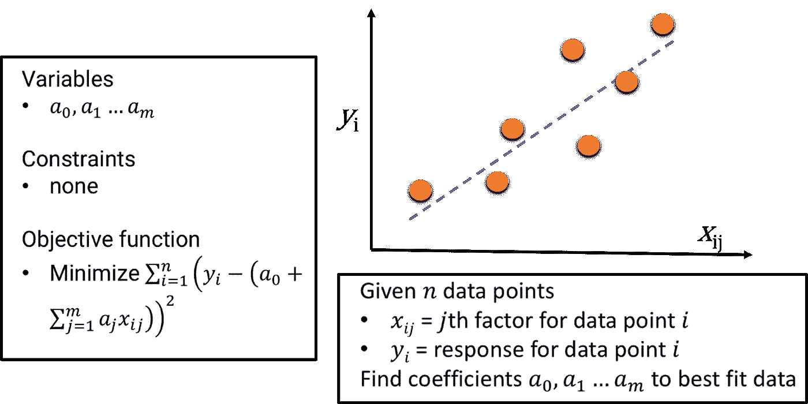
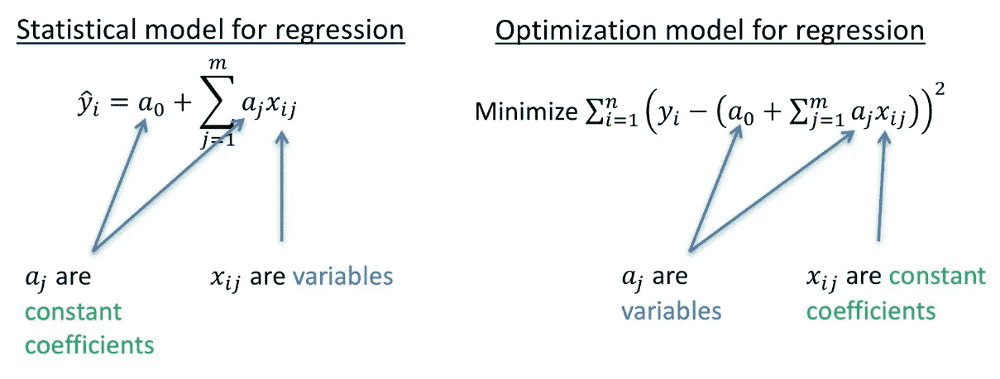
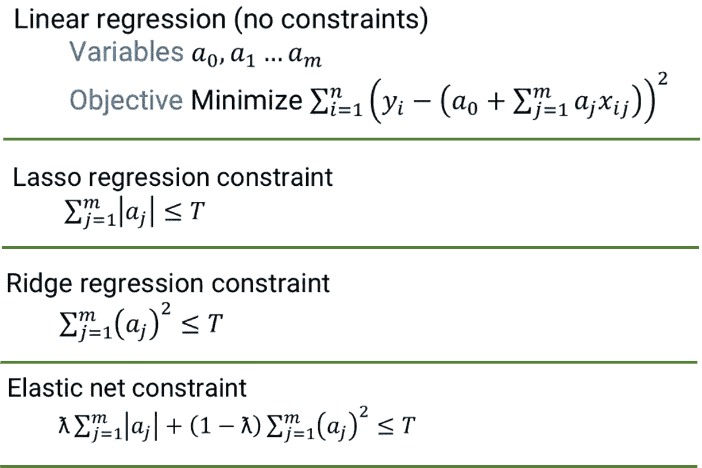
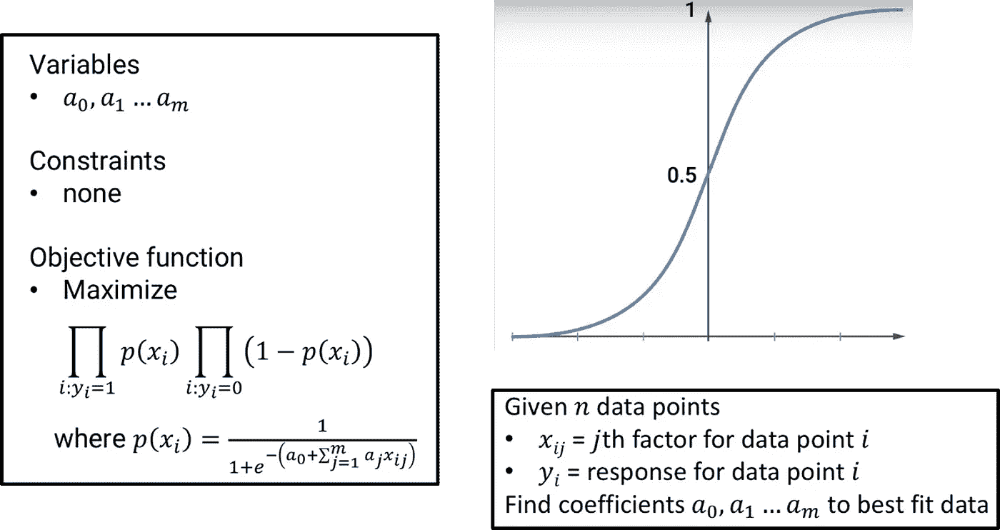
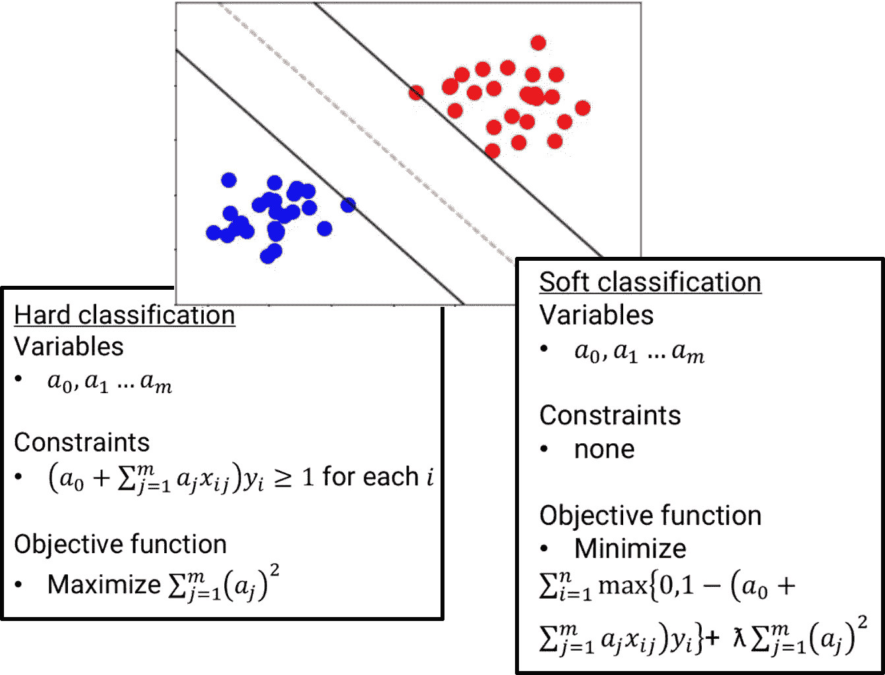
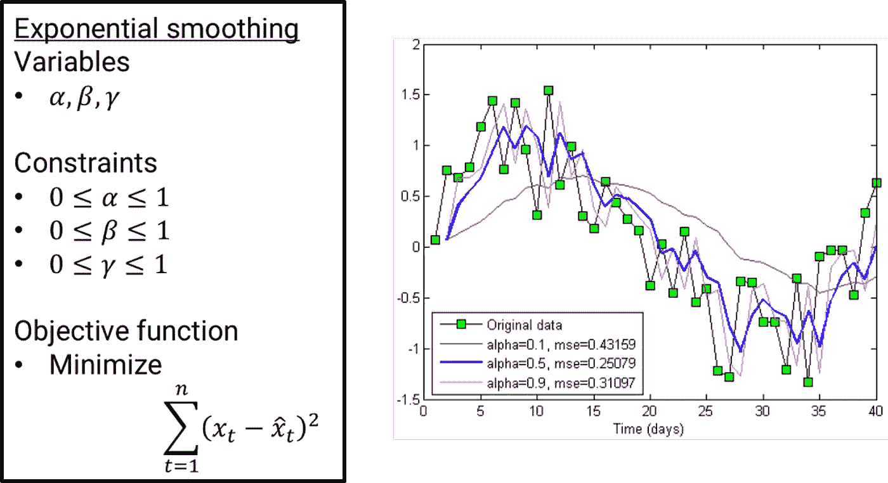
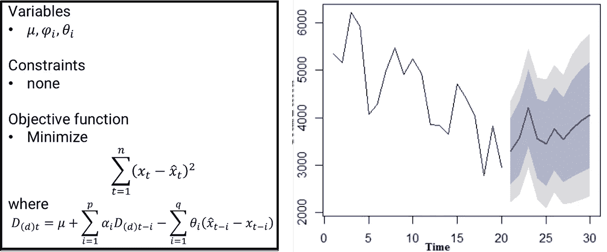
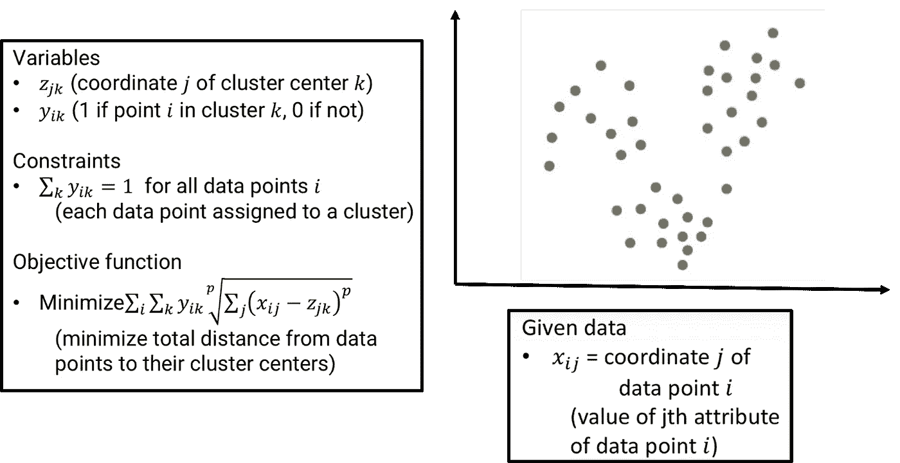
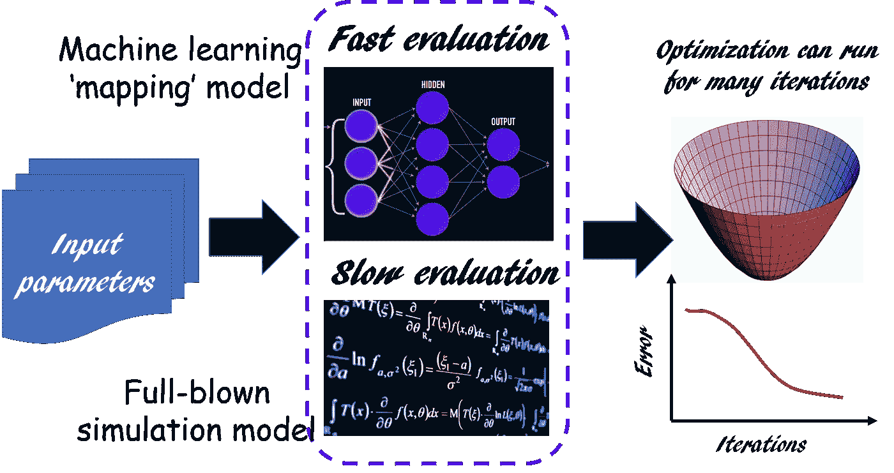

# 下面是什么？机器学习的核心是优化

> 原文：<https://towardsdatascience.com/a-quick-overview-of-optimization-models-for-machine-learning-and-statistics-38e3a7d13138?source=collection_archive---------5----------------------->

## 优化是数据科学中几乎所有机器学习和统计技术的核心。我们讨论最流行的机器学习/统计建模方法背后的核心优化框架。

**免责声明**:本文中的许多方程和优化形式化，均来源于 [**佐治亚理工学院在线分析硕士(OMSA)**](https://www.gatech.edu/academics/degrees/masters/analytics-online-degree-oms-analytics) 项目学习资料。我很自豪能继续这个优秀的在线硕士项目。你也可以[在这里查看详情。](http://catalog.gatech.edu/programs/analytics-ms/#onlinetext)

# 介绍

通常，数据科学(DS)和机器学习(ML)的新手会被建议尽可能地学习统计学和线性代数。对于 DS/ML 领域的成功职业生涯来说，这两个学科的坚实基础的效用是毋庸置疑的。然而，**优化**这个话题，虽然不太出名，但对任何数据科学和分析的严肃从业者来说都同样重要。

> 委婉地说，如果没有很好地理解这个话题，我们对数据驱动的文化和生活的现代世界观仍然是不完整的。

这是因为[优化是每一个主要商业、社会、经济](http://www.mit.edu/~dbertsim/papers/Robust%20Optimization/Robust%20and%20data-driven%20optimization-%20modern%20decision-making%20under%20uncertainty.pdf)的核心，我敢说*-*-[个人决策](https://en.wikipedia.org/wiki/Stable_marriage_problem)，由个人、集体代表或[智能机器和软件代理](https://ai.google/research/teams/algorithms-optimization/)做出。

# 日常例子

你整天都在优化变量和基于你的个人决定，大多数时候甚至没有意识到这个过程—

*   安排回复邮件的顺序
*   切换到回家的新路线，以尽量减少交通问题
*   努力挤出午餐和下午会议之间的最佳间隙，在办公区周围安静地散步

听起来很熟悉？在这里阅读有趣的插图…

 [## 如何使用算法解决日常问题

### 借鉴计算机科学，优先级队列可以用来优化去杂货店的行程。插图…

mitsloan.mit.edu](http://mitsloan.mit.edu/newsroom/articles/how-to-use-algorithms-to-solve-everyday-problems/) 

每一个看似个人的决定都可以用冷酷、困难的数学精确建模，以显示我们的大脑是一个惊人的优化器，整天解决这些计算复杂的问题！

但是，离开个人领域，现在谈谈关于数据科学的问题…

# 优化对数据科学有多重要？

极其重要。

基础科学、商业组织和工程企业长期以来一直在使用优化技术和方法。从这个意义上来说，**几乎每一个工程产品都是优化问题**的解的紧凑物理(或虚拟)形式。工程师经过专门培训，能够在资源有限的情况下工作，并从不完整或有噪声的数据或输入中产生足够好的解决方案(T2)。本质上，他们每天都在用计算机、半导体集成电路、熔炉或内燃机解决优化问题。

商业组织也是如此。事实上，在时间、预算、空间以及法律和道德界限的约束下，每个商业决策的目标都是最大化某种形式的收益(例如利润率或知识产权领导地位)。[这些都是某种形式的优化问题或其他](https://simplicable.com/new/business-optimization)。

 [## 成为数据驱动或灭亡:为什么你的公司需要一个数据战略，而不只是更多的数据人

### 在过去的 14 年里，我一直以这样或那样的方式处理数据。我一开始是做管理信息的…

towardsdatascience.com](/become-data-driven-or-perish-why-your-company-needs-a-data-strategy-and-not-just-more-data-people-aa5d435c2f9) 

今天，几乎所有的业务和技术都受到数据科学和机器学习的出现所带来的新范式变化的影响。然而，这并没有改变这样一个事实:基本的自然资源和人力资源仍然是有限的。**一天还有 24 小时。法律和道德界限不会很快消失。**

人工智能或机器学习的先进技术可能能够以更快的速度引导企业走向更好的最优解决方案，但他们**必须面对和解决与之前**相同(或更复杂)的优化问题。大量的新数据将有助于这一过程，但随着时间的推移，人们的期望值也会提高。

> 举一个非常简单的例子，如果在过去，一个工程团队可以访问 1 GB 的数据，并可以以 10 美元的成本产生一个最佳解决方案，那么如果给我一个“更丰富”的 10 GB 数据集，他们将会把成本降低到 7 美元。不然大数据有什么意义？

**Source**: Timo Elliott’s Blog ([https://timoelliott.com/blog/2017/06/from-understanding-big-data-to-monetizing-it.html](https://timoelliott.com/blog/2017/06/from-understanding-big-data-to-monetizing-it.html))

因此，对于数据科学/机器学习从业者来说，对常用统计/机器学习算法所使用的优化框架的理论基础有充分的了解是至关重要的

*   *如何有效利用数据*，
*   *如何估算处理大型数据集的计算量*，
*   *如何避免局部极小，从复杂的多维空间中搜索到好的解。*

在我关于数据科学的基本数学背景的文章中，我讨论了优化的作用和一些在线课程，你可以很好地掌握这个主题。在这里阅读。

 [## 数据科学的基本数学——“为什么”和“如何”

### 数学是科学的基础。我们讨论了成为更好的数据科学家需要掌握的基本数学主题…

towardsdatascience.com](/essential-math-for-data-science-why-and-how-e88271367fbd) 

## 优化的基本要素

任何优化问题都有三个基本要素-

*   **变量**:这些是算法可以调整的自由参数
*   **约束**:这些是参数(或其组合)必须落入的边界
*   **目标函数**:这是算法驱动解决方案的一组目标。对于机器学习来说，这通常相当于最小化一些误差度量或者最大化一些效用函数。

本文的其余部分集中于一些基本的、广泛使用的统计模型和 ML 算法，并展示了具有上述元素的优化框架。

## 简单线性回归

此外，从两个角度来看，请注意回归中的以下区别:

## 正则线性回归

## 逻辑回归

## 支持向量机

## 时间序列分析—指数平滑

## 时间序列分析— ARIMA

## *K*-表示聚类

## 深度学习/神经网络

大多数神经网络通过反向传播技术优化神经元之间连接的权重来工作。[采用先进的优化方法](/types-of-optimization-algorithms-used-in-neural-networks-and-ways-to-optimize-gradient-95ae5d39529f)以确保找到一个高收敛概率的好解。

**Image source**: [Types of Optimization Algorithms used in Neural Networks and Ways to Optimize Gradient Descent](/types-of-optimization-algorithms-used-in-neural-networks-and-ways-to-optimize-gradient-95ae5d39529f)

## 强化学习

RL 是任何现代人工智能代理/系统的核心。如果你听说过谷歌著名的 [AlphaGo 程序，它在古代棋盘游戏围棋中击败了最好的人类冠军，你可以确信在所有这些“机器智能”背后有一些真正先进的优化技术。](https://deepmind.com/research/alphago/)

 [## 用 Q-Learning 从零开始解决 MDP 问题——黑客的深度强化学习(第 1 部分)

### 是时候学习价值函数、贝尔曼方程和 Q 学习了。你将利用所有的知识…

medium.com](https://medium.com/@curiousily/solving-an-mdp-with-q-learning-from-scratch-deep-reinforcement-learning-for-hackers-part-1-45d1d360c120) 

## 稍微绕了一下——利用机器学习进行优化

可能会有令人兴奋的优化问题，*使用*机器学习作为前端来创建模型/目标函数，与其他方法相比，该函数可以更快地进行评估/计算。这当然不同于本文的主要讨论点。但还是展示了最优化和机器学习之间错综复杂的相互作用。

作为说明，优化框架中的更新公式(例如梯度下降)可以使用神经网络来代替复杂的函数。

 [## 通过强化学习学习优化

### 自从我们去年发表了关于“学习优化”的文章后，优化程序学习领域得到了越来越多的关注…

bair.berkeley.edu](https://bair.berkeley.edu/blog/2017/09/12/learning-to-optimize-with-rl/) 

这种方法的应用之一是**在优化循环**中用机器学习映射功能取代耗时的模拟模型，在优化循环中，成千上万的输入变量被输入到模拟模型中，我们希望以某种方式找到最佳模拟输出的优化参数集。这个想法如下图所示，

## 总结和其他方法

在本文中，我们讨论了优化在现代商业和工程企业中的一般作用，以及为什么了解优化对于数据科学变得至关重要。

我们展示了基本的优化模型，它是一些广泛流行的统计技术和机器学习算法的核心。

通过一些简单的搜索，你会在其他流行的 ML 方法的核心找到类似的优化框架，

*   [**期望最大化**](http://cs229.stanford.edu/notes/cs229-notes8.pdf)
*   深度学习/神经网络( [**梯度下降如何工作**](/types-of-optimization-algorithms-used-in-neural-networks-and-ways-to-optimize-gradient-95ae5d39529f) )
*   [**遗传算法**](https://www.kdnuggets.com/2018/03/introduction-optimization-with-genetic-algorithm.html)
*   [**模拟退火**](http://katrinaeg.com/simulated-annealing.html)

如果您有任何问题或想法要分享，请联系作者在[**tirthajyoti【AT】Gmail . com**](mailto:tirthajyoti@gmail.com)。此外，您可以查看作者的 [**GitHub 资源库**](https://github.com/tirthajyoti?tab=repositories) 中其他有趣的 Python、R 或 MATLAB 代码片段和机器学习资源。如果你像我一样对机器学习/数据科学充满热情，请随时[在 LinkedIn 上添加我](https://www.linkedin.com/in/tirthajyoti-sarkar-2127aa7/)或[在 Twitter 上关注我。](https://twitter.com/tirthajyotiS)

 [## Tirthajyoti Sarkar - Sr .首席工程师-半导体设计、人工智能、机器学习- ON…

### 查看 Tirthajyoti Sarkar 在世界上最大的职业社区 LinkedIn 上的个人资料。](https://www.linkedin.com/in/tirthajyoti-sarkar-2127aa7/)