# 基于简历自动摘要的命名实体识别(NER)综述

> 原文：<https://towardsdatascience.com/a-review-of-named-entity-recognition-ner-using-automatic-summarization-of-resumes-5248a75de175?source=collection_archive---------2----------------------->

了解什么是 NER，以及它是如何在行业中使用的，NER 的各种图书馆，使用 NER 进行简历汇总的代码演练。


这篇博客讲述了自然语言处理(NLP)和信息检索(IR)中的一个领域，称为命名实体识别，以及我们如何通过只提取姓名、教育背景、技能等主要实体来应用它自动生成简历摘要。

# 什么是命名实体识别？

**命名实体识别** ( **NER** )(也称为**实体识别**、**实体分块**和**实体提取**)是信息提取的子任务，其寻求将文本中的命名实体定位并分类到预定义的类别中，例如人名、组织、位置、时间表达式、数量、货币值、百分比等。

已经创建了使用基于语言语法的技术以及诸如机器学习的统计模型的 NER 系统。手工制作的基于语法的系统通常可以获得更好的精度，但代价是较低的召回率和经验丰富的计算语言学家数月的工作。统计 NER 系统通常需要大量人工标注的训练数据。有人建议采用半监督方法来避免部分注释工作。

# 最先进的 NER 模型

## 斯帕西·NER 模型:

作为一个免费的开源库，spaCy 使得 Python 中的高级自然语言处理(NLP)变得更加简单。

spaCy 为 python 中的命名实体识别提供了一个非常有效的统计系统，它可以将标签分配给连续的标记组。它提供了一个默认模型，可以识别各种命名或数字实体，包括公司名称、位置、组织、产品名称等等。除了这些默认的实体之外，spaCy 还支持向实体识别模型中添加任意的类，方法是通过训练模型用更新的训练样本来更新它。

**模型架构:**

spaCy 中的统计模型是定制设计的，提供了速度和准确性的卓越性能组合。目前使用的架构尚未发布，但以下视频概述了该模型如何工作，主要关注 NER 模型。

## 斯坦福命名实体识别器:

斯坦福 NER 是一个命名实体识别器，用 Java 实现。它提供了一个默认的训练模型，用于识别主要实体，如组织、个人和位置。除此之外，还提供了针对不同语言和环境的各种模型。

**模型架构:**

斯坦福 NER 也被称为 CRF(条件随机场)分类器，因为线性链条件随机场(CRF)序列模型已经在软件中实现。我们可以为各种应用使用我们自己的标记数据集来训练我们自己的定制模型。

CRF 模型最初是由 Lafferty，McCallum 和 Pereira (2001) 首创的；详细易懂的介绍请参见[萨顿和麦卡勒姆(2006)](http://people.cs.umass.edu/~mccallum/papers/crf-tutorial.pdf) 或[萨顿和麦卡勒姆(2010)](http://arxiv.org/pdf/1011.4088v1) 。

# NER 模型的使用案例

命名实体识别在自然语言处理和信息检索领域有着广泛的应用。下面列举了几个这样的例子:

## 自动汇总简历:


各个公司的人力资源部门面临的一个关键挑战是评估一大堆简历以筛选候选人。为了增加他们的负担，申请人的简历经常被过分详细地填充，其中大部分信息与评估者寻求的无关。为了简化这一过程，通过我们的 NER 模型，我们可以快速评估简历，从而简化从一堆简历中筛选候选人的工作。

## 优化搜索引擎算法:


为了设计搜索引擎算法，更有效的方法是对文章运行一次 NER 模型，并永久存储与其相关的实体，而不是在数百万篇文章和网站中搜索输入的查询。然后，可以将搜索查询中的关键标签与和网站文章相关联的标签进行比较，以进行快速有效的搜索。

## 为推荐系统供电:


NER 可以用于开发推荐系统的算法，该算法可以自动过滤我们可能感兴趣的相关内容，并根据我们以前的行为相应地指导我们发现相关的和未访问的相关内容。这可以通过提取与我们的历史或先前活动中的内容相关联的实体，并将它们与分配给其他看不见的内容的标签进行比较，以过滤相关的内容来实现。

## 简化客户支持:


NER 可用于识别客户投诉和反馈中的相关实体，如产品规格、部门或公司分支机构的详细信息，以便对反馈进行相应分类，并转发给负责已识别产品的适当部门。

我们将在接下来的章节中详细描述使用 NER 模型的简历汇总。

# 简历汇总的 NER

## 数据集:

当然，手头的第一项任务是创建手动标注的训练数据来训练模型。为此，从一个在线招聘平台下载了 220 份简历。这些文件被上传到 [Dataturks](https://dataturks.com/) 在线注释工具，并进行手动注释。

该工具自动解析文档，允许我们创建感兴趣的重要实体的注释，并生成 JSON 格式的训练数据，每行包含文本语料库和注释。

数据集的快照如下所示:

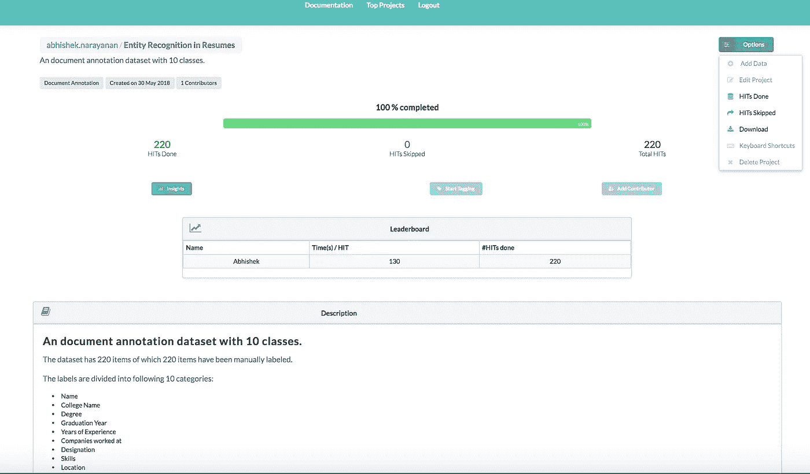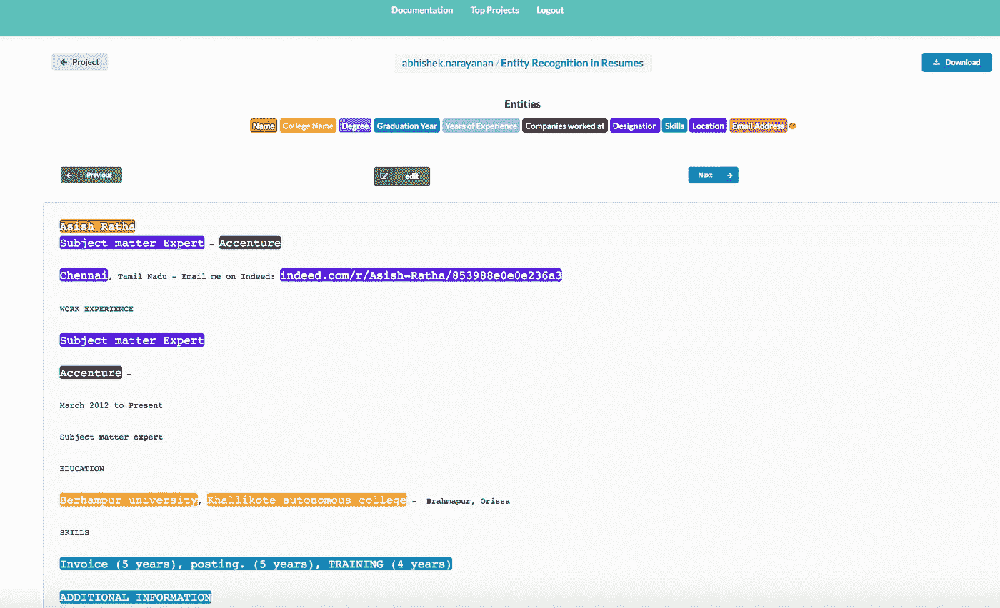

以上由 220 份带注释的简历组成的数据集可以在[这里](https://dataturks.com/projects/abhishek.narayanan/Entity%20Recognition%20in%20Resumes)找到。我们用 200 份简历数据训练模型，用 20 份简历数据进行测试。

## 使用 python 中的空间模型训练自定义模型:

**数据集格式:**

由 Dataturks 注释工具生成的 json 格式数据的一个示例提供给代码，如下所示:

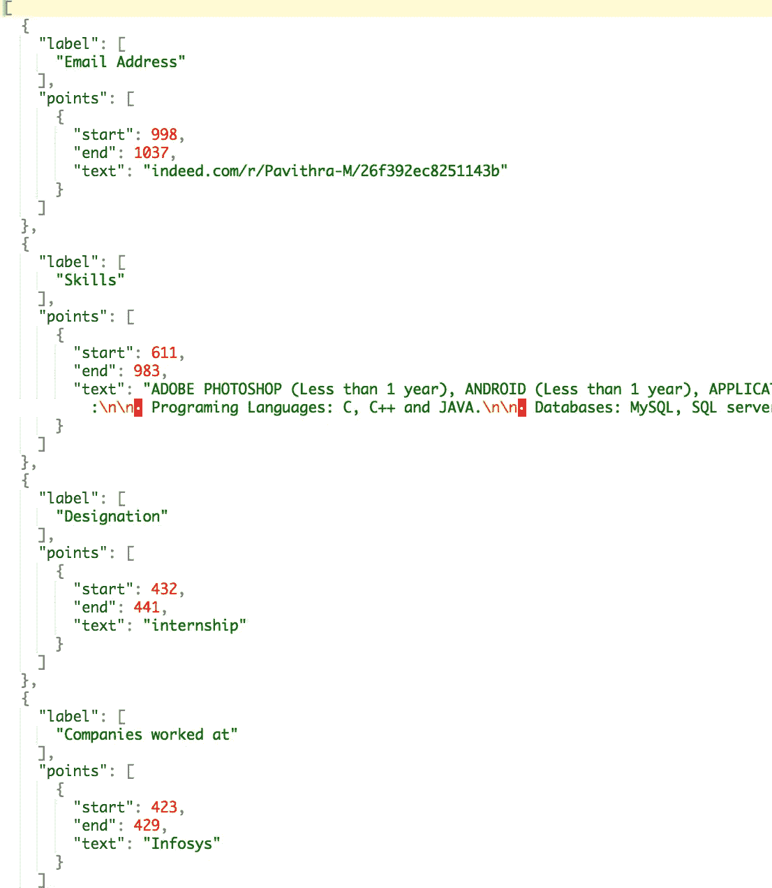

**训练模型:**

我们使用 python 的 spaCy 模块来训练 NER 模型。spaCy 的模型是**统计**的，他们做出的每一个“决定”——例如，分配哪个词性标签，或者一个词是否是命名实体——都是一个**预测**。这一预测基于模型在**训练**期间看到的例子。

然后向模型显示未标记的文本，并进行预测。因为我们知道正确的答案，所以我们可以以计算训练样本和预期输出之间的差异的**损失函数**的**误差梯度**的形式给出关于其预测的模型反馈。差异越大，梯度和模型更新就越显著。

当训练一个模型时，我们不仅仅希望它记住我们的例子——我们希望它能提出可以在其他例子中推广的理论。毕竟，我们不只是想让模型知道“亚马逊”的这个实例是一家公司——我们想让它知道，在像这样的的*环境中，“亚马逊”最有可能是一家公司。为了调整准确性，我们分批处理我们的训练示例，并对`[minibatch](https://spacy.io/api/top-level#util.minibatch)`大小和辍学率进行实验。*

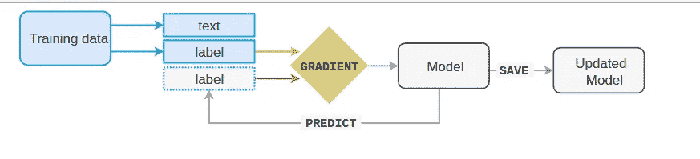

当然，仅仅向一个模型展示一个例子是不够的。特别是如果你只有很少的例子，你会想要训练一个**数量的迭代**。在每次迭代中，训练数据会被**打乱**，以确保模型不会基于示例的顺序做出任何概括。

另一种改善学习结果的技术是设置一个**退出率**，一个随机“丢弃”个别特征和表示的速率。这使得模型更难记住训练数据。例如，`0.25`丢弃意味着每个特性或内部表示有 1/4 的可能性被丢弃。我们对模型进行 10 个时期的训练，并保持辍学率为 0.2。

**下面是训练模型的代码片段:**

[](https://github.com/DataTurks-Engg/Entity-Recognition-In-Resumes-SpaCy) [## data Turks-Engg/Entity-Recognition-In-Resumes-SpaCy

### 通过在 GitHub 上创建一个帐户，为简历中的实体识别空间开发做出贡献。

github.com](https://github.com/DataTurks-Engg/Entity-Recognition-In-Resumes-SpaCy) 

**spaCy 模型的结果和评估:**

该模型在 20 份简历上进行了测试，预测的汇总简历被单独存储。每份简历的 txt 文件。

对于测试模型的每个简历，我们计算模型识别的每个实体的准确度分数、精确度、召回率和 f 分数。将每个实体的这些指标值相加并平均，以生成一个总分数，来评估由 20 份简历组成的测试数据上的模型。实体方面的评估结果如下所示。据观察，所获得的结果已经预测了值得称赞的准确性。

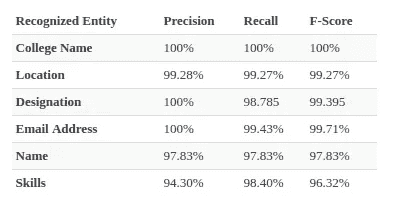

下面显示了通过我们的模型预测获得的一份来自 indeed.com 的员工的未公开简历的示例摘要:

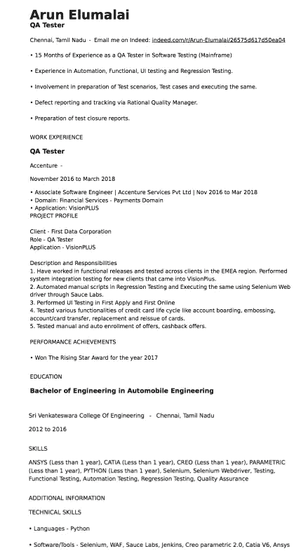

Resume of an Accenture employee obtained from indeed.com

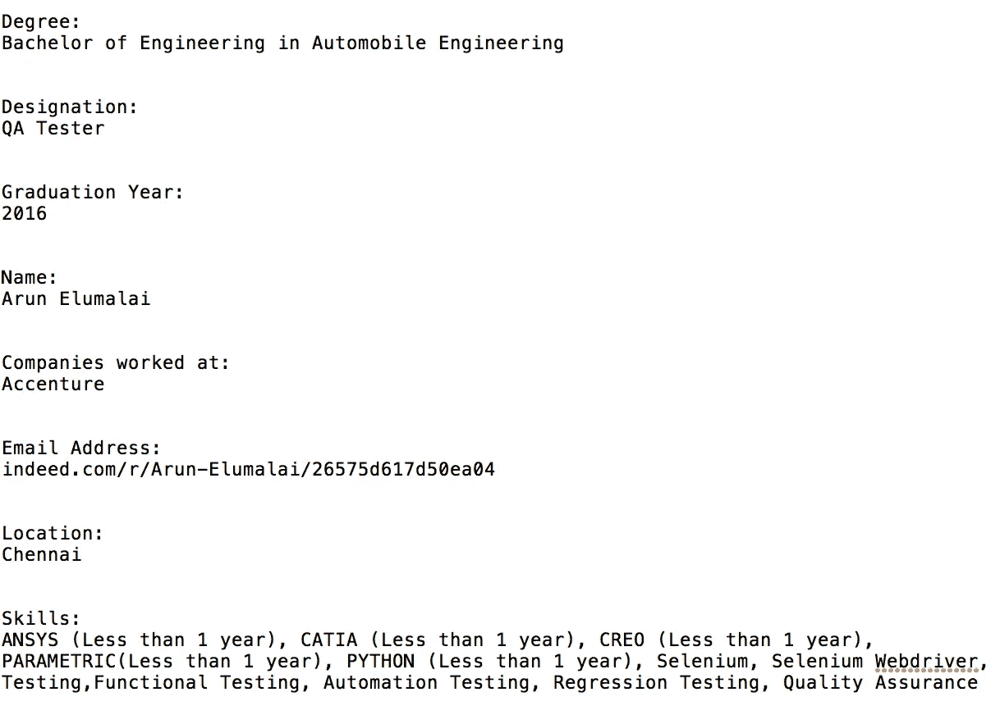

Summarized Resume as obtained in output

## 使用 Java 中的斯坦福 NER 模型来训练定制模型:

**数据集格式:**

用于训练的数据必须作为文本文件传递，以便每行包含一个单词-标签对，其中单词和标签标记由制表符空格“\t”分隔。对于一个文本文档，就像在我们的例子中，我们将文档标记为单词，并将每个单词和相关的标签添加到训练文件中。为了指示下一个文件的开始，我们在训练文件中添加一个空行。

以下是输入培训文件的示例:

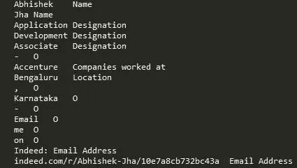

注意:每个单词都必须包含一个标签。这里，对于我们不关心的单词，我们使用标签 0。

**属性文件:**

Stanford CoreNLP 需要一个属性文件，其中包含构建定制模型所需的参数。例如，我们可以定义提取学习特征的方法，等等。以下是属性文件的示例:

```
# location of the training file
trainFile = ./standford_train.txt
# location where you would like to save (serialize) your
# classifier; adding .gz at the end automatically gzips the file,
# making it smaller, and faster to load
serializeTo = ner-model.ser.gz# structure of your training file; this tells the classifier that
# the word is in column 0 and the correct answer is in column 1
map = word=0,answer=1# This specifies the order of the CRF: order 1 means that features
# apply at most to a class pair of previous class and current class
# or current class and next class.
maxLeft=1# these are the features we'd like to train with
# some are discussed below, the rest can be
# understood by looking at NERFeatureFactory
useClassFeature=true
useWord=true
# word character ngrams will be included up to length 6 as prefixes
# and suffixes only
useNGrams=true
noMidNGrams=true
maxNGramLeng=6
usePrev=true
useNext=true
useDisjunctive=true
useSequences=true
usePrevSequences=true
# the last 4 properties deal with word shape features
useTypeSeqs=true
useTypeSeqs2=true
useTypeySequences=true
#wordShape=chris2useLC
wordShape=none
#useBoundarySequences=true
#useNeighborNGrams=true
#useTaggySequences=true
#printFeatures=true
#saveFeatureIndexToDisk = true
#useObservedSequencesOnly = true
#useWordPairs = true
```

**训练模型:**

斯坦福 CoreNLP 的首席类是`CRFClassifier`，拥有实际模型。在 Github 存储库中提供的代码中，我们提供了使用训练数据和属性文件来训练模型的代码，并将模型保存到磁盘，以避免每次训练所耗费的时间。下次我们使用该模型对一个看不见的文档进行预测时，我们只需从磁盘加载训练好的模型，并使用它进行分类。

输出中的第一列包含输入标记，而第二列引用正确的标签，第三列是分类器预测的标签。

**下面是训练模型并将其保存到磁盘的代码片段:**

[](https://github.com/DataTurks-Engg/Entity-Recognition-In-Resumes-StanfordNER/blob/master/StanfordCRFTagger.java) [## data Turks-Engg/Entity-Recognition-In-Resumes-Stanford ner

### 通过在 GitHub 上创建一个帐户，为 StanfordNER 的简历中的实体识别发展做出贡献。

github.com](https://github.com/DataTurks-Engg/Entity-Recognition-In-Resumes-StanfordNER/blob/master/StanfordCRFTagger.java) 

**斯坦福 NER 模型的结果和评估:**

该模型在 20 份简历上进行了测试，预测的汇总简历被单独存储。每份简历的 txt 文件。

对于测试模型的每个简历，我们计算模型识别的每个实体的准确度分数、精确度、召回率和 f 分数。将每个实体的这些指标值相加并平均，以生成一个总分数，来评估由 20 份简历组成的测试数据上的模型。实体方面的评估结果如下所示。据观察，所获得的结果已经预测了值得称赞的准确性。

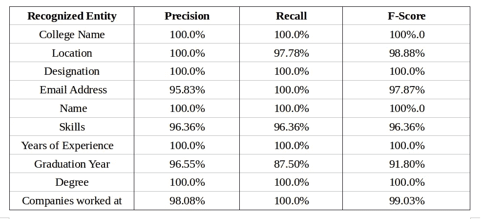

下面显示了通过我们的模型预测获得的一份来自 indeed.com 的员工的未公开简历的示例摘要:


A resume of an Accenture employee obtained from indeed.com

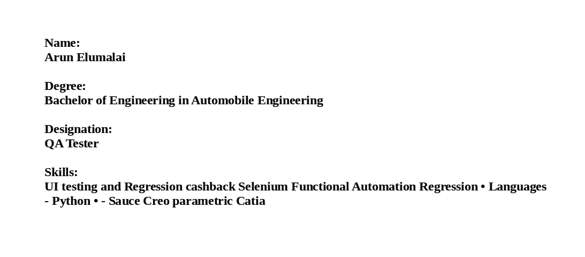

Summarized Resume as obtained in Output

# 斯帕西、斯坦福 NER 和最先进模型的比较；

现实世界简历文档中的绝大多数标记不是通常定义的实体名称的一部分，因此基线精度、召回率非常高，通常> 90%；按照这个逻辑，两个模型的实体精确召回值都相当不错。

从对模型的评估和观察到的结果来看，spaCy 在总结简历的任务上似乎优于斯坦福 NER。两种模型确定的实体的 F 分数审查如下:

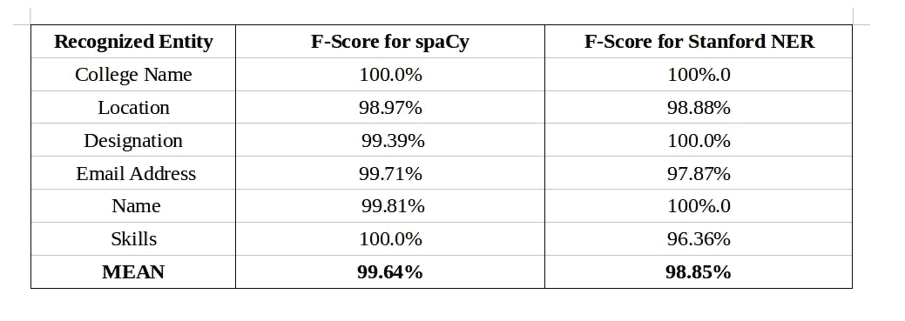

这是标有 NER 实体的简历[数据集。](https://dataturks.com/projects/abhishek.narayanan/Entity%20Recognition%20in%20Resumes)

用于训练 spaCy 模型的上述项目的 Python 代码可以在 github 存储库中的[这里](https://github.com/DataTurks-Engg/Entity-Recognition-In-Resumes)找到。

上述用于训练斯坦福 NER 模型的项目的 Java 代码可以在 GitHub 仓库的这里找到。

注意:这个博客是发表在 Dataturks 的 [NER 博客](https://dataturks.com/blog/named-entity-recognition-in-resumes.php)的扩展版本。