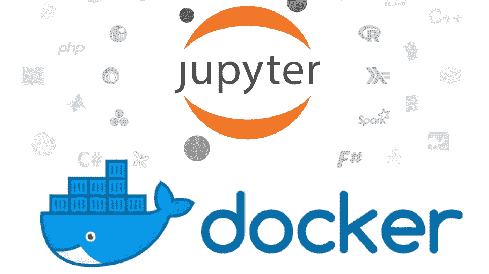
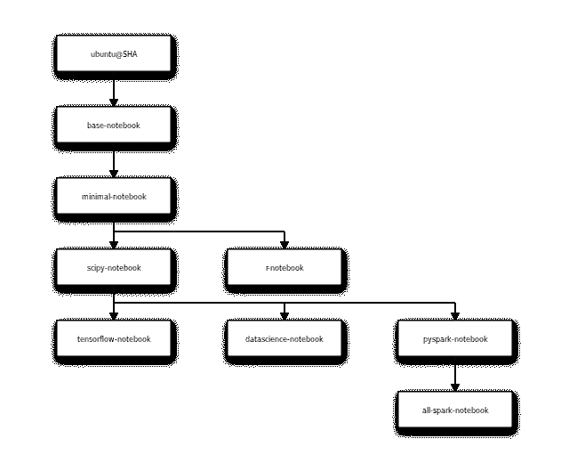

# 针对您的数据科学环境使用 Docker 的简短指南

> 原文：<https://towardsdatascience.com/a-short-guide-to-using-docker-for-your-data-science-environment-912617b3603e?source=collection_archive---------6----------------------->

## *告别 OS 烦恼，向便携性问好！*



Source : Docker + Jupyter teams

# 为什么

在新系统上开始工作/开始一项新工作或只是简单地分享您的工作，最耗时的部分之一是由于硬件/软件/安全策略等方面的差异而导致的可用工具的变化(或缺少工具)。[容器化](https://www.docker.com/resources/what-container)近年来兴起，作为一种现成的解决方案，可以解决各种应用程序的平台差异，从单用户开发环境(使用 docker 试用[*JetBrains*](https://www.jetbrains.com/help/idea/docker.html)*工具)到高度分布式的生产环境(例如[*Google Cloud*](https://cloud.google.com/containers)*、*[*Docker*](https://docs.docker.com/compose/bundles)*)。*在本文中，我们将介绍 Docker 作为我们的容器服务，以及开始为数据科学构建定制开发平台所需的步骤。*

*就个人而言，我认为使用 docker 的最大优势之一就是能够在他人的系统上进行构建。如果一个已经存在的环境满足您的所有需求，您可以简单地从克隆它开始，或者，您可以使用您的 [**dockerfile**](https://docs.docker.com/engine/reference/builder) 在它的基础上进行构建，使它对您的特定用例更加有用！*

# ***如何***

*让我们讨论几个场景:*

****方法 A:从您选择的 linux 发行版开始****

*假设您决定最好从头开始，即从您喜欢的 linux 发行版开始，安装适合您需要的所有软件。通过这种方式，您可以完全控制正在安装的每个软件，并且可以根据需要为每个工具安装特定的版本。这也可能给你最小的图像尺寸，因为你可以跳过任何你不需要的工具。下面显示了这种方法的几个示例 docker 文件:*

```
*# Using ubuntu 18.04 as base imageFROM ubuntu:18.04
RUN apt-get install python3-pip python3-dev && \
    ln -s /usr/bin/python3 /usr/local/bin/python && \
    pip3 install — upgrade pip*
```

*仅此而已。将它复制到一个空文件夹中的文件中，并使用 [docker build](https://docs.docker.com/engine/reference/commandline/build) 构建一个映像，以访问 ubuntu 中的基本 python3。*

*另一种构建映像的方法是使用 dockerhub 的官方 python 库[。您可以使用 *docker pull* 命令克隆一个映像:](https://hub.docker.com/r/_/python)*

```
*docker pull python*
```

****方法 B:使用已经安装了所有工具的可用映像****

*这就是我爱上使用 docker 进行日常工作的原因。Jupyter Docker Stacks 的工作人员已经创建了许多已经安装了不同工具的测试良好、功能齐全且随时可用的映像。从他们的文档中提取的依赖关系树如下所示:*

**

*Docker image tree by [***Jupyter Docker Stacks***](https://jupyter-docker-stacks.readthedocs.io) — Each child contains every tool in the parent image*

*使用这些图像或对它们稍加修改，对于大多数用例来说就足够了。要使用这些图像中的一个，只需使用“docker run”命令，如果图像不存在，它将被下载。*

```
*docker run -p 8888:8888 jupyter/scipy-notebook*
```

***-p** 参数将您的系统端口 8888 镜像到 docker 镜像端口 8888，因此现在，您可以在本地浏览器中启动 jupyter 或 jupyterlab！如果您想以随机方式转发所有暴露的端口，请使用 **-P** 来代替。这些映像来自 Anaconda 的 python 发行版，正如我前面提到的，您可以从任何映像开始，通过使用 docker 文件并在本地构建来添加额外的工具。*

*对于我的使用，我已经将使用 Anaconda 的 Julia、Python27 和 Python36 环境添加到了***all-spark-notebook***映像中。*

*这个修改后的映像包含以下可从 Jupyter 访问的内核:*

1.  *基本 python Jupyter 笔记本环境*
2.  *Python 3.6*
3.  *Python 2.7*
4.  *斯卡拉*
5.  *稀有*
6.  *朱莉娅*
7.  *火花*
8.  *Mesos 堆栈*

*我的图像储存库在 Github 的[](https://github.com/nilesh-patil/datascience-environment)****上，你可以随意使用和修改。要使用此环境并为工作挂载本地目录，请使用以下命令运行它:*****

```
*****docker run -P -v "path_to_shared_local_directory":/home/jovyan/work/ -t cvbi/datascience-environment*****
```

*****上面的命令做了 3 个重要的步骤。下载并运行容器 cvbi/data science-environment
2。将所有暴露的容器端口转发到随机主机环境端口
3。挂载主机目录*“path _ to _ shared _ local _ directory”*以从位于 */home/jovyan/work/* 的容器中访问*****

*****运行完上述命令后，复制 jupyter 令牌并使用以下命令查看端口映射:*****

```
*****docker ps*****
```

*****打开您的浏览器访问上述端口，例如 localhost:32780，然后粘贴您的密钥来访问这个 Jupyter 环境。*****

*****注意:向映像添加软件意味着增加总的映像大小(*显然是*)，所以在另一个映像上构建肯定会增加第一次运行的总下载大小。*****