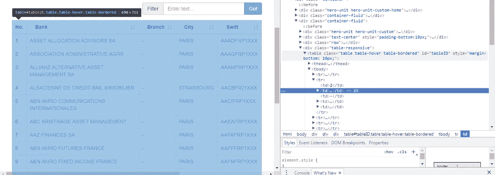
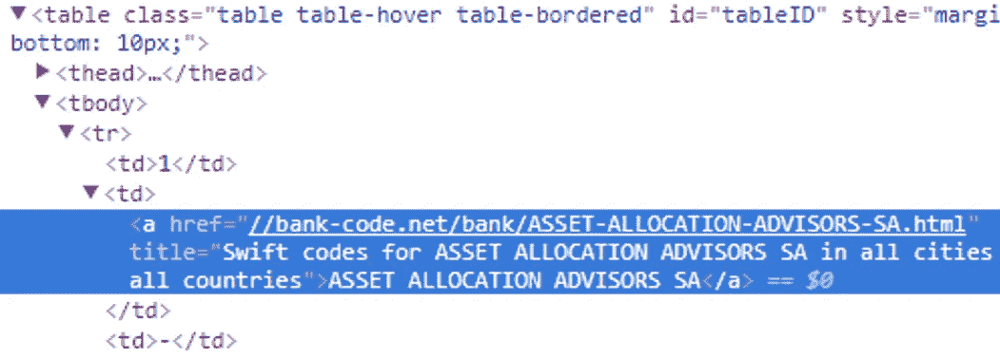
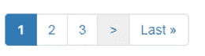

# 一个简短实用的使用 Python 从网站上抓取数据的指南

> 原文：<https://towardsdatascience.com/a-short-practical-how-to-guide-to-scrape-data-from-a-website-using-python-888373227d4f?source=collection_archive---------0----------------------->

*读者注意:Python 代码在最后被共享*

这个星期我不得不为一个客户刮一个网站。我意识到我做得如此自然和迅速，分享它会很有用，这样你也可以掌握这门艺术。*【免责声明:本文展示了我的刮痧实践，如果你有更多相关实践请在评论中分享】*

# 这个计划

1.  确定你的目标:一个简单的 html 网站
2.  用 Python 设计你的抓取方案
3.  奔跑&让魔法发挥作用

How much time do you need to scrape a website? A practitioner would take ~10 minutes to prepare the Python script for a simple html website

# 第一部分:找到你的目标(一个网站)

在我的例子中，我需要从 SWIFT 代码(或法国 BIC 代码)中收集银行的名称。)http://bank-code.net/country/FRANCE-%28FR%29.html[网站](http://bank-code.net/country/FRANCE-%28FR%29.html)有 4000 多个 SWIFT 代码和相关银行名称的列表。问题是他们每页只显示 15 个结果。浏览所有页面并一次复制粘贴 15 个结果是不可行的。刮擦对于这项任务来说很方便。

首先，使用 Chrome 的“inspect”选项来识别你需要获取的 html 部分。将鼠标移动到检查窗口(右侧)中的不同项目上，并跟踪代码突出显示的网站部分(左侧)。选择项目后，在检查窗口中，使用“复制/复制元素”并将 html 代码粘贴到 python 编码工具中。

On the right side is the Google Chrome’s “inspection window” you get when using right click / Inspect

在我的例子中，具有 15 个 SWIFT 代码的所需项目是一个“*表”*

# 第二部分:用 Python 设计你的抓取方案

## a)刮去第一页

就这样，3 行代码，Python 就收到了网页。现在您需要正确解析 html 并检索所需的项目。

记住所需的 html:

它是一个“*表*”元素，id 为“*表 ID* ”。它有一个 id 属性这一事实很棒，因为这个网页上没有其他 html 元素可以有这个 id。这意味着，如果我在 html 中查找这个 id，除了所需的元素之外，我找不到其他任何东西。它节省时间。

让我们用 Python 正确地做这件事

所以现在我们已经得到了想要的 html 元素。但是我们仍然需要获取 html 中的 SWIFT 代码，然后将其存储在 Python 中。我选择把它储存在熊猫体内。DataFrame 对象，但也可以仅使用列表列表。

要做到这一点，回到 Chrome 检查窗口，分析 html 树的结构，并注意到你必须去的元素。在我的例子中，所需的数据在“tbody”元素中。每个银行及其 SWIFT 代码包含在一个“tr”元素中，每个“tr”元素有多个“td”元素。“td”元素包含了我正在寻找的数据。

The html tree can be described as follows: table, tbody, tr, td

我用下面的代码做了一行:

## b)准备自动化

现在我们已经抓取了第一个网页，我们需要思考如何抓取我们还没有看到的新网页。我的做法是复制人类行为:存储一页的结果，然后转到下一页。现在让我们专注于进入下一个网页。

页面底部有一个菜单，允许您进入 swift 代码表的特定页面。让我们检查一下检查器窗口中的“下一页”按钮。

The “>” symbol will lead us to the next page

这给出了以下 html 元素:

现在用 Python 获取 url 很简单:

我们就快到了。
到目前为止，我们已经:
-开发了一个页面的表格的抓取
-识别了下一个页面的 url 链接

我们只需要做一个循环，然后运行代码。我推荐以下两个最佳实践:

1.当你登陆一个新的网页时打印出来:了解你的代码处于进程的哪个阶段(抓取代码可能要运行几个小时)

2.定期保存结果:避免在出错时丢失所有刮到的数据

只要我不知道什么时候停止抓取，我就用惯用的“ *while True:* 语法进行循环。我打印出每一步的计数器值。我还将每个步骤的结果保存在一个 csv 文件中。这实际上会浪费时间，例如，更好的方法是每 10 或 20 步存储一次数据。但是我选择了快速实现。

代码是这样的:

完整代码(只有 26 行)可以在这里找到:[https://github . com/Felix shop/mediu articles/blob/master/Scraping _ SWIFT _ codes _ Bank _ names . py](https://github.com/FelixChop/MediumArticles/blob/master/Scraping_SWIFT_codes_Bank_names.py)

如果你喜欢这篇文章，考虑发送至少 50 个掌声:)