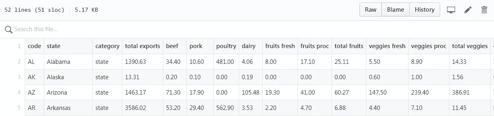
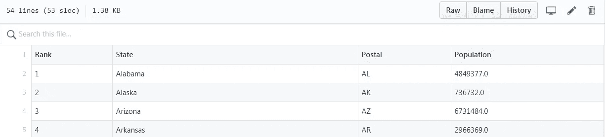
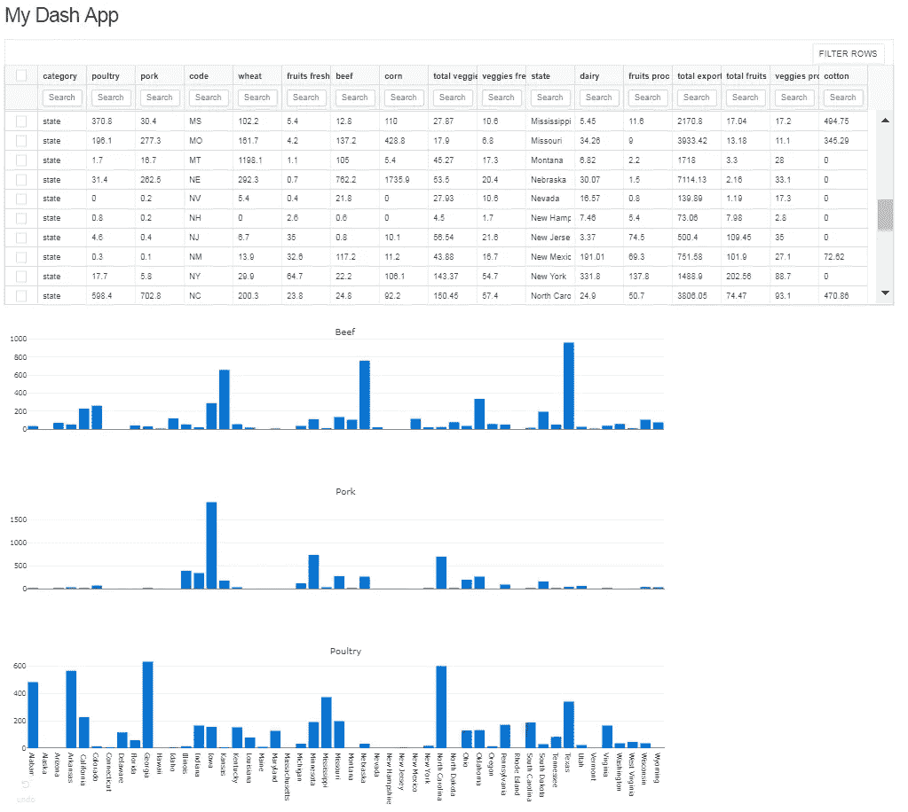
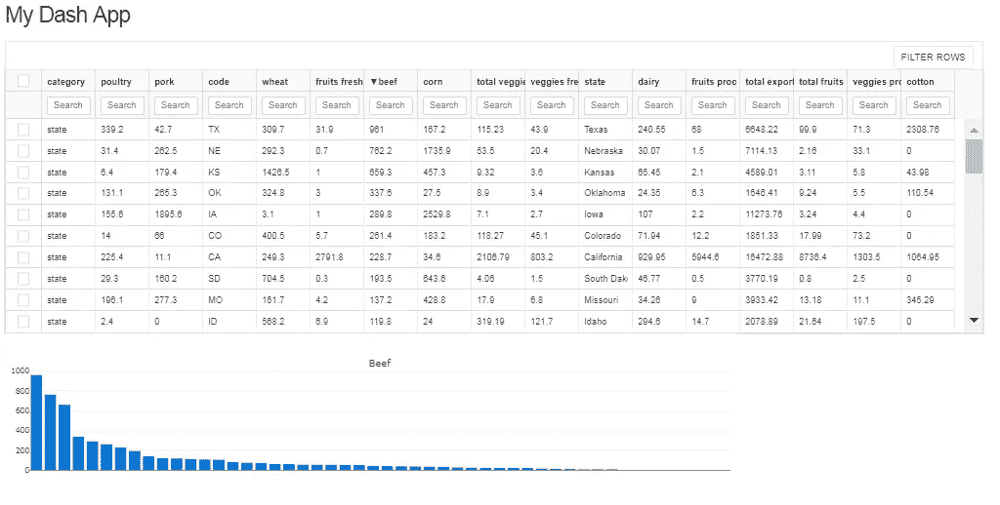

# 使用开源 Plotly“Dash”库的简短 Python 教程(第一部分)

> 原文：<https://towardsdatascience.com/a-short-python-tutorial-using-the-open-source-plotly-dash-library-part-i-e59fb1f1a457?source=collection_archive---------4----------------------->

最近，我已经成为 Plotly 的“Dash”Python 库的主要粉丝，该库用于数据可视化项目。使用 Dash，可以创建漂亮的图形和数字，然后轻松地将它们作为轻量级 web 应用程序进行分发，而无需编写任何 HTML 或 Javascript 代码。我不认为说在未来 18 个月内，Dash 库将成为最重要的 Python 数据可视化库之一是夸张的——而且它都是开源的(麻省理工学院许可的)。

在最近的一个项目中，我一直在使用 Dash 的一些中级功能，并希望创建一些教程来分享我学到的一些东西。今天，我想重点学习如何在 Dash 中创建动态数据表(这里的是基于原始 Plotly 代码的[)。在后续教程中，我们将了解更多高级功能，例如使用 Dash 回调函数来启用/禁用基础应用程序的某些组件。](https://github.com/plotly/dash-table-experiments/blob/master/usage.py)

出于本教程的目的，我们将使用 2011 年[美国每个州](https://github.com/plotly/datasets/blob/master/2011_us_ag_exports.csv)的农业出口数据和第二个美国每个州的 [2014 年人口数据集，这两个数据集都可以在 Github 上获得。](https://github.com/plotly/datasets/blob/master/2014_usa_states.csv)

2011 US Agricultural Export Data

2014 Population by US State

假设我们想找出一种可视化每个州的牛肉、猪肉和家禽出口的方法(在后面的教程中，我们将查看出口数据与该州人口的交叉引用)。我们将一步一步地介绍应用程序的每个部分——如果你很着急，可以跳到最终产品的最后代码嵌入部分。

首先，我们需要导入必要的 Python 模块，然后加载数据。

**重要提示:**‘dash _ table _ experiments’尚未完全稳定，因此在[安装 Dash 库](https://dash.plot.ly/installation)时，默认情况下不包括它。要使用 pip 安装，只需在您激活的环境中键入:' pip install dash-table-experiments '。

接下来，我们需要定义应用程序的布局。我最近特别喜欢动态 Dash“数据表”,所以让我们使用下面的代码在布局中定义一个这样的表。

记下我们上面创建的组件的 id，因为接下来我们需要编写两个应用回调来启用表的动态属性。第一个回调等待用户点击子情节中的一个条，然后高亮显示表格中的那一行。相反，第二个回调基于用户在表中选择的行创建和更新条形图。在回调之后，我们将调用附加到外部 CSS 文件中以进行样式化，然后最终运行应用程序。

The finished app created using the Plotly “Dash” Python library

现在，如果我想找出最大的牛肉出口州，我可以很容易地对表进行排序，图表将动态更新。这并不令人惊讶，但我们可以很快看到德克萨斯州、内布拉斯加州和堪萨斯州是美国前三大牛肉生产地。

在下一个教程中，我们将看看如何使用更高级的回调来交叉引用农业数据和州人口数据。在此之前，这里是这个应用程序的最终代码！