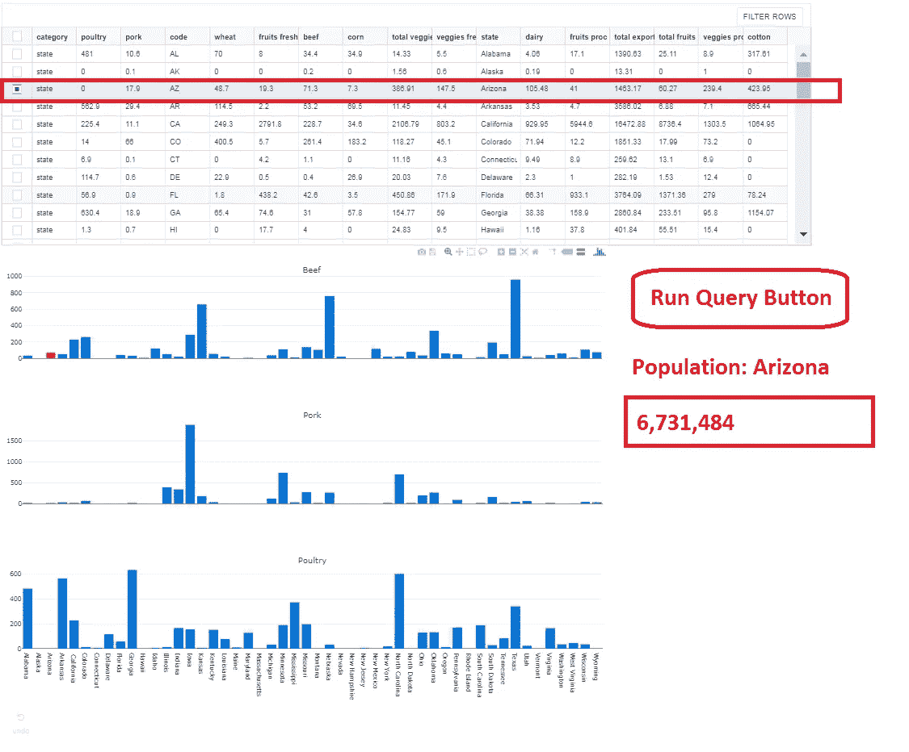
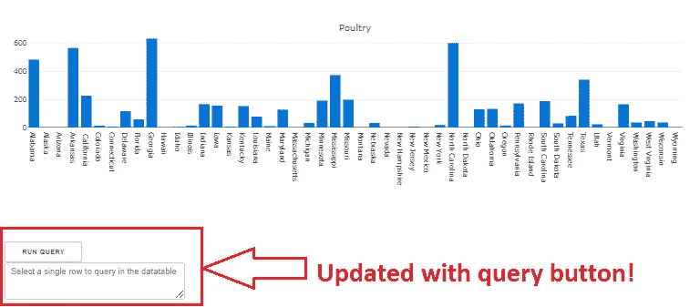
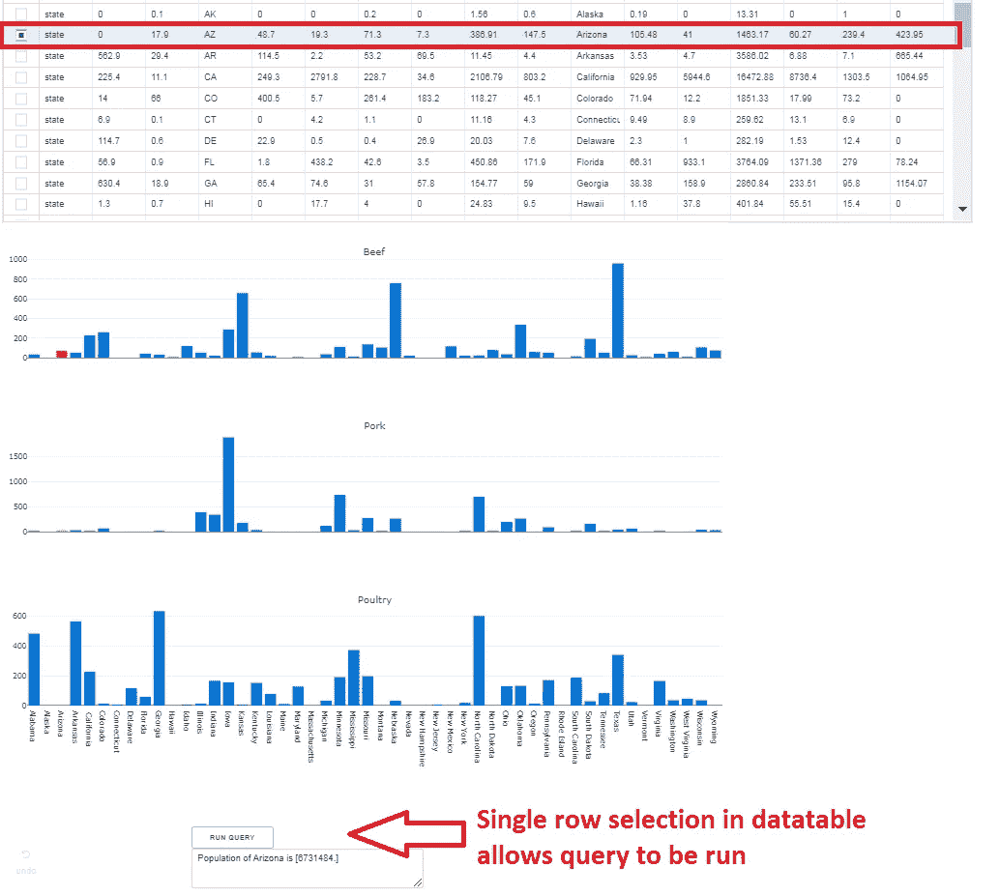

# 使用开源 Plotly“Dash”库的简短 Python 教程(第二部分)

> 原文：<https://towardsdatascience.com/a-short-python-tutorial-using-the-open-source-plotly-dash-library-part-ii-caddde82ee06?source=collection_archive---------5----------------------->

在上一篇教程中，我们使用 Python 的开源 Plotly“Dash”库创建了一个相当简单的数据仪表板。具体来说，我们研究了如何创建一个动态表来可视化美国各州的农产品出口。在数据科学项目中，我经常发现自己想要从多个数据库和用户输入标准中查询数据。我可以简单地加载我需要的所有数据，作为 Dash 应用程序的初始化步骤。然而，这是低效的，尤其是在涉及大量数据的情况下。我们如何修改现有的应用程序来做到这一点？请继续阅读…

为了举例，假设我们想要交叉引用美国各州的农业出口与该州的人口。显然，该州的人口数据集很小，但是想象一下这样一种情况:想要将数据交叉引用到该州发生的每个农业交易的时间序列。在这种情况下，让用户只在需要时运行查询会更有效。我们可以通过在应用程序中包含一个“运行查询”按钮来实现这一点，如果(且仅如果)从表中选择了一个州，则启用该按钮。

Mock-up of updated app with cross-referencing query function

首先，我们用 query 按钮更新我们的应用程序布局，并添加一个文本区域，在运行查询后，将在该区域中输出该州的人口。

很好，现在我们有了一个按钮和文本输出区域——但是我们如何合并逻辑呢？为此，我们需要为我们的应用程序创建两个新的回调。

我们的查询按钮现在可以在应用程序中通过选择表中的单个行来启用。单击“运行查询”后，该州的人口数将返回到文本框中！

App updated with query to cross-reference state population

完整应用程序的最终代码如下所示。敬请关注未来更多教程！