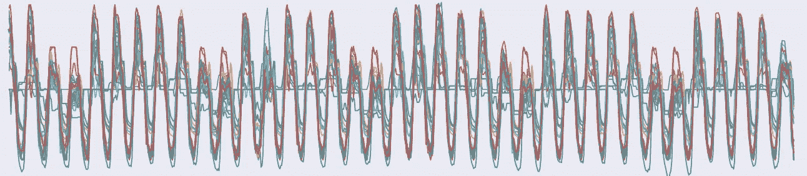
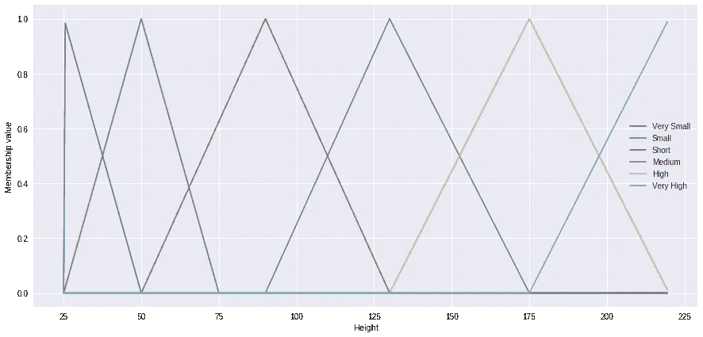
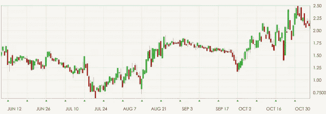
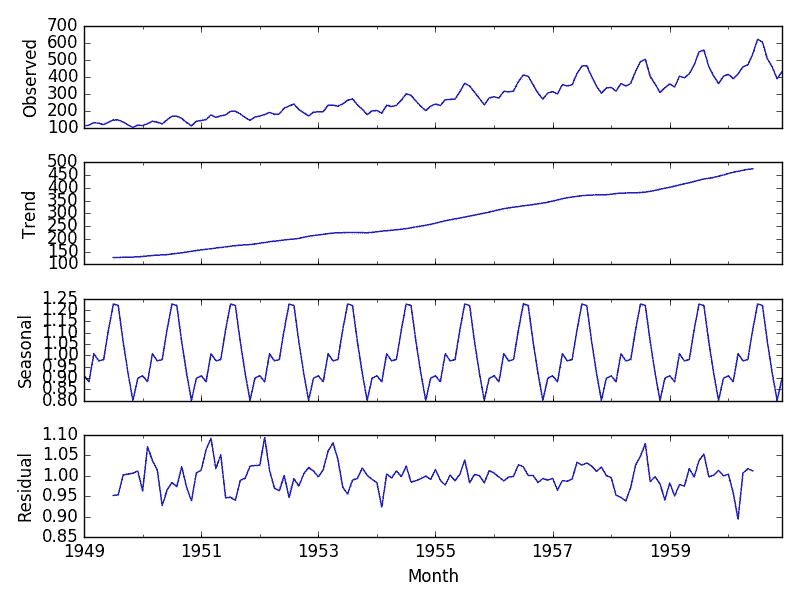
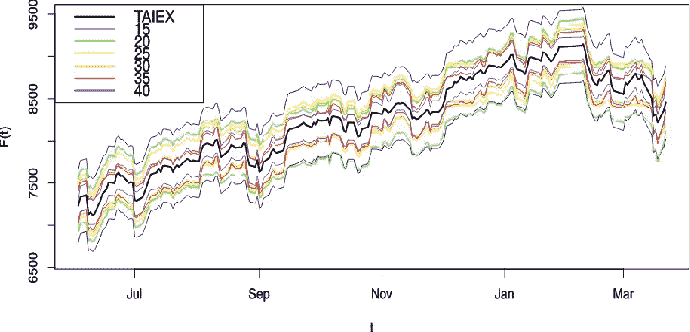
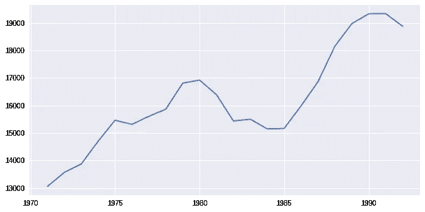
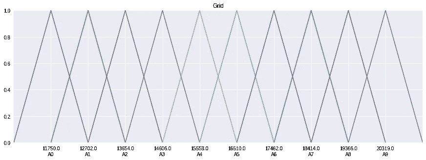
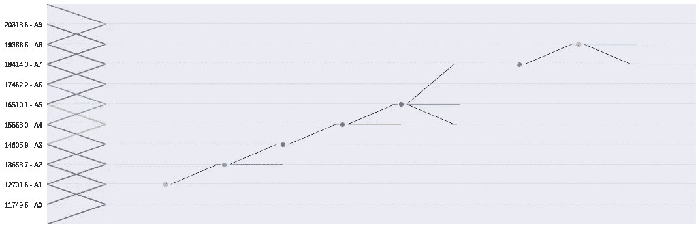

# 模糊时间序列的简短教程

> 原文：<https://towardsdatascience.com/a-short-tutorial-on-fuzzy-time-series-dcc6d4eb1b15?source=collection_archive---------3----------------------->



# 介绍

时间序列分析和预测方法在工程、医学、经济、气象等许多领域都是不可缺少的。

有几种分析和预测的方法，从传统的和神圣的统计工具(ARMA，ARIMA，萨里玛，霍尔特-温特斯等)，到新的计算智能工具(递归神经网络，LSTM，GRU 等)。没有完美的方法，也没有我在这里介绍的方法。但是模糊时间序列的一些关键特征使它成为一个吸引人的选择:

*   可读性
*   易处理
*   简单
*   可量测性

此后，我将假设你没有机器学习(侧重于模糊系统)和时间序列背景，我将提出这些领域的关键概念。然后将借助 pyFTS 库介绍模糊时间序列方法。走吧。

# 什么是模糊集？


[Source](https://brighterion.com/artificial-intelligence-101-fuzzy-logic/)

如果你已经知道模糊逻辑和模糊集，你可以继续下一节。这里介绍的只是非常入门的概念！

逻辑理论和经典数学将集合定义为二分法:每个元素都在集合之内或之外。没有中间点！元素的隶属度是一个布尔值，即集合{0，1}上的一个值，它给每个集合强加了严格且不可改变的边界。

这种二分法的思维方式对人类来说是不舒服的，因为无数的现实并非如此。当我们试图用严格的界限将人分类时会有困难，例如:体重= {瘦，苗条，胖}，年龄= {儿童，青少年，青年，成人，老年人}，身高= {低，中，高}。如果我们要描述一个至少在其中一个方面使用了这些概念的人，我们会发现这个人可能处于这两个值之间的中间类别。但是经典/刚性集合没有给我们这种灵活性。

扎德(1965)提出的模糊逻辑提出了一个对偶来代替这种二分法:某个元素在某些层次上可能属于也可能不属于同一个集合，这样隶属度就是区间[0，1]中的一个值。模糊集没有严格的界限，它们通常是重叠的，因此，使用前面的例子，我可以是中高和中等，或者 90%中等和 10%高。

给定 **X** ，一个**数值变量**，使得 x∈ℝ——例如一个高度度量——它的**论域**，缩写为 **U** ，是这个变量可以取值的范围，例如*u =【min(x)，max(x)】*。

A 语言变量 A 是数值变量 X 的值到一组单词/语言术语的转换(我们称之为模糊化)。每个单词/语言术语是一个模糊集*∈，每个模糊集*关联到一个函数 *μ* (mu 希腊文字母)，这样*μ:X→【0，1】*(这意味着*μ*从 X 接收一个输入值，并在区间[0，1]返回一个输出值)。**

*让我们回到数字变量高度，以厘米为单位。我们将 *U = [20，220]* 和语言变量γ定义为:*

**= {*“非常小”、“小”、“矮”、“中”、“高”、“非常高” *}**

*你明白我们在做什么吗？我们想停止处理 X 的数字数据，开始处理用γ表示的词汇，为此我们需要为每个集合映射 X 的值。*

*我们将把 *U* 分成 6 个重叠区间，每组*度∈度*一个区间。对于每个区间，我们关联一个*μ°( X)*函数。隶属函数有几种类型，但为了简化起见，我们将使用三角形隶属函数。三角形隶属函数可以定义为:*

```
*def triangular(x, a, b, c):
    return max( min( (x-a)/(b-a), (c-x)/(c-b) ), 0 )*
```

*其中 *a、b* 和 *c* 以 *a* 在左边， *b* 在上边， *c* 为右点绘制三角形。当给定的输入值 *x* 等于 *b* 时，我们说它 100%在模糊集内(换句话说:它的隶属度等于 1)。另一方面，隶属度在区间*【a】**【b】*上从 0 线性增加到 1，在区间*【b，c】*上从 1 线性减少到 0。如果 *x* 小于 *a* ，或者大于 *c* ，我们说 *x* 完全在模糊集之外(int 换句话说:其隶属度等于 0)。*

*那么，对于语言变量来说，我们的集合会是什么样的呢？*

**

*假设一个人身高 163cm。对于变量°,中位数为 0.27，高度为 0.73，即:*

**μ_median(163) =三角形(163，90，130，175) = 0.2666666…**

**μ_high(163) =三角形(163，130，175，220) = 0.7333…**

*查看这里的代码！*

*ut 仅仅是一个巨大知识领域的开始。如果你想知道更多关于模糊逻辑和模糊系统的知识…*

*但是我们在这里讨论时间序列，对吗？所以说时间吧！*

# *什么是时间序列？*

**

*如果你已经知道时间序列，你可以去下一节，这一节是非常入门的！*

*T ime 系列是代表一个(或多个)随机变量随时间变化的行为的数据集，其主要特点是该变量的连续记录不是相互独立的，对它们的分析必须考虑到收集的顺序。*

*根据 Ehlers (2009)，“相邻的观察值是相关的，我们有兴趣对这种相关性进行分析和建模”。那是什么意思？为了预测时间序列的未来值，我使用同一序列的过去/滞后值。*

*一个简单的例子是自回归 AR(p)模型，其中 p 表示用于预测的滞后变量的数量。给定一个时间序列 *X(t)* ，其中 *t* 表示一个时刻，如果我们在预测中仅使用滞后，那么我们有一个 AR(1)模型，这将类似于 *X(t) = α* *X(t-1) + ε* ，其中 *X(t-1)* 是滞后值，α是通过统计方法调整的系数，ε表示噪声或随机误差如果我们想在预测中使用最后两个滞后，我们将有一个 AR(2)模型，类似于*X(t)=α0**X(t-1)+α1**X(t-2)+ε。**

*什么是滞后量，应该使用什么样的滞后？为了做到这一点，有必要研究时间序列的组成部分并分析它们的特性，使用诸如 [ACF](https://en.wikipedia.org/wiki/Autocorrelation) 和 [PACF](https://en.wikipedia.org/wiki/Partial_autocorrelation_function) 的图表。通常时间序列在高层次上被建模(使用加法模型)为:*

*X(t) =C(t) + T(t) + S(t) + R(t)*

**

*[Source](https://machinelearningmastery.com/decompose-time-series-data-trend-seasonality/)*

*其中:*

*   *t 是时间指数；*
*   *X(t)是时间 t 时序列的点估计；*
*   *C(t)是周期性成分，可预见的短期/非常短期波动；*
*   *T(t)是趋势分量，表示序列的长期行为。一般趋势是增长/上升或减少/下降，否则就说数列没有趋势；*
*   *S(t)是季节性成分，是中长期的周期性波动。季节性因素的一个很好的例子是…猜猜看？一年四季！这些 4 个月的间隔有其自身的特点，并且每年重复一次——这使得这种季节性的任何变量都更容易预测。*
*   *R(t)是噪声分量，一个均值和方差恒定的随机值。这种随机噪声是不可预测的！*

*不是所有的时间序列都有趋势或季节性。一些数列被认为是平稳的，这意味着它们的平均值(或多或少)是恒定的。在非平稳序列中，平均值随时间变化。在同方差序列中，方差是常数，而在异方差序列中，方差是随时间变化的。总结:平稳和同方差时间序列“表现良好”且更容易预测，而非平稳和异方差时间序列要复杂得多。在后一种情况下，我们可以应用数学变换(如微分、Box-Cox 等)。)使级数平稳且齐次。*

*但是…模糊集在这个故事中起了什么作用？*

# *什么是模糊时间序列？*

**

*[Source](https://www.semanticscholar.org/paper/Interval-forecasting-with-Fuzzy-Time-Series-Silva-Sadaei/65e19278164559777d6c5fe3aa274e43171cadea)*

*使用模糊集对时间序列进行建模和预测几乎是直觉地出现的，首先是基于模糊模型逼近函数的能力，但也基于使用语言变量的规则的可读性，这使得它们更易于专家和非专家分析。*

*宋(Song)和齐松(Chisson)在模糊时间序列方面做了开拓性工作，但我们在这里介绍陈(Chen)在 1996 年发表的《进化》。这个想法是将时间序列中的论域划分为区间/分区(模糊集)，并学习每个区域如何表现(通过时间序列模式提取规则)。这些模型的规则告诉我们，随着时间的推移，当值从一个地方跳到另一个地方时，分区如何与自身相关联。换句话说:让我们创建一个语言变量来表示数字时间序列，这些区域将是我们变量的语言术语。*

*当我们创建一个语言变量来表示话语的范围时，我们创建了一个“词汇”，然后模糊化的系列由该词汇中的单词组成。这些单词——句子或短语——的顺序是我们需要学习的模式。*

*为了方便起见，我将模糊时间序列的方法论分为两个步骤:训练和预测。*

## *培训程序*

*在本教程中，我们将使用模糊时间序列起源中的一个众所周知的时间序列:阿拉巴马大学的入学人数。你可以看到下面的数据:*

**

***1。话语论域 U 的定义**
首先我们需要从训练数据中知道话语论域 U，比如*U =【min(X)，max(X)】*。通常我们将上下界外推 20%，作为安全余量。*

***2。创建语言变量γ(论域划分)**
现在我们需要在几个重叠区间(又名划分)上划分 U，并为每个区间创建一个模糊集。区间数是模糊时间序列中最重要的参数之一，它将直接影响模型的精度。*

*除了分区的数量，我们分割 U 的方式也对准确性有很大的影响。此后，我们采用最简单的分区方法，网格分区，其中所有分区都具有相同的长度和格式。要了解其他分区方法，请点击此处。对于我们的示例数据，我们将使用 10 个分区的方案，这样语言变量就是*= { A0，a 1，…，A9 }。**

**

***3。模糊化**
现在我们可以将 *X(t)* 的数值转化为语言变量γ的模糊值，产生模糊时间序列 *F(t)* 。提醒一下*和*上的模糊集是重叠的总是好的，因此对于每个 *x ∈ X(t)* 来说，它可能属于不止一个模糊集*Ai∈16。在 Chen 的方法中，事情稍微简单一点:只选择最大隶属度模糊集。然而，在其他 FTS 方法中，所有的模糊值都被考虑。**

*使用陈氏方法，我们的测试数据的模糊值将是 *F(t) = { A1，A2，A2，A3，A4，A4，A4，A5，A5，A4，A4，A4，A4，A4，A4，A5，A7，A8，A8，A7 }。**

***4。创建时间模式**
时间模式表示在模糊时间序列 *F(t)* 上顺序出现的两个模糊集，并且具有格式*先例→后果*，其中先例表示在时间 *t* 上出现的模糊集，而后果表示在时间 *t+1* 后不久出现的模糊集。*

*对于前面的例子，生成的时间模式将是:
*A1→A2，A2→A2，A2→A3，A3→A4，A4→A4，…，A8→A8，A8→A7**

***5。创建规则**
我们的模型规则也有格式*先例→结果*。鉴于先前生成的时间模式，我们将根据其先例对它们进行分组。我们的模型将为每个发现的独特先例包含一个规则，每个规则的结果将是具有相同先例的每个时间模式的所有结果的联合。*

*对于前面的例子，生成的规则将是:
*A1 →A2
A2 →A2，A3
A3 →A4
A4 →A4，A5
A5 →A4，A5，A7
A7 →A8
A8 →A7，A8**

**

*Rule visualization*

*事实上，这套规则不符合 FTS 模式。它们描述了我们的时间序列如何表现，如果它足够稳定(表现良好)，我们可以使用这个模型来预测时间的下一个值。*

*这样一个简单易读的模型还有另一个优点:*

*a)非常容易并行化/分布，这使得它对大数据非常有吸引力；*

*b)它非常容易更新，这使得它对频繁变化的数据非常有吸引力。*

*但是我们如何将这些规则用于预测呢？*

## *预测程序*

*既然我们知道时间 *t* 、 *x(t) ∈ X(t)* 的数值，我们现在要预测下一个瞬间， *x(t + 1)* 。*

***1。输入值模糊化** 输入值 *x(t)* 将被转换成语言变量*的模糊值，生成值 *f(t)* 。因为在训练过程中，只选择最相关的集合。**

**对于示例数据，对于 *t = 1992* ，该值为 *x(t) = 18876* 。模糊化 *x(t)* 最相关的集合是 A7，所以 *f(t) = A7* 。**

****2。寻找相容规则**
寻找其先例等于 *f(t)* 的规则。规则的结果将是对 *t + 1* 的模糊预测，即 *f(t + 1)* 。**

**对于 *f(t) = A7* ，我们有规则 *A7 → A8* 。那么 *f(t + 1) = A8* 。**

****3。现在你需要将 *f(t + 1)* 转换成一个数值。为此，我们使用质心方法，其中数值等于模糊集合的中心的平均值 *f(t + 1)* ，即 *x(t+1) = n⁻ ∑ Ai* ，对于 *i = 0..n-1* 和 *n* 等于 *f(t+1)* 中的组数。****

**由于 *f(t + 1)* 只有一组，那么 *x(t + 1) = 19366.46。***

**他展示的模型非常简单，而且我必须说，是过时的(它来自 1996 年！！！).但它是理解模糊时间序列如何工作的一个很好的指南。现在最精确的方法使用更多的滞后(这种方法仅使用 t-1 滞后)、规则中的权重(来自 Yu (2005)的工作)、优化器来寻找最佳的集合数、滞后等。在接下来的教程中，我们将深入研究更高级的模型。**

**上面解释的所有程序都可以在这台谷歌 Colab 笔记本上重现。**

**现在是时候去玩一会儿，把我们的手弄脏了！！！！:-)**

# **pyFTS 图书馆**

****

**[pyFTS:Fuzzy Time Series for Python](https://pyfts.github.io/pyFTS/)库是在巴西米纳斯吉拉斯联邦大学(UFMG)的 [MINDS —机器智能和数据科学](http://www.minds.eng.ufmg.br/)上开发的，面向学生、研究人员、数据科学家或希望利用模糊时间序列方法的人。PyFTS 是一个持续发展的项目，欢迎所有的贡献！**

**让我们了解一下这个图书馆的一些主要特点:**

**[**1。测试数据**](https://github.com/petroniocandido/pyFTS/tree/master/pyFTS/data)**

**在 pyFTS.data 包中有几个常见时间序列的数据集，如 TAIEX、纳斯达克、标准普尔 500、乘客等。每个数据集都有自己的特征，有些是单变量的，有些是多变量的，等等，但是所有的数据集基本上都有两个功能:**

*   ***get_data()* :返回单变量时间序列**
*   ***get_dataset()* :返回多元时间序列**

```
**from pyFTS.data import Enrollmentstrain = Enrollments.get_data()**
```

**[**2。数据转换**](https://github.com/petroniocandido/pyFTS/blob/master/pyFTS/common/Transformations.py)**

**在 pyFTS.common.Transformations 包中，可以对预处理和/或后处理数据使用几种数据转换，这直接影响了论域的划分。**

```
**from pyFTS.common import Transformations
tdiff = Transformations.Differential(1)**
```

**[**3。分割者**](https://github.com/petroniocandido/pyFTS/tree/master/pyFTS/partitioners)**

**在 pyFTS.partitioners 包中是话语划分器的领域。每个划分器都具有表示语言变量、创建话语论域及其模糊集的划分的功能。在所有这些函数中，至少需要两个构造函数参数:**

*   ***数据*:(必填！)的列车数据；**
*   ***npart* :(强制！)要建立的模糊集的最小数量；**
*   **mf :将用于模糊集合的隶属函数，默认为三角函数(trimf)。各种隶属函数可以在 [pyFTS.common.Membership 中找到；](https://github.com/petroniocandido/pyFTS/blob/master/pyFTS/common/Membership.py)**
*   ***变换*:如果系列中使用了任何变换，应在此处报告。**

```
**from pyFTS.partitioners import Grid, Entropy, Util as pUtilfs = Grid.GridPartitioner(data=train, npart=20)print(fs)**
```

**我们可以探索几种[话语划分器宇宙的几种替代方案](https://github.com/petroniocandido/pyFTS/blob/master/pyFTS/notebooks/GOOGLE%20COLAB%20Partitioners.ipynb)，每一种都有自己的特点和性能。**

**[**4。模糊时间序列方法**](https://github.com/petroniocandido/pyFTS/tree/master/pyFTS/models)**

**各种方法可以在[包 pyFTS.models](https://github.com/petroniocandido/pyFTS/tree/master/pyFTS/models) 中找到。所有方法都继承自类 [common.fts.FTS](https://github.com/petroniocandido/pyFTS/blob/master/pyFTS/common/fts.py) 。对于最终用户来说，有两种主要的方法需要了解:**

*   **FTS.fit(data，partitioner=fs):根据关于参数*数据*的训练数据和已经由 *fs* 分割器构造的语言变量来训练模型。建议研究该功能的帮助，因为这里已经可以使用[集群显示](http://dispy.sourceforge.net/)进行分布式训练。与 [pySpark](https://spark.apache.org/docs/0.9.0/python-programming-guide.html) 兼容的版本也会尽快发布。**
*   **FTS.predict(data，type='point '，steps_ahead=1):它使用已经训练好的模型根据数据中包含的滞后进行预测。有三种可能的预测类型，由“类型”参数指示:“点”(默认)、“间隔”和“分布”。选择方法时应该小心，因为不是所有的方法都适用于所有这些类型。最后,' steps_ahead '参数表示预测范围，或者您希望预测向前多少步。**

```
**from pyFTS.models import chenmodel = chen.ConventionalFTS(partitioner=fs)
model.fit(train)print(model)forecasts = model.predict(test)**
```

**有几个[型号](https://github.com/petroniocandido/pyFTS/tree/master/pyFTS/models)需要探索，所以请看一下[示例代码](https://github.com/petroniocandido/pyFTS/tree/master/pyFTS/notebooks)。**

# **向前看——第二次会更好**

**[在本教程的第二部分，我将讨论加权方法、高阶模型、多元模型](/a-short-tutorial-on-fuzzy-time-series-part-ii-with-an-case-study-on-solar-energy-bda362ecca6d)和多步预测。我还应用这些模型来预测光伏能源。**

**[第三部分讲区间和概率预测，非平稳性，概念漂移和时变模型。](/a-short-tutorial-on-fuzzy-time-series-part-iii-69445dff83fb)**

**一定要看完！**

# **参考**

**陈希明。**基于模糊时间序列的招生预测**。模糊集与系统，第 81 卷，第 3 号，第 311-319 页，1996 年。网址:[https://doi . org/10.1016/0165–0114(95)00220–0](https://doi.org/10.1016/0165–0114(95)00220–0)。Acess 于 2018 年 7 月 25 日。**

**Ehlers，r . s .**anáLise de séries temporais**。*巴拉那联邦大学统计局*。网址:【http://conteudo.icmc.usp.br/pessoas/ehlers/stemp/stemp.pdf 。Acess 于 2018 年 7 月 25 日。**

**莫勒廷，托罗伊，C.M.C. **时间的分析。布吕歇尔，2004 年****

**Silva，P. C. L .等人**pyFTS:Python 的模糊时间序列，4.0 版**。网址:[https://doi.org/10.5281/zenodo.597359](https://doi.org/10.5281/zenodo.597359)。Acess 于 2018 年 7 月 25 日。**

**宋、羌；模糊时间序列及其模型。模糊集与系统，第 54 卷，第 3 号，第 269–277 页，1993 年。网址:[https://doi . org/10.1016/0165-0114(93)90372-O](https://doi.org/10.1016/0165-0114(93)90372-O)。Acess 于 2018 年 7 月 25 日。**

**俞慧光，**加权模糊时间序列模型在预测中的应用。物理 A:统计力学及其应用，第 349 卷，第 3 期，第 609–624 页，2005 年。网址:[https://doi.org/10.1016/j.physa.2004.11.006](https://doi.org/10.1016/j.physa.2004.11.006)。Acess 于 2018 年 7 月 25 日。****

**洛杉矶扎德**模糊集**。信息与控制 8(3)338–353，1965 年。网址:[https://doi . org/10.1016/s 0019-9958(65)90241-X](https://doi.org/10.1016/S0019-9958(65)90241-X)。Acess 于 2018 年 7 月 25 日。**