# 模糊时间序列的简短教程—第二部分

> 原文：<https://towardsdatascience.com/a-short-tutorial-on-fuzzy-time-series-part-ii-with-an-case-study-on-solar-energy-bda362ecca6d?source=collection_archive---------4----------------------->

## 通过对太阳能的案例研究


在[本教程的第一部分](/a-short-tutorial-on-fuzzy-time-series-dcc6d4eb1b15)中，我简要解释了时间序列分析、模糊集以及什么是模糊时间序列 pyFTS，并简要介绍了 [pyFTS 库](https://pyfts.github.io/pyFTS/)。太棒了！我从世界各地的人们那里得到了反馈，我听到了他们提出的非常好的想法。但是，正如在每个介绍性研究中发生的那样，我们使用了非常简单的方法和数据，目的是促进对这种方法的总体理解。

但是现在，假设读者已经知道了所需的背景，我们可以稍微前进一点，玩一些更有用的东西。首先，我们将看到对偏差/方差概念的直观介绍，然后我们将了解一些最重要的 FTS 超参数及其对模型准确性的影响。最后，我们将采用一些 FTS 模型来模拟和预测太阳辐射时间序列，这对光伏能源预测很有用。

本教程的所有例子都可以在谷歌实验室，http://bit.ly/short_tutorial_colab2[获得。随时联系，给 ou 反馈，提问。现在，让我们开始吧！](http://bit.ly/short_tutorial_colab2)

# 信号、噪声、偏差和方差

T 机器学习模型的训练是将信号从噪声中分离出来、将一般行为从局部特殊性和随机误差中分离出来的冲突。在每个估计器的训练中，偏差和方差之间，欠拟合和过拟合之间存在冲突。

给定一个数字时间序列 *Y* ，它的单个值 *y(t)∈Y* ，以及 y 的一个估计量，一个函数 *ŷ(t+1) = f( y(t) )* 。 *f* 的**目的**是预测 *Y* 的最佳可能方式，使实际值 *y(t)* 与预测值 *ŷ(t)* 之间的差值 *ε(t)* 趋于零，或者换句话说对于*ε(t)= y(t)**t→∞来说*

直观地说，有偏估计量是指ε (t)的期望值不为零— E [ε (t)] ≠ 0 的估计量。偏差是正确值的系统“偏差”,请记住，估计值通常会与真实值有偏差，这是意料之中的，但平均而言，这些偏差应该趋于零。这种偏差是典型的欠拟合模型，当模型不能学习信号，我们感兴趣的时间序列的组成部分。

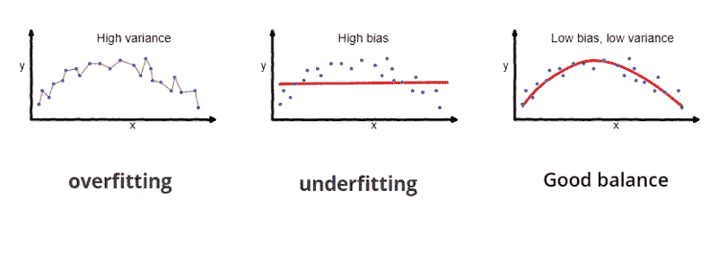

[Source](/understanding-the-bias-variance-tradeoff-165e6942b229)

另一方面，方差与模型的泛化能力有关，尤其是在训练阶段没有提供的数据。当模型开始学习不能很好地概括测试数据的训练样本的特异性时，高方差与过拟合有关。简而言之:模型学习了数据的噪声。

众所周知，完全消除偏差和方差的副作用是不可能的，最佳拟合是通过它们之间的平衡来实现的——这是估计模型的挑战。

# 模糊时间序列参数


[Fonte](https://ronenright.co.nz/)

几个参数决定了 FTS 模型的最佳拟合，但主要的参数是分区和顺序。这两个参数占模型准确率的 90%(经验值)。

## 1.分割

分区由三个参数组成，这里根据它们的重要性列出:

**1a)分区(或模糊集)的数量**

这是对模型精度影响最大的参数。模糊集越多，对时间序列特征的捕捉就越精确。这里有一个陷阱:

*   由于信号过度简化，太少的模糊集产生欠拟合；
*   过多的模糊集会产生过拟合，使得模型开始学习数据上的噪声；

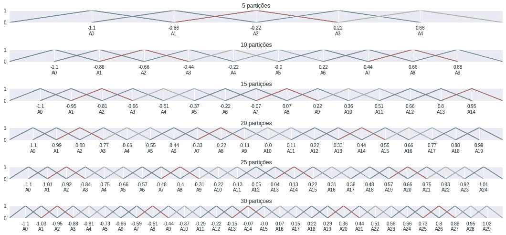

Several numbers of partition for the sine function

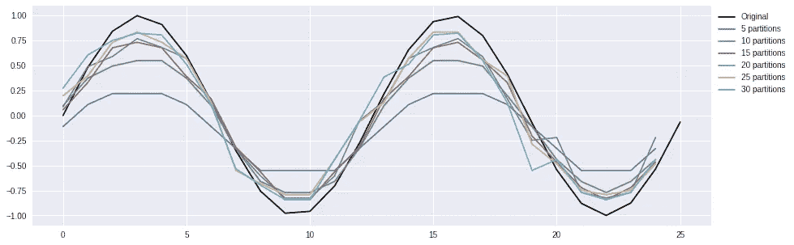

Accuracy of several partitionings for sine function

组数是一个必须进行基准测试的参数。在已经被区分的时间序列中，10 个分区是一个好的开始数字。在其他情况下，35 个分区是一个很好的数字。

**1b)分区类型**

有许多类型的分区，从网格分区(GridPartitioner)到分区器，网格分区中所有集合均匀分布并具有相同的格式，分区器中集合具有不同的大小，如基于熵的分区器和基于簇的分区器。这里我不会深入讨论这个问题，但是出于好奇[在 PYFTS/notebooks 存储库中有几个分区类型的例子](https://github.com/PYFTS/notebooks/blob/master/Partitioners.ipynb)。

总是从网格划分开始，如果是这样的话，探索其他类型。

**1c)隶属函数**

这是一个对模型的准确性几乎没有实际影响的参数，但是根据具体情况，您可能有很好的理由使用高斯或梯形函数来代替默认的三角函数。

理由之一可能是参数的数量(高斯型使用 2，三角形使用 3，梯形使用 4)，模型的易读性，甚至与过程和数据的性质相关的其他问题。

同样，我不会在这里深入讨论这个问题，[看看 PYFTS/notebooks 存储库，了解更多细节](https://github.com/PYFTS/notebooks/blob/master/Partitioners.ipynb)。

## 2.命令

模型的阶是 FTS 的第二个最重要的参数，因为它们是自回归模型(使用滞后值来预测下一个模型)。序参数是模型的内存大小，或者说需要多少过去的信息来描述未来的事件。

为了确定这个参数，熟悉自相关函数的概念——ACF 是很重要的。ACF 不仅能够指示最重要滞后的顺序和索引。

## 2a)滞后(或订单)数量

顺序是模型使用的滞后量(过去的值)。这真的非常重要，并且取决于被建模的时间序列的类型。这里的问题是:我需要多少滞后来让模型学习时间模式、周期、季节性等等？看看 ACF，看看有多少是显著的滞后。

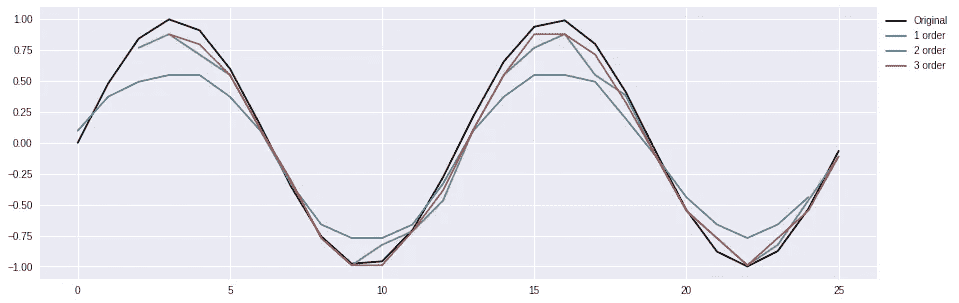

Model accuracy by order

然而，这里有一个陷阱:当模型使用更多的滞后时(特别是当分区数量很大的时候！)并且模型越大，学习和推理变得越慢。

根据我的经验，描述一个时间序列行为不超过 3 个滞后。但是当然一切都取决于数据。

## 2b)滞后指数

默认情况下，模型会按顺序选择最近的滞后。但是根据时间序列的季节性，这些可能不是最好的滞后。所以看看 ACF，看看哪个滞后指数是最重要的。

# 3.方法的类型

关于 FTS 方法的文献非常多样化，但有两个特征极其重要:

## 3a)有重量与无重量

权重增加了模型的准确性，平衡了模型规则中的哪些设置对预测更有影响。它们稍微降低了模型的可读性，但没什么大不了的。如果你必须选择，总是喜欢加权模型！

在下面的例子中，我们可以比较 HOFTS(无权重)、WHOFTS(规则的结果权重)和 PWFTS(规则的结果权重和先例权重):

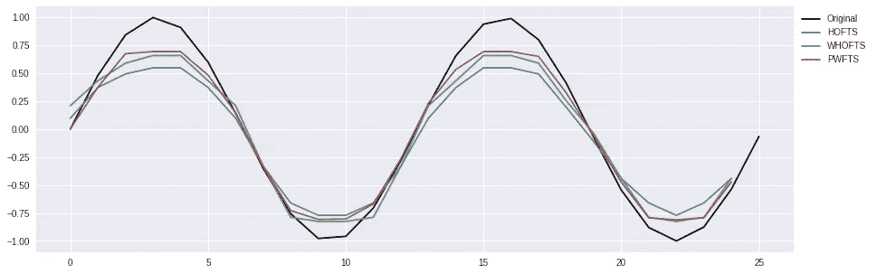

## 3b)单变量与多变量

大多数时候，我们只有一个变量的时间序列——内生变量。其他时候，我们可以利用其他信息(外生变量)来辅助这个变量。

例如，通常与时间序列测量相关的日期，对于季节性数据(如社会、环境等)来说是非常有价值的信息。数据。

如果你有多变量数据，那么首先要知道变量之间是否存在相关性，所以使用相关矩阵来检查它。相关系数指向简单的线性关系，因此它不应该是您应该使用的唯一工具，交叉熵是一个很好的替代方法。

另一个提示:如果您有一个单变量时间序列，您可以通过创建一个多变量序列来丰富您的模型，其中其他变量是内生变量的转换。例如，您可以拥有一个包含原始(内生)变量和微分内生变量的多元序列，从而提供有关值的最近波动的额外信息。

# 案例研究:太阳辐射


是时候找点乐子了！请记住:所有代码和结果都可以在 http://bit.ly/short_tutorial_colab2 的 T2 获得。我将使用来自 SONDA[——巴西](http://sonda.ccst.inpe.br/)国家环境数据组织系统的太阳辐射数据，特别是来自巴西利亚/DF 站的数据。辐射数据在“glo_avg”变量中，每天 24 小时每分钟采样，从 2013 年到 2014 年用于训练集，从 2015 年用于测试。

正如预期的那样，数据有点嘈杂，不太需要每分钟采样。我清理了数据，删除了其他变量(它们与我们的主变量相关性不是很大)，只留下了日期和内生变量。下一步是减少数据量和清除噪音，我通过对系列的每小时平均值进行采样来完成。预处理后的数据可从地址[https://data . world/petroniocandido/sonda-BSB-average-hourly](https://data.world/petroniocandido/sonda-bsb-averaged-hourly)获得。

直观上，太阳辐射有两个主要周期，日周期(太阳自转运动)和年周期(太阳平移运动)。影响这种预测的最大不确定性是天气和天空中是否有云。

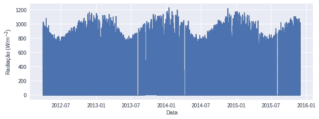

Sample of the yearly cycle

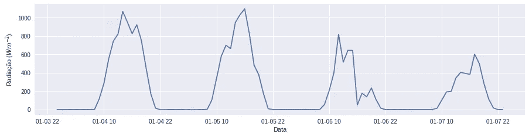

Sample of the daily cycle

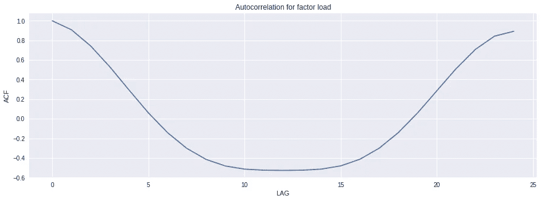

Autocorrelation function for the first 24 lags, correspondig for the previous 24 hours

# 适合各种口味的方法

正如一样，您已经知道 pyFTS 库中的方法在*模型*包中。然后我们将分析几个 FTS 模型在这个时间序列建模中的表现。在现实世界中，我们应该通过测试上述所有参数的众多组合来优化模型的超参数。在 pyFTS 中，我们可以使用*超参数*包，您可以在其中运行分布式网格搜索，这将在每个超参数的所有可能值之间生成笛卡尔乘积，并测试每个值。你也可以使用遗传算法(*超参数。进化的*或使用[远视库](http://hyperopt.github.io/hyperopt/)。但让我们简单点，好吗？

我们将使用具有 35 个分区的网格方案(GridPartitioner)划分我们的内生变量，分为 5 个亚组，VL-非常低，L-低，M-中，H-高和 VH-非常高，每个亚组有 7 个水平。这种命名法将通过生成以下规则使模型更易于解释:

***L6 L5→L6 M0 M1***

这条规则可以理解为:

**如果** *y(t-1)* **为**低(子级 5) **而** *y(t)* **为**低(子级 6) **那么***【t+1】***将为**低(子级 6) **或**中(子级 0) **或**

根据所选择的规则(由于规则的先例的成员与输入值相关)，去模糊化将把结果转换成数值(一个简单的方法是集合的加权平均)。


Grid partitioning of solar radiation time series

## 单变量方法

我们已经有了分区方案，所以让我们来研究一下方法。我们选择了带权重和不带权重的高阶方法(阶数> 1 ),所有方法都用 1 到 3 的阶数进行了测试。下面列出了生成规则的方法和示例:

*   ***霍夫茨。HighOrderFTS*** :高阶失重法

```
L4,VL0 → VL0,VL1
L5,VL0 → VL0,VL1
```

*   ***hofts。weightedhigorderfts***:高阶加权法，权重只在每个规则的后件上。

```
L4,VL0 → VL0 (0.5), VL1 (0.5)
L5,VL0 → VL0 (0.5), VL1 (0.5)
```

*   ***pwfts。probabilistic weighted FTS***:高阶加权方法，其中概率权重基于每个规则的前件和后件。

```
(0.003) L0,VL1 → (0.876)VL0, (0.103)VL1, (0.015)VL2, (0.006)VL3, (0.001)VL4(0.003) L0,VL2 → (0.003)L0, (0.003)L1, (0.003)L2, (0.0)L3, (0.0)L4, (0.787)VL0, (0.164)VL1, (0.03)VL2, (0.002)VL3, (0.002)VL4, (0.005)VL5, (0.001)VL6
```

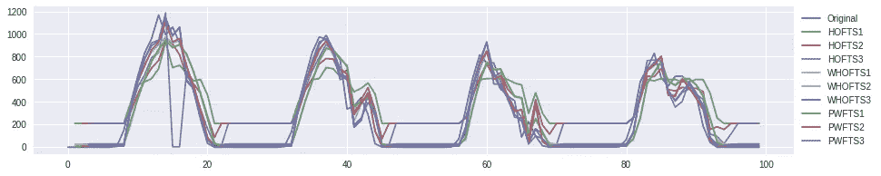

Performance sample of univariate models

## 多元方法

在pyft 上，多变量模型使用 Pandas 数据帧作为数据输入(单变量模型使用列表或 Numpy 数组),方法在 *models.multivariate* 包中。每个变量都有自己的分区方案和其他参数。您必须首先创建一个变量类型的对象，说明变量的名称、数据帧中的数据列和分割器。然后使用*追加变量*函数将外生和内生变量合并到模型中。内生变量必须在*目标变量*属性中设置。

```
from pyFTS.models.multivariate import common, variable, mvfts
from pyFTS.models.seasonal import partitioner as seasonal
from pyFTS.models.seasonal.common import DateTimesp = {'seasonality': DateTime.day_of_year , 'names': ['Jan','Feb','Mar','Apr','May','Jun','Jul', 'Aug','Sep','Oct','Nov','Dec']}month = variable.Variable("Month", data_label="data", partitioner=seasonal.TimeGridPartitioner, npart=12,data=train_mv, partitioner_specific=sp)radiation = variable.Variable("Radiation", data_label="glo_avg", alias='rad',partitioner=Grid.GridPartitioner, npart=35, data=train_mv)model = mvfts.MultivariateFTS()
model.append_variable(month)
model.append_variable(radiation)
model.target_variable = radiation
model.fit(train_mv)
```

除了我们的内生变量“glo_avg ”,我们将只使用“date”列，并从中提取两个外生变量:月份和小时。变量的划分如下所示:

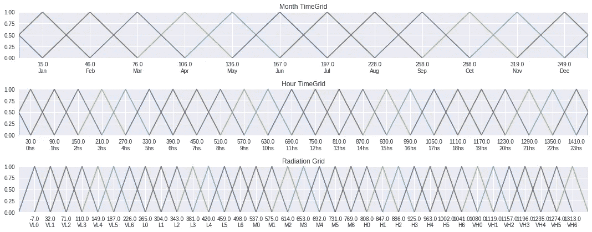

Partitioning scheme by variable

你可能会问自己:*为什么时间和月份会重叠？毕竟这是非常准确的信息！*回答:那是模糊逻辑的家伙！我们假设相邻的事物相互影响并具有相似的行为，因此特定时间的规则也会受到相邻时间和月份的影响。

现在让我们来看看多元方法，并看看它们生成的规则示例:

*   ***mvft。MultivariateFTS*** :失重一阶法(order = 1)；

```
Jan,8hs,VL0 → VL1,VL2,VL3,VL4,VL5
Jan,8hs,VL1 → VL1,VL2,VL3,VL4,VL5,L0,L1,L3,L4
```

*   ***wmvfts。Weighted multivariatedfts***:加权一阶法；

```
Jan,8hs,VL0  → VL2 (0.353), VL1 (0.253), VL4 (0.147), VL3 (0.207), VL5 (0.04)Jan,8hs,VL1  → VL2 (0.276), VL3 (0.172), VL1 (0.198), VL5 (0.083), VL4 (0.151), VL6 (0.021), L0 (0.036), L4 (0.005), L1 (0.036), L2 (0.021)
```

*   **颗粒状。GranularWMVFTS** :加权高阶法；

```
Jan11hsV3,Jan12hsL1  → Jan13hsVL6 (1.0)
Jan12hsL1,Jan13hsVL6  → Jan15hsVL3 (1.0)
```

# 对模型进行基准测试

显然，评估预测模型的主要标准是其准确性。我们将使用均方根误差(RMSE ),该值越低越好。但是另一个重要的标准是简约:简单的模型总是比复杂的模型更受欢迎。所以我们的目标是最小化 RMSE 和模型尺寸。让我们看看五个表现最好的模型:

预计多变量模型比单变量模型表现更好，毕竟，它们有更多的信息可以利用。但是请注意，最节省的模型是 PWFTS！

可能性不止于此。我们现在可以决定集合最好的模型([*models . ensemble*](https://pyfts.github.io/pyFTS/build/html/FTS.models.ensemble.html))，或者使用非平稳模糊集([*models . non stability*](https://pyfts.github.io/pyFTS/build/html/pyFTS.models.nonstationary.html))。但这是为了另一个机会！

# 扩大预测范围

当我们采用预测模型时，我们不仅对预测下一个值感兴趣，而且对预测这些值的序列感兴趣。这真的很酷，因为只要有一些滞后的信息，我们就可以对未来的许多步骤做出估计！对于太阳辐射预测的具体情况，我们将我们的预测范围设置为 48 小时。

对于 pyFTS 上的单变量模型，这非常简单，[只需使用*预测*函数](https://pyfts.github.io/pyFTS/build/html/pyFTS.common.html#pyFTS.common.fts.FTS.predict)的*提前步骤*参数。该参数将在下一次 *steps_ahead* 迭代中反馈输入中的输出值。

```
forecasts = model.predict(input_data, steps_ahead=48)
```

对于多元模型，这有点棘手:我们不仅生成内生变量的值，还生成外生变量的值。由于这个值的生成取决于每个变量的性质，除了 *steps_ahead* 参数之外，*生成器*参数也是必需的，它是一个字典，必须包含每个 Pandas DataFrame 列的一个键，其值是 lambda 函数，接收变量的当前值并返回下一个值。在我们的示例中，这非常简单，因为外生变量的值是日期时间，要计算下一个值，我们只需在输入值上加一个小时:

```
generator = lambda x : pd.to_datetime(x) + pd.to_timedelta(1, unit='h')forecasts = model.predict(input_data, steps_ahead=48, 
              generators={'date': generator})
```

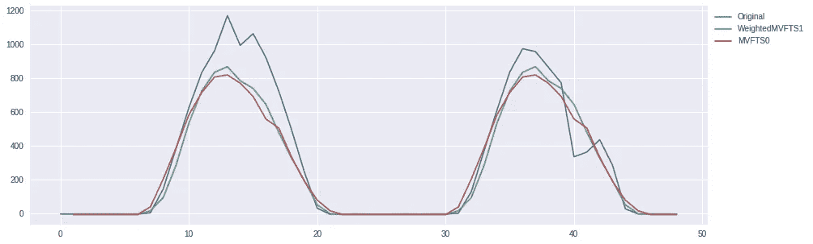

Forecasts for the next 48 hours, using the two best evaluated models

# 结论

现在，您已经对 FTS 和 pyFTS 库有了足够的了解，可以在您的个人项目中使用它们。当然，还有很多东西要谈！在下一个教程中，我们将讨论区间和概率预测、数据转换、非平稳和增量模型等。

如果您需要帮助、提出问题或给出反馈，请随时联系我们。回头见，伙计们！