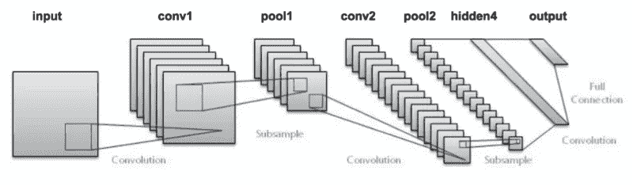
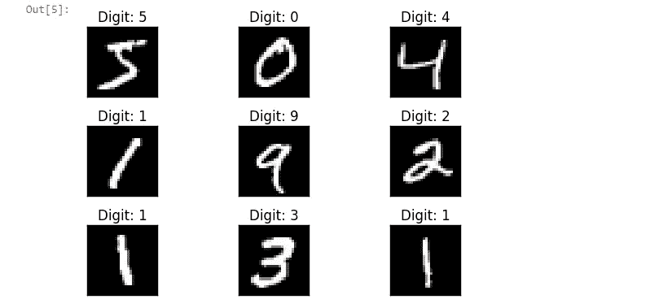
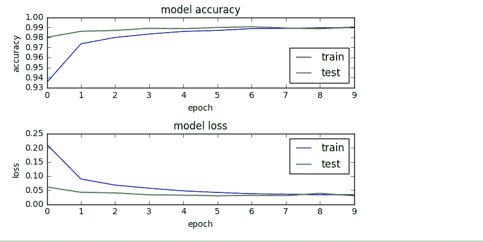

# 用于 MNIST 数字识别的简单 2D CNN

> 原文：<https://towardsdatascience.com/a-simple-2d-cnn-for-mnist-digit-recognition-a998dbc1e79a?source=collection_archive---------1----------------------->



卷积神经网络(CNN)是当前用于图像分类任务的最新架构。无论是面部识别、自动驾驶汽车还是物体检测，CNN 都在到处使用。在这篇文章中，我们使用 keras 和 tensorflow backend 为著名的 MNIST 数字识别任务设计了一个简单的二维卷积神经网络(CNN)模型。整个工作流程可以是:

1.  准备数据
2.  模型的建立和编译
3.  训练和评估模型
4.  将模型保存到磁盘以供重用

[](https://github.com/sambit9238/Deep-Learning/blob/master/cnn_mnist.ipynb) [## sambit 9238/深度学习

### 深度学习——深度学习技术在自然语言处理、计算机视觉等领域的实现。

github.com](https://github.com/sambit9238/Deep-Learning/blob/master/cnn_mnist.ipynb) 

**准备数据**

这里使用的数据集是上面提到的 MNIST 数据集。 **MNIST 数据库**(修改后的[国家标准技术研究院](https://en.wikipedia.org/wiki/National_Institute_of_Standards_and_Technology)数据库)是一个手写数字(0 到 9)的大型数据库。该数据库包含 60，000 个训练图像和 10，000 个测试图像，每个图像的大小为 28×28。第一步是加载数据集，这可以通过 keras api 轻松完成。

```
import keras
from keras.datasets import mnist
#load mnist dataset
(X_train, y_train), (X_test, y_test) = mnist.load_data() #everytime loading data won't be so easy :)
```

这里，X_train 包含 60，000 个训练图像数据，每个数据的大小为 28×28，y_train 包含它们相应的标签。类似地，X_test 包含 10，000 个测试图像的数据，每个维度为 28x28，y_test 包含它们相应的标签。让我们可视化一些来自训练的数据，以更好地了解深度学习模型的目的。

```
import matplotlib.pyplot as plt
fig = plt.figure()
for i in range(9):
  plt.subplot(3,3,i+1)
  plt.tight_layout()
  plt.imshow(X_train[i], cmap='gray', interpolation='none')
  plt.title("Digit: {}".format(y_train[i]))
  plt.xticks([])
  plt.yticks([])
fig
```



如这里可以看到的，在左上角,“5”的图像存储为 X _ train[0 ], y _ train[0]包含标签“5”。我们的深度学习模型应该能够只获取手写图像，并预测实际书写的数字。

现在，为了准备数据，我们需要对图像进行一些处理，如调整图像大小、归一化像素值等。

```
#reshaping
#this assumes our data format
#For 3D data, "channels_last" assumes (conv_dim1, conv_dim2, conv_dim3, channels) while 
#"channels_first" assumes (channels, conv_dim1, conv_dim2, conv_dim3).
if k.image_data_format() == 'channels_first':
    X_train = X_train.reshape(X_train.shape[0], 1, img_rows, img_cols)
    X_test = X_test.reshape(X_test.shape[0], 1, img_rows, img_cols)
    input_shape = (1, img_rows, img_cols)
else:
    X_train = X_train.reshape(X_train.shape[0], img_rows, img_cols, 1)
    X_test = X_test.reshape(X_test.shape[0], img_rows, img_cols, 1)
    input_shape = (img_rows, img_cols, 1)
#more reshaping
X_train = X_train.astype('float32')
X_test = X_test.astype('float32')
X_train /= 255
X_test /= 255
print('X_train shape:', X_train.shape) #X_train shape: (60000, 28, 28, 1)
```

在对图像信息进行必要的处理后，标签数据即 y_train 和 y_test 需要转换成分类格式，如标签**‘3’**应转换成向量**【0，0，0，1，0，0，0，0，0】**用于建模。

```
import keras
#set number of categories
num_category = 10
# convert class vectors to binary class matrices
y_train = keras.utils.to_categorical(y_train, num_category)
y_test = keras.utils.to_categorical(y_test, num_category)
```

**模型的建立和编译**

数据准备好输入模型后，我们需要定义模型的架构，并使用必要的[优化函数](https://keras.io/optimizers/)、[损失函数](https://keras.io/losses/)和[性能指标](https://keras.io/metrics/)对其进行编译。

此处遵循的架构是 2 个卷积层，然后分别是池层、全连接层和 softmax 层。对于不同类型的特征提取，在每个卷积层使用多个滤波器。一个直观的解释是，如果第一个过滤器有助于检测图像中的直线，第二个过滤器将有助于检测圆等等。对每一层的技术执行的解释将是即将到来的文章的一部分。为了更好地理解每一层，可以参考[](http://cs231n.github.io/convolutional-networks/)

*在最大池和全连接层之后，在我们的模型中引入了[丢弃](http://jmlr.org/papers/v15/srivastava14a.html)作为正则化，以减少过拟合问题。*

```
*##model building
model = Sequential()
#convolutional layer with rectified linear unit activation
model.add(Conv2D(32, kernel_size=(3, 3),
                 activation='relu',
                 input_shape=input_shape))
#32 convolution filters used each of size 3x3
#again
model.add(Conv2D(64, (3, 3), activation='relu'))
#64 convolution filters used each of size 3x3
#choose the best features via pooling
model.add(MaxPooling2D(pool_size=(2, 2)))
#randomly turn neurons on and off to improve convergence
model.add(Dropout(0.25))
#flatten since too many dimensions, we only want a classification output
model.add(Flatten())
#fully connected to get all relevant data
model.add(Dense(128, activation='relu'))
#one more dropout for convergence' sake :) 
model.add(Dropout(0.5))
#output a softmax to squash the matrix into output probabilities
model.add(Dense(num_category, activation='softmax'))*
```

*定义了模型的架构之后，就需要编译模型了。这里，我们使用分类交叉熵损失函数，因为它是一个多类分类问题。由于所有标签都具有相似的重量，因此我们更倾向于将准确性作为性能指标。称为 AdaDelta 的流行梯度下降技术用于优化模型参数。*

```
*#Adaptive learning rate (adaDelta) is a popular form of gradient descent rivaled only by adam and adagrad
#categorical ce since we have multiple classes (10) 
model.compile(loss=keras.losses.categorical_crossentropy,
              optimizer=keras.optimizers.Adadelta(),
              metrics=['accuracy'])*
```

***训练和评估模型***

*在模型架构被定义和编译之后，模型需要用训练数据来训练，以便能够识别手写数字。因此，我们将用 X_train 和 y_train 来拟合模型。*

```
*batch_size = 128
num_epoch = 10
#model training
model_log = model.fit(X_train, y_train,
          batch_size=batch_size,
          epochs=num_epoch,
          verbose=1,
          validation_data=(X_test, y_test))*
```

*这里，一个时期意味着所有训练样本的一次向前和一次向后传递。批量意味着一次向前/向后传递中训练样本的数量。培训输出是:*

**

*现在需要根据性能来评估训练好的模型。*

```
*score = model.evaluate(X_test, y_test, verbose=0)
print('Test loss:', score[0]) #Test loss: 0.0296396646054
print('Test accuracy:', score[1]) #Test accuracy: 0.9904*
```

*测试准确度 99%以上意味着模型在预测方面训练有素。如果我们可视化整个训练日志，那么随着更多的历元数，训练和测试数据的模型的损失和准确性收敛，从而使模型稳定。*

```
*import os
# plotting the metrics
fig = plt.figure()
plt.subplot(2,1,1)
plt.plot(model_log.history['acc'])
plt.plot(model_log.history['val_acc'])
plt.title('model accuracy')
plt.ylabel('accuracy')
plt.xlabel('epoch')
plt.legend(['train', 'test'], loc='lower right')plt.subplot(2,1,2)
plt.plot(model_log.history['loss'])
plt.plot(model_log.history['val_loss'])
plt.title('model loss')
plt.ylabel('loss')
plt.xlabel('epoch')
plt.legend(['train', 'test'], loc='upper right')plt.tight_layout()fig*
```

**

***将模型保存到磁盘以便重复使用***

*现在，训练好的模型需要序列化。模型的架构或结构将存储在 json 文件中，权重将以 hdf5 文件格式存储。*

```
*#Save the model
# serialize model to JSON
model_digit_json = model.to_json()
with open("model_digit.json", "w") as json_file:
    json_file.write(model_digit_json)
# serialize weights to HDF5
model.save_weights("model_digit.h5")
print("Saved model to disk")*
```

*因此，保存的模型可以在以后重用，或者很容易移植到其他环境中。在接下来的文章中，我们将看到如何在生产中部署这个经过训练的模型。*

*享受深度学习！*

*参考资料:*

*[](https://keras.io/getting-started/sequential-model-guide/) [## 顺序模型指南- Keras 文件

### Keras 顺序模型入门

keras.io](https://keras.io/getting-started/sequential-model-guide/) [](http://cs231n.github.io/convolutional-networks/) [## 用于视觉识别的 CS231n 卷积神经网络

### 斯坦福 CS231n 课程材料和笔记:视觉识别的卷积神经网络。

cs231n.github.io](http://cs231n.github.io/convolutional-networks/)*