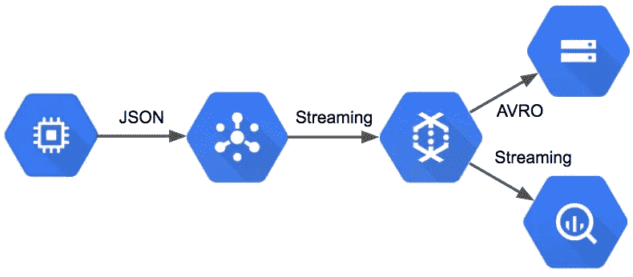
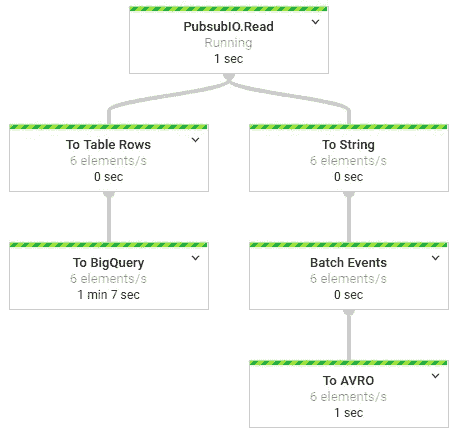
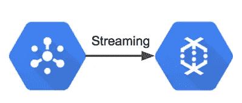
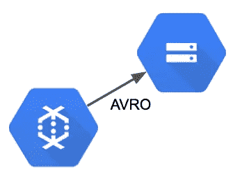
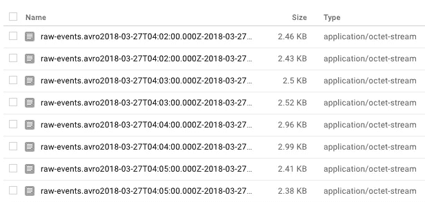
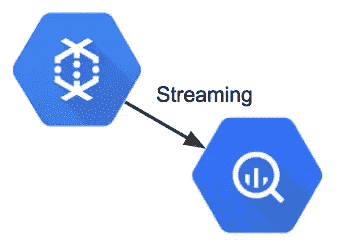
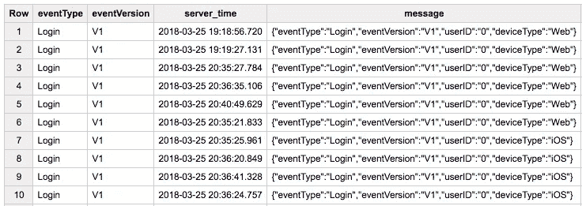
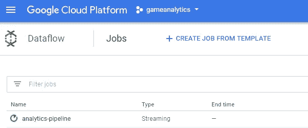
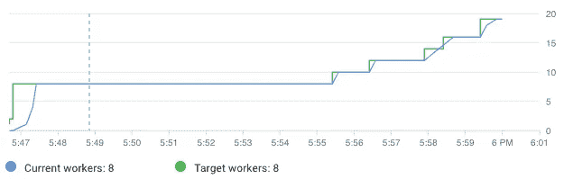

# 简单且可扩展的分析管道

> 原文：<https://towardsdatascience.com/a-simple-and-scalable-analytics-pipeline-53720b1dbd35?source=collection_archive---------2----------------------->


Source: [https://www.flickr.com/photos/bilfinger/14074154115](https://www.flickr.com/photos/bilfinger/14074154115)

收集关于应用程序使用和用户行为的数据，例如玩家在游戏中的进度，对于产品团队来说是无价的。通常，整个团队都致力于构建和维护数据管道，以收集和存储应用程序的跟踪数据。然而，随着许多新的无服务器工具的出现，构建用于收集应用程序使用数据的分析管道的障碍已经大大减少。Google 的 PubSub、DataFlow 和 BigQuery 等托管工具使小型团队能够建立可扩展到大量事件的分析管道，同时只需最低的运营开销。这篇文章描述了如何在谷歌云平台(GCP)上建立一个轻量级的分析管道，这个管道是完全管理的(无服务器的)并且可以自动扩展以满足需求。

我受到了谷歌用于手机游戏分析的参考架构的启发。这篇文章的目标是展示一个小团队可以构建和维护一个[数据管道](https://github.com/bgweber/GameAnalytics)，它可以扩展到大型事件量，为数据科学任务提供一个数据湖，为分析团队提供一个查询环境，并具有对其他组件的可扩展性，如应用程序的实验框架。

我用来实现这条数据管道的核心技术是谷歌的数据流，它现在与 [Apache Beam](https://cloud.google.com/blog/big-data/2016/08/cloud-dataflow-apache-beam-and-you) 库集成在一起。数据流任务定义了要在事件集合上执行的操作图，这些事件可以是流数据源。这篇文章展示了一个用 Java 实现的数据流任务，它将跟踪事件从 PubSub 主题传输到数据湖和 BigQuery。关于数据流及其概念的介绍可以在[谷歌的文档](https://cloud.google.com/dataflow/docs/concepts)中找到。虽然数据流任务是可移植的，但由于它们现在是基于 Apache Beam 的，这篇文章主要讨论如何将数据流与 GCP 上的其他托管服务结合使用，以构建一个简单、无服务器、可伸缩的数据管道。



My lightweight implementation of the GCP Reference Architecture for Analytics.

执行所有这些功能的数据管道相对简单。管道从 PubSub 读取消息，然后转换事件以实现持久性:管道的 BigQuery 部分将消息转换为 TableRow 对象并直接传输到 BigQuery，而管道的 AVRO 部分将事件批处理到离散的窗口中，然后将事件保存到 Google 存储中。操作图如下图所示。



The streaming pipeline deployed to Google Cloud

## **设置环境**

构建数据管道的第一步是设置编译和部署项目所需的依赖项。我使用了以下 maven 依赖项来为向管道发送事件的跟踪 API 和处理事件的数据管道设置环境。

```
<!-- *Dependencies for the Tracking API* ->
<dependency>
  <groupId>com.google.cloud</groupId>
  <artifactId>google-cloud-pubsub</artifactId>
  <version>0.32.0-beta</version>
  </dependency>
</dependencies><!-- *Dependencies for the data pipeline* ->
<dependency>
  <groupId>com.google.cloud.dataflow</groupId>
  <artifactId>google-cloud-dataflow-java-sdk-all</artifactId>
  <version>2.2.0</version>
</dependency>
```

我使用 Eclipse 来编写和编译本教程的代码，因为它是开源的。然而，其他 ide 如 [IntelliJ](https://www.jetbrains.com/idea/) 为部署和监控数据流任务提供了额外的特性。在将作业部署到 Google Cloud 之前，您需要为 PubSub 和 DataFlow 设置一个服务帐户。设置这些凭证超出了本文的范围，更多细节可以在 [Google 文档](https://cloud.google.com/bigquery/docs/authentication/service-account-file)中找到。

运行这个数据管道的另一个先决条件是在 GCP 上设置一个 PubSub 主题。我定义了一个 *raw-events* 主题，用于发布和消费数据管道的消息。关于创建 PubSub 主题的更多细节可在[这里](https://cloud.google.com/pubsub/docs/quickstart-console)获得。

要部署这个数据管道，您需要用上面列出的 maven 依赖项设置一个 java 环境，设置一个 Google Cloud 项目并启用计费，在存储和 BigQuery 服务上启用计费，并创建一个用于发送和接收消息的 PubSub 主题。所有这些托管服务都要花钱，但有一个免费层可用于构建数据管道原型。


Sending events from a server to a PubSub topic

## 发布事件

为了构建可用的数据管道，构建封装发送事件数据细节的 API 是很有用的。[跟踪 API](https://github.com/bgweber/GameAnalytics/blob/master/events/tracking/TrackingAPI.java) 类提供了这一功能，并可用于将生成的事件数据发送到数据管道。下面的代码显示了发送事件的方法签名，并显示了如何生成示例数据。

```
/** Event Signature for the Tracking API 
public void sendEvent(String eventType, String eventVersion, HashMap<String, String> attributes);
*/// send a batch of events    
for (int i=0; i<10000; i++) { // generate event names      
  String eventType = Math.random() < 0.5 ? 
      "Session" : (Math.random() < 0.5 ? "Login" : "MatchStart"); // create attributes to send      
  HashMap<String, String> attributes = new HashMap<String,String>();
  attributes.put("userID", "" + (int)(Math.random()*10000));
  attributes.put("deviceType", Math.random() < 0.5 ? 
      "Android" : (Math.random() < 0.5 ? "iOS" : "Web")); // send the event      
  tracking.sendEvent(eventType, "V1", attributes);      
}
```

跟踪 API 建立一个到 PubSub 主题的连接，以 JSON 格式传递事件，并实现一个回调来通知传递失败。下面提供了用于发送事件的代码，它基于 Google 的 PubSub 示例，在这里[提供](https://cloud.google.com/pubsub/docs/quickstart-client-libraries)。

```
// Setup a PubSub connection 
TopicName topicName = TopicName.of(projectID, topicID);
Publisher publisher = Publisher.newBuilder(topicName).build();// Specify an event to send
String event = {\"eventType\":\"session\",\"eventVersion\":\"1\"}";// Convert the event to bytes    
ByteString data = ByteString.copyFromUtf8(event.toString());//schedule a message to be published    
PubsubMessage pubsubMessage = 
  PubsubMessage.newBuilder().setData(data).build();// publish the message, and add this class as a callback listener
ApiFuture<String> future = publisher.publish(pubsubMessage);    ApiFutures.addCallback(future, this);
```

上面的代码使应用程序能够将事件发送到 PubSub 主题。下一步是在完全托管的环境中处理这些事件，该环境可以根据需要进行扩展以满足需求。

## 存储事件

数据管道的一个关键功能是让数据科学和分析团队可以使用测量的事件进行分析。用作端点的数据源应该具有低延迟，并且能够扩展到大量事件。本教程中定义的数据管道展示了如何将事件输出到 BigQuery 和数据湖，后者可用于支持大量分析业务用户。



Streaming event data from PubSub to DataFlow

这个数据管道的第一步是从 PubSub 主题中读取事件，并将获取的消息传递给数据流流程。DataFlow 提供了一个 PubSub 连接器，它支持将 PubSub 消息流式传输到其他 DataFlow 组件。下面的代码显示了如何实例化数据管道、指定流模式以及使用来自特定 PubSub 主题的消息。这个过程的输出是一组 PubSub 消息，可以存储起来供以后分析。

```
// set up pipeline options    
Options options = PipelineOptionsFactory.fromArgs(args)
  .withValidation().as(Options.class);    
options.setStreaming(true);    
Pipeline pipeline = Pipeline.create(options);// read game events from PubSub    
PCollection<PubsubMessage> events = pipeline
  .apply(PubsubIO.readMessages().fromTopic(topic));
```

我们希望存储事件的第一种方式是采用列格式，这种格式可用于构建数据湖。虽然这篇文章没有展示如何在下游 ETL 中利用这些文件，但是拥有一个数据湖是在需要修改数据库时维护数据集副本的好方法。数据湖提供了一种在由于模式变化或数据接收问题而需要时重新加载数据的方法。分配给该进程的数据管道部分如下所示。



Batching events to AVRO format and saving to Google Storage

对于 AVRO，我们不能使用直接分流的方法。在保存到平面文件之前，我们需要将事件分组到批处理中。在数据流中实现这一点的方法是应用窗口函数，将事件分组为固定的批次。下面的代码应用转换，将 PubSub 消息转换为 String 对象，以 5 分钟为间隔将消息分组，并将结果批量输出到 Google Storage 上的 AVRO 文件。

```
// AVRO output portion of the pipeline    
events
.apply("To String", ParDo.of(new DoFn<PubsubMessage, String>() {
  @ProcessElement        
  public void processElement(ProcessContext c) throws Exception {
    String message = new String(c.element().getPayload());
    c.output(message);        
  }      
}))// Batch events into 5 minute windows      
.apply("Batch Events", Window.<String>into(    
    FixedWindows.of(Duration.standardMinutes(5)))       
  .triggering(AfterWatermark.pastEndOfWindow())     
  .discardingFiredPanes()              
  .withAllowedLateness(Duration.standardMinutes(5))) // Save the events in ARVO format      
.apply("To AVRO", AvroIO.write(String.class)
  .to("gs://your_gs_bucket/avro/raw-events.avro")
  .withWindowedWrites() 
  .withNumShards(8)
  .withSuffix(".avro"));
```

总而言之，上面的代码将事件分批放入 5 分钟的窗口中，然后将事件导出到 Google Storage 上的 AVRO 文件中。

这部分数据管道的结果是谷歌存储上的 AVRO 文件的集合，可以用来建立一个数据湖。每隔 5 分钟就会生成一个新的 AVRO 输出，下游 ETL 可以将原始事件解析为经过处理的特定于事件的表模式。下图显示了 AVRO 文件的输出示例。



AVRO files saved to Google Storage

除了创建数据湖之外，我们还希望在查询环境中可以立即访问事件。DataFlow 提供了一个 BigQuery 连接器来实现这一功能，传输到这个端点的数据在短时间内就可以用于分析。下图显示了数据管道的这一部分。



Streaming events from DataFlow to BigQuery

数据管道将 PubSub 消息转换为 TableRow 对象，这些对象可以直接插入到 BigQuery 中。下面的代码由两个应用方法组成:数据转换和 IO 写入程序。转换步骤从 PubSub 读取消息有效负载，将消息解析为 JSON 对象，提取 *eventType* 和 *eventVersion* 属性，并使用这些属性以及时间戳和消息有效负载创建 TableRow 对象。第二个 apply 方法告诉管道将记录写入 BigQuery，并将事件追加到现有表中。

```
// parse the PubSub events and create rows to insert into BigQuery    events.apply("To Table Rows", new 
  PTransform<PCollection<PubsubMessage>, PCollection<TableRow>>() { 
    public PCollection<TableRow> expand(
        PCollection<PubsubMessage> input) {       

      return input.apply("To Predictions", ParDo.of(new  
          DoFn<PubsubMessage, TableRow>() {    

    @ProcessElement          
    public void processElement(ProcessContext c) throws Exception {
      String message = new String(c.element().getPayload()); 

      // parse the json message for attributes
      JsonObject jsonObject = 
          new JsonParser().parse(message).getAsJsonObject();
      String eventType = jsonObject.get("eventType").getAsString();
      String eventVersion = jsonObject.
              get("eventVersion").getAsString();          
      String serverTime = dateFormat.format(new Date()); 

     // create and output the table row            
     TableRow record = new TableRow();            
     record.set("eventType", eventType);               
     record.set("eventVersion", eventVersion);          
     record.set("serverTime", serverTime);
     record.set("message", message);            
     c.output(record);          
  }}));      
}})

//stream the events to Big Query    
.apply("To BigQuery",BigQueryIO.writeTableRows()   
  .to(table)           
  .withSchema(schema)
  .withCreateDisposition(CreateDisposition.CREATE_IF_NEEDED)
  .withWriteDisposition(WriteDisposition.WRITE_APPEND));
```

总结一下上面的代码，从 PubSub 消费的每个消息都转换为带有时间戳的 TableRow 对象，然后流式传输到 BigQuery 进行存储。

数据管道的这一部分的结果是，事件将被流式传输到 BigQuery，并可在由 DataFlow 任务指定的输出表中进行分析。为了有效地将这些事件用于查询，您需要构建额外的 ETL 来创建具有模式化记录的已处理事件表，但现在已经有了用于存储跟踪事件的数据收集机制。



Game event records queried from the raw-events table in BigQuery

## **部署和自动扩展**

使用 DataFlow，您可以在本地测试数据管道，或者部署到云中。如果在未指定其他属性的情况下运行代码示例，则数据管道将在本地计算机上执行。为了部署到云并利用此数据管道的自动缩放功能，您需要指定一个新的 runner 类作为运行时参数的一部分。为了运行数据管道，我使用了以下运行时参数:

```
--runner=org.apache.beam.runners.dataflow.DataflowRunner 
--jobName=game-analytics
--project=your_project_id 
--tempLocation=gs://temp-bucket
```

部署作业后，您应该会看到一条消息，说明作业已提交。然后您可以点击 [DataFlow 控制台](https://console.cloud.google.com/dataflow)查看任务:



The steaming data pipeline running on Google Cloud

上面指定的运行时配置将不会默认为自动缩放配置。为了部署根据需求扩大规模的作业，您需要指定其他属性，例如:

```
--autoscalingAlgorithm=THROUGHPUT_BASED
--maxNumWorkers=30
```

有关设置数据流任务以适应繁重工作负载条件的更多详细信息，请参见 Spotify 的这篇 Google 文章中的[和这篇文章](https://cloud.google.com/blog/big-data/2016/03/comparing-cloud-dataflow-autoscaling-to-spark-and-hadoop)[。下图显示了 DataFlow 如何根据需要进行扩展以满足需求。](https://labs.spotify.com/2016/03/10/spotifys-event-delivery-the-road-to-the-cloud-part-iii/)



An example of Dataflow auto scaling. The pipeline will scale up and down as necessary to match demand.

## 结论

现在有各种各样的工具可以用最少的努力为游戏或网络应用建立一个分析管道。使用托管资源使小型团队能够利用无服务器和自动扩展的基础架构，以最少的基础架构管理扩展到大量事件。您可以记录应用程序的所有相关数据，而不是使用数据供应商现成的数据收集解决方案。

这篇文章的目标是展示如何使用 GCP 堆栈建立数据湖和查询环境。虽然这里介绍的方法不能直接移植到其他云，但是用于实现该数据管道核心功能的 Apache Beam 库是可移植的，并且可以利用类似的工具在其他云提供商上构建可伸缩的数据管道。

该架构是对分析和数据科学团队有用的事件收集系统的最小实现。为了满足大多数分析团队的需求，需要将原始事件转换为经过处理的熟事件，以满足业务需求。这个讨论超出了本文的范围，但是分析基础现在应该已经到位，可以构建一个高效的数据平台。

Github 上提供了该示例管道的完整源代码:

[](https://github.com/bgweber/GameAnalytics) [## BG Weber/游戏分析

### 游戏分析——游戏分析的全面管理管道

github.com](https://github.com/bgweber/GameAnalytics) 

[本·韦伯](https://www.linkedin.com/in/ben-weber-3b87482/)是[意外收获数据](https://angel.co/windfall-data)的首席数据科学家，我们的任务是建立最准确和全面的净值模型。意外收获团队正在壮大，并正在招聘[工程师](https://angel.co/windfall-data/jobs/191572-senior-data-engineer)和[数据科学家](https://angel.co/windfall-data/jobs/335043-data-scientist)。