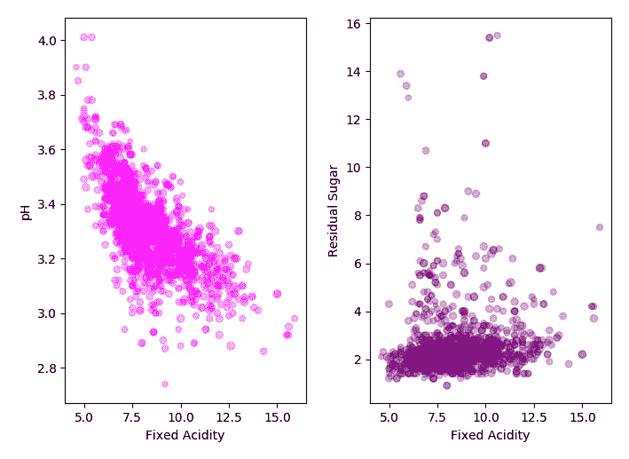

# 用 Scikit-learn 实现机器学习中流水线的一个简单例子

> 原文：<https://towardsdatascience.com/a-simple-example-of-pipeline-in-machine-learning-with-scikit-learn-e726ffbb6976?source=collection_archive---------0----------------------->


Akagiyama: (Image Source: Author)

今天的帖子将简短明了，我将带你看一个在 python 机器学习中使用管道的例子。我将使用其他一些重要的工具，如`GridSearchCV`等。，演示管道的实现，最后解释为什么管道在某些情况下确实是必要的。我们开始吧

根据 scikit-learn 对`pipeline`类的定义是

> 顺序应用变换列表和最终估计器。流水线的中间步骤必须实现 fit 和 transform 方法，而最终的估计器只需要实现 fit。

一旦我们开始在一个简单的数据集上实现 pipeline，上面的语句就更有意义了。这里我使用的是红酒数据集[，](https://github.com/suvoooo/Machine_Learning/blob/master/winequality-red.csv)，其中的“标签”是葡萄酒的质量，范围从 0 到 10。就数据预处理而言，这是一个相当简单的数据集，因为它没有缺失值。

```
import pandas as pd winedf = pd.read_csv('winequality-red.csv',sep=';')
# print winedf.isnull().sum() # check for missing dataprint winedf.head(3)>>> fixed ac.  volat. ac.  citric ac.  res. sugar chlorides  \
0     7.4       0.70         0.00             1.9   0.076   
1     7.8       0.88         0.00             2.6   0.098   
2     7.8       0.76         0.04             2.3   0.092free sulfur diox.  tot. sulfur diox.  dens.  pH  sulphates  \
0     11.0            34.0           0.9978  3.51       0.56   
1     25.0            67.0           0.9968  3.20       0.68   
2     15.0            54.0           0.9970  3.26       0.65 alcohol  quality  
0      9.4        5  
1      9.8        5  
2      9.8        5
```

我们总是可以用`seaborn`来检查相关图，或者我们可以用散点图来绘制一些特征，下面是两个这样的图..



Correlation between pH and Acidity (Image: Author)

正如预期的那样，与残糖和酸度相比，酸度和 pH 具有很高的负相关性。一旦我们熟悉并充分利用了数据集，让我们来讨论和实现管道。

顾名思义，`*pipeline*` *类允许将多个进程粘贴到一个 scikit-learn 估计器中。* `*pipeline*` *类有拟合、预测和评分方法，就像任何其他估计器一样*(例如。`LinearRegression`)。

为了实现 pipeline，通常我们首先从数据集分离特征和标签。

```
X=winedf.drop(['quality'],axis=1)
Y=winedf['quality']
```

如果你仔细观察了`pd.head(3)`的输出，你会发现数据集的特性变化很大。正如我之前解释的，就像[主成分分析](/dive-into-pca-principal-component-analysis-with-python-43ded13ead21)一样，一些拟合算法需要缩放，这里我将使用一个这样的算法，称为 SVM(支持向量机)。关于 SVM 的更多理论，你可以查看我的[其他帖子](/understanding-support-vector-machine-part-1-lagrange-multipliers-5c24a52ffc5e)。

```
from sklearn.svm import SVC
from sklearn.preprocessing import StandardScaler
from sklearn.model_selection import train_test_split, GridSearchCV
```

这里我们使用`StandardScaler`，它从每个特征中减去平均值，然后缩放到单位方差。

现在，我们准备通过提供步骤列表来创建管道对象。我们的步骤是——标准标量和支持向量机。*这些步骤是由转换器或估算器的名称和实例组成的元组列表。*让我们来看看下面这段代码，以便澄清 *-*

```
steps = [('scaler', StandardScaler()), ('SVM', SVC())]from sklearn.pipeline import Pipeline
pipeline = Pipeline(steps) # define the pipeline object.
```

字符串(' scaler '，' SVM ')可以是任何东西，因为这些只是为了清楚地识别转换器或估计器的名称。我们可以用`make_pipeline`代替流水线，避免命名估计器或变换器。*最后一步必须是元组列表中的估计器。*

我们用一个`random_state=30`将数据集分为训练集和测试集。

```
X_train, X_test, y_train, y_test = train_test_split(X,Y,test_size=0.2, random_state=30, stratify=Y)
```

*有必要使用* `*stratify*` *正如我之前提到的，标签是不平衡的，因为大部分葡萄酒质量属于 5、6 级。*您可以使用 pandas `value_counts()`进行检查，它返回包含唯一值计数的对象。

```
print winedf['quality'].value_counts() >>> 5    681
    6    638
    7    199
    4     53
    8     18
    3     10
```

SVM 通常使用两个参数`gamma,C`进行优化。我已经在另一篇文章的[中讨论了这些参数的影响，但是现在，让我们定义一个我们将在`GridSearchCV`中使用的参数网格。](/visualizing-support-vector-machine-decision-boundary-69e7591dacea)

```
parameteres = {'SVM__C':[0.001,0.1,10,100,10e5], 'SVM__gamma':[0.1,0.01]}
```

现在我们用管道实例化`GridSearchCV`对象，用 5 重交叉验证实例化参数空间。

```
grid = GridSearchCV(pipeline, param_grid=parameteres, cv=5)
```

我们可以用它来拟合训练数据集，并在测试数据集上测试算法。我们还可以找到最适合 SVM 的参数，如下所示

```
grid.fit(X_train, y_train)print "score = %3.2f" %(grid.score(X_test,y_test))print grid.best_params_>>> score = 0.60
    {'SVM__C': 100, 'SVM__gamma': 0.1}
```

由此，我们看到了一个有效地使用网格搜索流水线来测试支持向量机算法的例子。

[在另一篇文章](/visualizing-support-vector-machine-decision-boundary-69e7591dacea)中，我已经详细讨论了如何应用 pipeline 和 GridSearchCV 以及如何为 SVM 绘制决策函数。你可以使用任何其他算法，如逻辑回归，而不是 SVM，来测试哪种学习算法最适合红酒数据集。*为了在更真实的数据集上应用包括 GridSearchCV 在内的管道中的决策树算法，您可以查看* [*这篇文章*](/understanding-decision-tree-classification-with-scikit-learn-2ddf272731bd) *。*

## 为什么选择管道:

我将用一个简单直观的解释来结束这篇文章，解释为什么管道有时是必要的。它有助于执行所需的应用步骤顺序，创建一个方便的工作流程，确保工作的可重复性。但是，管道中还有更多东西，因为我们使用了网格搜索交叉验证，我们可以更好地理解它。

上例中的管道对象是用`StandardScaler`和`SVM`创建的。如果单独使用管道，那么对于`StandardScaler`，可以如下进行

```
scale = StandardScaler().fit(X_train)
X_train_scaled = scale.transform(X_train)
grid = GridSearchCV(SVC(), param_grid=parameteres, cv=5)
grid.fit(X_train_scaled, y_train)
```

这里我们看到了单独应用变压器和估计器的固有问题，其中估计器(SVM)的参数是使用`GridSearchCV`确定的。用于交叉验证的缩放特征被分成测试和训练文件夹，但是网格搜索内的测试文件夹已经包含关于训练集的信息，因为整个训练集(X_train)被用于标准化。更简单地说，当`SVC.fit()`使用交叉验证完成时，特性已经包括来自测试文件夹的信息，因为`StandardScaler.fit()`是在整个训练集上完成的。

人们可以通过使用管道绕过这种过分简化。使用管道，我们将`StandardScaler()`和`SVC()`粘合在一起，这确保了在交叉验证期间`StandardScaler`仅适用于训练折叠，与用于`SVC.fit()`的折叠完全相似。安德烈亚斯·穆勒的书给出了上述描述的一个奇妙的图示。

[1]安德烈亚斯·穆勒、萨拉·圭多；用 Python 进行机器学习的介绍；PP-305–320；第一版；莱利·奥出版公司；[亚马逊链接](https://www.amazon.com/Introduction-Machine-Learning-Python-Scientists/dp/1449369413)

你可以在 G [itHub 中找到完整的代码。](https://github.com/suvoooo/Machine_Learning/blob/master/pipelineWine.py)

干杯！保持坚强！！

***如果你对更深入的基础机器学习概念感兴趣，可以考虑加盟 Medium 使用*** [***我的链接***](https://saptashwa.medium.com/membership) ***。你不用额外付钱，但我会得到一点佣金。感谢大家！！***