# 初始网络版本的简单指南

> 原文：<https://towardsdatascience.com/a-simple-guide-to-the-versions-of-the-inception-network-7fc52b863202?source=collection_archive---------0----------------------->

初始网络是 CNN 分类器发展的一个重要里程碑。在其出现之前(双关语)，大多数流行的 CNN 只是将卷积层越叠越深，希望获得更好的性能。


Designing CNNs in a nutshell. Fun fact, this meme was referenced in the [first inception net paper](https://arxiv.org/pdf/1409.4842v1.pdf).

另一方面，初始网络是复杂的(大量工程)。它使用了很多技巧来提升性能；无论是速度还是准确度。它的不断演变导致了几个版本的网络的产生。流行的版本如下:

*   [盗梦空间 v1。](https://arxiv.org/pdf/1409.4842v1.pdf)
*   [盗梦空间 v2 和盗梦空间 v3。](https://arxiv.org/pdf/1512.00567v3.pdf)
*   [盗梦空间 v4 和盗梦空间-ResNet。](https://arxiv.org/pdf/1602.07261.pdf)

每个版本都是对前一个版本的迭代改进。了解这些升级可以帮助我们构建在速度和准确性上都得到优化的定制分类器。a̶l̶s̶o̶,̶̶d̶e̶p̶e̶n̶d̶i̶n̶g̶̶o̶n̶̶y̶o̶u̶r̶̶d̶a̶t̶a̶,̶̶a̶̶l̶o̶w̶e̶r̶̶v̶e̶r̶s̶i̶o̶n̶̶m̶a̶y̶̶a̶c̶t̶u̶a̶l̶l̶y̶̶w̶o̶r̶k̶̶b̶e̶t̶t̶e̶r̶.̶*(编辑:删除了这句话，因为它相当投机；请忽略相同)*。

这篇博文旨在阐明盗梦空间网络的演变。

# 盗梦空间 v1

这是一切开始的地方。让我们分析一下它打算解决什么问题，以及它是如何解决的。[(论文)](https://arxiv.org/pdf/1409.4842v1.pdf)

## 前提是:

*   **图像中的显著部分**在尺寸上可以有极其**大的变化**。例如，一幅带有狗的图像可以是以下任意一种，如下所示。在每幅图像中，狗占据的区域是不同的。


From left: A dog occupying most of the image, a dog occupying a part of it, and a dog occupying very little space (Images obtained from [Unsplash](https://unsplash.com/)).

*   由于信息位置的巨大变化，为卷积运算选择正确的内核大小变得困难。一个**较大的内核**优选用于更多**全局分布**的信息，一个**较小的内核**优选用于更多**局部分布的信息。**
*   **非常深的网络**容易**过拟合**。也很难通过整个网络传递梯度更新。
*   天真地叠加大型卷积运算**计算量大**。

## 解决方案是:

为什么不让**多尺寸**的过滤器在**同一水平面**上运行？这个网络本质上会变得更宽一点，而不是更深一点。作者设计了 inception 模块来反映这一点。

下图是“幼稚”的初始模块。它对一个输入执行**卷积**，使用 **3 个不同大小的滤波器** (1x1，3x3，5x5)。此外，**最大汇集**也被执行。输出被**连接**并发送到下一个初始模块。

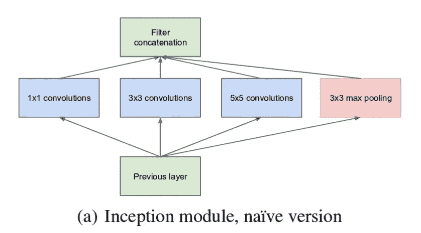

The naive inception module. (Source: [Inception v1](https://arxiv.org/pdf/1409.4842v1.pdf))

如前所述，深度神经网络**计算量很大**。为了让它更便宜，作者**通过在 3x3 和 5x5 卷积之前添加**额外的 1x1 卷积**来限制**输入通道**的数量**。虽然增加一个额外的运算看起来可能违反直觉，但 1x1 卷积比 5x5 卷积便宜得多，而且输入通道数量的减少也有所帮助。但是，请注意，1x1 卷积是在 max pooling 层之后引入的，而不是之前。

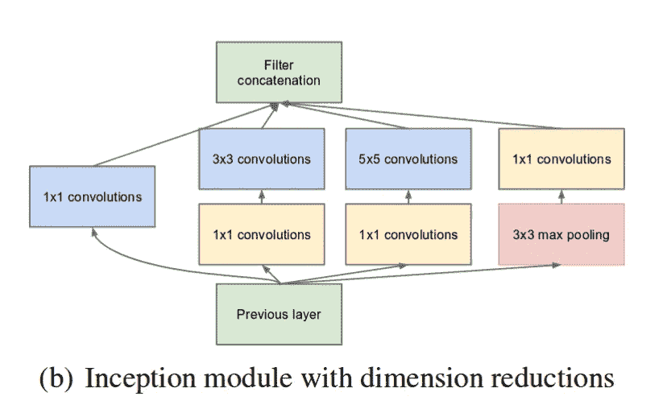

Inception module with dimension reduction. (Source: [Inception v1](https://arxiv.org/pdf/1409.4842v1.pdf))

利用降维初始模块，构建了神经网络结构。这就是广为人知的 GoogLeNet (Inception v1)。该架构如下所示:

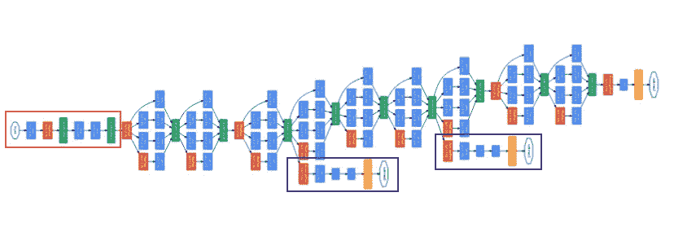

GoogLeNet. The orange box is the **stem**, which has some preliminary convolutions. The purple boxes are **auxiliary classifiers**. The wide parts are the inception modules. (Source: [Inception v1](https://arxiv.org/pdf/1409.4842v1.pdf))

GoogLeNet 有 9 个这样的线性堆叠的初始模块。它有 22 层深(27 层，包括池层)。它在最后一个 inception 模块的末尾使用全局平均池。

不用说，是一个挺**的深度分类器**。如同任何非常深的网络一样，它受到消失梯度问题的影响。

为了防止网络的**中间部分**被**淘汰**，作者引入了**两个辅助分类器**(图中的紫色方框)。他们实际上将 softmax 应用于两个初始模块的输出，并计算了相同标签上的**辅助损失**。**总损失函数**是**辅助损失**和**实际损失**的加权和**。本文中使用的权重值为每个辅助损失 0.3。**

```
# The total loss used by the inception net during training.
**total_loss = real_loss + 0.3 * aux_loss_1 + 0.3 * aux_loss_2**
```

辅助损失不用多说，纯粹用于训练目的，推理时忽略。

# 盗梦空间 v2

**盗梦 v2** 和**盗梦 v3** 在**同** [**论文**](https://arxiv.org/pdf/1512.00567v3.pdf) 中呈现。作者提出了许多提高精确度和降低计算复杂性的改进措施。Inception v2 探索了以下内容:

## 前提是:

*   减少代表性瓶颈。直觉是，当卷积没有显著改变输入的维度时，神经网络表现得更好。过多地减少维度可能会导致信息丢失，这就是所谓的“表示瓶颈”
*   使用智能因子分解方法，卷积可以在计算复杂性方面变得更有效。

## 解决方案是:

*   **将 5x5** 卷积**因式分解为两个 3x3** 卷积运算，提高计算速度。虽然这看起来可能违反直觉，但 5x5 卷积比 3x3 卷积贵 2.78 倍。因此，堆叠两个 3×3 卷积实际上会导致性能的提升。下图对此进行了说明。

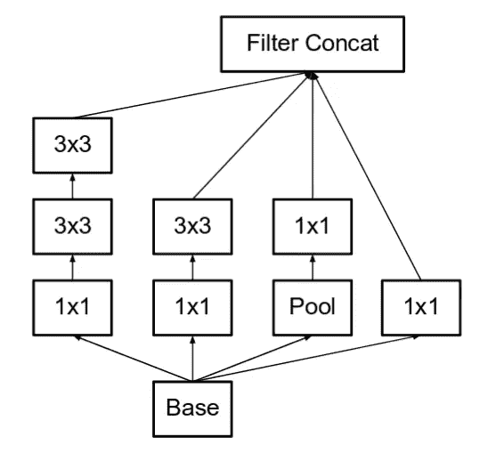

The left-most 5x5 convolution of the old inception module, is now represented as two 3x3 convolutions. (Source: [Incpetion v2](https://arxiv.org/pdf/1512.00567v3.pdf))

*   此外，它们**将滤波器尺寸 **nxn** 的**卷积分解为 **1xn 和 nx1** 卷积的**组合**。例如，3×3 卷积相当于首先执行 1×3 卷积，然后对其输出执行 3×1 卷积。他们发现这种方法比单一的 3x3 卷积便宜 33%。下图对此进行了说明。

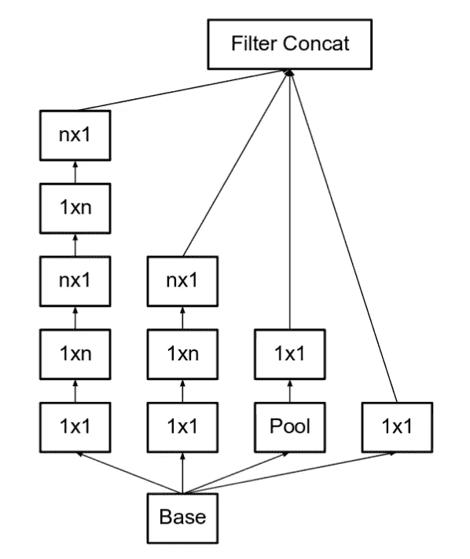

Here, put **n=3** to obtain the equivalent of the previous image. The left-most 5x5 convolution can be represented as two 3x3 convolutions, which inturn are represented as 1x3 and 3x1 in series. (Source: [Incpetion v2](https://arxiv.org/pdf/1512.00567v3.pdf))

*   模块中的**滤波器组**被**扩展**(变得更宽而不是更深)以消除代表性瓶颈。如果模块做得更深，尺寸会过度减小，从而丢失信息。下图对此进行了说明。

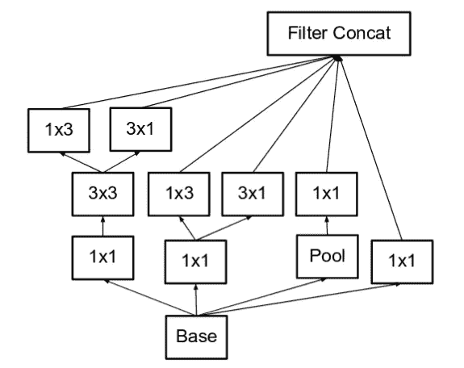

Making the inception module wider. This type is equivalent to the module shown above. (Source: [Incpetion v2](https://arxiv.org/pdf/1512.00567v3.pdf))

*   以上三个原则被用来构建三种不同类型的初始模块(让我们按照它们被介绍的顺序称它们为模块 **A、B** 和 **C** )。这些名称是为了清楚起见而介绍的，而不是正式名称)。该架构如下所示:

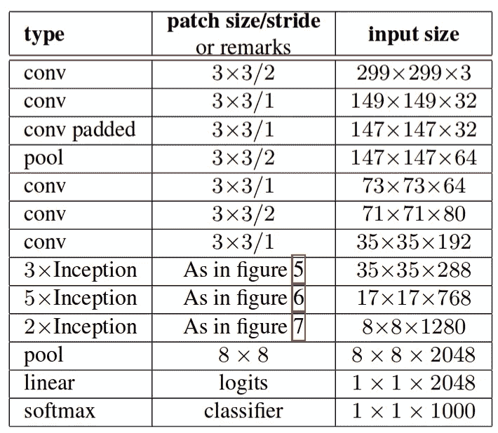

Here, “figure 5” is module A, “figure 6” is module B and “figure 7” is module C. (Source: [Incpetion v2](https://arxiv.org/pdf/1512.00567v3.pdf))

# 盗梦空间 v3

## 前提

*   作者注意到**辅助分类器**直到训练过程接近尾声时，准确率接近饱和，才发挥了很大作用。他们争辩说，他们的职能是**调整**，特别是如果他们有 BatchNorm 或 Dropout 操作。
*   将调查在不大幅改变模块的情况下改进 Inception v2 的可能性。

## 解决方案

*   **Inception Net v3** 整合了上述针对 Inception v2 的所有升级，此外还使用了以下内容:

1.  RMSProp 优化器。
2.  因子分解的 7x7 卷积。
3.  辅助分类器中的 BatchNorm。
4.  标注平滑(一种添加到损失公式中的正则化组件，用于防止网络对某个类过于自信。防止过度配合)。

# 初始版本 4

**盗梦空间 v4** 和**盗梦空间-ResNet** 在**同** [**论文**](https://arxiv.org/pdf/1602.07261.pdf) 中有介绍。为了清楚起见，让我们在单独的部分中讨论它们。

## 前提

*   使模块更加**一致**。作者还注意到一些模块比必要的模块更加复杂。这可以让我们通过添加更多这样的统一模块来提升性能。

## 解决方案

*   盗梦空间 v4 的**词干**被**修改**。这里的词干指的是在引入先启块之前执行的初始操作集。

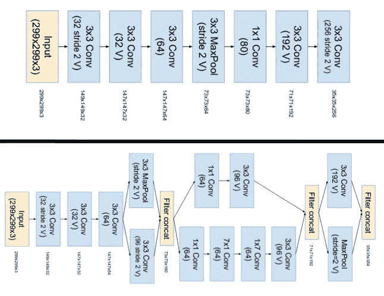

The top image is the stem of Inception-ResNet v1\. The bottom image is the stem of Inception v4 and Inception-ResNet v2\. (Source: [Inception v4](https://arxiv.org/pdf/1602.07261.pdf))

*   他们有三个主要的 inception 模块，命名为 A、B 和 C(与 Inception v2 不同，这些模块实际上命名为 A、B 和 C)。它们看起来非常类似于它们的 Inception v2(或者 v3)的对应物。

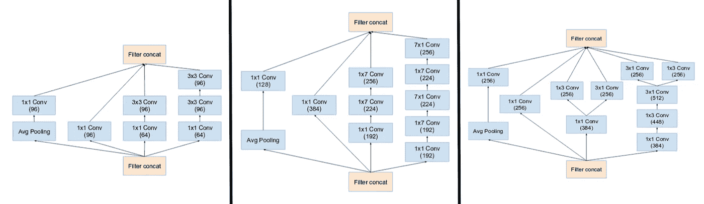

(From left) Inception modules A,B,C used in Inception v4\. Note how similar they are to the Inception v2 (or v3) modules. (Source: [Inception v4](https://arxiv.org/pdf/1602.07261.pdf))

*   Inception v4 引入了专门的**缩减块**，用于改变网格的宽度和高度。早期版本没有明确的 reduction 块，但是功能已经实现。

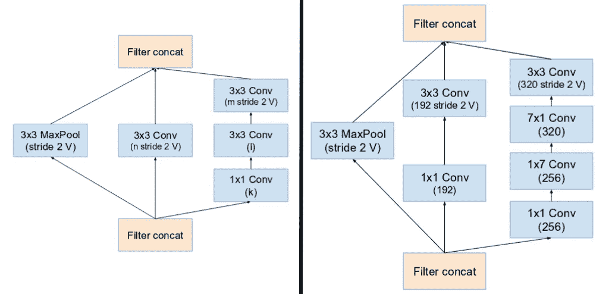

(From Left) Reduction Block A (35x35 to 17x17 size reduction) and Reduction Block B (17x17 to 8x8 size reduction). Refer to the paper for the exact hyper-parameter setting (V,l,k). (Source: [Inception v4](https://arxiv.org/pdf/1602.07261.pdf))

# Inception-ResNet v1 和 v2

受 [ResNet](https://arxiv.org/abs/1512.03385) 性能的启发，提出了一个混合初始模块。Inception ResNet 有两个子版本，即 v1 和 v2。在我们检查显著的特性之前，让我们看看这两个子版本之间的细微差别。

*   Inception-ResNet v1 的计算成本与 Inception v3 相似。
*   Inception-ResNet v2 的计算成本与 Inception v4 相似。
*   它们有**不同的词干**，如 Inception v4 部分所示。
*   两个子版本的**模块 A、B、C** 和**减速块**的**结构**相同。唯一的**差异**是**超参数**设置。在这一节中，我们将只关注结构。请参考论文以获得准确的超参数设置(图片来自 Inception-Resnet v1)。

## 前提

*   引入剩余连接，将初始模块卷积运算的输出添加到输入中。

## 解决方案

*   对于剩余加法来说，卷积后的输入和输出必须具有相同的维数。因此，我们在原始卷积后使用 1x1 卷积，以匹配深度大小(卷积后深度增加)。

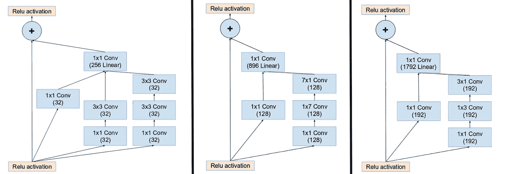

(From left) Inception modules A,B,C in an Inception ResNet. Note how the pooling layer was replaced by the residual connection, and also the additional 1x1 convolution before addition. (Source: [Inception v4](https://arxiv.org/pdf/1602.07261.pdf))

*   主要初始模块中的池化操作被替换为支持剩余的连接。但是，您仍然可以在归约块中找到这些工序。缩减块 A 与初始 v4 的缩减块相同。

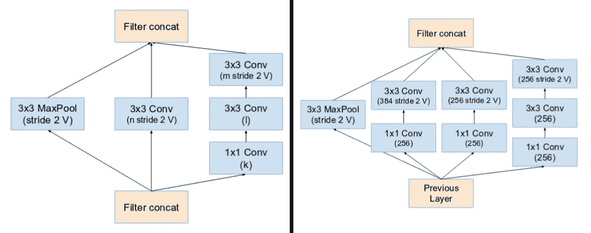

(From Left) Reduction Block A (35x35 to 17x17 size reduction) and Reduction Block B (17x17 to 8x8 size reduction). Refer to the paper for the exact hyper-parameter setting (V,l,k). (Source: [Inception v4](https://arxiv.org/pdf/1602.07261.pdf))

*   如果过滤器的数量超过 1000，在体系结构中具有较深残余单元的网络会导致网络“死亡”。因此，为了增加稳定性，作者将剩余激活值调整为大约 0.1 到 0.3。

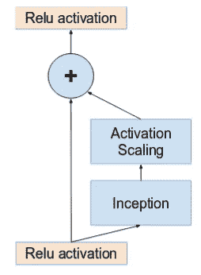

Activations are scaled by a constant to prevent the network from dying. (Source: [Inception v4](https://arxiv.org/pdf/1602.07261.pdf))

*   原论文没有使用求和后的 BatchNorm 在单个 GPU 上训练模型(在单个 GPU 上拟合整个模型)。
*   据发现，Inception-ResNet 模型能够在较低的时期达到较高的精确度。
*   Inception v4 和 Inception-ResNet 的最终网络布局如下:

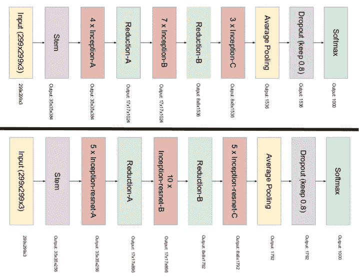

The top image is the layout of Inception v4\. The bottom image is the layout of Inception-ResNet. (Source: [Inception v4](https://arxiv.org/pdf/1602.07261.pdf))

> 感谢您阅读本文！希望它能让你对盗梦空间网有所了解。如果是的话，请按拍手按钮！如果您有任何问题，可以通过社交媒体[或电子邮件(bharathrajn98@gmail.com)联系我。](https://thatbrguy.github.io/)