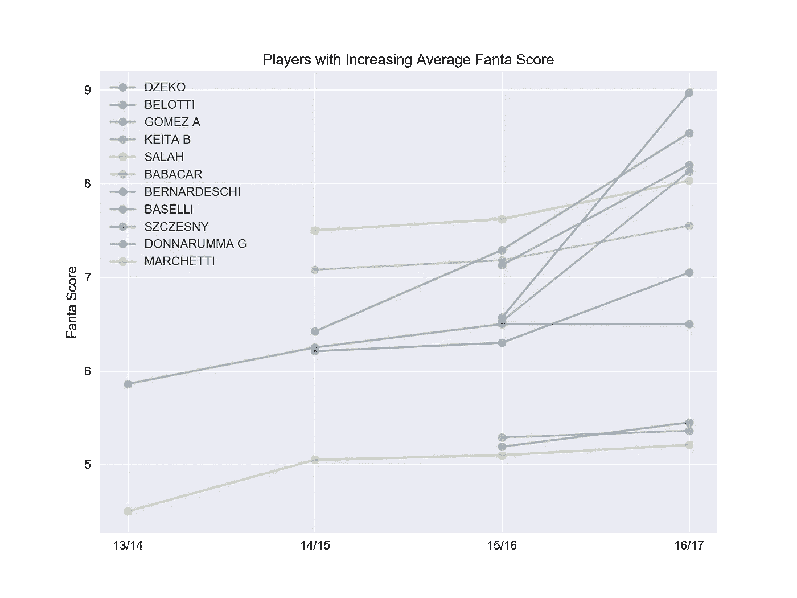
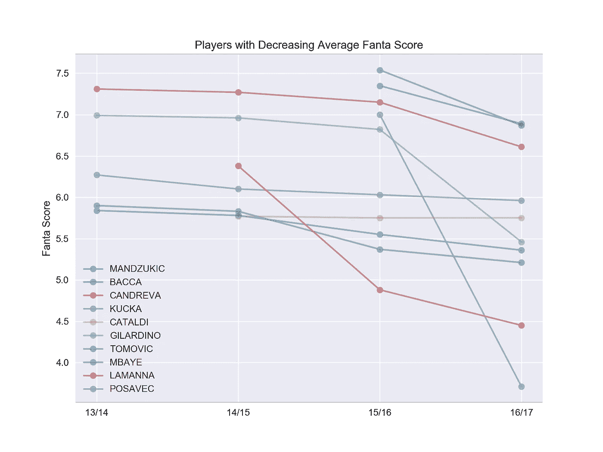
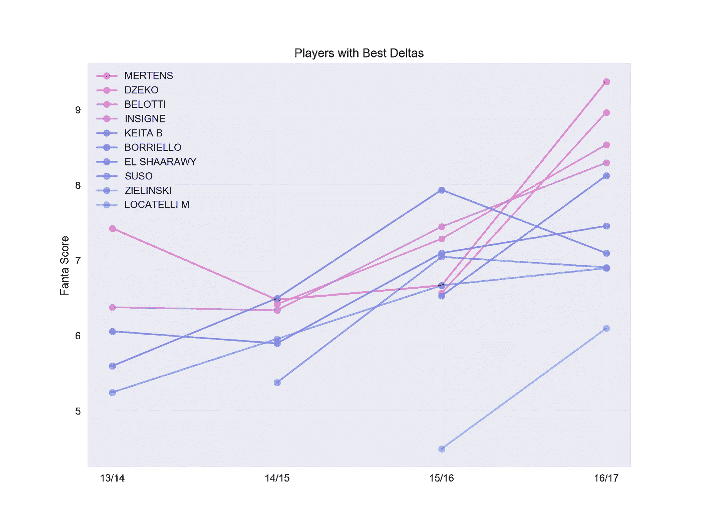
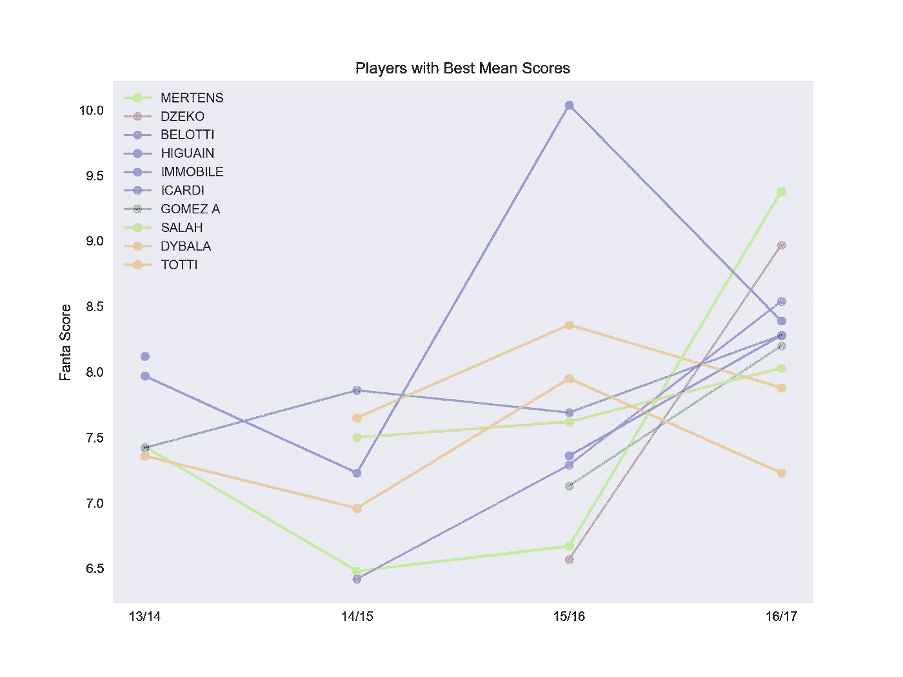
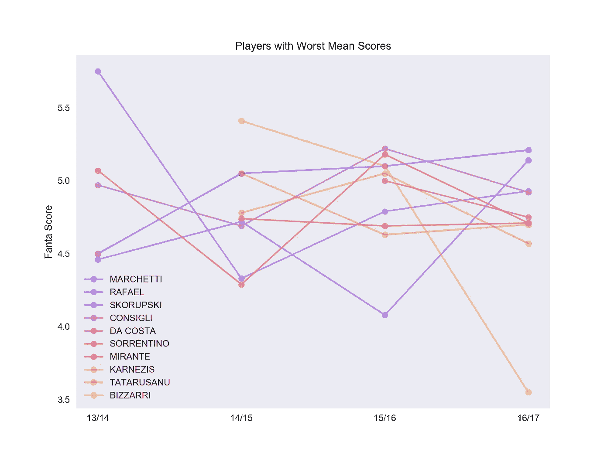
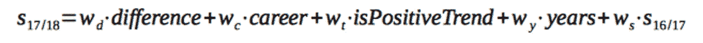

# 使用虚拟足球数据预测球员表现的简单方法

> 原文：<https://towardsdatascience.com/a-simple-method-to-predict-player-performance-using-fantasy-football-data-8b2d3adb3a1a?source=collection_archive---------3----------------------->

(注:[根据意大利语版本，clicca qui](https://medium.com/@davide.totaro/i-migliori-giocatori-della-stagione-fantacalcio-2017-2018-secondo-i-dati-c2ce55dca29b) )

这篇文章的目标是分析过去几年意甲梦幻足球(又名 *Fantacalcio* )的相关数据，并使用结果来预测下一个足球赛季的最佳球员。

大部分的文字将探索数据和可视化的球员的分数有见地的信息。最后一部分将展示一个简单的公式，可用于预测未来的表现。

# 数据

输入数据是从 [Fantagazzetta](https://www.fantagazzetta.com/statistiche-serie-a) 下载的，对应于为每个球员计算的季节性统计数据。它涵盖了过去 4 个赛季，从 2013 年至 2014 年至 2016 年至 2017 年。最相关的数据字段是每年的**平均芬达分数:**它表示玩家在所有游戏中获得的平均分数，并根据与特定事件(如进球、黄牌、红牌、助攻等)相关的奖金和惩罚进行调整。

在深入分析之前，我确保检查并清理了数据集。在这种情况下，我决定剔除上个赛季参加比赛少于 10 场或者芬达平均分数等于 0 的球员。前者的原因是为了尽量保持数据的“一致性”:比赛次数越高，他的平均得分就越准确。至于零分，它们似乎与没有参加运动的运动员有关，例如，因为他们被转移到不同的国家联盟。保罗·博格巴就是一个例子，他以创世界纪录的价格从尤文图斯转会到英超联赛的曼联。数据集中保存的球员总数是 265 人，每队大约 13 人，这听起来是一个相当合理的数字(一名首发 XI 加上两名替补)。

# 哪些玩家的趋势最好和最差？

让我们从数据集开始学习一些有趣的东西。有没有每年都在不断变好的选手？而又是谁反其道而行之，不断获得比上赛季更低的分数？

结果表明，芬达平均得分不断增加的运动员人数为 58 人，这相当于总人数 265 人中的大约 1/5(或每队 2 名运动员)。不出所料，绝对分数最高的都是进攻角色。
以下是关于这些结果的一些注释。

*   上赛季的指挥官 埃丁代科在罗马的第二个赛季取得了令人印象深刻的年平均得分飙升，这可能是这位前曼城前锋在第一个赛季表现不佳后所没有预料到的。
*   安德烈亚“伊尔盖洛”贝洛蒂已经成为夏季转会市场的[热门人物:在 3 个赛季中得分从 6.4 跃升至 8.5 后，他的](https://www.theguardian.com/football/2017/jun/09/football-transfer-rumours-manchester-united-battling-milan-for-andrea-belotti)[€100 米逃脱条款](https://www.usatoday.com/story/sports/soccer/2016/12/04/belotti-agrees-to-100-million-euro-escape-clause-at-torino/94964642/)似乎并不那么疯狂。
*   Alejandro“El Papu”Gomez 是亚特兰大 B.C .向意甲积分榜 anEuropa 联赛惊人进军的球员之一。
*   “莫莫”萨拉赫自从第一次来到意大利后，他的速度给所有人留下了深刻的印象。他的得分不断上升的趋势表明，尤尔根·克洛普为他的球队的动态比赛增添了一名优秀的人才。
*   有趣的是注意到一些守门员在这一套。Szczesny 的国际比赛经验有助于解释他的积极表现。多纳鲁马可能是目前最想要的门将，AC 米兰暂时能够留住他的神童。但最引人注目的名字是费德里科·马尔凯蒂和他的积极趋势，跨越了 4 年，而不是像提到的同事那样只有 2 年。

另一方面，得分不断下降的意甲足球运动员人数为 46 人。这些名字中的大多数都扮演着防守的角色，与之前展示的正好相反。

*   排名倒数第三的意甲球员包括守门员比萨里、波萨维奇和拉曼纳。其中两人随队降级到乙级，这可能解释了糟糕的分数。
*   卡洛斯·巴卡和马里奥·曼祖基奇是这个小组中绝对得分最高的球员。他们的得分下降几乎肯定与进球数量减少有关，因为哥伦比亚人的得分表现较差，克罗地亚人的角色也发生了变化。
*   安东尼奥·坎德雷瓦的数据也不差，尽管这位意大利国民的平均得分在 4 年后首次低于 7.0。

# 意甲第一年和上一年有哪些球员的差距最好/最差？

这个问题与上一个问题类似，但在这种情况下，我想包括那些年度绩效趋势可能发生变化(即不持续上升/下降)的球员。这个想法是为了看看哪些球员在开始他们的意甲经历后变得更好(或更差)。

*   前 10 名球员中有 3 名效力于 S.S. Napoli: Mertens、Insigne 和 Zieliński。
*   倒数 3 名球员同样被列入负面趋势名单，即比扎里、波萨维奇和拉曼纳。
*   一些负差异最大的人被认为是有才华的潜在客户，他们没有达到预期，例如迪斯特罗、克里斯坦特和伊图贝。

Top-10 players with best last-vs-first year score difference

Bottom-10 players with worst last-vs-first year score difference

# 哪些球员的职业生涯得分最好/最差？

一个球员职业生涯得分的一个很好的指标是他的年度芬达得分的平均值。不出所料，前 10 名和后 10 名分别包括前锋和门将。

Top-10 players with best career mean score

Top-10 players with worst career mean score

# 那么，哪些球员有可能成为 2017-2018 赛季意甲联赛的最佳球员呢？

这篇文章的最后一部分展示了一个简单的方法，利用前面几节收集的信息来预测球员下赛季的表现。

考虑到以下参数:

*   第一季和最后一季的得分差异
*   职业得分
*   存在持续的正/负趋势
*   在意甲踢球的年数
*   上一季芬达的平均得分

一个简单的公式可以帮助估计每个球员在下一个赛季的表现。它只是计算以下加权和:

通过选择不同的权重，有可能给足球运动员职业生涯的特定方面或多或少的关联。

定义公式后，为每个球员计算 2017/2018 赛季的加权得分。然后，这些值按降序排列，以获得所需的排名。

所以最后，按角色划分的未来最佳球员名单(包括转投其他联盟的)如下。

## **守门员**

*   马尔凯蒂
*   贝里萨
*   拉斐尔
*   布丰
*   佩林

## **守军**

*   甘贝里尼
*   安泰
*   康蒂
*   卡纳瓦罗
*   里斯波利
*   尖酸刻薄
*   费莉佩
*   库利巴利
*   马西埃罗 a。
*   博努奇

## **中场球员**

*   杰琳斯基
*   奈英戈兰
*   巴塞尔利
*   贝纳西
*   戈麦斯 a。
*   哈姆西克
*   马格纳内利
*   费利佩·安德森
*   佩罗蒂
*   贝尔纳代斯基

## **向前**

*   贝洛蒂
*   梅尔滕斯
*   泽科
*   Insigne
*   穆里尔（女子名）
*   伊瓜因
*   伊卡尔迪
*   埃尔沙拉文
*   =salat[变体]
*   博列洛

# 结论

这篇文章提供了一些关于意甲球员过去表现和相关预测的见解。
第一部分显示了一些有趣参数的存在，例如持续增加/减少的趋势以及上一个赛季和第一个赛季的得分差异。然后，这些参数被用来创建一个能够给出关于玩家预测分数的指示的公式。提供了一份按角色划分的下赛季最佳球员名单。

# 有关更多信息…

*   [GitHub 资源库](https://github.com/d-t/fantacalcio)