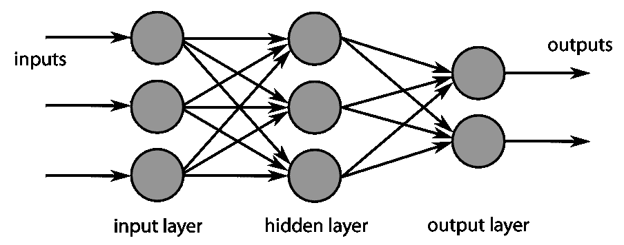
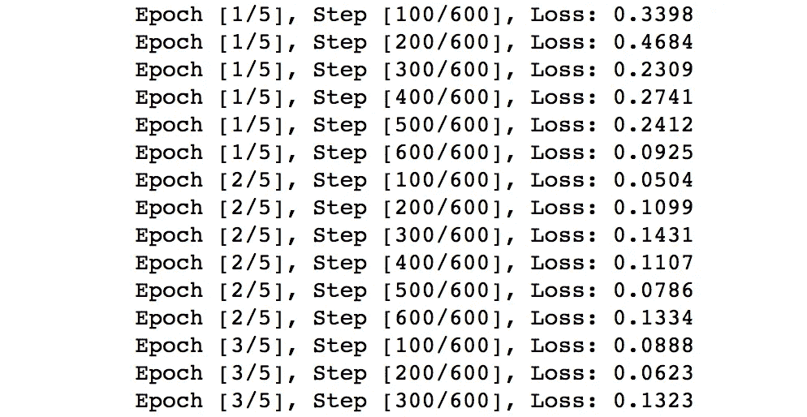

# 构建神经网络的简单入门指南

> 原文：<https://towardsdatascience.com/a-simple-starter-guide-to-build-a-neural-network-3c2cf07b8d7c?source=collection_archive---------2----------------------->


Photo by [Alina Grubnyak](https://unsplash.com/@alinnnaaaa?utm_source=medium&utm_medium=referral) on [Unsplash](https://unsplash.com?utm_source=medium&utm_medium=referral)

从今天开始，你将能够通过 [PyTorch](http://pytorch.org/) 编程并构建一个香草 [**前馈神经网络**](https://brilliant.org/wiki/feedforward-neural-networks/) (FNN)。以下是 https://github.com/yhuag/neural-network-lab FNN 的 python jupyter 代码库:

> 本指南作为基本的实践工作，引导您从头开始构建神经网络。大部分的数学概念和科学决策都被遗漏了。你可以在这方面做更多的研究。

# 入门指南

1.  请确保您的计算机中安装了 Python 和 PyTorch:

*   Python 3.6 ( [安装](https://www.python.org/downloads/))
*   PyTorch ( [安装](http://pytorch.org/)

2.通过控制台上的命令检查 Python 安装的正确性:

```
python -V
```

输出应该是 **Python 3.6.3** 或更高版本

3.打开一个储存库(文件夹)并创建您的第一个神经网络文件:

```
mkdir fnn-tuto
cd fnn-tuto
touch fnn.py
```

# 开始写代码

以下所有代码都应写入 **fnn.py** 文件

## 进口 PyTorch

它会将 PyTorch 载入代码。太好了！良好的开端是成功的一半。

## 初始化超参数

超参数是预先设置的强有力的参数，不会随着神经网络的训练而更新。

## 下载 MNIST 数据集

MNIST 是一个巨大的数据库，有大量的手写数字(即 0 到 9)用于图像处理。

## 加载数据集

下载 MNIST 数据集后，我们将它们加载到我们的代码中。

***注:*** *我们对 train_dataset 的加载过程进行了洗牌，使学习过程独立于数据顺序，但 test_loader 的顺序仍然是为了考察我们是否能处理输入的未指定偏序。*

# 建立前馈神经网络

现在我们已经准备好了数据集。我们将开始构建神经网络。概念图如下所示:



FNN image retrieved from [http://web.utk.edu/](http://web.utk.edu/)

## 前馈神经网络模型结构

FNN 包括两个完全连接的层(即 fc1 和 fc2)以及其间的一个非线性 ReLU 层。通常我们称这种结构为**1-隐藏层 FNN** ，不包括输出层(fc2)。

通过运行正向传递，输入图像(x)可以通过神经网络，并生成输出(out ),展示它属于 10 个类别中的每一个的受欢迎程度。*例如，一个猫的形象对狗类可以有 0.8 的喜欢度，对飞机类可以有 0.3 的喜欢度。*

## 实例化 FNN

我们现在根据我们的结构创建一个真正的 FNN。

```
net = Net(input_size, hidden_size, num_classes)
```

## 启用 GPU

***注意:*** *你可以启用该行运行 GPU 上的代码*

```
# net.cuda()    # You can comment out this line to disable GPU
```

## 选择损失函数和优化器

损失函数(**标准**)决定了输出如何与一个类进行比较，从而决定了神经网络的表现好坏。并且**优化器**选择一种方式来更新权重，以便收敛到该神经网络中的最佳权重。

```
criterion = nn.CrossEntropyLoss()
optimizer = torch.optim.Adam(net.parameters(), lr=learning_rate)
```

# 培训 FNN 模型

根据您的机器，此过程可能需要大约 3 到 5 分钟。详细的解释在下面的代码中作为注释(#)列出。

# 测试 FNN 模型

类似于训练神经网络，我们还需要加载一批测试图像并收集输出。不同之处在于:

1.  无损失和重量计算
2.  没有重量更新
3.  具有正确的预测计算

## 保存训练好的 FNN 模型以备将来使用

我们将训练好的模型保存为一个 [pickle](https://wiki.python.org/moin/UsingPickle) 供以后加载和使用。

```
torch.save(net.state_dict(), ‘fnn_model.pkl’)
```

> 恭喜你。您已经完成了第一个前馈神经网络的构建！

# 下一步是什么

保存并关闭文件。开始在控制台运行文件:

```
python fnn.py
```

您将看到培训过程如下所示:



> 感谢你的时间，希望你喜欢这个教程。所有代码都可以在这里找到！

**功劳:代码都是基于** [**yunjey 的**](https://github.com/yunjey) **伟大的**[**code base**](https://github.com/yunjey/pytorch-tutorial/blob/master/tutorials/02-intermediate/generative_adversarial_network/main.py)**编写的。❤**