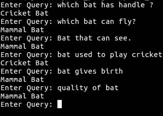

# 一个简单的词义消歧应用程序

> 原文：<https://towardsdatascience.com/a-simple-word-sense-disambiguation-application-3ca645c56357?source=collection_archive---------3----------------------->

词义消歧已经成为自然语言处理和机器学习领域的一个研究热点。词义消歧从根本上解决了因不同语境中词义不同而产生的歧义。

例如，考虑这两个句子。

" ***银行*** 周六不接受现金. "

**谓河水漫过*堤岸。*** ”

第一句中的 ***银行*** 一词是指商业(金融)银行，第二句是指河岸。由此产生的模糊性对于机器来说很难检测和解决。检测歧义是第一个问题，解决它并显示正确的输出是第二个问题。[这里](https://github.com/omkar-dsd/mini_projects/blob/master/word_sense_disambiuation/wsd1.py)，给出的代码是为了解决第二个问题。请随意投稿。

***给我看看代码……***

我们将使用的导入是，

> 自然语言工具包 (NLTK)库，是由普林斯顿大学开发的免费开源工具。这个库为我们的应用程序执行核心功能。它提供了训练数据集、Wordnet 语料库、各种标记器、词条分类器、词干分析器和标签器。

函数 *simpleFilter* 将给定的查询/句子作为输入，并返回一个经过词汇化的标记列表。*词条化*是指推导出词形正确的词根。在 ***词干化*** 和 ***词干之间出现了一点混淆。然而，这两个词的味道不同。*词干化*通常指一种粗糙的启发式过程，即砍掉单词的词尾，希望在大多数时候都能正确实现这一目标，通常还包括去除派生词缀。*词汇化*通常是指通过使用词汇和词形分析来正确地做事情，通常旨在只去除屈折词尾，并返回单词的基本形式或词典形式，这就是所谓的 ***引理*** 。***

*停用词*，是一种语言中的高频词，对句子的主题没有多大作用。在英语中，这样的词包括，“一个”，“一个”，“of”，“to”等..我们去掉这些词，专注于我们的主题，以解决歧义。该函数应用于训练数据集以及用户输入。

接下来，我们执行相似性检查，function:*similarity check*，用于过滤第一个函数返回的句子标记。检查给定查询/句子标记和训练数据集标记之间的相似性。为此，从 *wordnet* 语料库中为每个单词加载同义词集。一个单词的深度和接近度是按照 0-1 的范围计算和返回的。这是解决模糊性的主要数据。你提供的数据越多，它就越准确。存储句子之间的标准化相似度。

*synonymsCreator* 是一个简单的函数，用于存储给定输入单词的同义词。这将用于存储给定数据集的同义词和查询标记。在对句子执行相似性检查时，还会考虑同义词。

一旦存储了相似性，我们就应用下一级过滤器，function:*filtered sentence*，对词干标记应用词条化，并再次删除停用词。在过滤后的句子列表中，我们现在存储单词及其同义词，以便进行更精确的匹配/相似性检查。接下来，我们把所有这些放在一起。

这里所做的是，应用程序被提供了两个数据集文件，第一个是***cricketbat . txt***，其中包含几个涉及板球运动中使用的蝙蝠的句子，第二个是***vampire bat . txt***，其中包含几个涉及哺乳动物鸟蝙蝠的句子。 *sent1* 存储 vampirebat.txt 文件中降低的案例字符串数据，sent2 存储 cricketbat.txt，sent3 存储用户查询。接下来，使用上述函数过滤句子并检查相似性。这种比较是标准化的，无论查询是指 ***板球球棒*** 还是 ***哺乳动物球棒，都会相应地给出输出。***

这个程序给出非常准确的答案。它唯一不能处理的是否定句，比如“*哪只蝙蝠是* ***而不是*** *用来打板球的*”，“哪只蝙蝠是****而不是*** *飞”等等。*在这里随意贡献模块给它[。](https://github.com/omkar-dsd/mini_projects/tree/master/word_sense_disambiuation)*

*数据集和代码已经包含在[库](https://github.com/omkar-dsd/mini_projects/tree/master/word_sense_disambiuation)中。*