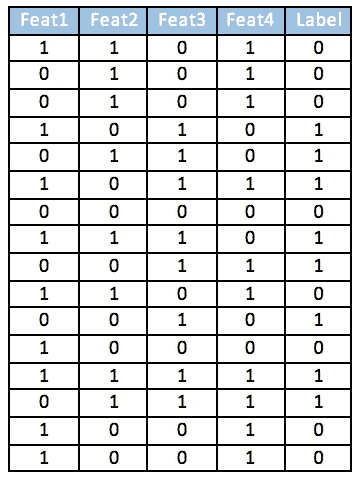
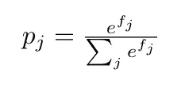
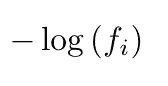
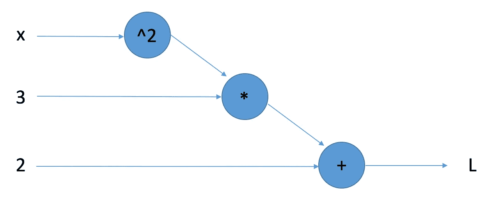
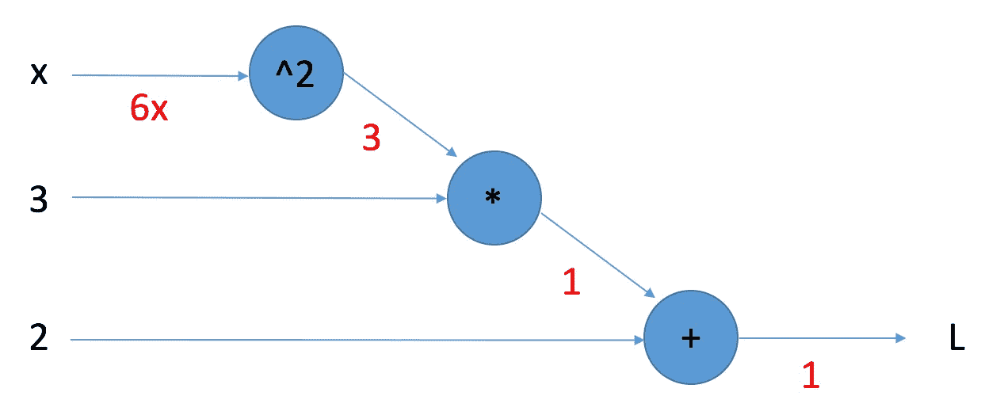
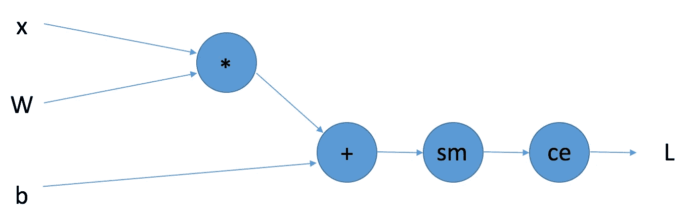
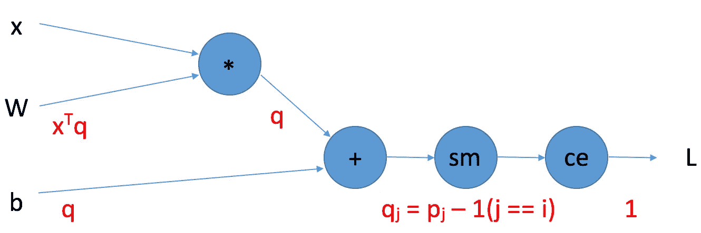
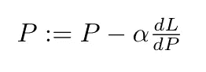

# 神经网络导论

> 原文：<https://towardsdatascience.com/a-soft-introduction-to-neural-networks-6986b5e3a127?source=collection_archive---------2----------------------->


在过去的几年里，神经网络已经成为机器学习的同义词。最近，我们已经能够制造神经网络，它可以产生栩栩如生的面孔，转移动态艺术风格，甚至可以按年“老化”一个人的照片。如果你想知道神经网络背后的直觉是如何工作的，但不知道从哪里开始，你来对地方了！

在本教程结束时，您应该能够理解神经网络工作的方式和原因。您还将仅使用 NumPy 从头开始创建一个非常简单的神经网络。线性代数/多元微积分和 Python 编程的经验是本教程的先决条件。

# 向前传球

任何一个**神经网络**的项目都是*基于某个输入*生成一个预测。这听起来非常模糊，但这是因为每个神经网络的任务略有不同，所以这个定义是一刀切的。输入的一些例子可以是三维张量形式的图像、属性的输入特征向量或字典嵌入的向量；输出的一些示例可能是预测的分类标签(分类)或预测的非离散值(回归)。

## 给我数据

我们举个简单的例子，让这个概念不那么模糊。我们有这个 16 个数据点的玩具数据集，每个数据点有四个**特征**和两个可能的**类别标签** (0 或 1):



这是数据集的代码:

```
**import** numpy **as** np

X = np.array([[1, 1, 0, 1], [0, 1, 0, 1], [0, 1, 0, 1], [1, 0, 1, 0], [0, 1, 1, 0], [1, 0, 1, 1], [0, 0, 0, 0], [1, 1, 1, 0], [0, 0, 1, 1], [1, 1, 0, 1], [0, 0, 1, 0], [1, 0, 0, 0], [1, 1, 1, 1], [0, 1, 1, 1], [1, 0, 0, 1], [1, 0, 0, 1]])y = np.array([[0], [0], [0], [1], [1], [1], [0], [1], [1], [0], [1], [0], [1], [1], [0], [0]])
```

如您所见，类标签与第三个特性的值完全相同。我们希望网络能够准确地将要素转换为预测的类别标注概率，也就是说，输出应该具有两个可能类别的概率。如果我们的网络是准确的，我们将对正确的类有高的预测概率，对不正确的类有低的预测概率。

在我们继续之前，有一点很重要:我们不能用所有的 X 来训练我们的网络。这是因为我们*期望*我们的网络在它看到的数据上表现良好；我们真的很有兴趣看看它在*还没有*看到的数据上表现如何。我们想要两种类型的看不见的数据:一个是*数据集，我们可以基于它定期评估我们的网络*，称为**验证集**，另一个是*数据集，它模拟“真实世界的数据”，我们只评估一次*，称为**测试集**。其余用于训练的数据被称为**训练集**。下面是执行该分割的代码:

```
X_train = X[:8, :]
X_val = X[8:12, :]
X_test = X[12:16, :]

y_train = y[:8]
y_val = y[8:12]
y_test = y[12:16]
```

## 网络层

单词“ **layers** ”在机器学习的上下文中经常出现。说实话，它只不过是一种数学运算*，经常涉及乘法权重矩阵和加法偏差向量*。

让我们只取其中一个数据点，它是一组四个特征值。我们希望将输入数据点(1×4 维的矩阵)转换为标签概率向量(1×2 维的向量)。为此，我们只需将输入乘以一个 4 乘 2 的权重矩阵。就是这样！不完全是这样，我们还在乘积中增加了一个 1 乘 2 的偏置向量，只是为了增加一个额外的学习参数。

代码如下:

```
W = np.random.randn(4, 2)
b = np.zeros(2)

linear_cache = {}
**def** linear(input):
    output = np.matmul(input, W) + b
    linear_cache[**"input"**] = input
    **return** output
```

(暂时不用担心缓存；这将在下一节中解释)

这种操作方式的一个非常酷的结果是，我们不需要只给图层一个数据点作为输入！如果我们取四个数据点，输入是 4 乘 4，输出是 4 乘 2(四组分类概率)。*在训练时间*使用的数据集子集被称为**批次**。

概率最高的类是网络的猜测。太好了！除了网络会严重出错——毕竟所有的权重都是随机的！言简意赅地说:现在我们已经有了网络猜测*，我们需要让它正确地猜测*。**

# **向后传球**

**为了使网络的猜测更好，我们需要找到权重和偏差的“好”值，以便正确猜测的数量最大化。我们通过找到*一个代表我们的猜测*有多“错误”的标量值(称为**损失**值)并使用多元微积分将其最小化来做到这一点。**

## **损失函数(或“取 L”)**

**在计算标量损失之前，我们希望将任意值的“概率”转换成适当的概率分布。我们通过对以下值计算 softmax 函数来实现这一点:**

****

**对于线性输出中的每个 f_j 值。为了得到标量损失值，计算*正确类*的交叉熵:**

****

**正确的类值 f_i。下面是代码:**

```
**softmax_cache = {}
**def** softmax_cross_entropy(input, y):
    batch_size = input.shape[1]
    indeces = np.arange(batch_size)

    exp = np.exp(input)
    norm = (exp.T / np.sum(exp, axis=1)).T
    softmax_cache[**"norm"**], softmax_cache[**"y"**], softmax_cache[**"indeces"**] = norm, y, indeces

    losses = -np.log(norm[indeces, y])
    **return** np.sum(losses)/batch_size**
```

## **反向传播**

**我们现在的工作是最小化损失值，我们需要改变权重来做到这一点。我们利用链式法则的美丽来实现这一点。**

**我们举一个超级简单的例子来论证这个概念。我们来定义一个函数:L(x) = 3x + 2。下面是一个函数图:**

****

**我们想求 L 相对于 x 的导数。我们可以通过处理子函数处的每个图节点，求每个子函数处的偏导数，然后乘以引入的导数来实现:**

****

**我们来分析一下。L 对 L 的导数正好是 1。n + 2 的导数为 1；乘以 1(引入渐变)等于 1。导数 3n 是 3；乘以 1 等于 3。最后，n 的导数是 2n；乘以 3 是 6n。的确，我们知道 3x +2 的导数是 6x。*通过递归使用链式法则*求关于参数的导数称为**反向传播**。我们可以对复杂的神经网络做同样的事情，首先将网络绘制成图形:**

****

**现在，我们可以通过网络反向传播，找到关于权重和偏差的导数(当变量是非标量时，称为**梯度**):**

****

**通过该图的反向传播具有与上图相同的基本规则。然而，这里仍然有很多事情要做，所以让我们再来分析一下。第二个梯度是*整个*soft max/交叉熵函数的梯度；它基本上说明了导数与前向传递的 softmax 的输出相同，只是我们从正确的类中减去 1。梯度的推导不在本文的讨论范围内，但是你可以在这里[阅读更多。此外，b 和 q 的维数不同，所以我们需要对一个维数求和，以确保维数匹配。最后，x^T 是输入矩阵 x 的转置。希望现在清楚了为什么我们需要缓存某些变量:在正向传递中使用/计算的一些值需要在反向传递中计算梯度。以下是向后传球的代码:](https://stackoverflow.com/questions/37790990/derivative-of-a-softmax-function-explanation)**

```
****def** softmax_cross_entropy_backward():
    norm, y, indeces = softmax_cache[**"norm"**], softmax_cache[**"y"**], softmax_cache[**"indeces"**]
    dloss = norm
    dloss[indeces, y] -= 1
    **return** dloss

**def** linear_backward(dout):
    input = linear_cache[**"input"**]
    dW = np.matmul(input.T, dout)
    db = np.sum(dout, axis=0)
    **return** dW, db**
```

## **更新规则**

**相对于参数的反向传播给出了最陡的变化方向。所以，如果我们向与相反的*方向移动，那么我们将减少函数值。向最陡下降方向移动的最简单算法称为**梯度下降** — *将梯度乘以某个值α并从参数中减去它:****

**

*乘性值α非常重要，因为如果它太大，我们可能会超过最小值，但如果它太小，我们可能永远不会收敛。*我们在权重更新*中采取的步长被称为**学习率**。学习率是一个**超参数**，*一个我们可以改变的值，以在我们训练的网络中产生不同的结果*。*

*请注意，在我们的训练制度的代码中，注释了“参数更新”一节:*

```
***def** eval_accuracy(output, target):
    pred = np.argmax(output, axis=1)
    target = np.reshape(target, (target.shape[0]))
    correct = np.sum(pred == target)
    accuracy = correct / pred.shape[0] * 100
    **return** accuracy

*# Training regime* **for** i **in** range(4000):
    indeces = np.random.choice(X_train.shape[0], 4)
    batch = X_train[indeces, :]
    target = y_train[indeces]

    *# Forward Pass* linear_output = linear(batch)
    loss = softmax_cross_entropy(linear_output, target)

    *# Backward Pass* dloss = softmax_cross_entropy_backward()
    dW, db = linear_backward(dloss)

    *# Weight updates* W -= 1e-2 * dW
    b -= 1e-2 * db

    *# Evaluation* **if** (i+1) % 100 == 0:
        accuracy = eval_accuracy(linear_output, target)
        print (**"Training Accuracy: %f"** % accuracy)

    **if** (i+1) % 500 == 0:
        accuracy = eval_accuracy(linear(X_val), y_val)
        print(**"Validation Accuracy: %f"** % accuracy)

*# Test evaluation* accuracy = eval_accuracy(linear(X_test), y_test)
print(**"Test Accuracy: %f"** % accuracy)*
```

*以下是全部代码的完整要点:*

*也可以在这里找到:[https://gist . github . com/ShubhangDesai/72023174 E0 d 54 f 8 FB 60 ed 87 a 3 a 58 EC 7 c](https://gist.github.com/ShubhangDesai/72023174e0d54f8fb60ed87a3a58ec7c)*

*就是这样！我们有一个非常简单的，一个隐藏层的神经网络，可以训练它在我们的玩具数据集上产生 100%的验证和测试准确性。*

# *后续步骤*

*我们使用的层类型被称为**线性**或**全连接层**。今年夏天，我将写更多关于其他类型的层和网络架构的文章，以及关于比玩具数据集更酷的应用程序的文章。小心那些东西！*

*有一些很棒的关于机器学习的在线课程是免费的。Coursera ML 课程当然是经典，但我也推荐斯坦福 CS 231n 的[课程材料。这是一门硕士水平的课程，我有幸在上个季度修过；这是令人难以置信的教学和密集。](http://cs231n.stanford.edu/)*

*我还会推荐查看一些关于 [TensorFlow](https://www.tensorflow.org/tutorials/) 和 [PyTorch](http://pytorch.org/tutorials/) 的初学者教程。它们是最受欢迎的开源深度学习库，理应如此。教程深入浅出，易于理解。*

*现在你已经有了神经网络的基础，你已经正式进入了一个令人兴奋的快速变化的领域。去，探索领域！我真的希望机器学习能激发你和我一样的敬畏和惊奇。*

*如果你喜欢这篇文章，请一定给我一个掌声，并关注我，在你的 feed 中看到我未来的文章！另外，看看我的 [*个人博客*](https://shubhangdesai.github.io/blog/) *，关注我的* [*推特*](https://twitter.com/ShubhangDesai) *了解更多我的想法。**