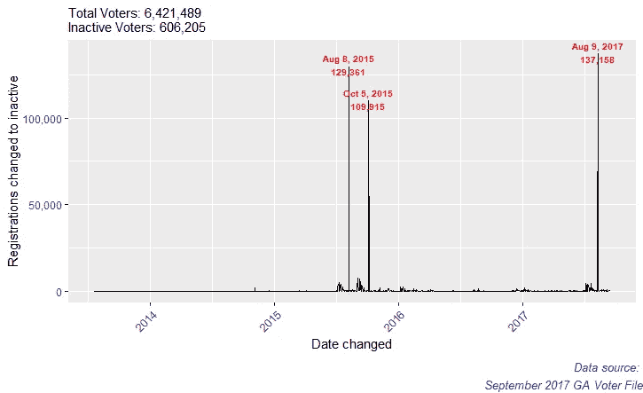
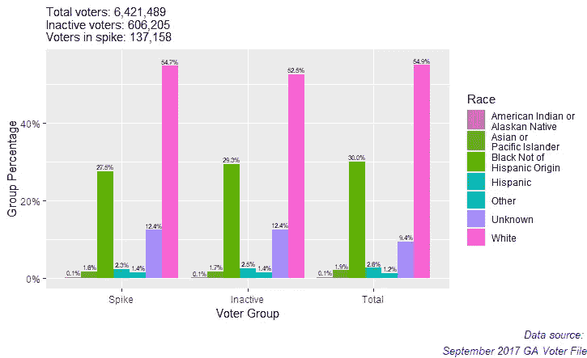
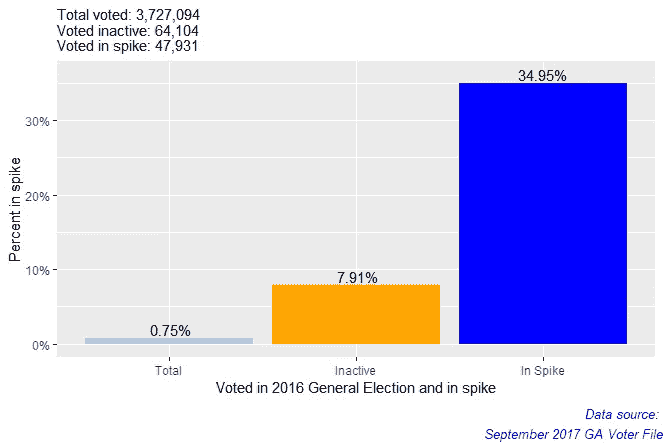
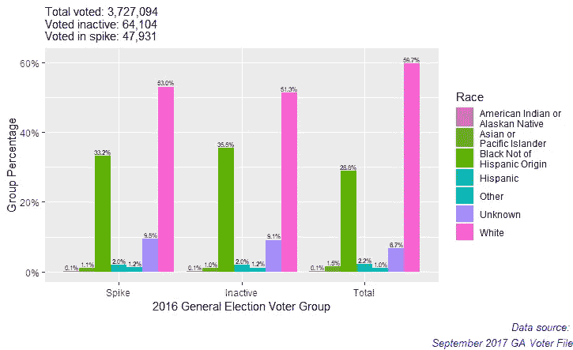
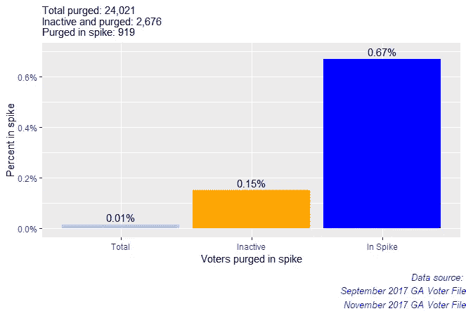
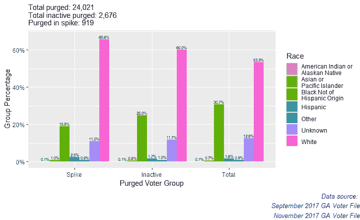
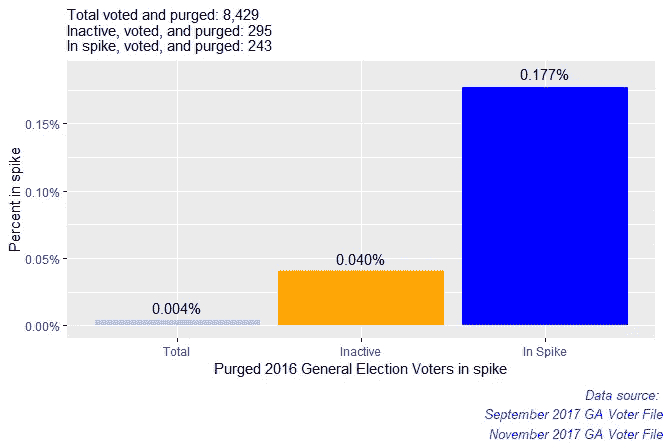
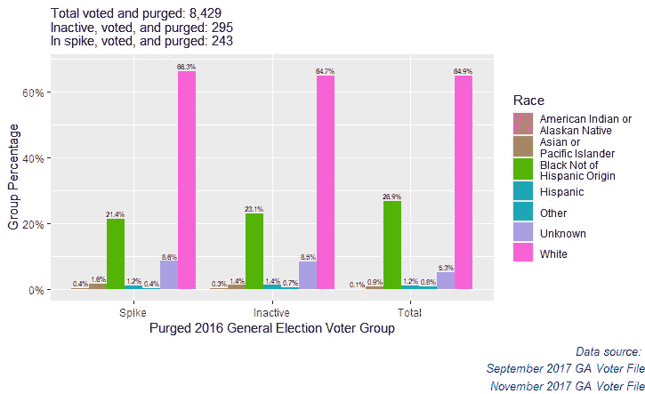
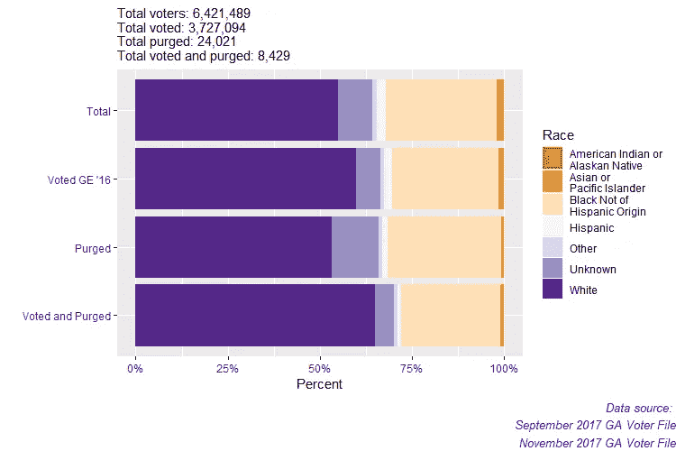
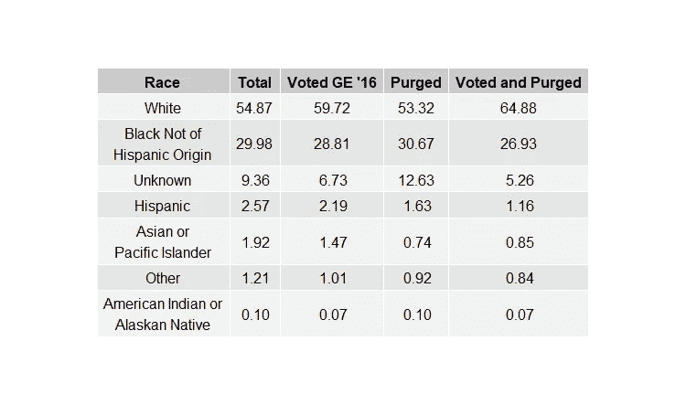

# 佐治亚州不活跃选民的“激增”

> 原文：<https://towardsdatascience.com/a-spike-of-inactive-voters-in-georgia-77babe0eab70?source=collection_archive---------20----------------------->

## 用 R 分析佐治亚州选民档案中不活跃的和被清除的选民

## 介绍

最近的中期选举引发了关于如何、何时以及为什么应该从选民登记文件中清除选民的讨论和辩论。被清除意味着一个选民已经从一个州的选民登记中被删除。乔治亚州当选州长、前州务卿布莱恩·肯普(Brian Kemp)在今年的中期选举中受到密切关注，他被指控在过去的几年里转移了数十万倾向于有色人种的选民。分析人士不仅发现从选民档案中除名的人数不成比例，而且这些选民中的许多人[完全有资格，并且不知道他们被除名了](https://www.wabe.org/georgia-purged-about-107000-people-from-voter-rolls-report/)。为了更好地了解删除选民的过程，我查看了 2017 年 9 月和 11 月的佐治亚州选民登记文件，以了解谁被删除，为什么被删除，何时被删除，以及这些选民是谁的种族。我对种族感兴趣，因为它经常是佐治亚州和全国关于选举权和[选民压制的争论焦点。](https://www.theguardian.com/us-news/2017/sep/13/america-history-voter-suppression-donald-trump-election-fraud)

## 工具和数据

对于这个项目，我使用的是 2017 年 9 月和 11 月的佐治亚州选民文件。为了分析数据，我将 R 与 R Studio 和一些有用的库一起使用。

```
library(tidyverse)
library(RColorBrewer)
library(lubridate)
library(ggpubr)
library(scales)
```

Tidyverse 是整理数据最有用的库。它让我能够轻松地对数据进行分类。例如，它提供了根据特定值的属性进行过滤或根据特定列进行分组的能力。这在我创建数据子集时非常有用。大多数其他库只是为了图形的美观。

为了整理数据，我创建了两个转换变量类型的函数——将字符类型转换为日期或数字类型——以及一个向量来帮助消除数据中不需要的和无用的列。

```
# We need to change our dates to Date types 
setAs("character","myDate", function(from) ymd(from))# We are only given birth year, so we need to convert that to their # age
setAs("character", "age", function(from) as.integer(2017 - as.numeric(from)))# We need to skip some columns that are not useful to us
# as well as read in the correct type for the column 
readcolumns <- c(rep("character", 3), rep("NULL", 9), rep("character", 2), "age", "myDate", rep("character", 2), rep("NULL",2), rep("character", 2), rep("NULL",25), rep("myDate", 4), "NULL", "character", "myDate", rep("NULL", 9))# Sept 2017 GA Voter File 
working.dir <- "C:/Users/Bradley/Desktop/Election Research/Georgia_Daily_VoterBase/"ga_voter.file <- paste(working.dir, "Georgia_Daily_VoterBase.txt", sep="")ga_voter.sept17 <- as.tibble(read.csv(ga_voter.file, header = TRUE, sep = "|", quote = "", dec = ".", colClasses = readcolumns, fill = TRUE, stringsAsFactors = FALSE))colnames(ga_voter.sept17)[6] <- "AGE"
```

为了使日期更容易处理，我创建了一个包装函数，它使用了来自 [lubridate](https://github.com/tidyverse/lubridate) 库的 ymd()函数(year，month day)。此函数将日期列转换为日期类型。

佐治亚州的选民档案不包括年龄，而是出生年份。我创建了一个将出生年份转换成年龄的函数。我还把栏目名改成了“年龄”。我最终没有在这个项目中使用这个属性，但是它可能在将来的分析中有用。

我在 2017 年 11 月的佐治亚州选民文件上使用了所有相同的函数和“readcolumns”向量。

你可以在我的 [github](https://github.com/bradleywyros/R-Projects) 上找到这个项目的所有代码。

## 分析

为了开始我的分析，我查看了 2017 年 9 月佐治亚州选民文件中的非活跃选民和他们的“日期改变”状态。在乔治亚州的选民档案中,“更改日期”类别是选举官员最后一次更新登记的日期。我决定查看非活跃选民的日期更改频率，因为如果大规模选民清洗开始，我预计会看到大量选民的状态在大群体中被更改为非活跃。这样做，我发现了三大“尖峰”:2015 年 8 月 8 日，2015 年 10 月 5 日，2017 年 8 月 9 日。

```
# All Inactive voters from the Sept 2017 voter file 
inactive.sept17 <- ga_voter.sept17 %>% filter(VOTER_STATUS == "I")
```



Figure 1: Frequency graph of dates changed among inactive voters.

**为什么这么多注册在这些日期被改变？**

这些峰值让我们深入了解佐治亚州的选民清洗过程。注册人数的大幅增加是因为[佐治亚州在重大选举](https://www.ajc.com/news/local-govt--politics/georgia-cancels-fewer-voter-registrations-after-surge-last-year/fqT1bcSzGu33UEpTMDzMVK/)(中期选举和总统选举)结束的年份清理选民档案，这就是为什么日期相隔一年，但在一年中的同一时间。我发现这些尖峰仍然很有趣。在三个主要峰值中，我决定关注 2017 年 8 月 9 日，主要有两个原因:

1.  我有 2017 年的其他选民文件，所以我有更多那一年的数据。
2.  2017 年 8 月 8 日，[司法部决定俄亥俄州大规模清洗选民的方法是可以接受的](https://www.nytimes.com/2017/08/08/us/politics/justice-department-ohio-voter-rolls.html)。佐治亚州使用与俄亥俄州相似的方法来清洗选民。

在整个分析中，我将 2017 年 8 月 9 日称为“尖峰”。

**谁在秒杀？**

首先，我想看看 2017 年 9 月选民文件中的选民比例。接下来，我想看看，在 2017 年 9 月的数据集中，所有不活跃的选民中，有多少人处于峰值。

```
# Inactive voters in the spike
inactive.spike <- inactive.sept17 %>% 
 filter(DATE_CHANGED == “2017–08–09”)# voters in spike / all inactive voters
spike_by_inactive <- nrow(inactive.spike) / nrow(inactive.sept17) * 100# voters in spike / all voters
spike_by_total <- nrow(inactive.spike) / nrow(ga_voter.sept17) * 100spike <- tibble(Voters = c('Of Total', 'Of Inactive'), 
                Percent = c(spike_by_total, spike_by_inactive))
```


Figure 2: Bar chart showing percent of voters in spike among total voters and total inactive voters.

该峰值包含 2017 年 9 月佐治亚州选民文件中所有选民的 2.1%和所有非活跃选民的 22.6%。因此，峰值包含数据集中的大部分非活跃投票者。

接下来，我查看了所有选民、非活跃选民和峰值内选民的种族分类。为了检查尖峰中任何潜在的成员比例失调，我在数据集中创建并可视化了三个群体子集:

1.  **穗中的选民**
2.  **不活跃的选民**
3.  **整个 2017 年 9 月选民档案的选民总数**

利用这些子集，我按种族将他们分组。通过比较高峰和非活跃选民总数中的百分比与选民百分比，我可以检查一个群体在高峰或非活跃中的存在是否与他们在数据集中的总体代表性不相称。例如，如果一个群体在尖峰信号中所占的比例大于总比例，那么它就是不相称的。

```
# Total percent by race
total.race <- ga_voter.sept17 %>%
  group_by(RACE) %>%
  summarise(Total = n()/nrow(ga_voter.sept17) * 100) %>%
  arrange(desc(Total))
total.race# Spike percent by race
spike.race <- inactive.spike %>%
  group_by(RACE) %>%
  summarise(Spike = n()/nrow(inactive.spike) * 100) %>%
  arrange(desc(Spike))
spike.race# Inactive percent by race
inactive.race <- inactive.sept17 %>%
  group_by(RACE) %>%
  summarise(Inactive = n()/nrow(inactive.sept17) * 100) %>%
  arrange(desc(Inactive))
inactive.race# Make a table for all results to compare proportions
total_inactive <- merge(x = total.race, y = inactive.race, by = "RACE")
total_inactive_spike.1 <- merge(x = total_inactive, y = spike.race, by = "RACE") %>% 
  arrange(desc(Total))
format(total_inactive_spike.1, digits=1, nsmall=2)# Using gather, we can make the data more friendlier to work with in a graph
total_inactive_spike.2 <- total_inactive_spike.1 %>% 
  gather(Total, Inactive, Spike, key="Voters", value="Percent") %>%
  arrange(RACE)
format(total_inactive_spike.2, digits=1, nsmall=2)
```



Figure 3: Bar graph representing the racial breakdown of voters in the spike, total inactive voters, and total voters.

各组中白人占多数(斯派克占 54.7%；占非活跃选民总数的 52.5%；占总选民的 54.9%)。因为白人在总选民中占大多数，他们在高峰和非活跃选民总数中的代表性并不令人关注。对所有群体来说，这些百分比表明，在高峰和非活跃选民总数中的代表性是成比例的。为了扩展这个项目，我们可能会使用某种类型的分布测试来统计比较这些比例。

既然我们已经对选民档案有了一个全面的了解，我决定看看高峰时期的活动。对于这部分分析，我决定对三个不同的组重复上面的分析:

1.  **参加 2016 年大选投票的人**
2.  **在高峰和 2017 年 11 月之间被清洗的人**
3.  **在 2016 年大选*和*中投票的人在高峰和 2017 年 11 月**之间被移除

对于每个群体(如上所述)，我检查了我之前创建的三个子群体中的每一个——(1)处于高峰的选民，(2)不活跃的选民，以及(3)整个 2017 年 9 月选民文件中的总选民。

## 第一组:参加 2016 年大选投票的人

为了查看在高峰期间投票的每个人，我采用了我最初的非活跃选民子集，并根据他们更改日期的高峰日期和他们上次投票日期的 2016 年选举日进行了过滤。我只选择了选举日，没有包括提前投票的选民，因为我找不到任何提前投票的人。

```
# Spike voted
spike.voted <- inactive.sept17 %>% 
  filter(DATE_CHANGED == "2017-08-09" & DATE_LAST_VOTED == "2016-11-08")voted_by_spike <- nrow(spike.voted) / nrow(inactive.spike) * 100voted_by_inactive <- nrow(spike.voted) / nrow(inactive.sept17) * 100voted_by_total <- nrow(spike.voted) / nrow(ga_voter.sept17) * 100voted <- tibble(Voted = c('Total', 'Inactive', 'In Spike'), 
                Percent = c(voted_by_total, voted_by_inactive,                  voted_by_spike))
```



Figure 4: Bar graph of 2016 General Election voters who are in the spike among all spike, inactive, and total voters.

我很惊讶(也有点怀疑)约 35%的 spike 在 2016 年选举日投了票。一个值得问的问题是，为什么 47931 名选举日选民在不到一年后变得不活跃？我们还应该记住，在总统选举一年后的 2017 年 9 月选民文件中，这个峰值占所有非活跃选民的 22.6%。

查看每个人口的种族分类，我重复了按种族分组的过程，创建了每个种族按其受尊重的人口所占百分比的表格，并合并了结果。

```
# Voted by race / all voted
voted_overall.race <- all.voted %>%
  group_by(RACE) %>%
  summarise(Total = n()/nrow(all.voted) * 100) %>%
  arrange(desc(Total))
voted_overall.race# Voted in spike by race / all voted in spike
voted_in_spike.race <- spike.voted %>%
  group_by(RACE) %>%
  summarise(Spike = n() / nrow(spike.voted) * 100) %>%
  arrange(desc(Spike))
voted_in_spike.race# Voted inactive by race / all voted inactive
voted_by_inactive.race <- inactive.voted %>%
  group_by(RACE) %>%
  summarise(Inactive = n() / nrow(inactive.voted) * 100) %>%
  arrange(desc(Inactive))
voted_by_inactive.race# Make a table for all results to compare proportions
overall_inactive <- merge(x = voted_overall.race, y = voted_by_inactive.race, by = "RACE")
overall_inactive_spike.1 <- merge(x = overall_inactive, y = voted_in_spike.race, by = "RACE") %>% 
  arrange(desc(Total))
format(overall_inactive_spike.1, digits=1, nsmall=2)# Using gather, we can make the data more friendlier to work with in a graph
overall_inactive_spike.2 <- overall_inactive_spike.1 %>% 
  gather(Total, Inactive, Spike, key="Voters", value="Percent") %>%
  arrange(RACE)
format(overall_inactive_spike.2, digits=1, nsmall=2)
```



Figure 5: Bar graph representing the racial breakdown of 2016 General Election day voters in the spike, total inactive voters, and total voters.

看起来，在总选民中，不活跃选民和活跃选民明显不成比例。我们可以看到这一点，因为当白人的比例从总数下降到不活跃和/或支持选民的比例时，黑人的比例却上升了。这一结果表明，白人在高峰和非活跃选民群体中的代表性低于他们的总体代表性，而黑人的情况正好相反——他们的代表性似乎不成比例。

## 第二组:在斯派克和 2017 年 11 月之间被清除的人

在看了投票的人之后，我的下一个问题是，一旦人们变得不活跃，他们会在多长时间内被移除？

我使用了 2017 年 11 月佐治亚州的选民文件，并在 2017 年 11 月的选民文件中寻找处于峰值但*不*的人。这意味着在他们变得不活跃和 2017 年 11 月选民文件发布之间的某个时候，选民已经被清除。

```
# How many were purged from the entire voter file?
purged.all <- ga_voter.sept17 %>% filter(!(ga_voter.sept17$REGISTRATION_NUMBER %in% ga_voter.nov17$REGISTRATION_NUMBER))# How many were purged from the spike?
purged.spike <- inactive.spike %>% filter(!(inactive.spike$REGISTRATION_NUMBER %in% ga_voter.nov17$REGISTRATION_NUMBER))# How many were purged that were inactive?
purged.inactive <- inactive.sept17 %>% filter(!(inactive.sept17$REGISTRATION_NUMBER %in% ga_voter.nov17$REGISTRATION_NUMBER))purged_by_spike <- nrow(purged.spike) / nrow(inactive.spike) * 100purged_by_inactive <- nrow(purged.spike) / nrow(inactive.sept17) * 100purged_by_total <- nrow(purged.spike) / nrow(ga_voter.sept17) * 100purged <- tibble(Voters = c('Total', 'Inactive', 'In Spike'), 
                Percent = c(purged_by_total, purged_by_inactive, purged_by_spike))
```



Figure 6: Bar graph of spike voters who were removed between September and November 2017 in the spike, total inactive voters, and total voters.

不到 1%的尖峰被清除出选民档案。虽然这只是一个很小的百分比，但仍有 900 多人。

接下来，我研究了这个群体的种族划分——从峰值中清除了选民。

```
# Purged by race / all purged
purged_total.race <- purged.all %>%
  group_by(RACE) %>%
  summarise(Total = n() / nrow(purged.all) * 100) %>%
  arrange(desc(Total))
purged_total.race# Purged by race in spike / purged in spike
purged_by_spike.race <- purged.spike %>%
  group_by(RACE) %>%
  summarise(Spike = n() / nrow(purged.spike) * 100) %>%
  arrange(desc(Spike))
purged_by_spike.race# Purged by race inactive / all inactive
purged_by_inactive.race <- purged.inactive %>%
  group_by(RACE) %>%
  summarise(Inactive = n() / nrow(purged.inactive) * 100) %>%
  arrange(desc(Inactive))
purged_by_inactive.race# Make a table for all results to compare proportions
purged_inactive <- merge(x = purged_total.race, y = purged_by_inactive.race, by = "RACE")
purged_inactive_spike.1 <- merge(x = purged_inactive, y = purged_by_spike.race, by = "RACE") %>% 
  arrange(desc(Total))
format(purged_inactive_spike.1, digits=1, nsmall=2)# Using gather, we can make the data more friendlier to work with in a graph
purged_inactive_spike.2 <- purged_inactive_spike.1 %>% 
  gather(Total, Inactive, Spike, key="Voters", value="Percent") %>%
  arrange(RACE)
format(purged_inactive_spike.2, digits=1, nsmall=2)
```



Figure 7: Bar graph representation of racial breakdown of purged voters between September and November 2017 in the spike, total inactive voters, and total voters.

似乎在这些人当中，白人是最不成比例的。西班牙裔略不成比例。这似乎与大多数调查结果相矛盾，大多数调查结果认为，在佐治亚州的选民清洗中，有色人种比白人比例更高。为什么我在这里找不到这个？我将在我们下一次分析后讨论这一点。

## 第三组:在 2016 年大选*和*中投票的人在高峰和 2017 年 11 月之间被移除

为了将所有事情联系起来，我的最后一个问题是，有多少被清除的选民在 2016 年选举日投票？我使用了我之前清除的选民子集，并根据上次投票日期(等于 2016 年 11 月 8 日)对其进行了过滤。

```
purged_all.voted <- purged.all %>%
  filter(DATE_LAST_VOTED == "2016-11-08")purged_inactive.voted <- purged.inactive %>%
  filter(DATE_LAST_VOTED == "2016-11-08")purged_spike.voted <- purged.spike %>%
  filter(DATE_LAST_VOTED == "2016-11-08")voted_purged_by_spike <- nrow(purged_spike.voted) / nrow(inactive.spike) * 100voted_purged_by_inactive <- nrow(purged_spike.voted) / nrow(inactive.sept17) * 100voted_purged_by_total <- nrow(purged_spike.voted) / nrow(ga_voter.sept17) * 100voted_and_purged <- tibble(Voters = c('Total', 'Inactive', 'In Spike'), Percent = c(voted_purged_by_total, voted_purged_by_inactive, voted_purged_by_spike))
```



Figure 8: Bar graph of spike voters who were purged and voted on 2016 election day in the spike, total inactive voters, and total voters.

我们已经减少了相当多的数据。如果 295 个选举日投票者是不活跃的(这包括尖峰中的 243 个选举日投票者)，那么在选举中投票并被移除的剩余 8134 个投票者是谁？这些选民的身份是活跃的。8134 名选民是搬走了，还是死了，还是两者兼而有之？看看 2016 年 8，134 名被清洗的选举选民将是一件有趣的事情，可以从这个项目中抽出来做进一步的分析。现在，让我们来看看种族分类。

```
voted_purged_all.race <- purged_all.voted %>%
  group_by(RACE) %>%
  summarise(Total = n() / nrow(purged_all.voted) * 100) %>%
  arrange(desc(Total))
voted_purged_all.racevoted_purged_inactive.race <- purged_inactive.voted %>%
  group_by(RACE) %>%
  summarise(Inactive = n() / nrow(purged_inactive.voted) * 100) %>%
  arrange(desc(Inactive))
voted_purged_inactive.racevoted_purged_spike.race <- purged_spike.voted %>%
  group_by(RACE) %>%
  summarise(Spike = n() / nrow(purged_spike.voted) * 100) %>%
  arrange(desc(Spike))
voted_purged_spike.race# Make a table for all results to compare proportions
voted_purged_inactive <- merge(x = voted_purged_all.race, y = voted_purged_inactive.race, by = "RACE")
voted_purged_inactive.1 <- merge(x = voted_purged_inactive, y = voted_purged_spike.race, by = "RACE") %>% 
  arrange(desc(Total))
format(voted_purged_inactive.1, digits=2, nsmall=2)# Using gather, we can make the data more friendlier to work with in a graph
voted_purged_inactive.2 <- voted_purged_inactive.1 %>% 
  gather(Total, Inactive, Spike, key="Voters", value="Percent") %>%
  arrange(RACE)
format(voted_purged_inactive.2, digits=2, nsmall=2)
```



Figure 9: Bar graph representing the racial breakdown of purged 2016 election day voters between September and November 2017 in the spike, total inactive voters, and total voters.

这种比例失调似乎仍然对白人影响最大。它也影响未知种族的人，似乎也轻微影响亚洲人或太平洋岛民。

仍然突出的问题是，为什么白人在清洗和最近投票清洗的选民中所占比例过大，而不是像许多其他分析显示的那样在有色人种中所占比例过大？我的第一个假设是我没有足够的数据。我不应该只看两份不同的选民档案。另一个因素可能是我如何检查数据。我关注的是两个选民文件之间的子集，而不是一整年或几个月的选民文件。也许如果我只看几个月来被清洗的选民和选民档案，我可能会发现比例失调。

总结一下，我决定创建一个水平条形图，显示我们观察到的群体中的所有总人口— (1)选民文件中的每个人，(2)在 2016 年大选中投票的人，(3)在高峰和 2017 年 11 月之间被清洗的人，以及(4)在高峰和 2017 年 11 月之间参加 2016 年大选中投票的人*和*。

```
# Compare total populations of each group and overall
total_populations.1 <- tibble(Race = c("WH", "U", "OT", "HP", "BH", "AP", "AI"), Overall = total_inactive_spike.1$Total, Voted = total_inactive_spike.voted.1$Total, Purged = purged_inactive_spike.1$Total, Voted_And_Purged = voted_purged_inactive.1$Total)total_populations.1total_populations.2 <- total_populations.1 %>%
  gather(Overall, Voted, Purged, Voted_And_Purged, key = "Total_Type", value = "Percent") 
total_populations.2
```



Figure 10: Horizontal bar graph of total proportions of each subset — Everyone in the voter file, people who voted in on the 2016 General Election Day, people who were purged between September 2017 and November 2017, and people who were purged and voted.



Figure 11: Table representation of horizontal bar graph above.

## 挑战

在这个项目中，我最大的挑战是不要迷失在数据中。我相信我大大低估了分析数据时“下兔子洞”的容易程度。几乎在每一个转折点，似乎都有一个新的问题要问。在深入研究数据之前，我必须学会如何组织我的想法，并制定一个游戏计划。因此，简而言之，我花了很多时间编写最终没有出现在项目中的东西。

另一个挑战是试图弄清楚*我想如何提问。因为我做了很多子集的子集的子集，有时计算我到底想看什么，我需要做什么才能看到它，以及如何可视化它变得令人不知所措。在深入研究数据并开始编码之前，这也是关键的一步。我最终在 Word 上创建了一个详细的大纲，将我的项目分成几个部分，并列出我需要计算的内容。幸运的是，分析是重复的，所以一旦我有了一些初始计算，我只需要正确地创建我的子集并应用关于子集的计算。*

## 结论

在很大程度上，我不认为有什么突出的或致命的发现，但我确实相信这为进一步调查选民清洗以及他们如何在佐治亚州运作奠定了基础。这个项目的下一步将是使用更多的数据，并寻找一年中的整体清除。我相信这样做很可能会导致其他人发现的不相称的结果。我想采取的另一个步骤是对这个项目进行统计分析。我需要做更多的研究，了解需要使用哪些测试，以及如何正确地可视化结果。总而言之，对我个人来说，这是一次很棒的学习经历，学习 R 和它所有的功能非常令人兴奋。我计划继续对这个项目和其他相关项目做进一步的分析，为争取一个公平的民主做出贡献。