# 使用 Python、pandas、seaborn 和 scikit-learn 进行探索性数据分析的入门包

> 原文：<https://towardsdatascience.com/a-starter-pack-to-exploratory-data-analysis-with-python-pandas-seaborn-and-scikit-learn-a77889485baf?source=collection_archive---------2----------------------->

## 我也是一个装满东西和小摆设的背包。你可能需要的任何东西我都在里面。—来自爱探险的朵拉的背包([来源](https://www.retrojunk.com/content/child/quote/page/6735/dora-the-explorer))

探索性数据分析(EDA)是任何处理数据的人的谋生之道。随着信息每天增加 2.5 万亿字节( [Forbes，2018](https://www.forbes.com/sites/bernardmarr/2018/05/21/how-much-data-do-we-create-every-day-the-mind-blowing-stats-everyone-should-read/#73eb132a60ba) )，对高效 EDA 技术的需求空前高涨。

那么这场洪水来自哪里呢？有用信息的数量几乎肯定不会以这样的速度增长。当我们仔细观察时，我们会意识到这种增加的大部分是由噪声引起的**。有如此多的假设需要检验，如此多的数据集需要挖掘，但客观事实的数量相对恒定。对于大多数数据科学家来说，他们的主要目标是能够**区分信号和噪声**，EDA 是实现这一目标的主要过程。**

# 输入 EDA

在这篇文章中，我将介绍一个初学者包，使用流行的 Python 包:pandas、matplotlib、seaborn 和 scikit-learn 在 [Titanic 数据集](https://www.kaggle.com/francksylla/titanic-machine-learning-from-disaster)上执行 EDA。

代码参考可以参考我的 GitHub 库[这里](https://github.com/notha99y/EDA)。

# 通信数据

一般来说，我们可视化数据有两个主要原因:

*   理解(EDA)
*   交流

在最后一部分，我将分享一些有用的仪表板指南，它们将帮助你清晰有效地传达你的分析结果。

# 大纲:

1.  [什么是数据](#89dd)
2.  [分类分析](#249d)
3.  [定量分析](#3534)
4.  [聚类](#def5)
5.  [基于树的估计器的特征重要性](#0bc0)
6.  [仪表板技术](#4de5)

# 1.什么是数据

首先，一些理论。“数据”一词在 1946 年首次用于表示“可传输和可存储的计算机信息”([来源](https://www.etymonline.com/word/data))。在最高级别，术语数据可以大致分为两类:**结构化**和**非结构化**。结构化数据是预定义的数据模型，通常驻留在具有固定模式的关系数据库或数据仓库中。常见的例子包括交易信息、客户信息和日期。另一方面，非结构化数据没有预定义的数据模型，只能在 NoSQL 数据库和数据湖中找到。示例包括图像、视频文件和音频文件。

在这篇文章中，我们将**聚焦于结构化数据**，在这里我将提出一个系统的方法来快速显示你的数据中潜在的统计数据。在结构化数据的保护伞下，我们可以进一步将它们分类为**分类**和**定量**。对于分类数据，算术规则不适用。在分类家族中，我们有**名义**和**序数**数据，而在数量家族中，我们有**区间**和**比率**。重要的是，我们需要一些时间来清楚地定义和理解每个术语之间微妙而重要的差异，因为这将影响我们以后的分析和预处理技术。

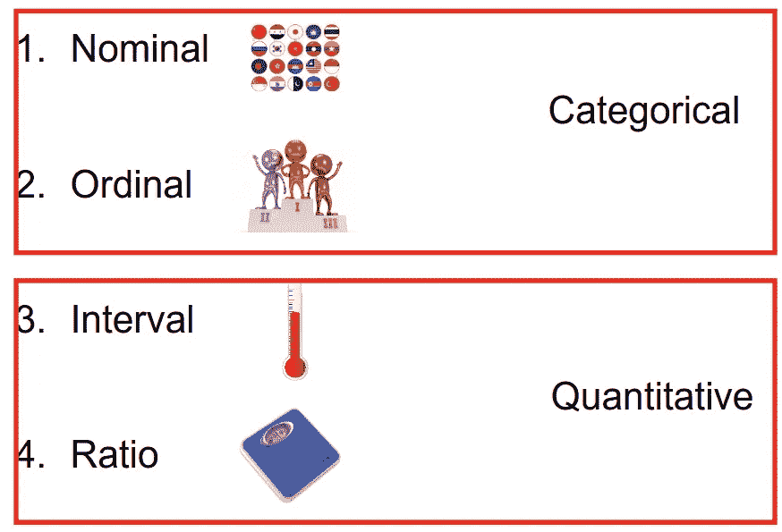

4 Different types of Data

## 标称数据

“名义上的”这个名字来自拉丁语， *nomen* ，意思是名字。名义数据是由简单命名系统**区分的对象。需要注意的一件重要事情是，名义数据也可能分配有数字。这可能会出现序数(定义如下)，但他们不是。编号的标称数据仅用于获取和参考。一些例子包括:**

*   一组国家。
*   钉在马拉松运动员身上的号码。

## 有序资料

顺序数据是指那些其顺序很重要的项目。更正式的说法是，它们在有序尺度上的相对位置为我们提供了意义。这可能表示优势或时间位置等..默认情况下，序数数据的顺序是通过给它们分配数字来定义的。然而，也可以适当地使用字母或其他顺序符号。一些例子包括:

*   一场比赛的名次(第一、第二、第三)
*   组织中的工资等级(助理，AVP，副总裁，SVP)。

## 区间数据

与顺序数据类似，间隔数据是沿着一个标尺测量的，其中每个对象的位置彼此之间的距离是**等距的**。这个独特的属性允许算术应用于它们。一个例子是

*   华氏 78 度和 79 度之间的温度差与 45 度和 46 度相同。

## 比率数据

像区间数据一样，比率数据的差异是有意义的。比率数据有一个额外的特性，使对象的比率也有意义，那就是它们有一个**真零点**。零表示没有某个属性。所以当我们说某样东西没有重量时，我们的意思是那东西没有质量。一些例子包括:

*   体重秤上人的重量

**区间 vs 比率**

区间和比值的区别只是一个没有真正的零点，而另一个有。举个例子可以很好地说明这一点:当我们说某样东西的温度是 0 华氏度时，并不意味着那东西没有热量。这一独特的性质使得诸如“华氏 80 度是华氏 40 度的两倍”之类的说法不成立。

[*回提纲*](#4603)

在我们深入研究其他部分之前，我想形式化一些概念，这样你就可以清楚地知道我们为什么要做下面显示的事情。

首先，我要说的是，快速显示数据摘要的最佳方式是通过 2D 图。尽管生活在 3D 空间世界中，人类发现很难感知第三维度，例如深度，更不用说 3D 图在 2D 屏幕上的投影。因此，在随后的章节中，您会看到我们仅使用**条形图**表示分类数据，使用**箱线图**表示定量数据，因为它们分别简洁地表达了数据分布。我们将只关注目标变量的**单变量分析**和**双变量分析**。有关仪表板技术的更多详细信息，请参考本文的第 6 节。

我们将主要使用海洋生物和熊猫来完成这个任务。众所周知，统计是任何数据科学家的工具箱中必不可少的一部分，seaborn 允许快速轻松地使用 matplotlib 来漂亮地可视化您的数据统计。matplotlib 功能强大，但有时会变得复杂。Seaborn 提供了 matplotlib 的高级抽象，允许我们**轻松地绘制有吸引力的统计图**。为了更好地利用 seaborn，我们还需要熊猫，因为 seaborn 与熊猫的数据帧配合得最好。

此外，如果您想跟随编码，一定要下载[数据](https://www.kaggle.com/francksylla/titanic-machine-learning-from-disaster/data)并正确设置您的环境。您可以在自述文件中找到说明。我的 GitHub [repo](https://github.com/notha99y/EDA) 中的 MD 文件。

说到这里，让我们开始动手吧！

# 2.分类分析

我们可以使用`pd.read_csv()`开始读取数据。通过对数据框执行`.head()`，我们可以快速查看数据的前 5 行。对于那些不熟悉 pandas 或数据框概念的人，我强烈建议花半天时间浏览以下资源:

1.  [熊猫文档](https://pandas.pydata.org/)
2.  [什么是数据帧？](https://github.com/mobileink/data.frame/wiki/What-is-a-Data-Frame%3F)

其他有用的方法有`.desribe()`和`.info()`，前者会显示:

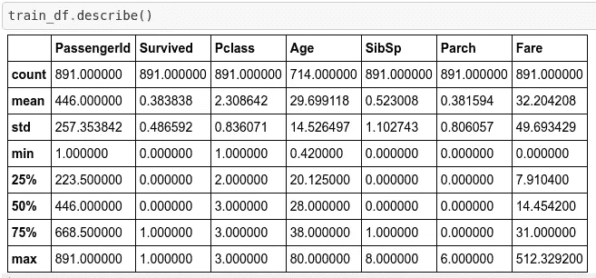

Output of .describe() method on a data frame

后者会显示:

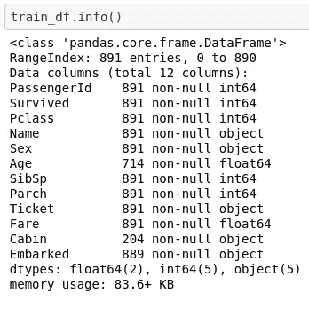

Output of .info() method on a data frame

我们现在看到，

**分类数据:**

*   PassengerId，
*   幸存了下来，
*   Pclass，
*   姓名，
*   性，
*   票，
*   小屋，
*   登上了

**而定性数据:**

*   年龄，
*   SibSp，
*   炒熟，
*   和票价

现在，有了这些知识和我们在第 1 节中学到的知识，让我们编写一个定制的帮助器函数，它可以用来处理大多数种类的分类数据(或者至少尝试这样做),并给出它们的快速摘要。我们将借助一些熊猫方法和 seaborn 的`.countplot()`方法来做这些。助手函数称为`categorical_summarized`，如下所示。

Helper Function #1: Categorical Data Summarizer

`categorical_summarized`所做的是接收一个数据帧，连同一些输入参数，并输出以下内容:

1.  数字数据的计数、平均值、标准差、最小值、最大值和四分位数，或者非数字数据的计数、唯一性、顶级和顶级频率。
2.  如果`verbose`设置为`True`，感兴趣列的分类频率
3.  感兴趣的列的每个类的计数的条形图

让我们来谈谈输入参数。`x`和`y`接受一个`str`类型，它对应于我们想要调查的感兴趣的列。将列名设置为`x`将创建一个条形图，x 轴显示不同的类，y 轴显示它们各自的计数。将感兴趣的列的名称设置为`y`将会翻转前面的图的轴，其中不同的类将位于 y 轴上，而 x 轴显示计数。通过将`hue`设置为目标变量，该函数将显示目标变量对相关列的依赖性。显示`categorical_summarized`用法的示例代码如下所示:

## 使用“分类总结”的一些例子

## 单变量分析

Using categorical_summarized on Survival Variable

将给出以下内容:

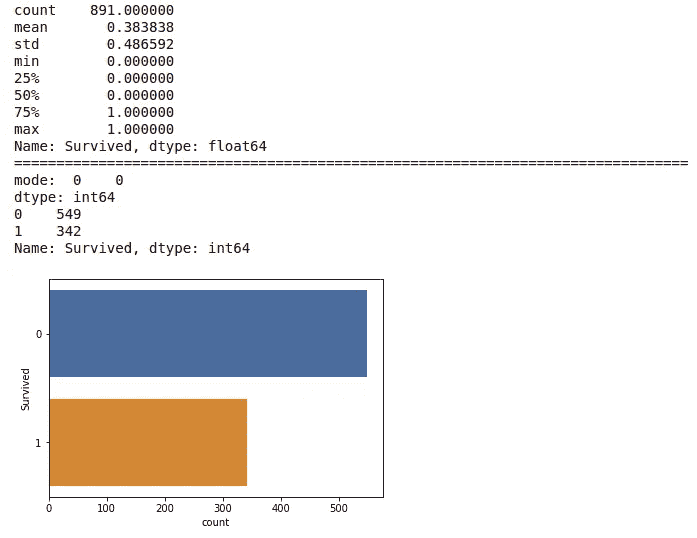

Output of categorical_summarized on Survival Variable

## 双变量分析

Using categorical_summarized on Gender Variable with hue set to Survived

将给出以下内容:

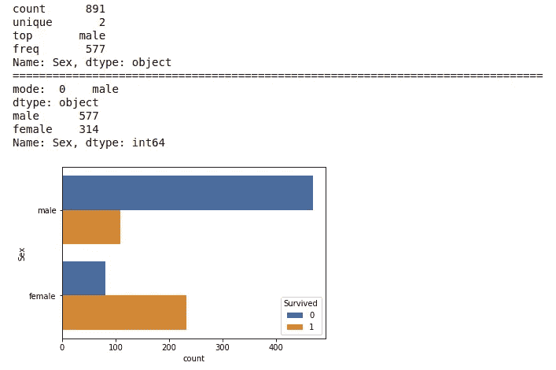

Output of categorical_summarized on Gender Variable with hue set to Survived

更多例子请参考 GitHub repo 中的`Titanic.ipynb`。

[*回提纲*](#4603)

# 3.定量分析

现在，我们可以在技术上使用条形图来表示定量数据，但这通常会非常混乱(您可以尝试在`Age`列上使用`categorical_summarized`，您会看到一个由细箱组成的混乱图)。更简洁的方法是使用箱线图，它基于五个数字汇总显示分布:最小值、Q1、中值、第三季度和最大值。

下一个助手函数称为`quantitative_summarized`，定义如下:

Helper Function #2: Quantitative Data Summarizer

与`categorical_summarized`类似，`quantitative_summarized`接收一个数据帧和一些输入参数，以输出潜在统计数据以及一个箱线图和群集图(如果`swarm`设置为`true`)。

`quantitative_summarized`可以接受一个定量变量和最多两个分类变量，其中定量变量必须分配给`y`，另外两个分类变量可以分别分配给`x`和`hue`。显示用法的一些示例代码如下所示:

## 一些使用“定量 _ 概括”的例子

## 单变量分析

Using quantitative_summarized on Age Variable

将给出以下内容:

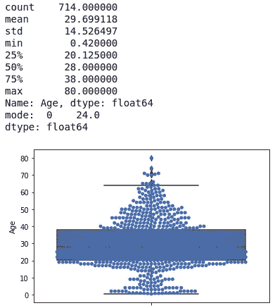

Output of quantitative_summarized on Age Variable

## 双变量分析

Using quantitative_summarized on Age Variable with x set to Survived

将给出以下内容:

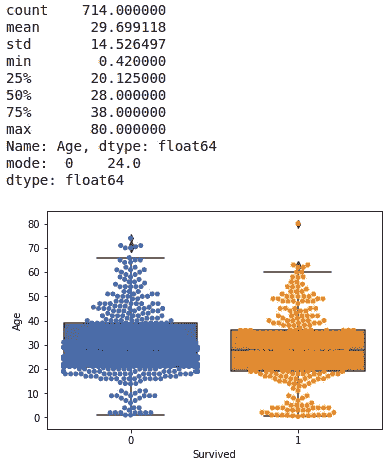

Output of quantitative_summarized on Age Variable with x set to Survived

## 多变量分析

Using quantitative_summarized on Age Variable with x set to Survived and hue set to Pclass

将给出以下内容:

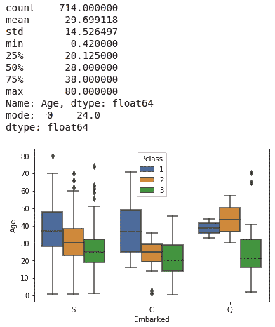

Output of quantitative_summarized on Age Variable with x set to Survived and hue set to Pclass

**相关性分析**

我们可以使用的另一个流行的定量分析是找出变量之间的相关性。相关性是理解数据集中变量之间关系的一种方式。对于任何一对变量:

*   **正相关**:两个变量同向变化
*   **中性相关**:变量的变化没有关系
*   **负相关**:变量反向变化

皮尔逊相关系数通常用于总结两个样本变量之间线性关系的强度。这是两个变量之间的协方差的归一化，

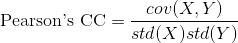

Pearson’s Correlation Coefficient Formula

形象化的一个好方法是使用热图。我们首先丢弃分类变量，并用它们的模式填充剩余定量变量的缺失值。熊猫数据框架允许用`.corr`方法简单计算皮尔逊的 CC。代码可以在下面找到

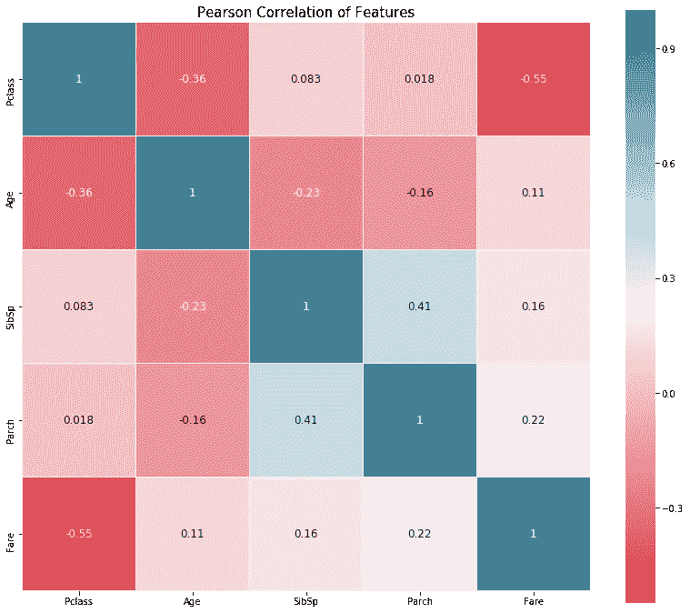

Heatmap of Pearson’s CC for Quantitative Variables

这种可视化的一个好处是，我们不仅可以看到变量之间的关系，例如，Fare 和 Pclass 之间存在负的 Pearson CC，我们可以避免多重共线性现象的发生。

多重共线性会对广义线性模型(如逻辑回归)产生不利影响。当变量之间存在高度相关性，导致回归系数的估计不稳定时，就会出现这种情况。然而，如果你计划使用决策树作为你的预测器，那么你不需要担心这个。

关于共线性的有趣阅读可以在[这里](https://medium.com/future-vision/collinearity-what-it-means-why-its-bad-and-how-does-it-affect-other-models-94e1db984168)找到。

相关性有助于数据插补，相关变量可用于填充彼此的缺失值。相关性也可以表示因果关系的存在。也就是说，需要注意的是[相关性并不意味着因果关系](https://en.wikipedia.org/wiki/Correlation_does_not_imply_causation)。

更多例子请参考 GitHub repo 中的`Titanic.ipynb`。

[*回到大纲*](#4603)

# 4.使聚集

## k 均值聚类

k-means 聚类属于**划分聚类**家族。在分区集群中，我们必须指定我们想要的集群数量， *k* 。这可以通过挑选如下所示的惯性图的“肘”点来完成。**一个好的选择是 *k* ，它不是太大并且具有低惯性值**。惯性是一种衡量群集质量的指标，它为我们提供了群集紧密程度的指标。

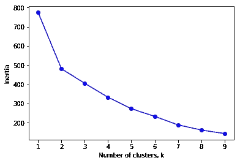

Inertia plot using K Means Clustering to select a suitable k value

当 K Means 计算特征之间的距离以决定随后的观察是否属于某个质心时，我们必须通过编码分类变量和填充缺失值来预处理我们的数据。下面显示了一个简单的预处理函数。

Function to preprocess the data to prepare for Clustering

既然我们已经处理了数据，我们必须执行**特征缩放**，以便可以比较跨特征计算的距离。这可以通过`sklearn.preprocessing`库轻松完成。代码实现请参考`Titanic.ipynb`。运行 k-means 算法后，我们设置 *k = 2* ，我们可以绘制如下所示的变量。

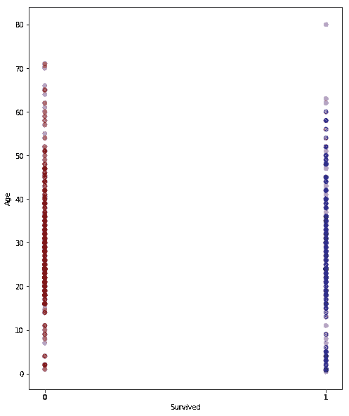

Cluster red and blue plotted on Age and Survived Axes

## 层次凝聚聚类

对于这一小节，我将介绍另一种通过集群执行 EDA 的快速方法。凝聚聚类使用自下而上的方法，根据各个观察值之间的距离将它们迭代地连接在一起。我们将使用`scipy.cluster.hierarchy`包来执行链接，并使用树状图显示我们的结果。通过**最近邻法**计算两个聚类之间的距离。

Code to implement Hierarchical Agglomerative Clustering

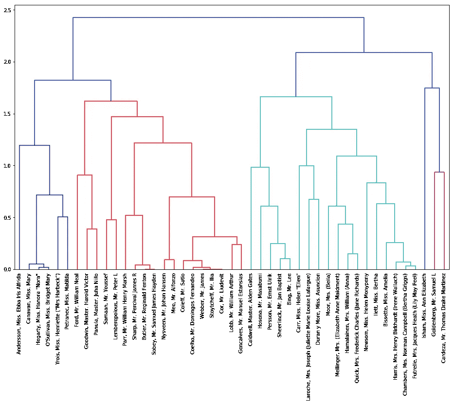

Dendrogram of the Hierarchical Clustering of the Titanic Dataset

[*回提纲*](#4603)

# 5.基于树的估计器的特征重要性

执行 EDA 的另一种快速方法是通过基于树的估计器。决策树学习如何在最终输出预测的叶节点之前“最佳地”将数据集分割成更小的子集。这种分裂通常由一个**杂质标准**来定义，如**基尼**或**信息增益熵**。因为这是一篇关于 EDA 而不是决策树的文章，所以我不会详细解释它们背后的数学原理，但是我会告诉你如何使用它们来更好地理解你的特性。更多细节你可以参考这篇[写得很好的文章](https://medium.com/@srnghn/the-mathematics-of-decision-trees-random-forest-and-feature-importance-in-scikit-learn-and-spark-f2861df67e3)。

基于杂质标准，可以通过贪婪地挑选对最大信息增益有贡献的特征来构建树。为了说明这一点，我将使用`scikit-learn`库。

## 构建随机森林分类器

我们首先构建一个随机森林分类器。默认情况下，杂质标准设置为基尼系数。使用下面的代码，我们可以看到我们的 Titanic 数据集的相应特征的重要性。

Code to generate a Random Forest Classifier, train, and also plot the Feature Importance

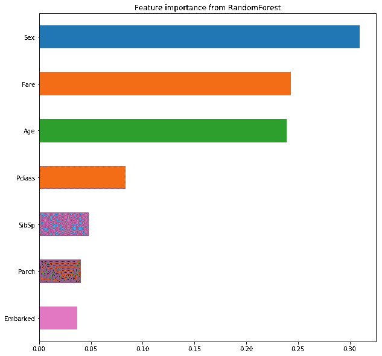

## 让我们试试 XGBoost

另一种创建决策树集合的方法是通过 XGBoost，它是梯度增强框架家族的一部分。使用下面的代码，我们可以看到哪个相应的特性对我们的 XGBoost 是重要的。同样，默认情况下，杂质标准设置为基尼系数。

Code to generate an XGBoost Classifier, train, and also plot the Feature Importance

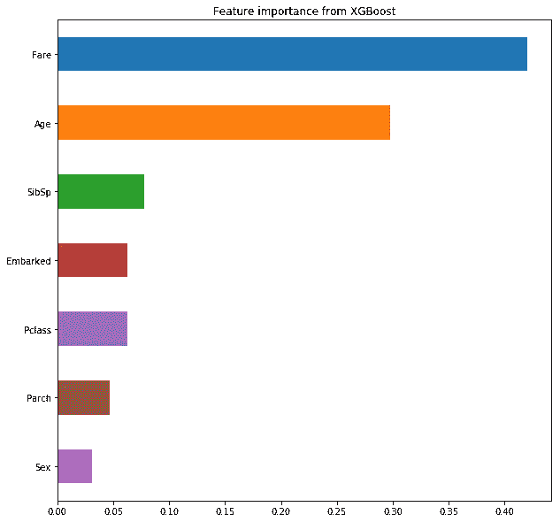

[*回提纲*](#4603)

# 6.仪表板技术

与信息图表不同，仪表板的创建是为了在单个屏幕上以干净、简洁的方式客观地显示重要信息，目的是通知而不是误导读者。通常，仪表板是利用我们的视觉感知能力来放大认知的数据表示。他们显示的信息是高质量的图形，所有人都能理解，不需要额外的信息来解释。

为了实现卓越的图形，必须遵守以下两个关键方面:

1.  最大化数据:墨迹和最小化图表垃圾
2.  具有高度的图形完整性

## 数据:墨水和图表垃圾

数据:墨水被定义为用于表示数据的墨水，而图表垃圾被定义为多余的、装饰性的或转移注意力的墨水。图表垃圾的例子有莫尔振动、网格和鸭子。为了实现这一点，我们利用我们的**预先注意属性**和**格式塔原则**来引出可视化的模式。

Image showing the side of a man’s face, at the same time, the front of his face. An example to illustrate Figure & Ground

## 实现图形完整性

改编自:爱德华·塔夫特。(2001).[定量信息的可视化显示，第二版，图形](https://www.amazon.com/Visual-Display-Quantitative-Information/dp/1930824130)，有六个原则保证图形的完整性:

1.  使数字的表示与数量成比例
2.  使用清晰、详细、彻底的标签
3.  显示数据变化，而不是设计变化
4.  使用标准化单位，而不是标称值
5.  描述少于或等于“n”个可变维度的“n”个数据维度
6.  引用完整上下文中的数据

因此，我们避免使用饼状图或 3D 图或区域尺寸。条形图和箱线图是实现图形完整性的很好的例子，因为它们简单(每个人都可以毫不含糊地理解)而且强大。不要遗漏上下文也很重要，比如让轴显示以零为参考的定量数据。

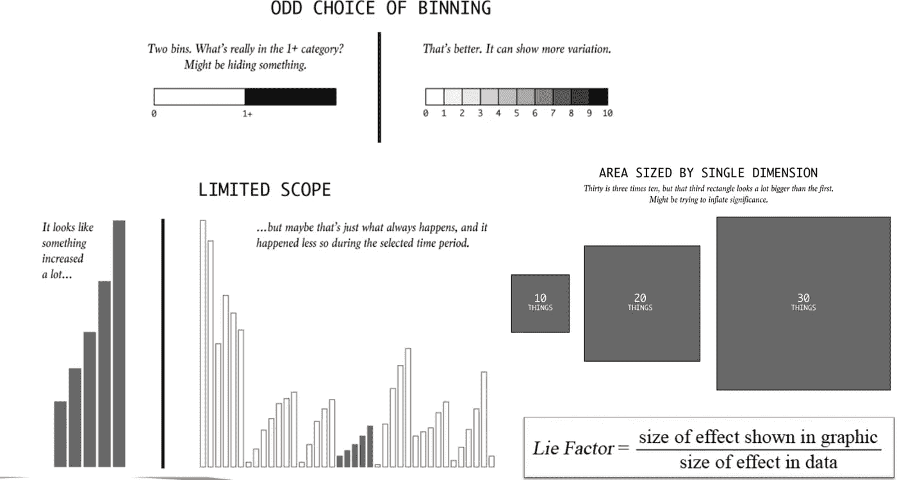

Examples of Misleading Graphics with Poor Graphical Integrity

迄今为止， [Tableau](https://www.tableau.com/) 可能是仪表板方面的行业领导者。他们采用了最佳的仪表板实践，还通过拖放为您完成了绘制图表的繁重工作。我强烈推荐任何对这个领域感兴趣的人来看看 Tableau。另一个新兴的开源项目叫做 [Apache Superset](https://superset.incubator.apache.org/) ，它做的事情与 Tableau 类似。

[*回轮廓*](#4603)

# 结论

总而言之，做 EDA 有无数种方法。EDA 是整个数据科学过程的一部分，这个过程是高度迭代的。我在这篇文章中分享的是我在参加了一些数据科学黑客马拉松后学到的东西，我在 [AI Singapore](https://www.aisingapore.org/) 担任数据科学家的时间，以及我在 [MTech 课程](https://www.iss.nus.edu.sg/graduate-programmes/programme/detail/master-of-technology-in-knowledge-engineering)中的项目。我坚信首先要建立一个坚实的基础，然后我们优化速度和性能，这也是我写这篇文章的动机。有了这组帮助函数，我和我的团队能够理解我们给定数据集的潜在统计数据，然后制定一个合理的策略，在半天的黑客攻击内构建一个分类器。

这篇文章并不是 EDA 的完整指南，而是一个入门包，让有抱负的数据科学家使用 Python、pandas、seaborn 和 scikit-learn 等开源工具开始他们的第一个数据科学项目。如果您有任何基于 Python 包的很酷的自定义函数，并且在 EDA 过程中对您有所帮助，请随时在下面留下您代码的评论。您还可以提交一个 pull 请求并贡献给`helper.py`文件。感谢阅读😄。我希望你带走了一些东西。

*特别提及***[*德里克*](https://towardsdatascience.com/@derekchia) *，以及* [*钦扬*](https://medium.com/@cykoay04157) *对本文进行校对并反馈改进意见***

***随时通过*[*Twitter*](https://twitter.com/rahjaytee)*[*LinkedIn*](https://www.linkedin.com/in/renjietan/)*与我联系！****

***如果你对我参与的其他项目感兴趣，欢迎访问我的*[*GitHub*](https://github.com/notha99y)*！***

***想学习如何快速构建人体动作分类器？请查看我之前的帖子* [*这里*](/6-steps-to-quickly-train-a-human-action-classifier-with-validation-accuracy-of-over-80-655fcb8781c5) *。***