# 用逻辑回归研究分类问题及对招生问题的理解

> 原文：<https://towardsdatascience.com/a-study-of-classification-problems-using-logistic-regression-and-an-insight-to-the-admissions-ec69ddf93f36?source=collection_archive---------0----------------------->

# **摘要:**

在我们的世界里，很多经常遇到的问题都是分类问题。我们经常在确定的价值观和对事物的僵化选择之间感到困惑。在本文中，我们将讨论一种使用机器学习有效解决简单分类问题的算法。此外，我们将分析一个假设的二元类问题，涉及基于入学考试成绩和本科成绩的研究生成绩。

# 简介:

监督学习是一种机器学习技术，其中我们将输入与给定数据集中的目标相关联。对于我们的最终产出，我们已经有了明确的直觉。我们大致有两种类型的监督学习问题，“回归”和“分类”。我们将在本文中讨论分类问题。分类问题是我们将输入数据分成不同类别的问题。所谓离散，我们指的是单独的类。
例如:想象一个基于研究生院招生的假设数据集，有三列。第一列是入学考试分数(**输入 X1** )，第二列是 UG 考试(**输入 X2** )，第三列是结果，录取/拒绝(**目标 Y** )。本文中使用的数据集片段如下所示。

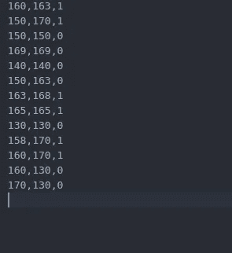

Entrance Exam Score, UG Score, Outcome(Binary)

我们将目标类 Y 定义为二进制类。因此，我们将集合定义为， **Y={0，1}** 其中集合元素为:

**0 表示拒绝(否定类)，
1 表示接受(肯定类)**

因此，这是一个分类问题。我们可以根据录取过程的结果将数据集分为两类。通常将数据集分解为离散类别的算法被定义为*分类器*。在这个例子中，因变量是*二分的*。在这种情况下，我们更喜欢逻辑回归。我们可以在 MATLAB/Octave 中绘制数据集的散点图，并观察下图:

Scatter plot of our dataset

# 涉及的激活功能和映射功能:

首先，考虑映射我们的输出和输入的函数，因此在计算平方误差函数时用于计算预测。让我们称那个函数为映射函数或假设函数， **h(X)** 。“假说”一词是出于各种历史原因而创造的。此外，术语“逻辑”是乙状结肠的同义词。因此，我们在该算法中使用具有“S 形曲线”的 Sigmoid 激活函数。通过我们的编程功能生成的曲线如下所示。

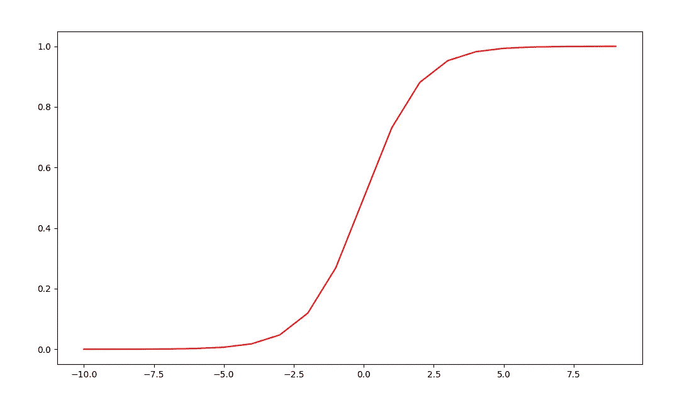

Sigmoid Activation Function

数学上，我们将函数定义为:

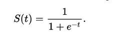

Sigmoid 函数还有其他几个数学特性。比如我们可以用函数本身来表示函数的导数。

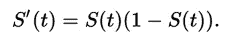

这种 Sigmoid/Logistic 函数简化了优化过程中涉及的数学运算，是小规模分类问题的理想选择。使用 Sigmoid 函数，我们可以有效地限制我们的范围，以便它有效地表示概率。我们可以用数学方法将假设/映射函数表示为:

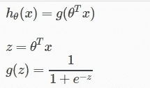

这本质上是一个非常基本的线性成本函数，只是它与一个 sigmoid 函数相结合。

我们的假设函数给出了任何给定事件发生概率的数值。我们可以将映射函数的范围定义为: **0≤h(X)≤1** 。

# **成本函数直觉:**

成本函数是一种数学函数，用于估计假设与输入集和目标集的匹配程度。从图形上看，我们知道一个更好的成本函数会更好地拟合我们给定的数据。它通常表示为参数的函数。在这种情况下，我们称之为 **J(θ)** 。
在这个算法中，我们使用了一个**对数代价函数**，它是从*最大似然估计(M.S.E)* 的原理中推导出来的，以确保我们得到的作为输出的函数是一个**凸函数。**

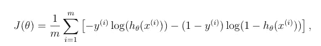

一个简单的直觉是认为代价函数中涉及的对数大致反作用于所涉及的 **exp** 。

正如克里斯托弗·毕晓普在他的著作中指出的那样，

> “当我们假设我们的阳性和阴性训练样本来自两个不同的高斯聚类(不同的位置，但相同的协方差)时，我们可以开发一个完美的分类器。”

凸函数中的优化更容易，因为在曲线中更容易达到最小值并获得参数θ的最佳值。
然而，我们观察到，在我们对 J(θ)进行微分之后，我们得到了与线性回归方法相同的梯度函数。

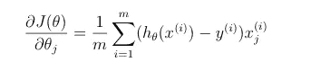

然而，梯度值不是一回事，因为我们拥有不同的线性和逻辑回归映射函数。

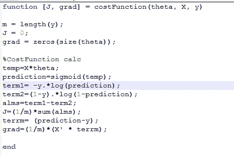

Prototype code for a Cost Function

因此，使用参数向量θ和成本函数 J(θ)，我们可以应用任何给定的优化算法来实现简单的决策边界。

# **优化参数:**

现在，如果我们想要拟合参数(在本例中为θ)，我们需要应用最小化(优化)算法。
我们可以采取简单的小步骤 *(* ***)限制(θ)>0****)*达到我们给定的最小值，通常称为**梯度下降**，或者采用高级优化算法，如***【BFGS】***或 ***有限内存 BFGS*** *。* 高级优化方法是 ***拟牛顿*** 方法的一部分，我们在其中计算**黑森矩阵**的优化值。L-BFGS 非常类似于 BFGS，除了它有更好的内存优化和更可扩展的算法。此外，当与梯度下降并置时，高级算法不容易出现反复试验的情况，因为不需要选择任意值的*α(*学习率)来获得更优的结果。Hessian 矩阵的数学符号如下所示:

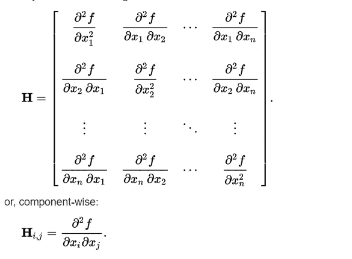

通常，我们通过库应用高级优化。C++中用于应用高级优化算法的一个特殊库是 [Eigen C++库](http://eigen.tuxfamily.org/index.php?title=Main_Page)。

然而，不同的库可能有不同的时间复杂度。不明智地选择一个库可能会降低我们算法的整体性能，并对我们的整个程序产生严重的影响。

因此，在使用优化方法有效地最小化我们的参数之后，我们可以绘制决策边界。因此，我们使用 MATLAB 的通用*“fmin unc”*来应用高级优化。在应用以θ和梯度值为参数的函数后，我们可以如下绘制决策边界:

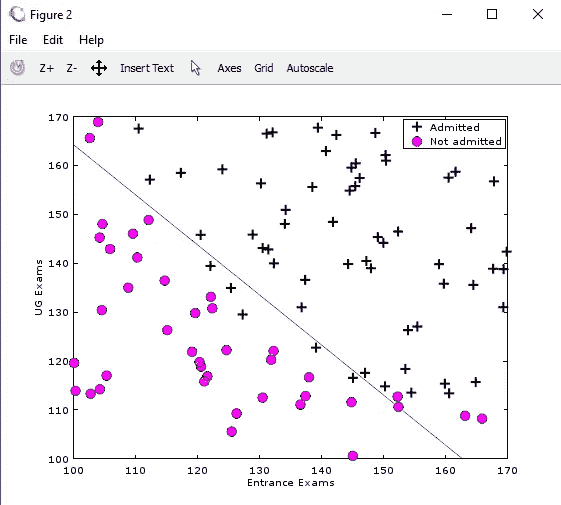

Decision Boundary separating the data. In this case, a linear boundary fits better.

# 过度拟合曲线的概念:

过度拟合基本上是一种情况，其中我们的学习假设设法拟合数据集中的所有点，并产生很少或没有错误，但有一个重大缺陷。我们的算法**无法预测**新测试实例**的离散类。
这个问题的解决方法:** 我们可以惩罚某些参数(θ)来修复这个。我们在优化算法中增加了一个调节参数(λ),可以优化曲线。这个技术叫做*正则化*。因此，我们修改我们的成本函数和优化算法来惩罚参数并获得最佳拟合。

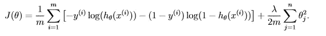

# 适合度:

在**拟合优度(G.O.F)** 中，我们主要检查一个给定的模型是否被正确指定，以及它与统计观察值的拟合程度。通常有两种常用的方法来估计拟合优度。一个测试是著名的皮尔逊卡方测试，另一个测试是*霍斯默和莱梅休测试*。简单明了的**皮尔逊卡方**检验是一种更简单的技术，因此我们将讨论检验的直觉。

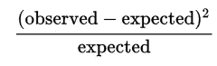

卡方(χ2)对于从给定数据集计算统计参数具有很高的数学准确性。此外，这个测试是渐近真实的。它的主要作用是计算数据集中每个观测值的频率。
因此，我们可以通过比较 p 值和分布值来计算统计 p 值。
我们还可以使用各种其他测试，如 **Stukel 测试或信息矩阵**测试来有效地测量逻辑回归的拟合度。

由于这是我关于机器学习的第一篇文章，我讨论了该领域的一个基本概念。在下一篇文章中，我将使用基于 U64 Bitboard 的国际象棋引擎来讨论 Alpha Beta 修剪。

# 参考资料:

1.  W.李少华，刘，“利用加权逻辑回归的正例与非正例学习”，大学，2003 年
2.  刘，和 J .诺塞达尔，“关于大规模优化的有限记忆 BFGS 方法”-数学规划，1989-施普林格
3.  马·巴比亚克，“所见不一定是所得:回归型模型中过度拟合的非技术性简要介绍”，《心身医学》，2004 年，《
4.  Andrew NG，“机器学习，斯坦福大学课程”。
5.  Paul D. Allison，“适合逻辑回归的度量”，-SAS 全球论坛，DC 华盛顿州，2014 年-statisticalhorizons.com
6.  Christopher M Bishop，“模式识别和机器学习”。