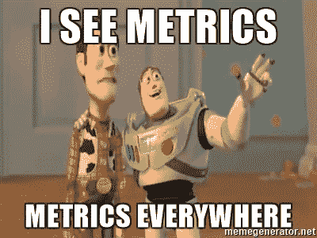
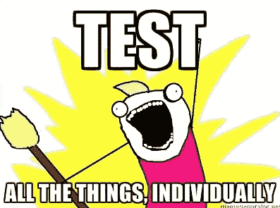
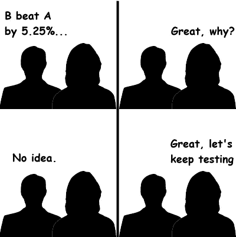

# Udacity A/B 测试课程总结

> 原文：<https://towardsdatascience.com/a-summary-of-udacity-a-b-testing-course-9ecc32dedbb1?source=collection_archive---------0----------------------->

最近我在 Udacity 上完成了 Google 的 [A/B 测试课程。这个课程被强烈推荐给想学习 A/B 测试的人。我认为写一份关于我所学的总结会非常有帮助，因为我的笔记非常详细，我也听到我的朋友抱怨说很难跟上老师。希望这个总结可以帮助更多的人。](https://www.udacity.com/course/ab-testing--ud257)

本课程着重强调 A/B 测试的商业应用，而不是统计方面。然而，如果你想学习更多关于统计推断的知识，为 A/B 测试打下基础，我建议你找一本统计书或看几个视频，作为本课程的补充。

## 首先，**我们为什么要做 A/B 测试**？

答案是测试消除了网站优化中的猜测，使基于数据的决策能够将商业对话从“我们认为”转变为“我们知道”通过测量变更对您的指标的影响，您可以确保每个变更都产生积极的结果。如今，公司对网页版本、个性化推荐和新功能进行 A/B 测试非常普遍。

## **我们能测试一切吗**？

不。有些情况我们不能通过 A/B 测试来分析。例如，如果您正在添加一个新的体验，并希望测试它，老用户可能会抵制新版本(厌恶改变)，或者老用户可能都喜欢新的体验，那么测试集就具备了一切(新奇效果)。当谈到新的体验时，需要考虑两个问题:(1)你比较的基础是什么？(2)你需要多少时间让你的用户适应新的体验，这样你才能真正说出什么是稳定的体验，并做出稳健的决策？除了新的经验，长期效果也很难测试。例如，一个房屋租赁网站测试它的推荐效果，但是一个客户可能甚至在六个月内都不会回来，这很难通过 A/B 测试来衡量。如果是这种情况，我们该怎么办？

当 A/B 测试没有用时，我们可以:

*   分析用户活动日志
*   进行回顾性分析
*   进行用户体验研究
*   焦点小组和调查
*   人类评估

## **那么，如何做 A/B 测试呢？**

实际上，A/B 测试可以总结为以下 5 个步骤:

1.  选择并描述评估你的实验的标准，例如，你关心什么，你想如何衡量效果
2.  选择显著性水平(alpha)、统计功效(1-beta)和实际显著性水平。如果测试具有统计显著性，您确实希望启动变更
3.  计算所需的样本量
4.  为对照组/治疗组取样并进行测试
5.  分析结果并得出有效的结论

在本 Udacity 课程中，这五个步骤将通过大量真实世界的示例进行详细解释:

# **步骤 1:为健全性检查和评估** 选择和描述度量

*我们为健全性检查选择的度量被称为不变度量。他们不应该受到实验的影响。它们不应该在对照组和治疗组之间发生变化。否则，实验设置是不正确的。*

*我们选择的评估指标用于衡量哪种变化更好。例如，我们可以使用每日活跃用户(DAU)来衡量用户参与度，使用点击率(CTR)来衡量网页上的按钮设计，等等。一般来说，你应该记住**四类指标**:*

**

*   *总和与计数*
*   *分布(平均值、中间值、百分位数)*
*   *概率和比率(例如，点击率、点击率)*
*   *比率:任何两个数字互相除*

*除了选择度量的类别，您还应该考虑**灵敏度**和**健壮性**。你想要选择一个具有高灵敏度的指标，这意味着该指标可以拾取你所关心的变化。您还希望度量对于您不关心的变更是健壮的。这意味着当您不感兴趣的事情发生时，度量不会改变很多。如果一个指标太敏感，那么它就不够健壮，因此这两者之间需要一个平衡，你需要研究数据来找出使用哪个指标。*

***如何衡量灵敏度和鲁棒性？***

*   *进行实验*
*   *使用 A/A 测试查看指标是否有差异(如果有，则该指标不可靠)*
*   *回顾性分析*

# *第二步:选择显著性水平、统计功效和实际显著性水平*

*通常显著性水平为 0.05，功效设置为 0.8。实际显著性水平因每个单独的测试而异，它告诉你测试检测到多少变化，使你真的想发起变化。即使测试具有统计学意义，您也可能不想启动变更，因为您需要考虑变更的业务影响，考虑工程成本、客户支持或销售问题以及机会成本是否值得启动。*

# *步骤 3:计算所需的样本量*

*概述:需要考虑度量标准的选择、转移单位的选择和人口的选择，因为它们都会影响度量标准的可变性。然后决定实验的规模。*

*   ***科目**:测试的科目(**分流单位**)是什么？也就是说，您将在哪些单元上运行测试并进行比较。转移的单位可以是基于事件的(例如页面视图)或匿名 id(例如 cookie id)或用户 ID。这些都是常用的分流单位。对于用户可见的更改，您希望使用 user_id 或 cookie 来度量更改。如果测量延迟变化，其他指标如事件级别转移可能就足够了。*
*   ***人群**:哪些受试者有资格参加测试？所有人？只有美国人？只有某些行业的人？*
*   ***如何缩小实验规模以更快完成实验？**您可以增加显著性水平α，或降低功率(1-β),这意味着增加β，或更改转移的单位(如果最初它与分析单位不同)(分析单位:您的评估指标的分母)。*

# *步骤 4:为对照组/治疗组取样并进行测试*

*要记住几件事:*

*   *持续时间:什么时候跑最好？学生回大学？假期？周末对工作日？*
*   ***暴露**:您希望将实验暴露在多大比例的流量中？建议是取一小部分，同时运行多个测试(不同的日子:周末、工作日、假日)。*
*   ***学习效应**:当有新的变化时，开始时用户可能会反对变化或者大量使用变化。但是随着时间的推移，用户行为变得稳定，这就是所谓的平台期。衡量学习效果的关键是时间，但实际上你没有那么多时间来做决定。建议:在更小的用户群上运行，运行时间更长。*

# *第五步:分析结果并得出结论*

## ***第一步，理智检查。***

*在分析结果之前，第一步是进行健全性检查——检查您的不变指标是否已经改变。如果您的健全性检查失败，请不要继续。相反，去分析为什么你的理智检查失败了。你可以选择:(1)回顾性分析，或者(2)研究是否有学习效应。*

## ***第二步，分析结果。***

***答:如果您有一个单独的评估指标，并且不重要:***

*第一轮:检查结果，看是否真的没有显著差异。例如，分解成不同的平台或一周中的某一天。这可能有助于你找出系统中的错误，也可能有助于你了解用户对你的实验的反应。*

*第二轮:用不同的方法交叉核对。例如，用参数假设检验与非参数符号检验进行比较。如果你的假设检验和符号检验不一致，你会怎么做？你应该以批判的眼光审视你的数据，因为你可能正遭受辛普森悖论(一个趋势出现在不同的数据组中，但当这些组被组合时就会消失或逆转)。辛普森悖论发生的原因可能是:(1)你的实验设置不正确；(2)变化对新用户和有经验用户的影响不同。*

***b .如果您同时测量多个指标***

*(1)一个潜在的问题是，你可能会偶然看到一个重要的结果。(看看这个 [xkcd: significant](https://xkcd.com/882/)*

**

*例如，您正在运行一个包含 20 个变量的测试，并分别测试每个假设:*

**P(一个显著结果)= 1p(无显著结果)**

**P(一个有效结果)= 1−(1−0.05)^20 = 0.64**

*很有可能你会偶然看到一个重要的结果！！幸运的是，有几种方法可以解决这个问题:*

*   ***Bootstrap** 并一次又一次地运行实验，如果偶然发生，显著性度量应该会消失。*
*   ***Bonferroni 校正**:将显著性水平 0.05 除以多重测试中的测试次数。假设您正在测量 20 个测试，那么您对该测试的显著性水平应该是 0.05/20 = 0.0025。Bonferroni 修正的问题是它太保守了。如果同时测试许多指标，可能没有一个是重要的。*
*   *控制**家族误差率(FWER)** :任何指标显示假阳性的概率。*
*   *控制**错误发现率(FDR)** : FDR = #假阳性/拒绝总数。*

*(2)另一个潜在的问题是，如果度量标准**没有按照您想象的方向**移动，该怎么办？例如，你预计 DAU 和用户使用你的应用的平均时间长度都会增加。然而，你观察到 DAU 减少，而平均时间长度增加。WTH？？*

*你应该深入调查，找出原因。这也是为什么人们通常希望有一个 OEC(总体评价标准)。一个好的 OEC 给你一个短期和长期目标之间的平衡，或者不同指标之间的平衡。然而，你也需要记住，拥有 OEC 有助于你了解你的企业关心什么，以及你如何平衡停留时间和点击等指标，但它不会帮助你做出产品变更的决定。*

## ***最后一步，得出结论。***

*如果你从测试中获得了一个重要的结果，就会出现两个问题:你理解这个变化吗？您要启动变更吗？如果你的改变对一部分用户有正面影响，但对其他部分用户没有影响或有负面影响怎么办？你明白为什么吗？？(例如，英文中的粗体字与中文中的粗体字具有不同的测试结果，因为粗体中文难以阅读)。*

**

*那么，我如何决定是否启动变更呢？*

*问自己几个问题:我是否有统计意义上和实践意义上的结果来证明这种改变？我是否了解这些变化对我们的用户体验产生了什么影响？最后一点，值得推出吗？*

# *逮到你了*

*当你想在 A/B 测试后启动一个变更时，总是要做一个上升。因为您想知道对未受影响的用户是否有任何您在最初的实验中没有测试的附带影响。*

*当你加速变化时，你可能会看到效果变平。因此使得测试的效果不可重复。造成这种现象的原因有很多。*

1.  ***季节性效应**:学生开始放暑假或返校时，社交网络平台用户行为发生很大变化。节假日对用户的购物行为影响很大。解决方案:使用保留方法，向除了一小组保留用户之外的所有人发起变更，并继续将他们的行为与控制组进行比较。*
2.  ***新奇效应**或**变化厌恶**:群组分析可能会有帮助。*

# *经验教训*

1.  *两次检查，三次检查你的实验设置是否正确。*
2.  *不仅要考虑统计上的显著性，还要考虑业务影响。考虑工程成本、客户支持或销售问题、机会成本等。*
3.  *如果你正在运行你的第一个有重大影响的实验，你可能想运行几个实验，并检查结果，看看你是否愿意启动它。*

# *其他需要考虑的事情:**实验的政治和伦理***

*实验涉及到真实的人，重要的是保护使用者并遵守伦理。然而，过去有许多有问题的实验例子。例如，历史上的[塔斯基吉梅毒实验](https://en.wikipedia.org/wiki/Tuskegee_syphilis_experiment)、米尔格拉姆实验[和最近的](https://en.wikipedia.org/wiki/Milgram_experiment)[脸书情感实验](https://www.nytimes.com/2014/06/30/technology/facebook-tinkers-with-users-emotions-in-news-feed-experiment-stirring-outcry.html)。为了以道德的方式进行 A/B 测试，有四个原则需要牢记:*

***1。风险:参与者面临什么风险？***

*主要门槛是风险是否超过“最小风险”。最小风险被定义为参与者在日常生活中可能遇到的伤害的概率和程度。所考虑的伤害包括身体、心理和情感、社会和经济问题。如果风险超过最小风险，则需要知情同意。*

***2。益处:研究结果的潜在益处是什么？***

*能够陈述完成研究的益处是很重要的。*

***3。选择:参与者还有什么其他选择？***

*在在线实验中，要考虑的问题是用户可能拥有的其他服务，以及在时间、金钱、信息等方面的转换成本。*

***4。隐私:参与者有什么隐私？***

*对于正在收集和存储的新数据，这些数据的敏感程度如何？处理这些数据的内部保护措施是什么？那么，对于那些数据，它将如何被使用，参与者的数据将如何被保护？如何保证参与者收集的用于研究的数据不会用于其他目的？*

*这个总结只是对课程内容的简要概述，如果你对 A/B 测试或准备面试感兴趣，我强烈建议你参加这个课程，并做期末项目。掌握一件事情的最有效的方法总是在实践中学习。*