# 哲学与文本挖掘的交叉

> 原文：<https://towardsdatascience.com/a-text-mining-approach-to-philosophy-fb757b7e1c1f?source=collection_archive---------4----------------------->

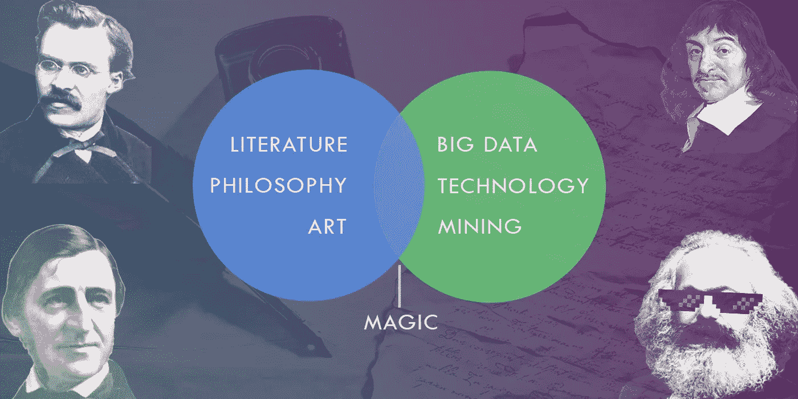

## 运用 R 对著名哲学著作的深入分析

通过大数据课程学习 R 之后，我获得了提取有用信息并通过图表、聚类图或分层树创建有意义的可视化所需的基本工具和技术的实践培训。本课程的主要学习目标之一是对文本数据集样本进行文本挖掘。虽然我对深入了解这个主题充满希望，但概念的教授非常抽象，令人不安的是，导师只花了 14 节课中的两节来学习这个模块。情况不言自明。我们要完成这项繁重的任务，研究我们的项目要分析哪些文本。然而；对我个人来说，这种自由对我有利，因为我能够在课程结束时获得比预期更好的学习体验。

谈到这个过程，最初的第一周，我在谷歌上疯狂搜索，积累了大量有用的文本挖掘资源、现有的工作成果和“公开”的问题。一旦我对开始这个项目的材料感到满意，我不得不寻找一个文本数据集，它不仅激起了我的兴趣，而且是一个以前没有使用过的数据集。因此，作为我项目的一部分，我想评价我在某个时间点读过的文学作品，无论是作为我过去选择的课程的一部分，还是通过我在浏览互联网时对哲学的随机探索。这些书是描述性的，但涉及生活的不同方面。其他的涉及深奥的理论，意识形态和一系列的前提，我根本没有足够的时间去浏览它们。相反，为了让生活对我来说更容易，我主要关心的是理解每个哲学家试图在他们的著作中传达的要旨。因此，通过编写几行代码，我将能够借助一些引人注目的可视化效果来理解冗长的文字。

为了使这篇文章尽可能简洁易读，我只分析了 6 套不同的文本，这些文本是由著名的哲学家撰写的，他们的理论和思想具有历史意义，即:

1.  **《哲学原理》** —勒内·笛卡尔(译 *Steve Harris* ，*查理·弗兰克*，2003 年版出版)
2.  《纯粹理性批判》 —伊曼纽尔·康德(J. M. D. Meiklejohn 译，2003 年版)
3.  散文集:第一辑——拉尔夫·瓦尔多·爱默生(2001 年版)
4.  **《共产党宣言》** —卡尔·马克思、弗里德里希·恩格斯(由*艾伦·路丁* & *吉姆·塔齐亚*版 2005 年出版 *)*
5.  **《道德谱系学》** —弗里德里希·尼采(由*霍勒斯·b·塞缪尔*&*j·m·肯尼迪*译，*奥斯卡·利维*博士编辑，1913 年首次出版)
6.  **超越善恶**——弗里德里希·尼采*海伦·齐默恩译，*版*2009 年出版*

*【注意最后两本书是同一作者写的。这是有意为我的评估做的]*

*找到提到的书籍并不是一项艰巨的任务，这主要归功于开放源代码库，尤其是古腾堡计划。该网站收集了 56，000 本上传的电子书，可供下载。为了提取有用的术语和关键见解，需要执行不同的统计或自然语言处理(NLP)程序，只有这样，我们才能产生我们谈到的可视化。我根据所采用的方法订购了不同的部分，如下所示:*

1.  *用于关键词分析的词云创建*
2.  *文本样本之间的相似性*
3.  *所选文本中包含的最常重复的二元模型的词频和 TF-IDF 图，以了解单词等级*
4.  *情感分析，以理解数据的上下文，并在给定文本之间建立关联。*

## *第 0 节:数据导入和内务处理*

*从我的 R 程序开始，我通常使用下面的命令清理所有的全局和局部变量:*

```
*rm(list=ls())*
```

*一旦执行，你的代码将有一个新的开始。因为我们正在使用古腾堡计划，必须阅读。txt 文件导入到我们的变量中，我们将导入以下库来利用某些重要的函数:*

```
*require(readtext)
require(gutenbergr)
require(quanteda)*
```

*Quanteda 库是我对文本文件进行定量分析的首选库。用更专业的术语来说，它允许我创建*语料库*或文本“集合”,其中包括文档级变量和该集合中每个包含文本的元数据。Quanteda 还允许我绘制一个文档特征矩阵(简称 DFM ),它将用于创建所有看起来很酷的图，如下所示。*

*最后，为了导入数据，我们执行以下代码行:*

```
*url  <- "[http://www.gutenberg.org/cache/epub/4391/pg4391.txt](http://www.gutenberg.org/cache/epub/4391/pg4391.txt)"
data <- texts(readtext(url))*
```

*看起来很简单，对吧？让我们进入有趣的部分。*

## *第一部分:文本中的关键词分析*

*在深入研究文本的关键字分析之前，我想在图 1a 中分享一段我的 Github 代码。这个代码块只允许我解析文本数据，并最终从中创建一个*单词云*。因为我们正在处理的文本可能包含拉丁字符(比如,, T20，T21)，我们需要将它们转换成 ASCII 格式，这样我们就可以提取“可读”的结果。*

***Fig 1a**: R Code for the function that allows word cloud creation using a text’s document feature matrix*

*接下来，我们必须删除多余的单词或标记，如停用词、符号、数字和标点符号。**根据定义，停用词**是任何给定文本中常见的词，如“a”、“the”、“in”等。我们从语料库中过滤出这组单词，这样它们就不会降低我们关键字分析的质量。第 4–6 行执行过滤过程。*

*在对语料库进行预处理之后，接下来我们将它转换成一个**文档特征矩阵** (DFM)，它决定了每个单词在给定文档中的出现频率。我们不会深入 DFM 是如何计算的细节，但我们应该知道的是，这个矩阵将被传递到*神奇的*单词云函数中，该函数绘制了图 1(b)、(c)和(d)中的彩色结果。*

*就单词等级而言，位于中间的单词(灰色的)是最常见的单词，而橙色和青色的单词是最不常用的单词，但这并不意味着它们不重要。*

*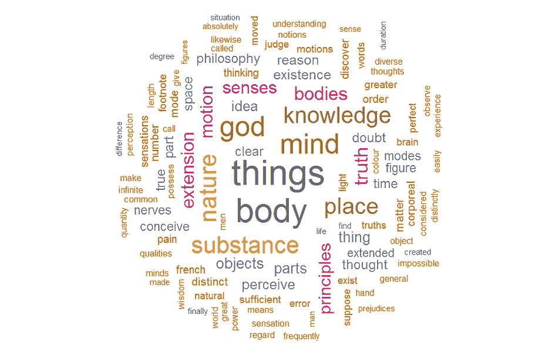***

***Fig 1b**: Word Clouds based on Descartes’ Principles of Philosophy (left) and Immanuel Kant’s Critique of Pure Reason (right)*

*首先，我们将比较笛卡尔的《哲学原理》和康德的《纯粹理性批判》。作为典型的 17 和 18 世纪的作品，它们写于现代西方哲学全盛时期。在左云中，我们观察到笛卡尔重视单词'*心灵*'、*身体*'、*'自然*'和'*事物*'，通过这些单词，他描述了所有具有心灵的生物都具有核心属性和能力来思考、策划想法和批判性地比较事物；因此，这句名言就存在了:*

> *我思故我在。(我觉得；故我在。)*

*康德；然而，强调“原因”一词在右云中可见。因为他的书名是关于“理性”的争论，所以它是被重复次数最多的术语，这是绝对有意义的。除此之外，康德还提到了诸如“概念”、“经验”、“直觉”等术语，这些都是理解他的信仰的关键。我们也在云中看到“先验”这个词，它与康德开创的哲学运动或趋势有关；后来被拉尔夫·瓦尔多采纳，他的理论认为，为了理解现实的“本质”(用诸如“*空间*”、“*时间*”、“*世界*”这样的词作为自然的派生物)，人们必须首先检查和分析支配着“*经验*的本质的推理过程。*

*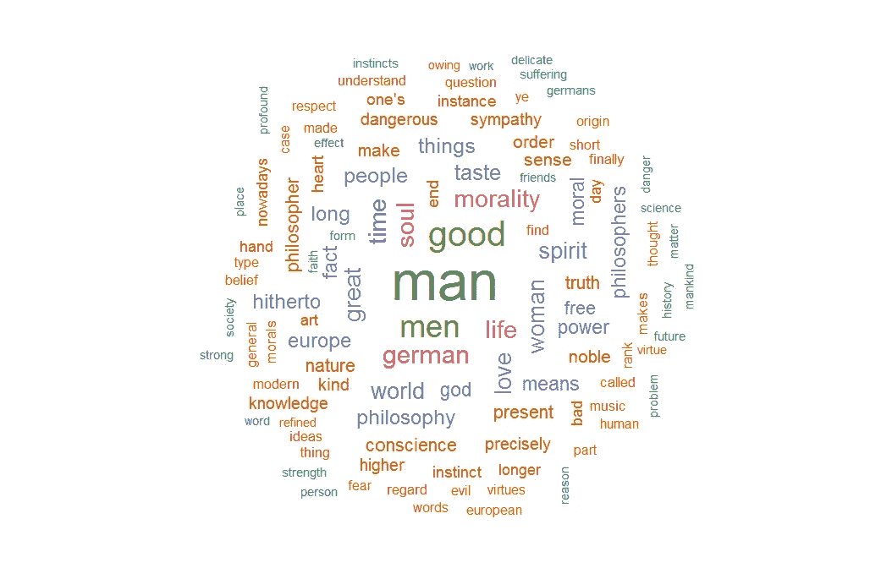**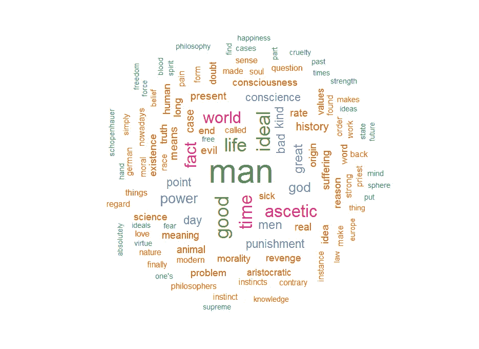*

***Fig 1c:** Word Clouds based on Nietzsche’s works: Beyond Good and Evil (left) and Morals of Genealogy (right)*

*如果我们要比较一个作者的两部作品，我们可以识别两个云之间的词语相似性。单词“人”在大多数哲学著作中占主导地位，尤其是在亚里士多德和柏拉图哲学中。即使在尼采关于道德主题的作品中，我们也可以假设这本书的主要症结是如何围绕着一个理想主义的概念，即一个人应该如何过一个'*苦行僧*、*善*、*真理*和“爱”的生活。在这两本书里，尼采还批评了过去的哲学家，他们把邪恶的人和善良的人对立起来，这是作者试图反驳的。这是引号中提到的单词的基本上下文。*

*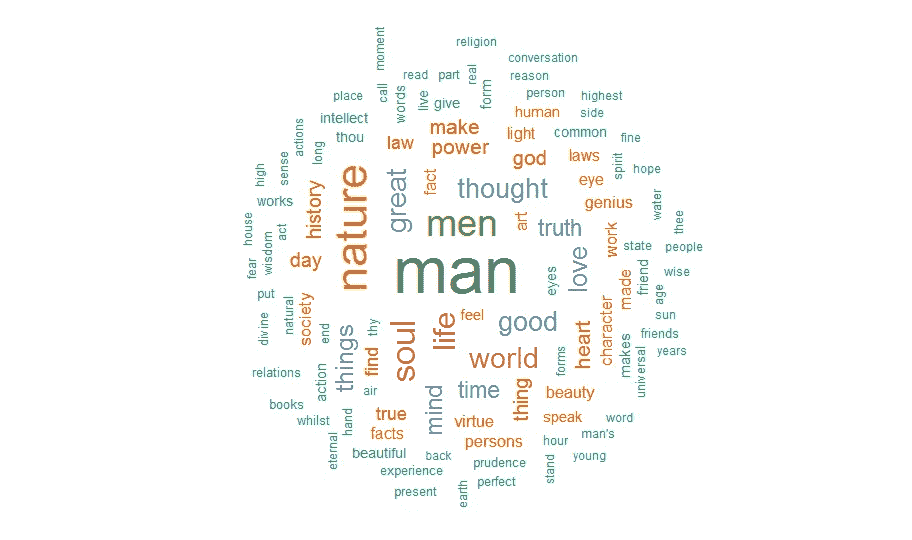**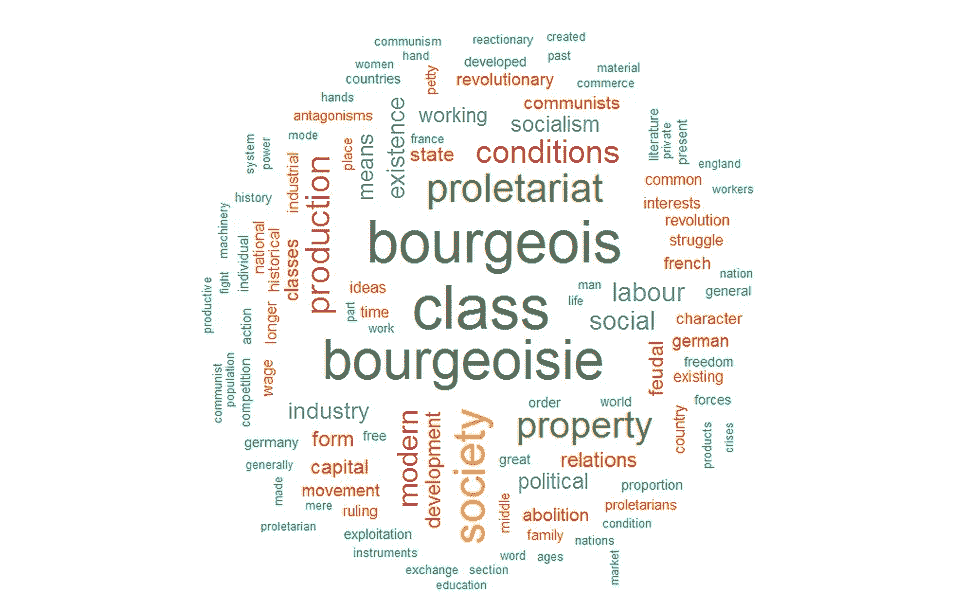*

***Fig 1d**: Word Clouds based on Ralph Waldo’s “Essays-The First Series” (left) & Marx’s “The Communist Manifesto” (right)*

*遵循康德哲学的拉尔夫·瓦尔多；十九世纪的美国哲学家，是超验主义运动中反对灵性和理智主义的思想家之一。瓦尔多关于宇宙的信仰最好用“自然”和“灵魂”这两个词来代表，他认为这两个词是现实地认识真理的必要组成部分。*

*考虑到卡尔·马克思的著作，并将其与其他 5 部著作中的任何一部进行比较，就会发现明显的两极分化。术语是不同的，概念是革命性的，在这个意义上，很少有工作的迹象来自任何其他哲学文本。马克思的著作和其他著名思想家之间最有趣的区别是，前者有一种更集体的方法，而不是个人主义的方法。正如瓦尔多、尼采等人在谈论“人”一样，马克思更积极地关注整个社会，即“资产阶级”或“中产阶级”以及“无产阶级”或“工人阶级”，这些词构成了共产主义的基础。*

## *第二部分:文本相似性*

*词云只是在定性分析时受到限制。我们需要利用某种数学模型，通过它我们可以在更深的层次上比较文本。r 使用各种统计模型计算文本相似性的方式非常简洁。在这个特定的场景中，我使用了[扩展的 Jaccard](https://en.wikipedia.org/wiki/Jaccard_index) 方法来计算下面的矩阵。*

*通过取每个集合中的属性(词)的有限集合来进行比较，在我们的情况下，该集合是哲学文本，然后将交集的总大小( **∩** )除以样本集合的并集的总大小(∩)。这是你现在需要知道的数学范围，但是我们将在以后的文章中触及计算文本相似矩阵的不同方法。*

*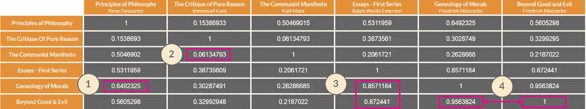*

***Fig 2a:** Text Similarity Matrix based on the Extended Jaccard formula*

*直接观察，我们看到 1 以对角线方式出现，几乎像一个单位矩阵。这表明相似的命名文本彼此之间将具有 100%的相似性。此外，我们可以从这个图表中提取有趣的信息。查看图 2a 中的编号标签:*

1.  *我们可以说，尼采关于道德的著作与笛卡尔的文本有大约 65%的相似性。通过这一点，我们可以假设尼采可能在他的章节中从法国哲学家那里获得了一些内容。*
2.  *卡尔·马克思的作品是革命性的，因为它在所有其他作品中得分最低。盒子代表 6%的价值，认为马克思的著作与康德的《理性批判》最不相似。两部哲学著作之间基本上完全不相关的背景。*
3.  *分别有大约 85%和大约 87%的显著指数分数，我们可以假设尼采的作品与拉尔夫·瓦尔多关于“人”的道德的哲学和思想有适度的共鸣。*
4.  *比较尼采自己的作品，有巨大的相似性，部分原因是写作风格，章节间术语的共性。由于所讨论的术语不同，可能会出现 5%的微小差异。*

## *第 3 部分:双图频率和 TF-IDF*

*关键词的频率可以提供关于特定哲学文本的一些重要信息。使用 R，我们可以估计给定文本中的总字数。考虑到整个文本中有多个多余的符号、标点符号和数字，估计总数更安全；因此，第一列中的波浪号(~)。*

*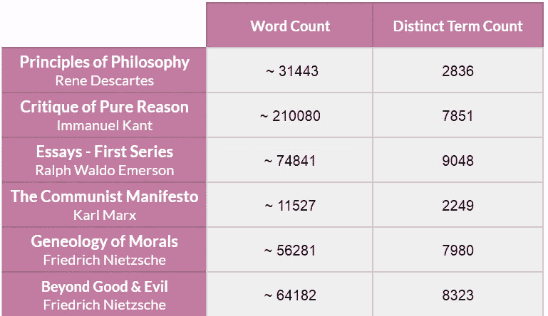*

***Fig 3a**: Table that illustrates the total number of words and unique terms occurring in the texts*

*第二列表示每个文本中出现的唯一术语的总数。从这个专栏中，我们可以推测出英语的掌握程度和流利程度，Waldo 的作品以最高数量的独特单词名列榜首。这是有意义的，因为其他 5 本书最初是用德语或法语写的，后来被翻译了；同时，瓦尔多的作品已经是英文的了。*

*此外，我们可以通过使用**双字母组合**频率**来进一步理解作品。**二元模型是在某个文本中一起出现的两个连续单词或术语的组合。在图 3b 中，x 轴上的‘n’表示二元模型的计数。y 轴显示了每个文本中的前 10 个二元模型的列表。*

*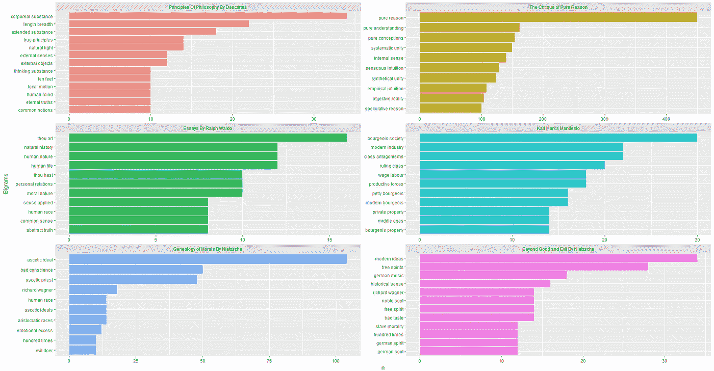*

***Fig 3b**: Frequency Plots of Bi-grams present in selected philosophical books*

*在给定的图表中，笛卡尔使用“有形物质”作为重复最多的二元组，这是哲学家试图证明的主要话题之一。这两个词还与其他可见的词集相互关联，如“扩展的物质”、“外部对象”，在某种意义上，它们试图描绘“人类思维”如何试图断言对象是真实的。*

*毫不奇怪，康德的论文热情地谈论着“纯粹理性”,图表以 400+的重复次数直接证明了这一点。因为康德的文本总共有 21000 字。从瓦尔多的文章中不能确定太多，因为诸如“人性”、“常识”这样的一组词在大多数哲学著作中普遍出现。在这些文本中，马克思的共产主义思想最为突出。不仅二元模型与其他 5 个讲座不同，所有的词组在马克思的宣言中都有很高的频率分布。*

*有趣的是，当我们考虑尼采的作品时，我们看到“禁欲理想”和“现代观念”分别是“道德谱系”和“超越善恶”中的两个主要二元对立。至少可以说，尼采的作品之间的联系是很有趣的，因为他提供了一个新的视角，关于其他古代哲学家如何遵循禁欲主义，作为一种最大化他们权力感的手段。同时，我们可以观察“理查德·瓦格纳”这个名字；一位德国音乐作曲家，出现在两个图表中。*

*继续讨论**、**，我还创建了现有二元模型的 **TF-IDF** 图，这将为我们提供正在使用的单词的“排名”视图。TF-IDF 是**词频-逆文档频率**的缩写，这是另一种统计工具，旨在反映一个词对语料库中的文本文档有多重要。*

*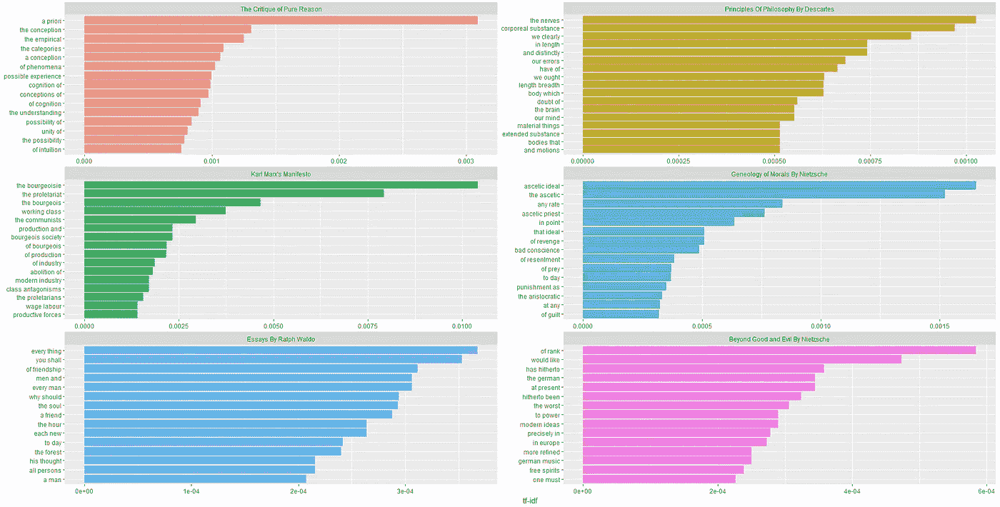*

***Fig 3c**: TF-IDF bi-gram plots of selected philosophical texts*

*为了理解这个图表，我们需要看一组经常出现的单词和另一组很少出现的单词。请注意，这组图表由几个停用词组成，如“the”、“of”、“to”和“a”，它们在计算术语频率(TF)时非常重要。现在，这些停用词旁边的词是计算逆文档频率(IDF)的兴趣来源。最后，我将把对生成的二元图的分析留给读者。*

## *第 4 部分:情感分析*

*进入情感分析的最后一部分。r 有一个非常抽象的方式来进行这种类型的分析，有好有坏。这很好，因为希望从文本数据中快速生成信息的分析师可以编写几行代码并获得结果。对于那些渴望学习算法并以更高级的方式应用它的人来说，这是不好的。*

*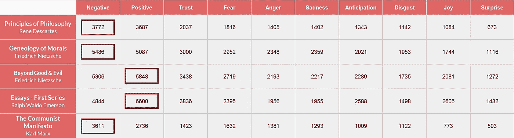*

***Fig 4a**: Word-Emotion analysis table using the NRC lexicon*

*查看图 4a 中的表格，我们使用 NRC 单词词典，该词典包括与两种情绪相关联的单词列表:积极情绪和消极情绪；以及 8 种基本情绪:愤怒、恐惧、期待、信任、惊讶、悲伤、快乐和厌恶。我们当然必须假设一个词在本质上可以是积极的，但表达的情感可能是消极的。例如，像“不高兴”或“不兴奋”这样的二元模型应该被认为是负面情绪，但是应该意识到 R 根本不能在一次迭代中确定所有这些关联。这是机器学习可以应用的实例之一，我们将在未来对此进行更多的研究。*

*该表格在其他方面非常容易理解，因为它说明了与特定情绪或情感相关联的单词总数。红色方框代表各行中最主要的情绪。*

*情感分析通常使用以研究者命名的不同词汇。对于下面的图形结果，我使用了 Bing 词典，其中的单词只分为积极情绪和消极情绪。与 2007 年的积极词汇相比，有 4782 个消极词汇。这意味着，当我们汇编结果时，预计击中负轨迹的概率更高。*

*朝着图 4b 中的图表前进，笛卡尔以相对积极的态度开始，随后是偶尔的抑郁。总的来说，表达的总体情绪是积极的。另一方面，康德的做法恰恰相反。他以一种消极的语气开始，可能是消极地抨击当时流行的“理性”概念。然后在他的评论结束时，康德把他的语气转变成一种更热切的语气。*

*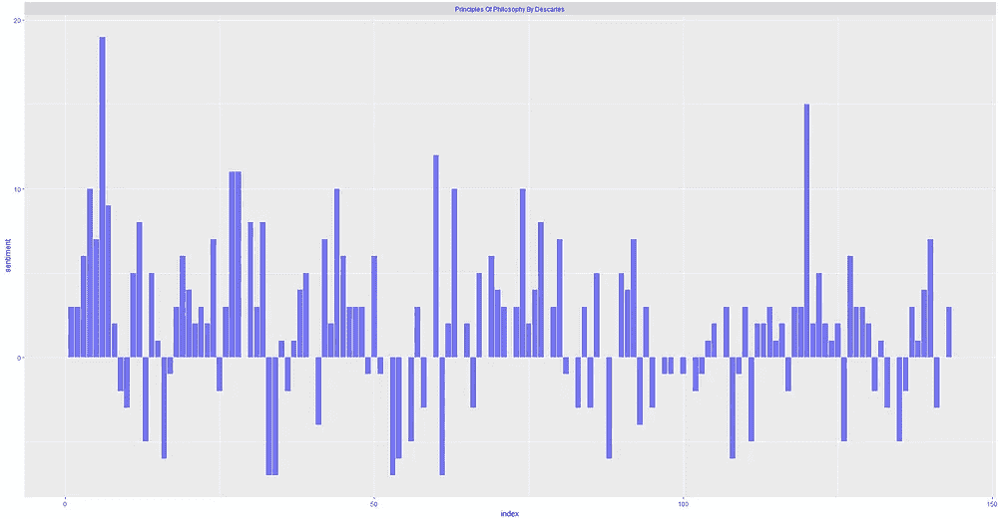**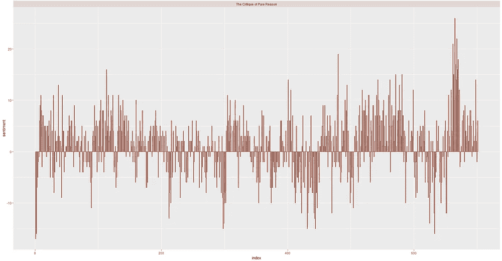*

***Fig 4b**: Sentiment Analysis for (a) Principles of Philosophy and (b) Critique of Pure Reason*

*在《超越善恶》中，积极情绪和消极情绪平均分布，而《道德谱系学》则更偏向于 y 轴的相反光谱，原因可能是尼采非常关注对抗人类中存在的“恶”。*

*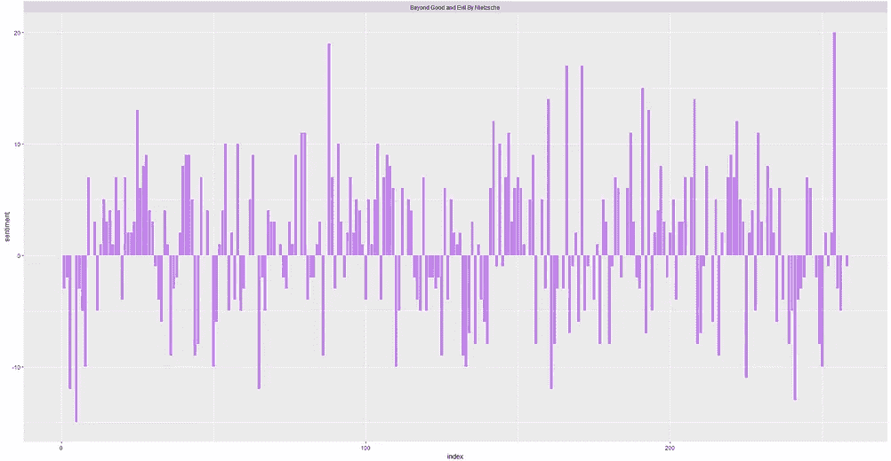**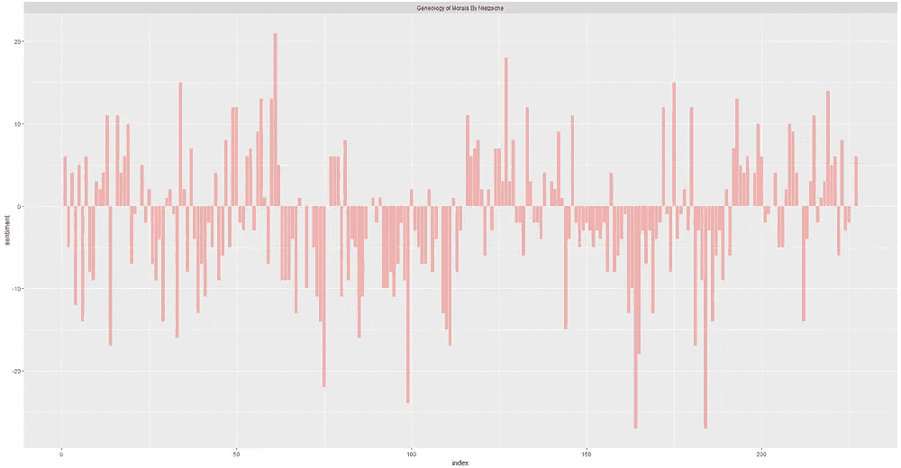*

***Fig 4c**: Sentiment Analysis for Friedrich Nietzche’s (a) Beyond Good and Evil and (b) Geneology of Morals*

*在拉尔夫·瓦尔多的论文中(用绿色图表突出显示)，他演讲的中间部分明显倾向于积极的一面。仔细观察，瓦尔多散文的中间部分谈到了“爱”,因此我们可以证明这种激增是有道理的。而在马克思的短篇综述中，我们看到了更多的负面偏见。这可能是因为他讲话中咄咄逼人或令人恐惧的语气。*

*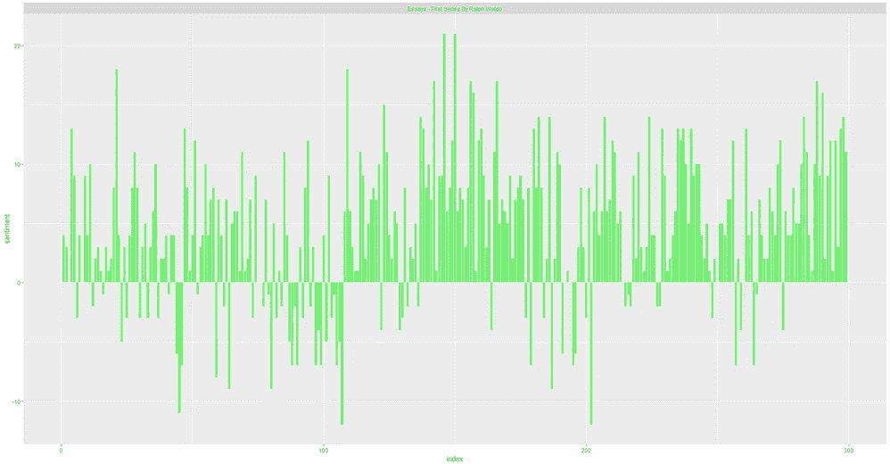**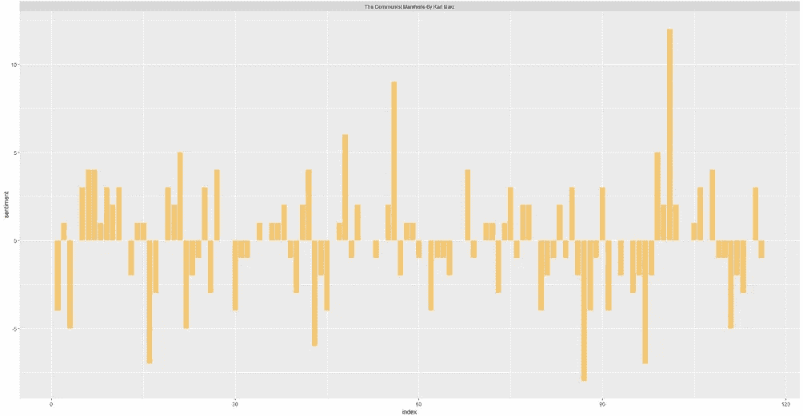*

***Fig 4d**: Sentiment Analysis for (a) Essays — The First Series and (b) The Communist Manifesto*

## *结论*

*有了这篇全面的文章，我们可以看到分析文本数据的现有可能性。凭借我对文学作品的喜爱，并将其与技术知识相结合，我能够创造出有趣的视觉效果，可以用各种方式来感知。我打算学习网上可用的高级工具包，如 D3.js、Plotly，并尝试使用可用的“开放”数据。在下一篇文章中，我可能会谈到脸书的数据，以及如何使用他们的表情符号反应来进行情感分析。*

*注意:文章中提到的所有工具都需要一定程度的编码经验。幸运的是，所有这些库都是以这样一种方式编写的，即通过一些努力，了解统计分析工具(如 Microsoft Excel、SPSS 或 Stata)的分析师可以创建有趣(且美观)的图表。所以，如果你想提高你的数据分析技能，试试这些工具吧。*

*Python 爱好者可以看看 [NLTK](https://www.nltk.org/) ，它有大量的模型，可以使用科学、数学甚至公式来分析文本内容，其中可能还涉及一些机器学习。*

*引用的作品*

*[1]https://docs.quanteda.io/*

*[2]https://uc-r.github.io/word_relationships*

*[3][http://legacy.earlham.edu/~nksmith06/DescExpli.html](http://legacy.earlham.edu/~nksmith06/DescExpli.html)*

**传播和分享知识。如果这篇文章激起了你的兴趣，如果你是个善良的人，给这篇文章一些掌声。关注我的个人资料，获取更多技术相关的文章。—哈姆扎**