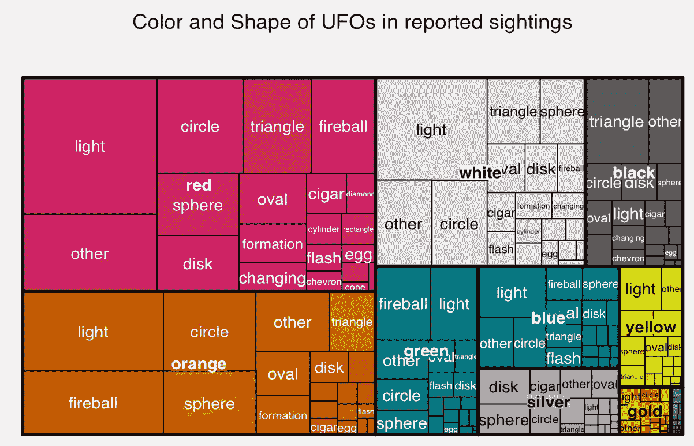
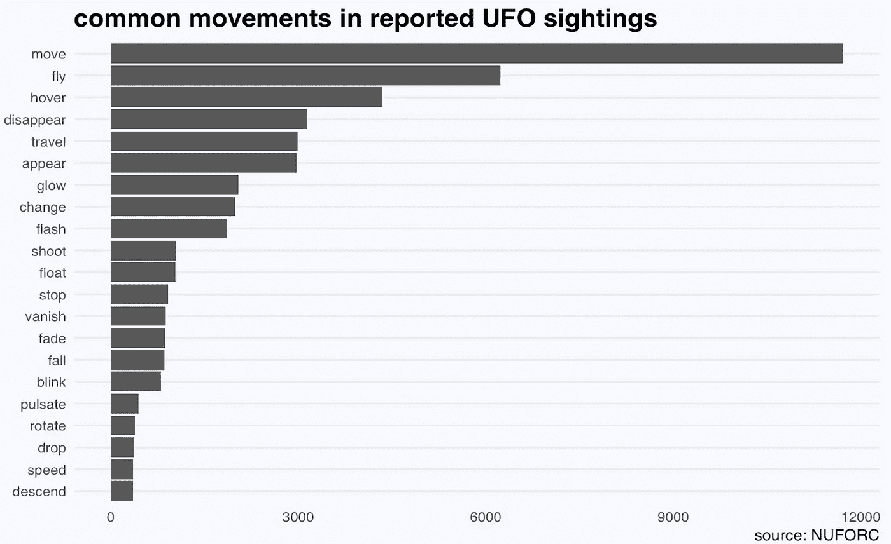
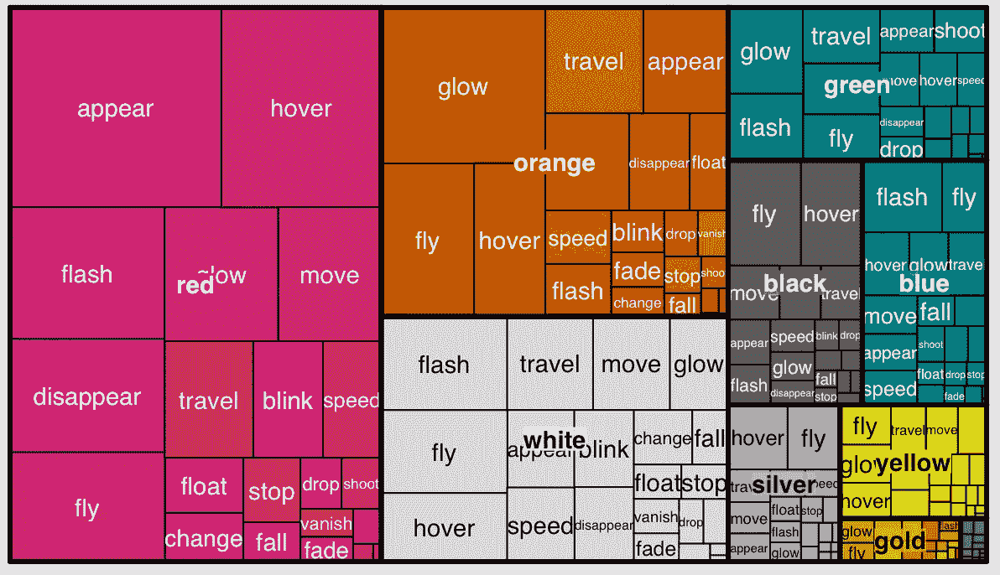
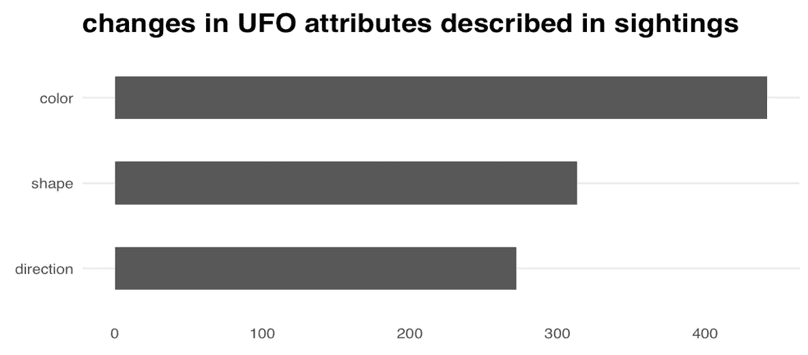

# 外星人飞船的文字描述

> 原文：<https://towardsdatascience.com/a-textual-portrait-of-alien-spaceships-606f7e881bf6?source=collection_archive---------4----------------------->

根据国家不明飞行物报告中心在过去一个世纪收集的数据，我们可以从超过 80 万起报告的不明飞行物目击事件中拼凑出一些信息(颜色、形状、运动)——如果它们存在的话。

**看起来如何**

与通常描绘的银碟不同，记录指出了不同的颜色和形状组合:

color and shape

*   **红色**和**橙色**是最常见的颜色。它们经常以光球的形式出现或者发出这种颜色的光
*   其他频繁联想的还有:**绿火球**，**银盘**，**黑三角**

**它如何移动**

通过提取动词，我们可以观察不同的速度、方向和运动模式——悬停与射击、出现与清漆、漂浮与下降、发光与脉动等，还可以结合颜色来查看它们。

how movement is described

除了像改变方向这样的运动(“三角形之字形。另一束光照在我们身上。其他人喷射到地平线”)，人们还报告了 UFO 在颜色和形状上的变化(“金橙色的明亮的星星从天而降；变成扁平的黑色松软物体，落在树上然后飞走”)。该信息是通过结合依存分析和搜索相邻单词来提取的。

到目前为止，我们既不能证明也不能反驳目击者是否受了酒精的影响。

这是我关于数据科学和视觉故事的[# 100 日项目](https://medium.com/@yanhann10)的第 50 天。我的 [github](https://github.com/yanhann10/opendata_viz) 上的全部代码。感谢阅读。欢迎新主题的建议和反馈。