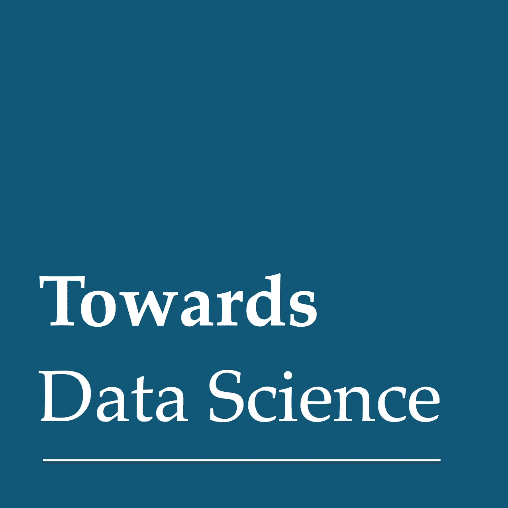

# 《迈向数据科学》的感谢信

> 原文：<https://towardsdatascience.com/a-thank-you-note-to-towards-data-science-58b714a824f8?source=collection_archive---------13----------------------->

## 数据科学并不容易，但多亏了许多像[这样的关于数据科学的出版物](http://towardsdatascience.com)现在更容易以一种简单的方式理解困难的概念。这篇文章是我感谢他们对这个领域和社会的贡献的方式。

# 数据科学，一种新的科学(或者是？)

数据科学是一个跨学科的领域，是一门与商业密切相关的新型科学。正如我在前[所说，我认为数据科学使我们能够通过人工智能创造智能。](/creating-intelligence-with-data-science-2fb9f697fc79)

是的，我说这是一种“新”的科学，因为我认为这份出版物的名字就是我们正在做的事情，我们正走在一条让数据科学成为科学的道路上。我认为数据科学是一门科学是非常有用的，因为如果是这样的话，数据科学中的每个项目至少应该:

**可复制:**便于测试他人的工作和分析所必需的。

更多信息，请点击此处:

 [## 数据科学的再现性危机

### 数据科学中的再现性是什么，我们为什么要关注它？

towardsdatascience.com](/data-sciences-reproducibility-crisis-b87792d88513)  [## 走向再现性:平衡隐私和出版

### 在数据安全和研究公开之间的冲突中，会有金发姑娘的选择吗？

towardsdatascience.com](/toward-reproducibility-balancing-privacy-and-publication-77fee2366eee) 

**Falible:** 数据科学和科学寻找的不是真理，他们寻找的是
知识，所以每个项目在未来都可以被替代或改进，没有
解是终极解。你可以在这里阅读和[这里](http://www.csun.edu/~vcsoc00i/classes/s680f14/Lakatos.pdf)。

**协作:**数据科学家不是单独存在的，她/他需要一个团队，这个团队将使创造智能和解决方案成为可能。协作是科学的一大部分，数据科学也不应该例外。

 [## 组建数据科学团队的最有效方式是什么？

### 从 2012 年到 2017 年，我有幸在 Coursera 从零开始建立数据和分析组织。在那之上…

towardsdatascience.com](/what-is-the-most-effective-way-to-structure-a-data-science-team-498041b88dae)  [## 建立数据科学团队| Coursera

### 构建来自约翰霍普金斯大学的数据科学团队。数据科学是一项团队运动。作为一名数据科学高管…

www.coursera.org](https://www.coursera.org/learn/build-data-science-team) 

**创造性:**数据科学家所做的大部分工作都是新的研究、新的方法或采用不同的解决方案，因此他们的环境应该非常有创造性，并且易于工作。创造力在科学中至关重要，是我们找到解决困难和复杂问题的唯一方法。

 [## 创造力在数据科学中至关重要

### 数据科学可能不会被视为最具创造性的追求。您将大量数据添加到存储库中，并且您…

www.kdnuggets.com](https://www.kdnuggets.com/2017/02/creativity-is-crucial-data-science.html)  [## 创造力在数据科学中的作用是什么？

### 回答(3 之 1):从我在这个领域非常有限的知识来看，创造力起着极其重要的作用。我会…

www.quora.com](https://www.quora.com/What-is-the-role-of-creativity-in-data-science) 

**遵从法规:**现在有很多关于科学的法规，关于数据科学的法规不多，但将来会有更多。重要的是，我们正在构建的项目能够意识到这些不同类型的法规，以便我们能够创建一个干净的、可接受的问题解决方案。

 [## GDPR 会让机器学习非法吗？

### 欧盟通用数据保护法规，即 GDPR，是数据隐私法规中最重要的变化…

www.kdnuggets.com](https://www.kdnuggets.com/2018/03/gdpr-machine-learning-illegal.html)  [## '您的数据隐私已更新'-感谢您再次忽略它！

### 下雨了 GDPR 的电子邮件，为什么一个盲目的'我同意'是不行的

towardsdatascience.com](/your-data-privacy-was-updated-thanks-for-ignoring-it-yet-again-9f6d1d567997) 

# 为什么数据科学这么难，同时又这么简单？

所以回到数据科学如何让我们通过人工智能创造智能这一点，我想说的是，数据科学既困难又简单。

我认为数据科学很难，因为你必须知道和理解所有的事情才能认为自己是一名数据科学家:阅读论文、书籍，知道如何编程，了解企业以及如何应用你的知识来解决他们的问题，等等。

与此同时，我认为这很容易，或者说有点容易，因为我们有一个充满活力的社区，人们试图互相帮助，分享思想和知识，分享经验和感受，他们成为数据科学家的过程，他们在工作中的表现如何，以及伟大的博客、出版物、网络研讨会、视频、信息、信息图和更多工具，这些工具使向数据科学的过渡变得更加容易。

因此，我要感谢编辑 [TDS 团队](https://medium.com/u/7e12c71dfa81?source=post_page-----58b714a824f8--------------------------------)、 [Ludovic Benistant](https://medium.com/u/895063a310f4?source=post_page-----58b714a824f8--------------------------------) ，以及为这份令人惊叹的出版物做出贡献的作家和人们。我还要感谢[媒体](https://medium.com/u/504c7870fdb6?source=post_page-----58b714a824f8--------------------------------)和[媒体员工](https://medium.com/u/a32c340ea342?source=post_page-----58b714a824f8--------------------------------)为我们创造了这个伟大的平台来分享想法、知识和经验。

我想以几个月前的一个想法来结束我的演讲，这个想法是最近由 T2 的克里斯蒂安·威利格提醒我的，对我来说，数据科学是我开始实现这个想法的主要方式之一:

> 你可以产生影响，你可以做你喜欢的事情来改变世界。
> 
> 我们多次听说，改变事物或世界的运行方式是不可能的。你做什么都改变不了它，你只是这个巨大星球上的一只蚂蚁。
> 
> 这不是真的。你可以改变世界。你可以让事情变得更好，你必须从改变你看待事物的方式开始。我为我自己、我的家人和我爱的人努力工作，如果有人生活得更好，我已经在做出改变。
> 
> 然后你想得更大，我怎样才能让这个地方对我和其他人来说变得更好？我如何改进某个流程的完成方式？
> 
> 找到你喜欢做的事情，对我来说是科学(物理)和数据科学。我喜欢这个领域。我希望分享我做的事情，我贡献的开源项目，我在雇佣我的公司的工作，以及我将在不久的将来做的事情，将使这个世界成为一个更好的生活场所。
> 
> 相信你所做的，带着激情去做，倾听他人，努力工作，有时间陪伴家人，享受乐趣，相信你会改变世界。

以下是我在 TDS 上发表的文章，我希望你会喜欢，我希望在不久的将来能写更多的文章:

 [## 如何获得一份数据科学家的工作？

### 大家好。这篇博客文章来自我最近在 LinkedIn 发表的三篇文章。这是第一部分、第二部分和第三部分。

towardsdatascience.com](/how-to-get-a-job-as-a-data-scientist-f417078fe13e)  [## 我的深度学习之旅

### 在这篇文章中，我将分享我如何研究深度学习并使用它来解决数据科学问题。这是一个…

towardsdatascience.com](/my-journey-into-deep-learning-c66e6ef2a317)  [## 深度学习的 Skejul 会议

### 厌倦了试图与某人见面，却找不到日期或时间？我也是。

towardsdatascience.com](/skejul-meetings-with-deep-learning-5efab285b111)  [## 获得数据科学家工作的两个方面

### 你是找工作的数据科学家吗？你是在找数据科学家的招聘人员吗？如果你回答是或否…

towardsdatascience.com](/the-two-sides-of-getting-a-job-as-a-data-scientist-a4571acc58bc)  [## 深度学习的“怪异”介绍

### 有关于深度学习的惊人介绍、课程和博文。但这是一种不同的介绍。

towardsdatascience.com](/a-weird-introduction-to-deep-learning-7828803693b0)  [## 用数据科学创造智能

### 在这篇文章中，我将展示数据科学如何让我们通过人工智能创造智能。

towardsdatascience.com](/creating-intelligence-with-data-science-2fb9f697fc79)  [## 使用 Apache Spark 进行深度学习—第 1 部分

### 第一部分全面讨论了如何使用 Apache Spark 进行分布式深度学习。这一部分:什么是火花…

towardsdatascience.com](/deep-learning-with-apache-spark-part-1-6d397c16abd)  [## 如何在你的电脑上使用 PySpark

### 我发现在您的本地上开始使用 Apache Spark(这里将重点介绍 PySpark)有点困难…

towardsdatascience.com](/how-to-use-pyspark-on-your-computer-9c7180075617)  [## 超越敏捷数据科学

### 超越我的眼睛所看到的，是我应用于生活中每一个方面的东西。在本文中，我将展示如何…

towardsdatascience.com](/going-beyond-with-agile-data-science-fcff5aaa9f0c)  [## 利用深度学习检测乳腺癌

### 乳腺癌是女性中最常见的侵袭性癌症，是女性癌症死亡的第二大原因，仅次于…

towardsdatascience.com](/detecting-breast-cancer-with-a-deep-learning-10a20ff229e7)  [## 使用 Apache Spark 进行深度学习—第 2 部分

### 第二部分全面讨论了如何使用 Apache Spark 进行分布式深度学习。我将完全专注于…

towardsdatascience.com](/deep-learning-with-apache-spark-part-2-2a2938a36d35)  [## DIY 深度学习项目

### 受阿克谢·巴哈杜尔伟大工作的启发，在这篇文章中你将看到一些应用计算机视觉和…

towardsdatascience.com](/diy-deep-learning-projects-c2e0fac3274f) 

感谢一切:)

感谢阅读。希望你在这里发现了一些有趣的东西:)

如果您有任何问题，请在 twitter 上添加我:

 [## 法维奥·巴斯克斯(@法维奥·巴斯克斯)|推特

### Favio Vázquez 的最新推文(@FavioVaz)。数据科学家。物理学家和计算工程师。我有一个…

twitter.com](https://twitter.com/FavioVaz) 

和 LinkedIn:

 [## Favio Vázquez —首席数据科学家— OXXO | LinkedIn

### 查看 Favio Vázquez 在世界上最大的职业社区 LinkedIn 上的个人资料。Favio 有 15 个工作职位列在…

linkedin.com](http://linkedin.com/in/faviovazquez/) 

那里见:)