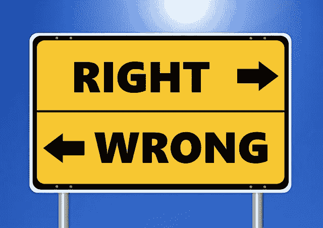

# 如何不使用机器学习模型

> 原文：<https://towardsdatascience.com/a-thought-on-using-machine-learning-models-8b5a55b5fc1d?source=collection_archive---------21----------------------->

在我的培训课程中，在讨论常见的机器学习模型之后/期间，我通常会提出一个话题，即从这些模型中获得的见解的使用或模型在业务/组织流程中的实施。

例如，我们可以获得最准确的模型，它非常擅长“预测”哪些客户会对营销活动做出反应，但如果使用了错误的营销渠道或营销信息，该模型仍然无法为企业带来足够的价值。这就是为什么在我之前的帖子中，我推荐数据科学家去理解[战略思维](/data-scientist-need-strategic-thinking-8039435639dd)和发展[商业敏锐度](/business-knowledge-for-data-science-2aa458b6d988)。

我发现自己在培训期间多次重复这个例子，所以我想我把它作为一篇博客文章，希望更多的数据科学家也能意识到思考如何使用模型是非常重要的。

**教育中的机器学习**

在我之前的工作中，我遇到过许多由数据科学的新生提出的项目。他们选择进行数据科学研究的“最热门”行业之一是教育。现在，我对教育有着浓厚的兴趣，因为我相信它是一种伟大的社会流动工具，并一直在研究如何改善教育，以对人们的生活产生重大而持久的影响。因此，在教育中使用机器学习的项目演示总是激起我的兴趣。

因此，其中一个项目着眼于使用机器学习模型对“有失败风险”和“能够通过这一年”的学生进行分类。如果你问我，我不怀疑这是机器学习模型在教育中的现有用法。我对演示团队将如何使用这个模型非常感兴趣，所以我问了这个问题，“那么一旦模型建立起来，你打算用它做什么？”

得到的回答是，“我们将使用该模型来确定谁有失败的风险，谁没有，一旦我们做到了这一点，我们将把我们的资源更多地集中在那些不会失败的人身上，确保他们以非常好的结果通过了考试。”*下巴下垂*

这个团队由刚接触数据科学的学生组成，我认为这是给他们上一堂关于模型用法的课的好机会。所以我继续说，“所以如果这个学生被模型归类为处于危险中，这意味着他/她将被剥夺任何成功和取得好成绩的资源？”

“是的！”回答回来了。所以我继续说，“如果我在使用这个模型，而你被归类为有失败风险，会发生什么？你认为我剥夺你的任何教学/学习资源公平吗？”沉默…

“你必须知道，通过在这里使用机器学习模型，它只是为我们提供了一个结果的概率，而不是 100%的保证。如果有人被“预测”有风险，那只是因为模型中的当前特征告诉我们这一点。生活更加复杂，因为除了数据中包含的因素之外，还有其他因素会影响结果，比如考试失败。”

继续说，“你可以提出的是，在建立相同模型的情况下，我们可以首先调查哪些因素会表明学生处于风险中，为什么会这样？其次，我们应该致力于设计一个好的计划来帮助那些有失败风险的学生，因为我们现在可以更好地识别他们。这可能会改善整个社会，培养出更多有生产力的社会成员，帮助更多的学生摆脱贫困。”

**机器学习模型的使用**

你可能会注意到，对于同一个模型，根据它的使用方式，我们可以帮助更多的人，也可以区别对待。我坚信构建模型只是数据科学项目的一小部分，知道如何特别合乎道德地使用模型也很重要。这就是我控制评分标准的项目的原因，我会在战略和实施方面给予很大一部分分数，不是在 IT 基础设施方面，而是在业务流程方面。

我希望读完这篇文章的读者能真正投入更多的思考，如何使用你的模型，并理解它对人们或客户的影响。构建“最佳”机器学习模型只是从我们的数据中获取价值的大图景的一小部分。

我希望这个博客对你有用。我希望所有读者有一个有趣的数据科学学习之旅，并访问我的[其他博客文章](https://medium.com/@koolanalytics)和 [LinkedIn 个人资料](https://www.linkedin.com/in/koopingshung/)。