# 机器学习中的公平性教程

> 原文：<https://towardsdatascience.com/a-tutorial-on-fairness-in-machine-learning-3ff8ba1040cb?source=collection_archive---------3----------------------->

# 摘要

这篇文章将是这个系列的第一篇文章。这个职位的目的是:

1.  对 Fair ML 进行快速但相对全面的调查。
2.  为对 Fair ML 感兴趣的各个层次的读者提供参考和资源。

内容基于:[Solon Bacrocas 和 Moritz Hardt 在 NIPS2017 给出的关于公平的教程](https://nips.cc/Conferences/2017/Schedule?showEvent=8734)来自 [CS 294:加州大学伯克利分校 Moritz Hardt 讲授的机器学习中的公平](https://fairmlclass.github.io/)以及我自己对公平文献的理解。我强烈建议感兴趣的读者去看看链接的 NIPS 教程和课程网站。

目前的职位由六部分组成:

1.  介绍
2.  动机
3.  ML 中偏差的原因
4.  公平的定义，包括公式，动机，例子和缺陷。
5.  用于实现这些公平性定义的算法。
6.  摘要

# 1.介绍

近年来，空气质量正在成为机器学习中最热门的话题之一。该领域的出版物激增(见图 1)。研究团体在这个领域投入了大量的努力。在 2018 年的 [ICML](https://icml.cc/) 上，五篇最佳论文/亚军获奖论文中有两篇是关于公平性的。关于公平性也有新的会议/工作坊:[FAT/ML](http://www.fatml.org/)2014 年开始，[ACM FAT](https://fatconference.org/)2018 年开始，[fair ware](http://fairware.cs.umass.edu/agenda.html)2018 年开始。 [arxiv](https://arxiv.org/) 上每周都有几篇新上传的关于公平的论文。许多在理论和实践 ML 社区有声望的研究者已经参与了这个领域。

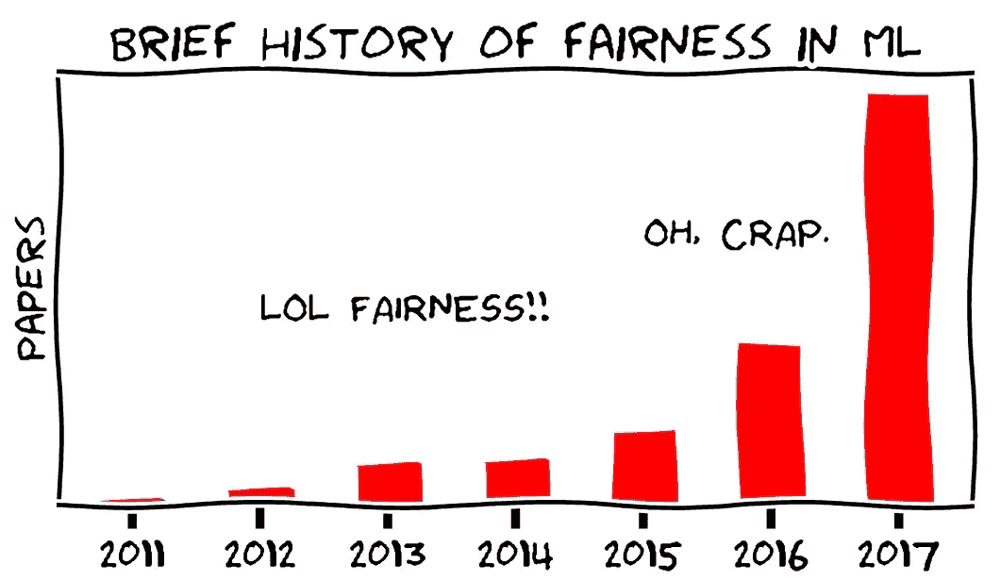

Fig1\. The number of publications on fairness from 2011 to 2017

# 2.动机

第一个要问的问题是，我们为什么关心公平？主要动机是和我们自身利益高度相关。我们正处于这样一个时代，许多事情已经或正在被人工智能系统自动化。自动驾驶汽车已经指日可待，估计 5–10 年内会被广泛使用；雇主使用 ML 系统选择工作申请人；美国法院使用 COMPAS 算法进行累犯预测；Linked-in 使用 ML 对查询的求职者进行排名；亚马逊使用推荐系统来推荐商品，并决定商品在页面上出现的顺序。网飞使用推荐系统为每个用户呈现定制页面。机器学习系统已经成为我们日常生活中不可分割的一部分。随着越来越多的领域开始将人工智能集成到他们现有的实践/产品中，它们在不久的将来会变得更加广泛。

人工智能是好的，但它可能会被错误地使用。机器学习是应用最广泛的人工智能技术，它严重依赖数据。认为 AI 是绝对客观的，这是一种普遍的误解。人工智能只有在学习人类所教的东西的意义上才是客观的。人类提供的数据可能会有很大的偏差。2016 年发现，用于累犯预测的算法 COMPAS 对黑人产生的误报率远高于白人(见图 2， [Larson et al. ProPublica，2016](https://www.propublica.org/article/machine-bias-risk-assessments-in-criminal-sentencing) )。

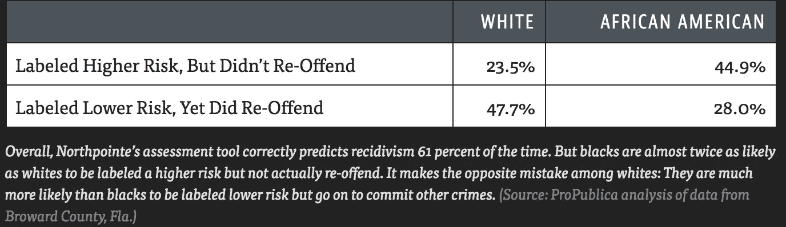

Fig2: The bias in COMPAS. (from [Larson et al. ProPublica, 2016](https://www.propublica.org/article/machine-bias-risk-assessments-in-criminal-sentencing))

类似于 Linked-in 的求职平台 XING 被发现对不太合格的男性候选人的排名高于更合格的女性候选人(见图 3， [Lahoti et al. 2018](https://arxiv.org/pdf/1806.01059.pdf) )。

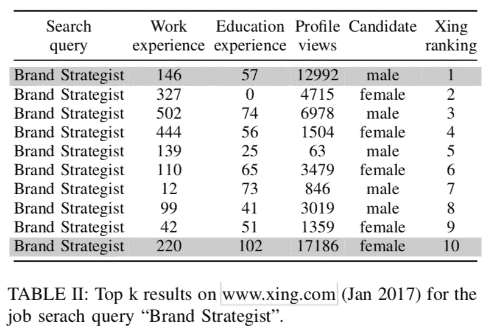

Fig3: The bias in the query for Brand Strategist from XING(from [Lahoti et al. 2018](https://arxiv.org/pdf/1806.01059.pdf)).

分别由微软、Face++和 IBM 提供的公开可用的商业人脸识别在线服务被发现在肤色较暗的女性身上实现的准确率低得多(见图 4， [Buolamwini 和 Gebru，2018](http://proceedings.mlr.press/v81/buolamwini18a/buolamwini18a.pdf) )。

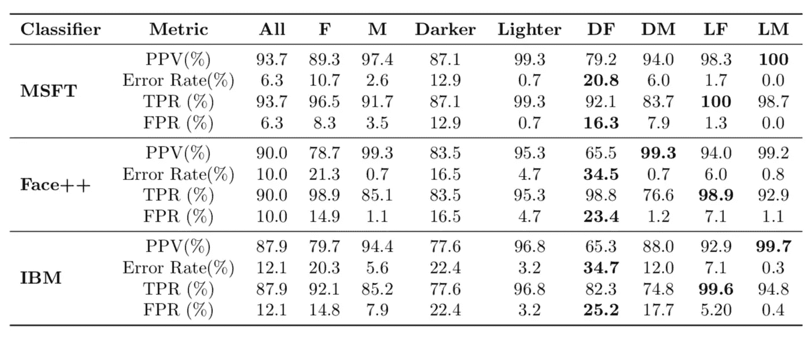

Fig4: The bias in commercial face recognition services([Buolamwini and Gebru, 2018](http://proceedings.mlr.press/v81/buolamwini18a/buolamwini18a.pdf)). DF, DM, LF, LM stand for: darker skin female, darker skin male, lighter skin female and lighter skim male. PPV, TPR, FPR stand for [predictive positive value](https://en.wikipedia.org/wiki/Positive_and_negative_predictive_values), true positive rate and false positive rate.

当应用程序涉及到人时，ML 中的偏见几乎无处不在，它已经损害了少数群体或历史上处于不利地位的群体的利益。不仅是少数群体的人，每个人都应该关心人工智能中的偏见。如果没人关心，下一个遭受偏见对待的人极有可能就是我们中的一员。

# 3.原因

有人会问:“是什么导致了 ML 系统中的偏差？”本质上，这种偏差来自于由于历史原因而存在于训练数据集中的人为偏差。以下是潜在原因的列表( [Barocas 和 Selbst，2016](http://www.californialawreview.org/wp-content/uploads/2016/06/2Barocas-Selbst.pdf) ):

**偏斜样本**:如果偶然发生一些初始偏差，这种偏差可能会随着时间的推移而加剧:未来的观察结果会证实预测，而做出与预测相矛盾的观察结果的机会会减少。一个例子是警方记录。犯罪记录只来自警察观察到的那些犯罪。警察局倾向于派遣更多的警察到最初发现犯罪率较高的地方，因此更有可能在这些地区记录犯罪。即使后来其他地区的人犯罪率更高，也有可能由于警方关注较少，警察部门仍然记录这些地区的犯罪率更低。使用以这种方式收集的数据训练的预测系统倾向于对警察较少的地区有积极的偏向。
**污点例子**:任何 ML 系统都保留着因人为偏差导致的旧数据中存在的偏差。例如，如果系统使用经理做出的雇用决定作为选择申请人的标签，而不是工作申请人的能力(大多数情况下，对于被拒绝的人来说，这种能力是观察不到的)。使用这些样本训练的系统将复制经理决策中存在的偏差(如果有的话)。另一个例子是，在谷歌新闻文章上训练的词嵌入“表现出令人不安的女性/男性性别刻板印象”，例如，“男人”和“计算机程序员”之间的关系与“女人”和“家庭主妇”之间的关系高度相似( [Bolukbasi et al. 2016](https://arxiv.org/pdf/1607.06520.pdf) )。
**有限特征**:为少数群体收集的特征信息可能较少或不可靠。如果来自少数群体的标签的可靠性比来自多数群体的标签的可靠性低得多，则由于这些噪声，系统对于少数群体的预测往往具有低得多的准确性。
**样本大小差异**:如果来自少数群体的训练数据比来自多数群体的数据少得多，那么就不太可能完美地模拟少数群体。
**代理**:即使敏感属性(被认为不应该用于任务的属性，例如种族/性别)不用于训练 ML 系统，也总是可以有其他特征作为敏感属性的代理(例如邻域)。如果包含这样的特征，偏差还是会发生。有时，很难确定相关功能是否与受保护的功能过于相关，以及我们是否应该将它包括在训练中。

它们可以归纳为以下三个问题:

*   发现未被观察到的绩效差异:偏斜样本，有污点的例子
*   应对观察到的绩效差异的样本:有限的特征、样本大小差异
*   理解预测结果差异的原因:代理

# 4.公平的定义

一个自然的问题是“如何定义公平？”，具体来说，“我们如何制定公平，以便它可以在 ML 系统中考虑”。第一个想法是寻找法律支持，并检查是否有任何定义可以用来量化公平。许多国家的反歧视法律禁止基于敏感属性(如性别或种族)的不公平待遇(民权法案。1964 年民权法案，第七章，平等就业机会，1964 年。).这些法律通常使用两个不同的概念来评估决策过程的公平性( [Barocas 和 Selbst，2016](http://www.californialawreview.org/wp-content/uploads/2016/06/2Barocas-Selbst.pdf) ): **不同的待遇**和**不同的影响**。如果决策(部分)基于主体的敏感属性，则决策过程会受到完全不同的对待，如果其结果对具有某些敏感属性值的人(例如，女性、黑人)造成不相称的伤害(或好处)，则会产生完全不同的影响。然而，这两个定义对于计算来说太抽象了。因此，在公平的数学公式上没有共识。

文献中已经提出了许多关于公平的定义(参见 [Gajane 和 Pechenizkiy，2018](https://arxiv.org/pdf/1710.03184.pdf) 和[维尔马和鲁宾，FairWare2018](http://fairware.cs.umass.edu/papers/Verma.pdf) )。然而，它们中的大部分是基于以下六点:

*   没认识到
*   人口均等
*   均等的赔率
*   预测汇率平价
*   个体公平
*   反事实公平

其中人口统计均等、均等优势和预测比率均等属于一个更大的类别，称为“群体公平”。

**注:**我选择使用的名字都是文献中比较流行的。这些定义没有统一的命名约定。

## 4.0 设置和符号

在本节中，为了简单起见，我们将只考虑具有单个敏感属性的二元分类问题。然而，该公式可以容易地扩展到具有多个敏感属性的其他任务(例如回归)。

想象一下预测是否雇佣一个申请人的问题:

*   X ∈ Rᵈ:量化的申请人特征(如教育程度、工作经验、大学平均绩点等。).
*   A ∈ {0，1}:二进制敏感属性(如多数/少数)。
*   C :=c(X，A) ∈ {0，1}:二进制预测器(例如，雇用/拒绝)，它根据分数 R:=r(x，a) ∈ [0，1]做出决策。
*   Y ∈ {0，1}:目标变量(例如，候选人是否真正能够胜任该职位)。
*   我们假设 X，A，Y 是从一个基本分布 D 生成的，即(X，A，Y) ~ D。

我们也用 P₀ [c] := P [c | A= 0]来表示。

最初，当我们不施加任何公平性约束时，我们针对精度进行优化，并且当 C(X，S)=Y ∀ (X，s，Y) ~ D 时达到最佳精度

## 4.1 不知晓

这只是意味着我们不应该将敏感属性作为特征包含在训练数据中。这个概念与**不同的处理**是一致的，它要求不使用敏感属性。

**提法:**

C=c(x，A) = c(X)

**动机:**

直观、易于使用和法律支持(区别对待)。

**瑕疵:**

基本限制是可能有许多高度相关的要素(例如邻域)作为敏感属性(例如种族)的代理。因此，仅仅删除敏感属性是远远不够的。

## 4.2 人口均等

人口统计均等，也称为独立性、统计均等，是最著名的公平标准之一。

**配方:**

c 独立于 A: P₀ [C = c] = P₁ [C = c] ∀ c ∈ {0，1}

在我们的例子中，这意味着两组申请人的录取率必须相等。在实践中，有两种放松这种平等的近似形式(假设组 1 是优势组，即当不考虑公平问题时具有更高的被雇用概率):

*   P₀ [C=1]/P₁ [C=1] ≥ 1-ϵ

当ϵ=p/100 ( [Zafar 等人 AISTATS2017](https://people.mpi-sws.org/~mzafar/papers/disparate_impact.pdf) )时，p%规则被定义为满足这个不等式。

*   |P₀ [C=1]-P₁ [C=1]| ≤ ϵ其中ϵ ∈ [0，1]。

**动机:**

*   法律支持:"**四五法则**"规定任何弱势群体的入选率都低于入选率最高群体的五分之四。在我们的公式中，这相当于满足 80%法则。如果违反此规则，必须提供与工作相关或业务需要的理由。“业务必要性意味着使用该程序对于业务的安全和高效运营至关重要，并且没有实质上同样有效且负面影响较小的替代程序”(来源:[负面影响分析/五分之四规则](https://www.prevuehr.com/resources/insights/adverse-impact-analysis-four-fifths-rule/))。
*   有一些论文认为，在短期内实施这些标准有利于在长期内建立弱势少数群体在劳动力市场上的声誉([胡和陈，WWW2018](https://arxiv.org/pdf/1712.00064.pdf) )。

**瑕疵:**

*   该定义忽略了 y 和 a 之间任何可能的相关性。特别是，当基本利率不同时，它排除了完美预测值 C=Y(即 P₀ [Y=1] ≠ P₁ [Y=1])
*   懒惰:如果我们从一个群体中雇佣合格的人，从另一个群体中随机选择一些人，我们仍然可以实现人口统计上的平等。

## 4.3 **扳平赔率**

均等赔率，也叫分离，正率平价，最早是在 [Hardt，Price and Srebro，2016](http://Equality of Opportunity in Supervised Learning) 和 [Zafar 等人 WWW2017](https://arxiv.org/pdf/1610.08452.pdf) 中提出的。

**配方:**

c 独立于 Y 上的条件:

p₀=p₁∀

一个较弱的概念是:

p₀=p₁

这被称为**精确度奇偶校验**。这种较弱概念的局限性在于，我们可以用一组的假阳性率来交换另一组的假阴性率。这种交易有时是不可取的(例如，交易拒绝来自组 1 (A=0)的(C=0)合格申请人(Y=1)，而接受来自组 2 (A=1)的(C=1)不合格申请人(Y=0))。

在许多应用中(例如，招聘)，人们更关心真实的正比率而不是真实的负比率，因此许多工作集中在以下放松的版本上:

P₀ [C = 1| Y = 1] = P₁

这被称为机会均等。

在我们的例子中，这就是说我们应该从每个组的合格部分中雇佣相同比例的人。

**动机**:

*   最优性相容性:允许 C=Y。
*   惩罚懒惰:它提供了在所有团队中统一减少错误的激励。

**瑕疵:**

这可能无助于缩小两个群体之间的差距。例如，假设 A 组有 100 名申请人，其中 58 人合格，而 B 组也有 100 名申请人，但其中只有 2 人合格。如果公司决定接受 30 名申请人，并满足机会均等，A 组将获得 29 份工作机会，而 b 组仅获得 1 份工作机会。如果工作是高薪工作，A 组往往有更好的生活条件，为他们的孩子提供更好的教育，从而使他们长大后有资格获得这样的高薪工作。随着时间的推移，A 组和 B 组之间的差距会有扩大的趋势。

## 4.4 预测汇率平价

预测汇率平价，也称为充分性，出现在 [Zafar et al. WWW2017](https://arxiv.org/pdf/1610.08452.pdf) (我不确定第一个涉及它的文献)。

**提法:**

y 独立于 C 上的条件:

P₀ [Y = y| C= c] = P₁ [Y = y| C= c] ∀ y，c ∈ {0，1}

这相当于满足了两者

P₀ [Y = 1| C= 1] = P₁ [Y = 1| C= 1]和

P₀ [Y = 0| C= 0] = P₁ [Y = 0| C= 0]，

分别称为**正预测奇偶校验**和**负预测奇偶校验**。

在我们的例子中，这就是说，如果从预测算法(用于确定候选人的工作资格)返回的分数应该反映候选人做这项工作的实际能力。这与雇主的利益是一致的。

**动机**:

*   最优性兼容性:C=Y 满足预测速率奇偶校验。
*   假设接受(C=1)，成功的机会均等(Y=1)。

**瑕疵:**

*   这个缺陷类似于机会均等的缺陷:它可能无助于缩小两个群体之间的差距。推理和以前类似。

## 4.5 个人公平

个人公平是一个相对不同的概念。前面三个标准都是基于群体的，而个体公平，顾名思义，是基于个体的。这是由 Cynthia Dwork 等人于 2012 年在[通过意识实现公平](https://arxiv.org/pdf/1104.3913.pdf)中首次提出的，是该领域最重要的基础性论文之一。个体公平的理念强调:相似的个体应该得到相似的对待。

**配方:**

表示 O 为可测空间，δ(O)为 O 上的分布空间。表示 M:X→δ(O)为将每个个体映射到结果分布的映射。则公式为:
D(M(X)，M(X’)≤D(X，X’)

其中 x，X' ∈ Rᵈ是两个输入特征向量，d 和 d 分别是输入空间和输出空间上的两个[度量函数](https://en.wikipedia.org/wiki/Metric_(mathematics))。参见图 5 的图解。

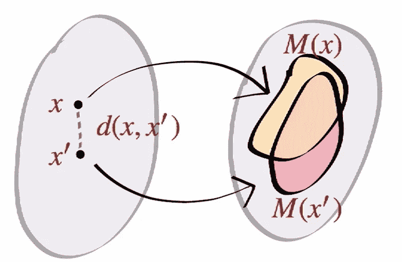

Fig5: illustration of individual fairness

**动机:**

作为个体，我们倾向于更关心个体，而不是关注群体。此外，个体公平比任何群体公平都更精细:它对每对个体的待遇施加了限制。

**瑕疵:**

很难确定什么是合适的度量函数来测量两个输入的相似性( [Kim et al. FATML2018](https://arxiv.org/pdf/1803.03239.pdf) )。在我们的案例中，很难量化两个求职者之间的差异。假设有三个求职者，A，B 和 c。A 有学士学位和 1 年相关工作经验。b 具有硕士学位，1 年相关工作经验。c 有硕士学位，但没有相关工作经验。A 比 C 更接近 B 吗？如果是，增加多少？这个问题很难回答，因为我们不能同时拥有 A、B 和 C 的表现(我们不能同时雇佣这三个人)。否则，我们可以在一个叫做[度量学习](https://en.wikipedia.org/wiki/Similarity_learning#Metric_learning)的领域应用技术。当敏感属性出现时，情况会变得更糟。在我们的度量函数中，我们是否应该以及如何计算组成员的差异？

## 4.6 反事实公平

反事实公平是在 [Russell et al .，NIPS2017](https://papers.nips.cc/paper/7220-when-worlds-collide-integrating-different-counterfactual-assumptions-in-fairness.pdf) 中提出的。它为解释偏见的原因提供了一种可能的方法。

**配方:**

P[C_{A← 0}=c|X，A=a]=P[C_{A← 1}=c|X，A=a]

反事实值替换敏感属性的原始值。反事实值通过一些结构方程向[因果图](https://en.wikipedia.org/wiki/Causal_graph)(见图 6 的例子)的“下游”传播。不是敏感属性后代的所有其他内容保持不变。

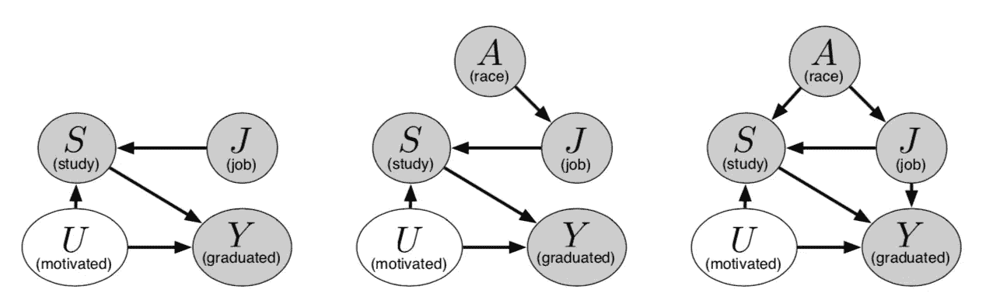

Fig6: some possible causal graphs

**动机:**由于许多相关的特性，4.1 远远不够。4.2–4.4 都是观察公平标准。它们不能用来寻找不公平现象的原因。4.5 在寻找合适的度量标准方面存在根本性的限制。反事实公平解决了所有这些问题。

反事实公平提供了一种检查仅替换敏感属性的可能影响的方法。它提供了一种通过因果图解释偏见影响的方法。图 6 显示了申请大学的几个可能的图表。请注意，当我们替换敏感属性时，与之相关的所有其他特性也会受到影响。在图 6 中，如果敏感属性(种族)改变，教育分数和工作分数也会改变。

**瑕疵:**

这个想法非常理想。在实践中，很难就因果图应该是什么样子达成共识，甚至更难决定使用哪些特征，即使我们有这样的图(如果我们消除所有相关的特征，我们可能会在准确性上遭受巨大损失)。

## 4.7 公平的不可能定理

事实证明，4.2–4.4 中的三个准则中的任何两个是互斥的，除非在非退化的情况下。

**人口平价与预测利率平价**

如果 A 依赖于 Y，那么要么人口统计平价成立，要么预测汇率平价成立，但不能两者都成立。

证明:

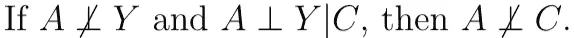

**人口均等 VS 均等几率**

如果 A 依赖于 Y，而 C 依赖于 Y，那么要么人口统计均等，要么机会均等，但不能两者都有。
证明:

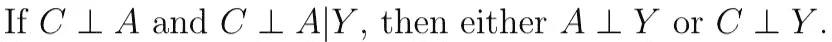

**均衡赔率 VS 预测汇率平价**

假设(A，C，Y)的联合分布中的所有事件都有正概率。如果 A 依赖于 Y，则均衡赔率或预测率平价成立，但不能同时成立。
证明:([乏色曼](http://www.stat.cmu.edu/~larry/all-of-statistics/)定理 17.2)

文献主要集中在第三种情况的证明上。证明可以在 [Chouldechova，2016](https://arxiv.org/pdf/1610.07524.pdf) 和 [Kleinberg et al. 2016](https://arxiv.org/pdf/1609.05807.pdf) 中找到，后者给出了一个假设较弱的证明。

下面是一个说明第三种互斥的例子(均衡的赔率与预测的比率奇偶校验)。假设在没有任何公平性约束的情况下优化我们的分类器后，我们有以下结果和预测(见图 7)。我们对 a 组的预测都是正确的，但是对 b 组却有一个假阳性的错误。

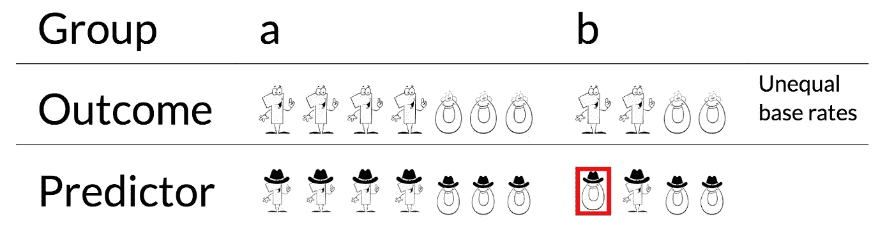

Fig7: illustration of impossibility theorem(original)

因为我们想保持均等的机会，我们决定在 a 上也犯两个假阳性错误。现在，真正的正比率和真正的负比率是相等的:两者都有 1/2 和 1(见图 8)。

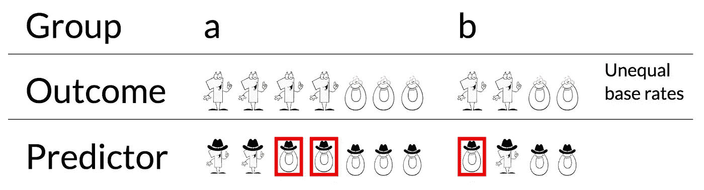

Fig8: illustration of impossibility theorem(equalized odds is preserved)

然而，尽管正预测奇偶校验也得以保留，但此设置违反了负预测奇偶校验。不可能在不牺牲均等优势/正预测奇偶性的情况下保持负预测奇偶性(见图 9)。

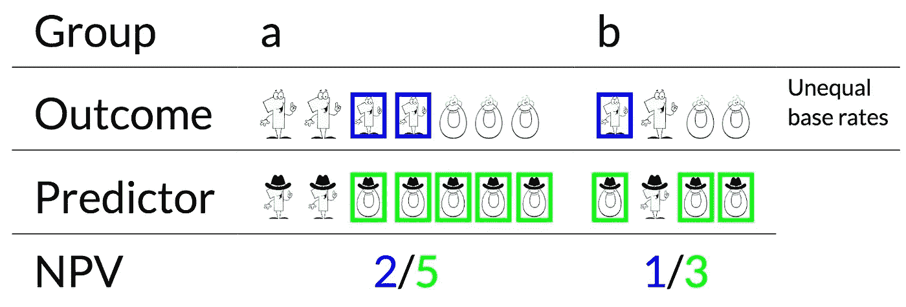

Fig9: illustration of impossibility theorem(PPV is satisfied but NPV is not)

COMPAS 辩论的本质类似于这个玩具例子。ProPublica 的主要指控是黑人被告面临更高的假阳性率，即它违反了机会平等，因此均等了赔率。Northpointe 的主要辩护是分数满足预测率平价。

## 4.7 公平性和准确性之间的权衡

对精确度施加上述约束的影响确实取决于数据集、所使用的公平性定义以及所使用的算法。然而，总的来说，公平会损害准确性，因为它将目标从准确性转移到准确性和公平上。因此，在现实中，应该进行权衡(见图 10 的说明)。

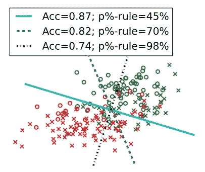

Fig10: trade-off between accuracy and demographic parity on a linear classification problem ([Zafar et al. AISTATS2017](https://people.mpi-sws.org/~mzafar/papers/disparate_impact.pdf))

# 5.公平算法

这里有许多算法声称有助于提高公平性。其中大多数分为三类:预处理、训练时优化和后处理。

## 5.1 预处理

想法是我们要学习一个新的表示 Z 这样它就去除了与敏感属性 A 相关的信息并且尽可能的保留了 X 的信息([泽梅尔等人 ICML2013](https://www.cs.toronto.edu/~toni/Papers/icml-final.pdf) ，[路易佐斯等人 ICLR2016](https://arxiv.org/pdf/1511.00830.pdf) ，[卢姆和约翰卓尔 2016](https://arxiv.org/pdf/1610.08077.pdf) ，[阿德勒等人 2016](https://arxiv.org/pdf/1602.07043.pdf) ，[卡尔蒙等人尼普斯 2017](https://papers.nips.cc/paper/6988-optimized-pre-processing-for-discrimination-prevention.pdf) ，下游任务(例如分类、回归、排序)因此可以使用“干净的”数据表示，从而产生保持人口统计均等和个体公平的结果(如果给出了适当的度量)。参见图 11 的图解。

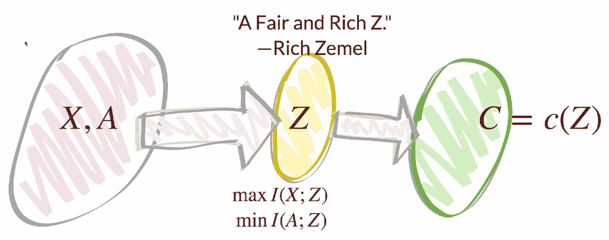

Fig11: Illustration of preprocessing

## 示例:

下面的算法是 Zemel 等人在 ICML2013 中提出的。

注释(与原论文略有不同):
X ∈ R^{d× N}:训练数据。
Y:代表个体分类决策的二元随机变量。
X⁺:= {x∈ X | A = 1}:正的训练数据。z:一个多项式随机变量，其中 K ∈ Z⁺值中的每一个代表一个“原型”。与每个原型相关联的是在与个体 x 相同的空间中的向量 v_k。

其思想是将每个数据点 x 表示为 K 个原型的加权线性组合，以满足人口统计学上的奇偶性，并尽可能保持原始信息和准确性。损失函数反映了这一思想。

定义元素成为特定原型的概率的 softmax 版本

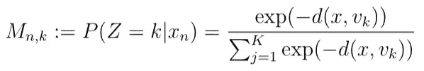

其中 d 是距离测量函数(例如 l₂距离)。在本文中，它被定义为一个加权 l₂距离函数:

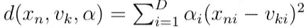

定义 y_n 的预测，基于每个原型对 Y 的预测边缘化为:

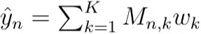

总损失为:

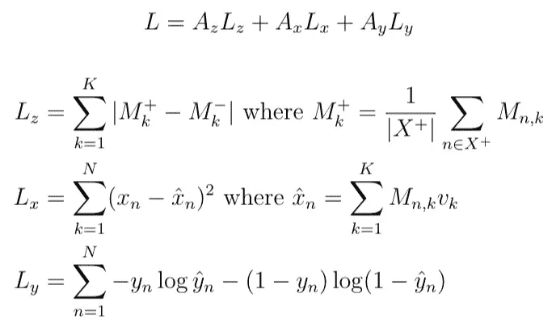

其中，L_z 用于调整人口统计奇偶校验，L_x 是重建误差，L_y 用于计算预测损失。相关的 A_z、A_x、A_y 是平衡这些损耗的超参数。
在训练阶段，通过 L-BFGS 联合优化 v，w，α以最小化目标 L，超参数通过网格搜索来选择。必须注意，目标是非凸的，因此不能保证最优。

## **优点:**

*   预处理数据可用于任何下游任务。
*   不需要修改分类器。
*   测试时不需要访问敏感属性。

## 缺点:

*   一般来说，预处理只能用于优化统计奇偶性或个体公平性(如果度量给定)，因为它没有标签 y 的信息。
*   在准确性和公平性度量的性能方面次于其他两种方法。

## 5.2 培训时的优化

最直观的想法是给现有的优化目标添加一个约束或正则项。大多数文学作品都属于这一类。此类方法可用于优化任何公平性定义( [Calders 等人 2009](https://ieeexplore.ieee.org/stamp/stamp.jsp?tp=&arnumber=5360534) ， [Woodsworth 等人 2017](https://arxiv.org/pdf/1702.06081.pdf) ， [Zafar 等人 AISTATS2017](https://people.mpi-sws.org/~mzafar/papers/disparate_impact.pdf) ， [Zafar 等人 WWW2017](https://people.mpi-sws.org/~mzafar/papers/disparate_mistreatment.pdf) ， [Agarwal 等人 ICML2018](http://proceedings.mlr.press/v80/agarwal18a/agarwal18a.pdf) )。优化反事实公平性的方法也属于这一类( [Russell et al .，NIPS2017](https://papers.nips.cc/paper/7220-when-worlds-collide-integrating-different-counterfactual-assumptions-in-fairness.pdf) )。

## 示例:

下面的算法是在 [Zafar 等人的 WWW2017](https://people.mpi-sws.org/~mzafar/papers/disparate_mistreatment.pdf) 中提出的。

符号:
x ∈ Rᵈ:非敏感属性。
y ∈ {-1，1}:类标签。
\hat{y} ∈ {-1，1}:预测标签。
θ:要学习的参数。
L(θ):原凸损失。
d_θ (x):特征向量到决策边界的有符号距离。
f_θ (x):分类器函数。如果 dθ(x)≥0，fθ(x)= 1，否则为-1。
z ∈ {0，1}:敏感属性。

本文主要讨论以下三种公平性约束:

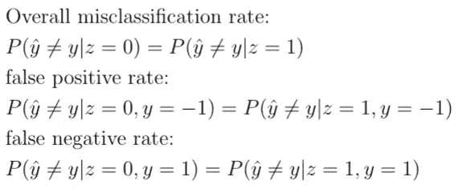

它们中的一个或全部三个可以作为约束添加到原始优化问题中。

应该注意的是，假阴性率的平等意味着真阳性率的平等，因此这意味着机会的平等。假阳性率相等意味着真阴性率相等。总的错误分类率的相等意味着分类率的相等，这是准确性的均等，均等优势的较弱的概念。这里我们以假阳性率(约束条件与机会均等相同)为例。它具有以下优化公式:

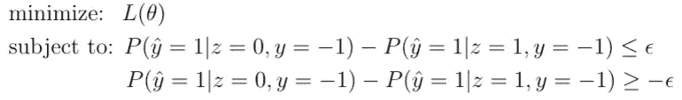

问题是约束使得优化变得难以处理。因此，该文件放宽了限制。它使用用户敏感属性之间的协方差以及用户特征向量和分类器决策边界之间的有符号距离作为代理来捕捉敏感属性和组级(条件)预测之间的关系:

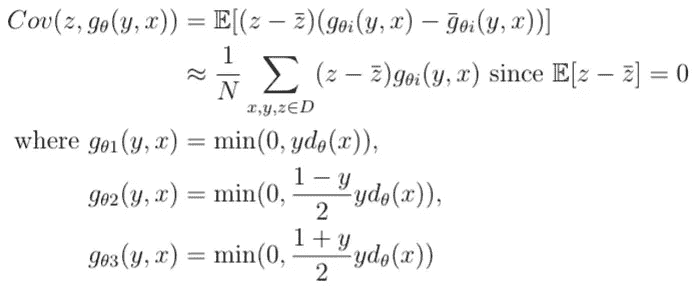

放松后，公式现在变成:

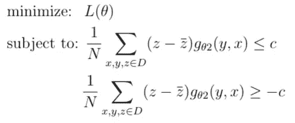

其中协方差阈值 c ∈ R⁺控制遵守机会均等的程度。

这样的公式化仍然是非凸的，所以接下来我们将把这些约束转换成一个有纪律的凸凹规划()，它可以通过利用凸凹规划的最新进展来有效地解决([沈等 2016](https://arxiv.org/pdf/1604.02639.pdf) )。
首先，我们可以将公平性约束重写为:

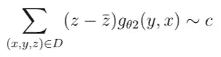

其中~表示“≥”或“≤”。为了简单起见，我们去掉常数 1/N。由于 z ∈ {0，1}，我们可以将总和分成两项:

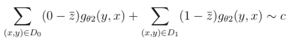

其中 D₀和 D₁分别是 d . s . t . z = 0 和 z=1 的子集。定义 N₀=|D₀|和 N₁=|D₁|，然后\overbar{z} = N_1/N。约束现在变成:

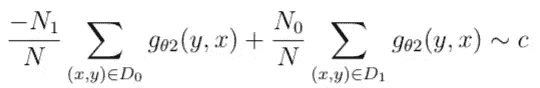

假设 g_θ在θ中是凸的(假设)，这就产生了一个凸凹函数。因此，优化现在变成了:

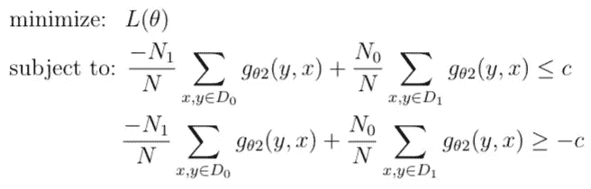

这是一个针对任何凸损失 L(θ)的训练有素的凸-凹规划(DCCP)，并且可以使用众所周知的试探法有效地求解，例如在[沈等人 2016](https://arxiv.org/pdf/1604.02639.pdf) 中提出的试探法。

## 优点:

*   在准确性和公平性方面表现良好。
*   可以更灵活地选择准确性和公平性度量之间的权衡(这取决于具体的算法)。
*   测试时不需要访问敏感属性。

## 缺点:

*   此类别中的方法是特定于任务的。
*   需要修改分类器，这在许多情况下可能是不可能的。

## 5.3 后处理

这种方法试图以满足公平性约束的方式编辑后验概率。它可以用来优化大多数公平定义(反事实公平除外)。基本思想是使用每个组的原始得分函数 R 来找到合适的阈值。作为预处理，分类器不需要重新训练/改变([费尔德曼 2015](https://scholarship.tricolib.brynmawr.edu/bitstream/handle/10066/17628/2015FeldmanM.pdf?sequence=1) ，[哈特等人 NIPS2016](https://arxiv.org/pdf/1610.02413.pdf) )。

## 例子(统计均等/机会均等):

下面的算法是在 [Hardt 等人的 NIPS2016](https://arxiv.org/pdf/1610.02413.pdf) 中提出的。

给定一个分类器，我们可以为两组绘制相应的 [ROC](https://en.wikipedia.org/wiki/Receiver_operating_characteristic) 曲线。接下来，我们可以根据 ROC 曲线找到阈值(参见图 12 的图示)。

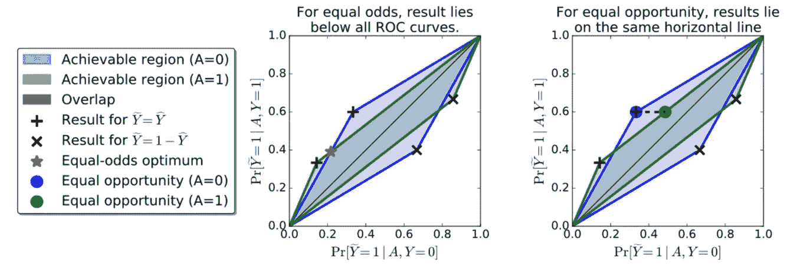

Fig12: Finding the optimal equalized odds predictor (left), and equal opportunity predictor (right) ([Hardt et al. NIPS2016](https://arxiv.org/pdf/1610.02413.pdf))

均衡优势(真阳性率和假阳性率相等)仅在两组的 ROC 曲线相交时满足，如左图所示；机会均等，作为一个较弱的概念，可以通过采用阈值来满足，使得两组的真实阳性率相等，如右图所示。

## 优点:

*   可应用于任何分类器之后。
*   相对较好的性能，尤其是公平措施。
*   不需要修改分类器。

## 缺点:

*   要求测试时访问受保护的属性
*   缺乏选择准确性-公平性权衡的灵活性。

## 5.4 实验

需要注意的是，本节实验结果来自 [Agarwal et al. ICML2018](http://proceedings.mlr.press/v80/agarwal18a/agarwal18a.pdf) 。他们的方法属于训练时优化的范畴。我没有介绍他们的方法，因为完全解释他们的方法和他们的方法提供的理论保证需要时间。我可能会在未来的一个单独的帖子中介绍他们的论文。

## **数据集:**

以下四个数据集用于实验。除了 *adult4* 之外，所有数据集都有二进制保护属性，adult4 有两个敏感属性(性别、种族)，因此有四个保护属性值(为简单起见，两个属性都被二进制化)。

**成人收入数据集** ( [Lichman，2013](http://archive.ics.uci.edu/ml/index.php) )

*   尺寸:48842 个示例
*   任务:预测某人的年收入是否超过 5 万美元
*   敏感属性:性别(男/女)或性别(男/女)和种族(白人/非白人)

[**ProPublica 的 COMPAS 累犯数据**](https://www.propublica.org/datastore/dataset/compas-recidivism-risk-score-data-and-analysis) **(** [Larson 等人 ProPublica，2016](https://www.propublica.org/article/machine-bias-risk-assessments-in-criminal-sentencing) **)**

*   尺寸:7918 个示例
*   任务:从某人的犯罪历史、入狱时间、人口统计数据和 COMPAS 风险评分预测累犯率
*   敏感属性:种族(白/黑)

**法学院招生委员会的全国纵向律师通道研究** ( [威格特曼，1998](https://files.eric.ed.gov/fulltext/ED469370.pdf)

*   尺寸:20，649 个示例
*   任务:预测某人最终通过律师考试
*   敏感属性:种族(白/黑)

**荷兰人口普查数据集** ( [荷兰中央统计局，2001 年](http://microdata.worldbank.org/index.php/catalog/2102/study-description))

*   尺寸:60420 个示例
*   任务:预测某人是否有声望的职业
*   敏感属性:性别(男/女)

## **实验结果:**

对几种方法的性能进行了比较，包括预处理( [Kamiran 和 Calders，2012](https://link.springer.com/content/pdf/10.1007%2Fs10115-011-0463-8.pdf) 提出的重新加权和重新标记方法)、训练时的优化( [Agarwal 等人的 ICML2018](http://proceedings.mlr.press/v80/agarwal18a/agarwal18a.pdf) 中的归约、网格和归约、后处理( [Hardt 等人的 NIPS2016](https://arxiv.org/pdf/1610.02413.pdf) )(见图 13)。

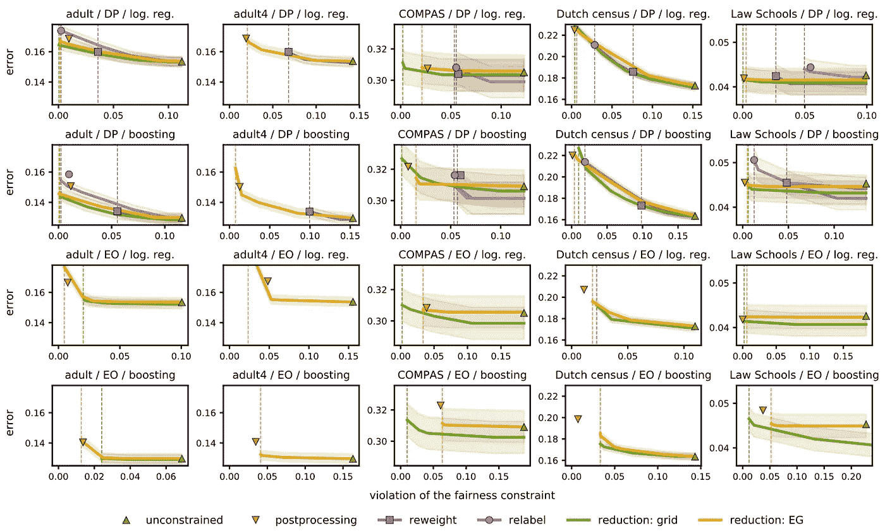

Fig13: *Classification error versus constraint violation on test examples with respect to Demographic Parity(DP) and Equalized Odds(EO).* The curves plot the Pareto frontiers of several methods. Markers correspond to the baselines. Vertical dashed lines are used to indicate the lowest constraint violations. ([Agarwal et al. ICML2018](http://proceedings.mlr.press/v80/agarwal18a/agarwal18a.pdf))

结果表明，所有的方法都能够大大减少或消除差异，而对分类器精度没有太大影响(除了在荷兰人口普查数据集上)。对于人口统计均等，归约方法(属于训练时的优化)一致地实现最低的约束违反，优于或匹配基线。对于小的违规，后处理算法表现良好。重新加权和重新标记(属于预处理)是最差的。

## 5.5 讨论

实际上，毫无疑问，在准确性和公平性之间实现最佳平衡的方法是通过在训练时进行优化。然而，预处理和后处理方法能够在不修改分类器的情况下保持公平性。当我们没有能力修改分类器时，这样的特征是需要的。

必须指出的是，我们之前讨论的所有方法都需要在训练期间获得关于敏感组的信息。后处理方法甚至在测试时也需要它。当人们不公开他们的身份时，这可能是不可能的。最近在这方面开展了一项工作，在不知道敏感属性的情况下，使用稳健统计技术优化精确度奇偶校验( [Hashimoto 等人，ICML2018](https://arxiv.org/pdf/1806.08010.pdf) )。

# 6.摘要

*   近年来，公平成为 ML 社区中一个非常热门的话题。
*   公平很重要，因为它对每个人的利益都有影响。
*   最大似然系统中的不公平性主要是由于训练数据中存在的人为偏差。
*   对于(不)公平的“最佳”定义，目前还没有共识
*   观察标准有助于发现歧视，但本身是不够的。因果观点可以帮助阐明问题，组织假设。
*   除非在退化的情况下，否则三个组公平性定义中的任何两个不能同时实现人口统计均等、均等优势和预测率均等。
*   准确性和公平性之间的权衡通常存在。
*   有三种方法:预处理、训练时优化和后处理。各有利弊。
*   大多数公平算法使用敏感属性来实现某些公平概念。然而，这种信息在现实中可能无法获得。

# 接下来是什么

在以后的文章中:我会考虑谈论超越二元分类的公平 ML，公平 ML 的最新进展，使用因果推理的反事实公平 ML，或者更详细的理论结果。

# 确认

感谢您的阅读！这是我在 Medium 上的第一篇帖子。错误和遗漏是非常可能的，所以请让我知道，我会尽快纠正他们！我将非常感谢你的支持。请激励我以后多写一些，质量更高的帖子。